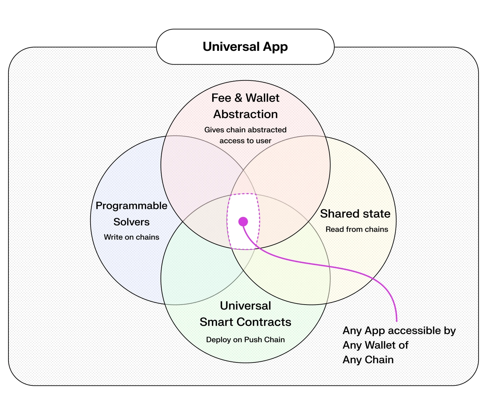
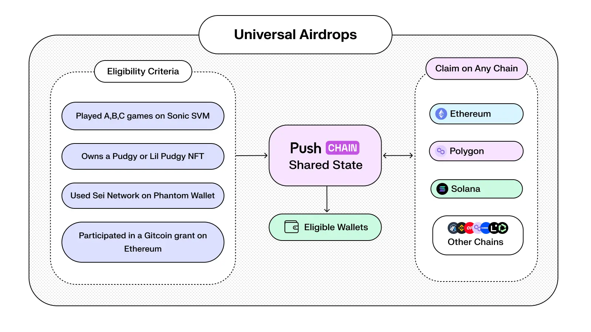

<!--truncate-->

Crypto has evolved... **fast**. But even after a decade, apps and users still live inside isolated chain silos.

**Push Chain’s shared-state architecture changes that, forever!**

Here are **5 breakthrough use cases** that become possible only **with shared-state blockchains** like Push Chain.

These use cases cover various bases, including but not limited to Defi, Degen Defi(iykyk), Airdrops, NFTs and Gaming that actually live across chains.

## What is Push Chain?

Push Chain is a shared-state universal blockchain designed to eliminate fragmentation across all chains (EVM + non-EVM). 

**Developers deploy once** and instantly become compatible with every chain. 
**Users interact** with the same app no matter the chain they come from, using any token or wallet.

This results in a **shared-state world** where apps, data, and users exist seamlessly across ecosystems.

## What kind of apps does this enable?

Universal chain resolves a ton of issues that exist today in the crypto space and opens up exciting new possibilities. 

- It enables apps to be available to users of any chain effortlessly, massively helping your app get to user base and community of every chain at once.
- It allows **users** to interact with your app using any token and wallet of their choice, uplifting the user experience.
- It allows **developers** to deploy once and dramatically reduce the complexities, engineering delays and cost of deploying on multiple chains.
- It opens up new paradigms for apps where users of chains come together and engage, or compete with each other.

Let's look at some examples of how this can be used.

## 💧 Universal DeFi

DeFi today is fractured by:

1. chain-bound liquidity,
2. cumbersome bridging,
3. and fragmented pools split across chains.

This causes a lot of issues even if you are not a DeFi degen.

- 📉 Yields tank in shallow pools (your $ earning 2% vs. 5% in an ocean)
- 💸 Swaps cost extra (slippage + fees = 1–3% gone)
- ⛔ Capital's stuck (bridge waits = hours of opportunity lost)

The best way to imagine this is by understanding how liquidity is currently fragmented. 

Currently the same USDT on Solana and Ethereum are seen as two different assets which means that they have their own liquidity pools. Now think about the 50+ chains out there, each running their own liquidity pools for the same asset. This is a total mess.

**Push Chain solves this** by **unifying access to assets and data across all chains** and using the unified liquidity to ensure:

### Universal Lending Protocol

Having a universal lending protocol means a singular universal liquidity pool that can be accessed by any chain is the future of DeFi.

→ One massive liquidity pool (not dozens of tiny ones) 
→ Any chain, any trusted stablecoin forming unified seamless experience 
→ And Universal DeFi that is accessible by any users of any chain 😱 

Did we just unlock DeFi 3.0?

## 💸 Universal Payments

In the traditional web3 world, if a payee (like a merchant) wants to receive a payment, they usually specify:

- A chain (e.g. “Send to Ethereum”),
- A token (e.g. “Send USDC”), and
- An address (e.g. their ETH address).

But this is terrible for users and merchants as this limits:

1. Which chain the payer can use
2. What token they must use
3. Operational comfort that forces bridging or manual swaps

This is the opposite of making payments seamless for the end-user so that service providers can focus on their core value proposition.

**Push Chain solves this** by enabling **universal fee and wallet abstraction** giving the user the comfort of paying from any chain and in any token.

### Stripe-like Cross-Chain Payments

A universal payment system that gives user the flexibility to pay from any chain is now possible with Push eliminating the need for bridging or manual swaps.

We can even expand this further through a universal smart contract on Push Chain that can take payment from any token and use an AMM to convert it to the desired token.

This results in fluid payments where users can pay from any chain and any token.

### Universal Tipping
  
A universal tipping service can also be made possible using the same concepts. This competes with the likes of payment providers of web2 where in the service providers adapts to the user needs and not the other way around.

## 🌾 Any Stablecoin Yields 

With current chains, a user is limited to specific blockchain ecosystem to take advantage of the yield offerings. Most of the time, the yields are not attracting enough or the APYs keep on shifting from one chain to another.

This handicaps the users as they either need to:

1. Lose self custody of the funds and trust centralized parties to earn best yields (which rarely ends well)
2. Learn bridging, multiple chain standards (incase hopping to non-EVMs) and other complex topics to earn best yields
3. Be stuck with sub-standard payloads

**Push Chain solves this** with the ability to **move funds from any chain** to Push and even move them out to any other chain and deposit in a contract. All done with a **single transaction**.

This allows the user to execute the most profitable staking transactions across any network without worrying about native reconversions or swaps.

### Universal Yield Aggregators

A universal smart contract that is able to get funds from users of any chain and logic to determine and move funds from one chain to other would result in the most optimal yield bearing products.

One that is both secure and earning the highest APYs as

- Users are no longer tied to a particular blockchain or ecosystem to earn yields on their stablecoins or assets (whether native or foreign).
- Their **aggregated yield routing** enables optimal capital allocation across protocols, minimizing fragmentation and maximizing APY
- **Universal Liquid Staking Tokens** (ULSTs) can be created by combining and/or hybridizing existing ones (e.g. stETH, rETH, mSOL)

## 💫 Universal Token Swaps

Currently, ‘trading pairs’ on DEXes are limited to recognized tokens, which leads to several limitations:

- They only allow swaps for tokens available on their chain
- It forces users to move from chains if they want a token of a particular project ($XYZ on ABC chain)
- The problem further amplifies if the user has different wallet (ie: Ethereum users wanting to but $TRUMP)

This leads the users to resort to central exchanges losing control of their assets as a trade-off to trade tokens they want on any chain but that comes up:

1. Losing custody of your funds
2. You only trade what exchanges deem to be **token worthy**
3. The trade is mapped 1:1 and with whitelisted pairs, **no programmable fluidity**
  - For example: you can only trade $ALPHA token with $USDT, not with $UNI or any valuable NFTs or a combination of both
  
**Push Chain solves this** as it enables the user's **wallet to be cross chain compatible** and allows **any chain / any token transaction**. This means that the user, from the comfort of their source chain, natively controls and swaps tokens available across crypto.

A decentralized experience that finally rivals centralized experience. All the while ensuring that you are always in control.

### Universal Swaps (DECEXs?)

Just by deploying a simple fork of an AMM, or innovating your own fun (that's always fun) on Push Chain instantly gives you access to **users of every chain** and **assets of every chain**.

With few steps to combine the liquidity moved. This unlocks a decentralized experience that rivals and will become the future for crypto trading.

Think Uniswap, Jupiter, or 1inch, but natively cross-chain and fully decentralized.

### Barter Swaps

Since swaps are now universal and can be done from any chain. You can further extend this programmability by having swaps that behave like a barter. For instance:

- e.g. “willing to sell pudgy penguin NFT#44 for 100,000 $SHIB”.
- Buyers and sellers can be connected through **cross-chain asset barter system**:
- e.g. someone ‘willing to sell all his coins on Solana for two popular NFTs on Ethereum’ may be notified of the above trade

## 🌀 Universal Digital Primitives

Several digital primitives are out of reach for other ecosystems due to the inherent limitations of being deployed on isolated blockchains. 

This limits outreach as protocols are forced to only market their product to that blockchain. The chain's community subset can only ever be your outreach and marketing support. 

For instance, Airdrops are localized to a specific chain(Solana, Ethereum, Arbitrum etc). The eligibility checks usually work only within the chain of the drop.

This can also be extended to Art, NFTs, Ticketing which can benefit immensely with wider reach but are left to market the chain in order to gain their share, resulting in a parasitic relation.

**Push Chain solves this** via the ability of **inheriting every user of every chain natively**. 

### Universal Airdrop

You can reward users across chains without increasing the friction for those users using merkle proofs and mapping different wallet addresses (EVM or non-EVM) to deterministic universal executor accounts (UEA).

This results in users of any chain able to claim airdrop from their source chain wallet dramatically increasing your outreach to now all of crypto.

**Cross-Chain Game Drop Example:**

A project launches a new gaming token with the following eligibility conditions:

- Played at least A,B,C games on Solana,
- Bought a [Pudgy Penguin](https://pudgypenguins.com/) or Lil Pudgy NFT on Ethereum,
- Holds $100 or more value across Solana, Ethereum, Base or BNB,
- Participated in a Gitcoin grant on Ethereum.

<!-- Diagram 3 -->

A **universal drop**, in this case, can:

- Verify these diverse activities and wallet to form a merkle proof to user's universal executor account
- Universal Executor Account (UEA) are representation of source chain wallet address of the user on Push Chain and are always controlled by the respective source chain wallet
- Allow claiming the gaming token on Polygon, Solana, or Ethereum - whichever the user prefers

### Universal NFTs

Your NFT inventory, on-chain reputation, game items, and collectibles can now merge into a single, shared identity that lives across all ecosystems.

No more isolated wallets.
No more duplicated assets.
Just one _creative life_, everywhere.

## End Game: The Universal Layer 🌍

Push Chain’s shared-state model fuses users, developers, and data into a single, connected web.

For **users**, it means frictionless, cross-chain interaction. No bridges. No fragmentation. Full control.
For **developers**, it means one deployment that speaks to all chains.

**Seriously, why build for one chain when you can build for them all?**

## It's not over yet!

We have just scratched the surface. [Vol. 2 of this article](/blog/apps-only-possible-with-shared-state-v2/) covers more use cases across AI agents, DAOs, Gaming and much more!

Stay Tuned!

## Next Steps

- Follow [@PushChain on X](https://x.com/PushChain) for Updates
- Explore [Push Chain Docs](https://push.org/docs/)
- Visit [Knowledge Base](https://push.org/knowledge/)
- Check out [Universal Apps that are live on Push](https://push.org/ecosystem/)