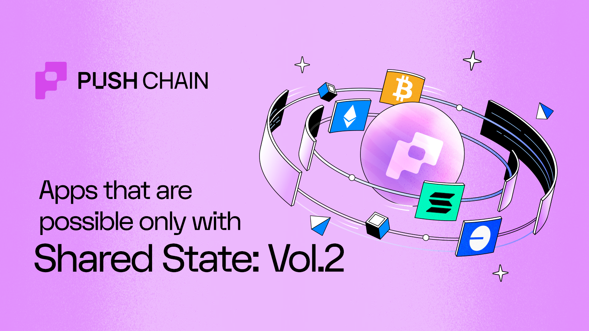

<!--truncate-->

Welcome to **Volume 2** of *Apps Possible Only with Shared State*. A deeper dive into what becomes possible when every blockchain speaks the same language.  

In [Volume 1](/blog/apps-only-possible-with-shared-state-v1/), we explored use cases across DeFi, cross-chain yields, universal airdrops, and NFTs that truly live across chains.  

🚨 **Spoiler:** Some of those concepts are already live on **[Donut Testnet V1](/ecosystem)**. Stay tuned for what’s next.  

This volume amps up the scale — covering **Gaming, DAOs, AI Agents, Safes, and Prediction Markets**. The next frontier for both developers and users alike.

## What is Push Chain? - Super Quick Recap

Push Chain is a **shared-state universal blockchain** designed to eliminate fragmentation across all chains (EVM + non-EVM).  

**Developers deploy once** and instantly become compatible with every chain.  
**Users interact** with the same app no matter the chain they come from, using any token or wallet.

The result: a **shared-state world** where apps, data, and users exist seamlessly across ecosystems.

## Apps Only Possible with Shared State

## 📈 Universal Prediction Markets

Prediction markets align incentives and gather collective intelligence. But today, they’re stuck on isolated chains with limited liquidity and poor UX.  

**Push Chain turns them into universally embeddable modules** that plug into any cross-chain app, game, or community, **usable from any chain, in any token**.

### What this enables

Shared-state connects every participant and every token into a single predictive playground.

**App-Based Prediction Widgets**  
- Developers can attach mini-markets to any cross-chain app or event.  
- Viewers bet on game outcomes or specific moves in real time.  

**Event-Driven Derivatives** 
- Auto-spawn markets around live events (“Will $TRUMP rise during his golf match?”) that resolve trustlessly after completion.  

**Community Engagement**  
- Local markets inside apps boost participation and organic stickiness.  

### Why it needs shared-state
- Outcome resolution requires trustless cross-chain settlement proofs.  
- Shared-state provides the single source of truth for all prediction pools.

## 🎮 Competitive Cross-Chain Gaming

**Shared-state makes “chain wars” real.**  
Players from any blockchain ecosystem can come together to play, **or bet against** each other through Push Chain’s shared settlement layer.

Imagine **Universal Chess** tournaments between Ethereum and Solana communities, with cross-chain wagers for spectators and NFTs for players.  

Now extend that to Poker, Blackjack, RPGs, or shooters. All accessible to every chain’s user base.

By removing UX friction and asset fragmentation, **Push Chain lets gamers bring their chain-specific identities into chain-neutral playgrounds.**

### What this enables
- Game developers can build once and reach the entire Web3 player base.  
- Chain-agnostic onboarding: users join from any wallet, on any chain.  
- True multiplayer universality: players from different chains share the same game state.

### Why it needs shared-state
- Chain-neutral playgrounds require synchronized player states in a trusted environment.  
- Without shared-state, every game would need custom bridges and sync contracts which are expensive, risky, and UX-breaking.

## 🛡️ Universal Safes (Multi-Chain Vaults)

Managing assets across chains is a logistical nightmare. You go through multiple wallets, manual bridges, and fragmented balances.  

**Shared-state enables safes with multi-chain signers** create chain-agnostic vaults that can pool and use assets across all chains.

Push Chain turns fragmented treasuries into a single, interoperable system for DAOs, funds, or families.

### What this enables

#### Unified Asset Management  
- Deposit assets from any chain into a single safe and view the total portfolio in real time.  
- DAOs or funds manage cross-chain treasuries without bridging or chain-specific multisigs.  

**Conditional Cross-Chain Spending**
- Define rules like: “Allow withdrawals only if 3/5 signers approve and under 10% of TVA.”  
- Automate rebalancing (“If Base assets drop 20%, sell Solana to restore ratio”).  

**Shared Ownership & Recovery**
- Hold ETH on Ethereum, stSOL on Solana, USDC on Base — same safe, same rules.  
- Cross-chain inheritance and social recovery become native features.  

### Why it needs shared-state
- Spending rules need atomic cross-chain verification.  
- Recovery logic demands multi-chain activity checks before triggering fail-safes.

## 🤖 Universal AI Agents

AI agents are the next major wave, but they’re currently trapped inside single ecosystems.  

Push Chain’s shared-state gives them the **coordination layer** to operate across all chains autonomously, with a unified memory.

### What this enables
Build **chain-agnostic AI agents** that:
- Reads users’ cross-chain history and collates data from all their interactions across chains.
- Act on behalf of users with no bridges or wallet switching.
- Able to leverage a universal x402 payment interface when needed.
- Maintain a **persistent universal context** across apps and networks.

**Example — Personal Finance Assistant Agent:**  
  
- Reads the user’s balances across Ethereum, Arbitrum, Optimism, and Solana (off chain).  
- Spots idle assets on Base and reallocates them to Polygon for higher yield.  
- Executes cross-chain actions autonomously via Push Chain’s universal validators.

### Why it needs shared-state
- AI agents need real-time visibility into user activity across all chains to act safely and intelligently.  

## 🏛️ Multichain DAOs

DAO governance today is fragmented. The same token exists on multiple chains but voting power doesn’t unify.  

With shared-state, **Push Chain aggregates a member’s voting weight across all chains** by reading and bundling token holdings into one coherent state.

### What this enables
- DAOs can launch tokens **on multiple chains** without fracturing governance.  
- Unified voting and proposal systems. cross-chain delegation, comments, and commitment pools.  
- True community coordination across ecosystems.

### Why it needs shared-state
- Voting power depends on real + synthetic assets across chains.  
- Shared-state lets governance contracts read all balances in real time, without bridges or manual syncs.

## End Game 🌍

Push Chain’s shared-state architecture delivers **the universal blockchain trifecta**. Unifying users, developers, and data in one layer.

For **users**, it means seamless cross-chain interaction. No bridges. No fragmentation. Full control.  
For **developers**, it means one deployment that speaks to every chain in existence.

**Seriously — why build for one chain, when you can build for them all?**

## Next Steps

- Follow [@PushChain on X](https://x.com/PushChain) for updates  
- Explore [Push Chain Docs](https://push.org/docs/)  
- Visit the [Knowledge Base](https://push.org/knowledge/)  
- Check out [Universal Apps live on Push](https://push.org/ecosystem/)
