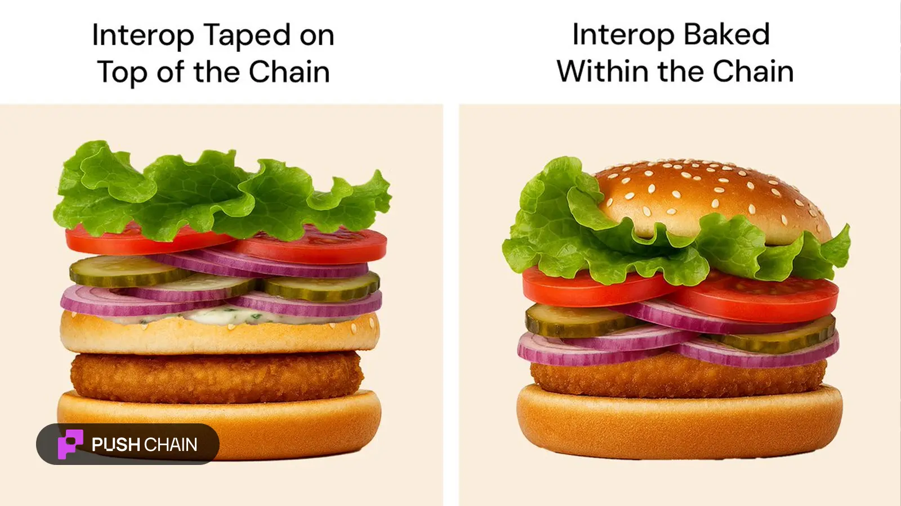

<!--truncate-->

Projects continue to treat interoperability as an afterthought, as a *'feature addition'* duct-taped to a single chain app.

This perspective of treating an 'inherent quality' as an 'add on feature' — has only made things messier, both for devs as well as users.

Take a Solana user, for example, who wants to interact with an Ethereum app.

They can't simply do so from the comfort of their Solana wallet.
Instead, they're forced to manually bridge assets or hand over control of their funds to unfamiliar intermediaries (centralised relayer wallets) — **entities they have no custody or trust over**.

Looking at this current state of interop left us with no other choice than to reimagine interop completely:

**Say Hi to Chain-Native Interop 👋.**

Where all the core interoperability features are baked within the chain by default.
This means **it's the chain that handles the interop and not the app & app devs**.

Any app that sits on top of it benefits from interoperability **out of the box**.

With this new approach, the Solana user never leaves their wallet, never bridges assets, nor loses any control over their actions.

Their interactions on other chains are controlled via a smart shadow wallet (we call it UEA — Universal Execution Address) — which is cryptographically derived from the user's Solana wallet itself!

Meaning, the user holds complete control over its UEA.

You never leave your preferred, chain-native wallet, yet you still enjoy the full experience of universal apps.

Remember, you can only enjoy a burger if you can hold it right 🍔
