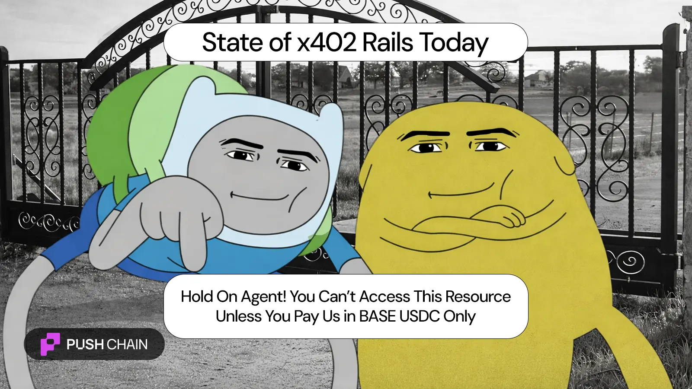

<!--truncate-->

x402 = extremely bullish paradigm for global & agentic crypto adoption.

[X402](https://docs.cdp.coinbase.com/x402/welcome) is a payment protocol that lets AI (and humans) pay instantly, autonomously, on-chain (crypto payments, no banks).

{/* image 1 - x402 overview */}

BUT… it severely lacks one crucial element — **Flexibility 👇**

"Pay in BASE USDC only."
OR → "Pay in {this chain} {this token} only."

This alone can't be the future. 🤔

@michyexe nailed it:
*"x402 makes money (crypto) move through the internet like information".*

The irony?
Internet = open, borderless
Crypto payments = still gated behind chains

Actual Reality — paying through crypto is still super constricted.

- Agents are forced to support assets and transact on chains supported by common facilitators.
- An extra step required to swap / bridge into supported tokens before accessing a resource.
- Devs have to custom-integrate support for new chains and wallets.

Push Chain fixes this.

Universal chain breaks these silos and restrictions.

Allowing clients (agents, users) and sellers (service providers) to interact without any preparatory steps or friction.

Push = Ultra bullish for the agentic internet → fast and ultra flexible.

Take a look at the [Universal x402 implementation here](http://github.com/pushchain/push-chain-examples/tree/main/tutorials/x402-universal-transaction).
