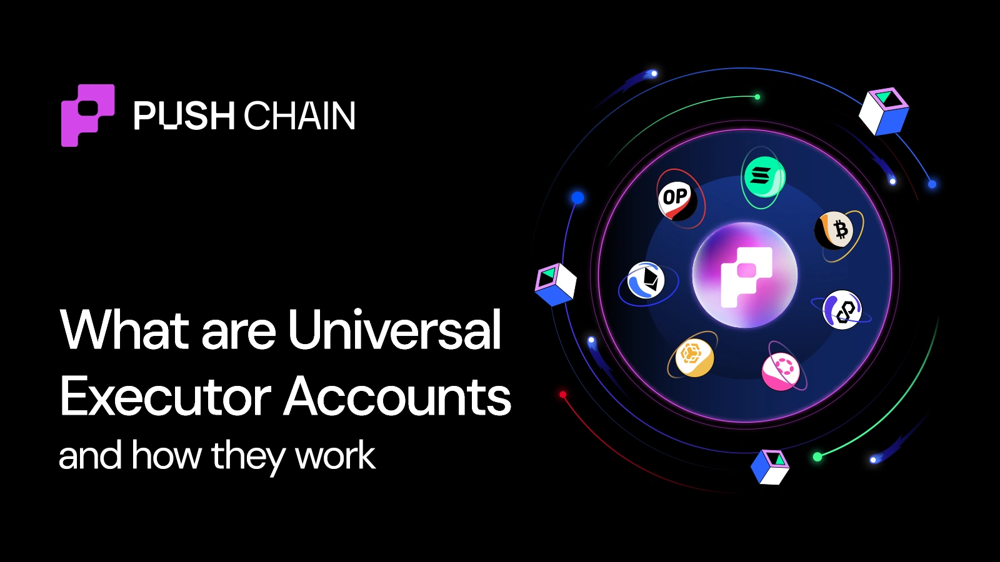
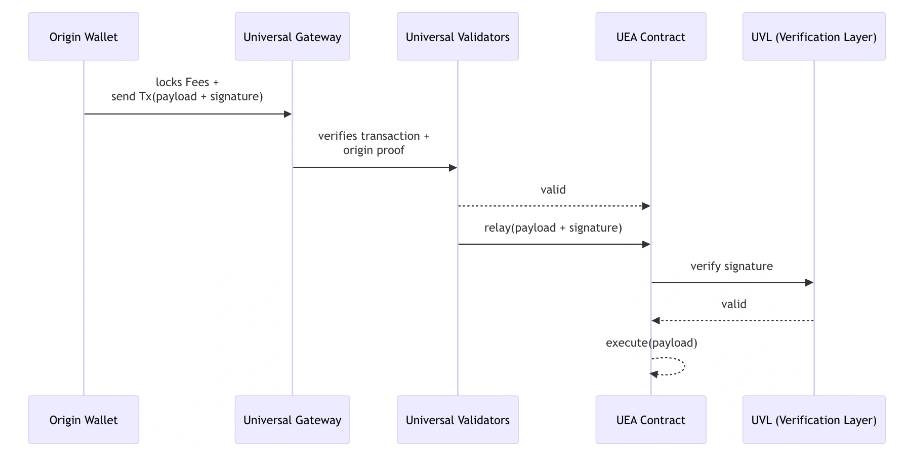

<!--truncate-->

<b>Universal Executor Accounts (UEAs)</b> are magical entities that let users from any blockchain pay and transact on Universal Apps on Push Chain.

With UEAs, you can use your <b>source-chain wallet</b> (e.g., Solana, Ethereum, Base, BSC) to interact directly with apps on Push Chain — paying in your native token or any other approved asset.

💡 <i>No bridging. No swapping. No new wallet setup. Just one click.</i>

## Why do we need UEAs?

### The Everyday User Pain

Let’s consider a scenario that thousands of crypto users face every day.

Suppose Tim, a Solana user, wants to use a DEX on Ethereum. To do this, he must:
to:

1. <b>Bridge or wrap his assets</b> to Ethereum - just to use an app that lives on another chain.
2. <b>Swap tokens</b> to get the native gas asset (ETH)
3. <b>Set up a new wallet</b> compatible with EVM (like MetaMask) or switch between networks within the same multichain wallet.
4. <b>Fund it again</b> with gas fees

Only then can he make a simple trade. The prep time often exceeds the transaction time. 😩

### The Developer Pain

Meanwhile, developers face their own headaches:

- <b>Fragmented identity logic</b>:  Build separate wallet and signature handling for every chain (EVM, Solana, etc.).

- <b>Manual cross‑chain routing</b>: Forced to integrate bridges, relayers, or off‑chain services to move assets and data.

- <b>Inconsistent verification rules</b>: each chain uses a different cryptographic scheme (ECDSA vs Ed25519), making cross‑chain validation painful.

- <b>Fee‑routing complexity</b>:  need to manage gas logic for each supported network, often involving swap layers or middleware.

- <b>Extra deployment overheads</b>;  app smart contracts must be redeployed per chain; no unified execution or shared state.

Instead of focusing on building their apps and their cool features. The devs are now stuck in an endless infrastructure + devops loop.

### Enter UEAs — the Universal Solution ✨

**Now imagine Tim using a Universal App built on Push Chain:**

1. Clicks "BUY $1000 worth of Memecoin”

2. Wallet shows: "Pay 5 SOL" (gas included)

3. Signs once

4. Transaction executes on Push Chain

5. Token appears in his existing multichain wallet.

That’s it.
No need for bridging, no new wallets, 1-click process.

> <b>But how is it even possible to make Solana and EVM, two totally incompatible systems to coordinate with each other?</b>

> <b>The reason behind this magic lies with the Universal Executor Accounts</b>

## So, What Exactly is a UEA?

At a high level:
> A Universal Executor Account (UEA) is a smart account that lives on Push Chain, but can be controlled from any origin chain — Ethereum, Solana, Base, Polygon, and beyond.

Think of it as your <b>personal on-chain butler</b>:
- Executes your transactions on Push Chain

- Holds balances and state

- Verifies cross-chain signatures

- Ensures your source wallet remains in control

- Handles fee abstraction (no native token needed)

UEAs make your wallet <i>universal</i>. Any wallet is now able to act anywhere, anytime.

## How to create a UEA?

You don’t create them manually. UEAs are <b>auto-deployed behind the scenes</b> when you first interact with Push Chain from any supported chain.
The process:
1. You sign a transaction from your origin wallet (say, Solana).

2. Push Chain deterministically generates your UEA address.

3. A mapping is forever linked between your <b>origin address</b> and your <b>UEA</b>.

From that point onward, your wallet = your UEA identity on Push Chain.

## How does UEA work behind the scenes?

**The entire process is divided into 3 phases.**

1. <b>Routing</b> - Handles the steps involved in teleporting txns from ext. Chains to Push Chain
2. <b>Verification</b> - Forming a Consensus on the validity of txn and ensuring whether the txn is indeed initiated by the user's private key.
3. <b>Execution</b> - Finally, executing the transaction and settling it on Push Chain.

### The Architecture

Within these three above-described stages, 4 key innovative modules play a crucial role in abstracting the entire interop away from the app and the user

| Component | Role | Description |
|-----------|------|-------------|
| **Universal Gateway** | Routing | These smart contracts are deployed on every supported chain. Their objective is to handle inbound and outbound routing between origin chains and the Push Chain. Locks user fees and relays payloads. |
| **Universal Validators** | Verification / Security | Special entities that keep a close eye on the inflows/outflows happening at the Universal gateways and form a consensus on the validity of cross-chain transactions before relaying to Push Chain.  **Note:** Universal Validators != Validators. Want a quick detour to unravel Universal Validators? [Find out here]() |
| **Universal Verification Layer (UVL)** | Signature Verification | Security mechanism that verifies signatures from multiple chain types (EVM, Solana, etc.) via pluggable verifiers. |
| **Universal Executor Account (UEA)** | Execution | Executes encoded transactions and manages account state on Push Chain. |

### How does it work?

#### 1️⃣ Routing:

The routing phase involves a series of steps that dictate how transactions originated by users from external chains flow towards the Push Chain for execution.

The steps include:
- <b>Gas Estimation</b>: Based on the current value of users' native token, the SDK calculates the required amount of PC to pay the gas

- <b>Transaction Signing</b>: Converts the gas, tallies the total txn cost, prepares and initiates the transaction payload, which is then signed by the user’s wallet cryptographically

- <b>Locking of Fees</b>: This fee payment (in the user's native funds) is locked into the Universal Gateway Contract. These are contracts on external chains that facilitate fee and asset locking and unlocking.

- <b>Proof Verification</b>: Gateway events are verified by consensus through Universal Validators (UVs), who then pass this to Push Chain’s Validators.

- <b>User Creation</b>: Based on the new or returning user, Push validators create new UEA accounts or deposit to existing UEAs.

<b>Side note</b>: Since the UEA is deterministically generated, the validators can derive addresses from a Solana or Ethereum address automatically to check if they are new or returning users.

#### 2️⃣ Verification
Verification ensures the transaction request from the external chain is signed by the rightful owner and validated through cryptographic checks.

Verification of the txs is never offloaded to any third party. Each tx that lands in the UEAs smart account must always be accompanied with the signature from the native chain.

The UAE, upon receiving a transaction request, sends the signature to a custom module in Push Chain that is called <b>Universal Verification Layer (UVL)</b>.

Its job is to verify whether the <b>controller of the UEA</b> is the same wallet that signed the transaction on the source chain.

#### 3️⃣ Execution (Smart Account Execution)
Once the signature is verified:

- UEA <b>executes the transaction</b> using the instructions signed by the external wallet.
- The execution is seamless and respects the rules/UX of the originating chain.

Of course, all this happens <b>under the hood</b>. From the user’s perspective:
- They simply interact using their <b>native wallet</b>.
- <b>Pay gas in their native token</b>.
- <b>Execute cross-chain logic in a single flow</b>.

And validate if the <b>user's private key did actually sign this transaction</b>?
On successful verification, → <b>signal is sent to the UEA to execute the transaction</b>.

## Transaction Routing Optimizations
Not all cross-chain transactions require full routing through the Universal Gateway. The SDK dynamically detects whether the user’s UEA already holds sufficient fees for execution.

If fees exist on the UEA:
- The transaction bypasses both the Gateway and Validators.
- It’s sent directly to the UEA for immediate execution.
- This removes source-chain confirmation latency, giving users a near-instant experience after their first funded transaction.

Subsequent transactions feel instant because the UEA can self-fund execution once fees are already available.

## How does a UEA preserve a user’s identity universally?

The answer lies in the 1:1 deterministic mapping between the user’s source chain wallet address and its UEAs that exist on various chains.

No.

A new UEA is only created when a new user wallet transacts on Push Chain.

As said above each UEA is deterministically linked to the user’s origin wallet address.

This linkage is achieved by using the origin wallet as the <b>seed for UEA address generation</b>.
Users origin address -> UEA Generator Function (User’s origin address) -> UEA Address

TL;DR

At last, for Users, UEAs help eliminate:

| UEAs Eliminate | UEAs Enable |
|----------------|-------------|
| Bridging tokens across chains just to use one dApp | Direct access to any Universal App from their source chain wallet |
| Installing or learning new wallets | Keep using existing wallets (Phantom, Solflare, MetaMask, etc.) with no changes |
| Trust unknown relayers & give them custody to your funds | Chain-native routing with full control and attribution retained |
| Being forced to pay gas in Push Chain native token | Pay gas in any approved token from their own chain, even stablecoins! |

And for developers:
| UEAs Eliminate | UEAs Enable |
|----------------|-------------|
| The need to integrate third-party interoperability or messaging protocols | Interoperability embedded inside the chain |
| Writing or maintaining custom relayers | Automatic execution routing via chain-native UEAs |
| Managing complex gas logic for every supported network | Native Fee abstraction to pay for gas in any preferred token. Learn more about the magic of Fee Abstraction here |
| Devoting engineering time to infra management | Focus purely on app features & experience |
