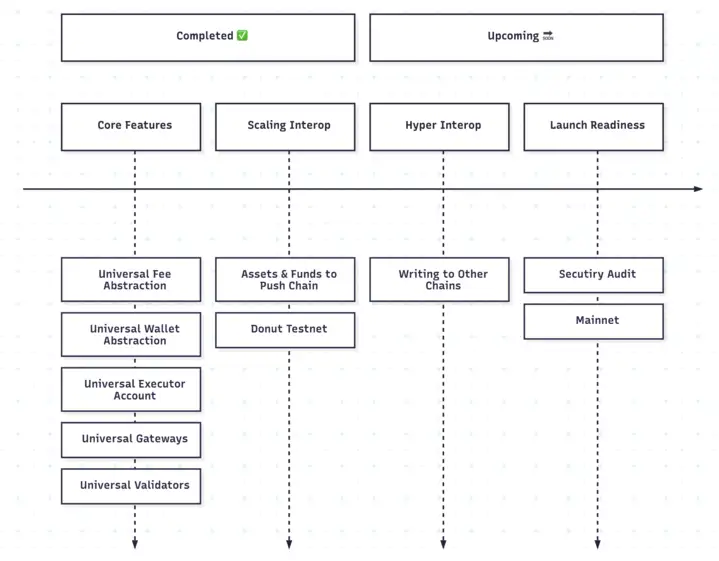
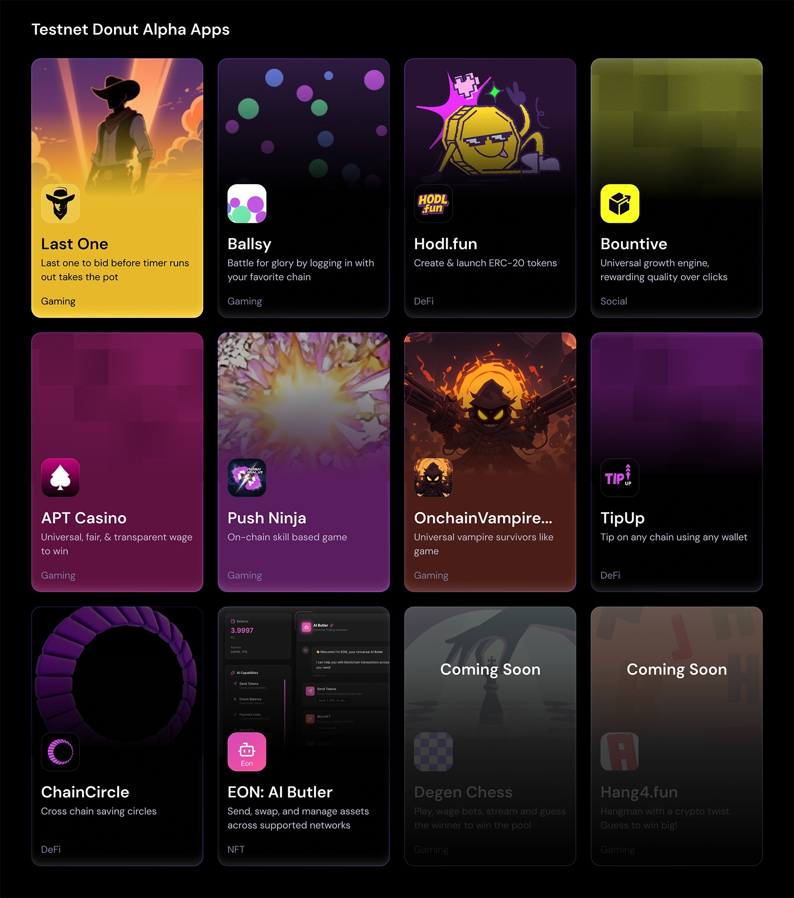

<!--truncate-->

After years of fragmentation, the time has come to unite all chains.

Today, we’re thrilled to launch **Donut 🍩,** the **Push Chain Public Testnet**.

Push is the **first true universal Layer 1** connecting every blockchain, wallet, app, and user through shared-state.

For the first time ever, developers, validators and users can experience what *true interoperability* feels like. **Instant, native,** and **free**.

## 💫 Why Push Chain Exists

Today’s Web3 ecosystem is heavily fragmented and overly complex.

Developers must redeploy smart contracts across multiple chains, users have to bridge tokens or switch wallets, and teams spend months auditing and maintaining chain-specific codebases.

Each new chain adds overhead, complexity, cost and friction, which massively slows innovation and adoption.

**_Push Chain eliminates these barriers_**

It reimagines a shared-state, universal blockchain **built to make interoperability a fundamental primitive of the chain**, not an afterthought added through external protocols.

This enables native applications, wallets, and users from any chain to interact seamlessly without bridges or additional integration layers.

> “An app developer should only build their app and its features. We enable this\! Deploy once and you are able to reach every user on any chain.”
 — **Harsh Rajat, Founder of Push Chain**, in his talk [**Building Apps of the Future**](https://youtu.be/J5DYeiNzGjM?si=RBimzjapmnHiscLd)

## ⚙️ How Push Chain Reimagines Interoperability

Most interoperability solutions today rely on messaging layers or bridges, forcing developers to manage multiple contracts, audits, and integrations across every chain.

**Push Chain redefines this model entirely.** With Push, you:

* **Deploy once, reach everywhere.** Your app instantly becomes available across chains, EVM or non-EVM.
* **Eliminate redundant contracts and bridges.** Interoperability is native to the chain, letting you focus purely on your app.
* **Fully EVM-compatible.** Use the same tools, frameworks, and audits you already have. Deploy as is and go multi-chain immediately.
* **Universally native app.** Users can transact from any chain or wallet. No bridging, no gas tokens, no changing networks, no swapping, no setup.

## 🍩 Welcome to Donut \- Push Chain’s First Public Testnet

The **Donut Testnet** is the first public environment where developers, users, and node operators can explore Push Chain’s universality firsthand.

Here’s how we got here, and what comes next\!

The roadmap outlines Push Chain’s journey from universal core features to full cross-chain execution and mainnet readiness.

Donut brings the full Push ecosystem online with:

* 🌳 **Ecosystem Apps:** Explore live Universal Apps on the [Ecosystem Page](https://push.org/ecosystem).
* **📖 Developer Docs:** Start building Universal Apps from [Developer Docs](https://push.org/docs).
* **🧠 Knowledge Base:** Learn the architecture and design from [Knowledge Base](https://push.org/knowledge).
* **🪩 Popular Apps to Try:**
  * [Ballsy](https://ballsy.push.org/) — experience the same app logic working seamlessly across chains.
  * [Simulate](https://simulate.push.org/) — test and visualize cross-chain interactions.
* **💧 Faucet:** Get testnet tokens from [Testnet Faucet](https://faucet.push.org).
* **🔍 Donut Scan:** Track transactions and network data from [Push Scan](https://donut.push.network/).

## 🧭 How do I Participate in the Network?

### 👩‍💻 Developers

Push Chain gives developers the power to **build once and deploy everywhere.**

Every **app runs natively** across all chains without extra integrations or separate deployments.

The chain currently supports **Ethereum, Solana, Base, Arbitrum, and BNB Chain** on testnet, with more chains coming soon.

Start building your first Universal App:

* **Explore** the [Documentation](https://push.org/docs) 
  Interact with live codeboxes, examples right from the docs.

* **Play** around with [Ballsy App](https://ballsy.push.org) 
  Experience a Universal App in action. No wallet, gas juggling or setup required.

* **Apply** for 🌱 [Grassroot Program](https://zv9atndluia.typeform.com/to/ItQ7i2sO) 
  We are a developer-first chain. Want to take your app to the next level? Have persistence and passion? Apply to be included in our Grassroot Program and scale your app to reach every user..

### 🌎 Users

Experience a Web3 that just works: No switching chains, bridging tokens, or learning required.

Use your existing wallet to access any app on Push Chain and pay directly in your native token.

* Try Universal Apps on our 🌳 [Ecosystem Page](https://push.org/ecosystem)

* Check activity of Donut Testnet on [Push Explorer](https://donut.push.network)

### 🧑‍🚀 Node Operators

Push Chain’s network is powered by a decentralized set of validators. To run a validator, execute the following command on Mac or Ubuntu:

`curl -fsSL https://get.push.network/node/install.sh | bash`

To understand the different configs and what everything means, check out [Push Validator](https://push.org/docs/chain/node-and-system-tools/running-push-validator/).

**Why run a testnet validator?**

Running a testnet validator helps strengthen the network and shape its mainnet readiness. It may also include perks and benefits that will come with Season 3 of [Push Points Program](https://portal.push.org).

Tag [@pushchain](https://x.com/PushChain) and share your experience with us on X.

## 🔮 What’s Next

**Donut is a major step toward mainnet.**

It focuses on ushering in the universal era of Web3, the future of connected crypto apps, while also testing network performance and developer tooling.

We are already seeing signs of [community and ecosystem love](https://push.org/lfpush) and in the coming weeks, we will be onboarding more ecosystem apps, developer tools, tutorials along with expanding our validators participation.

Each of these steps will bring us closer to the **Push Chain Mainnet**.

**PS:** Keep an eye out 👀 for Season 3 of our Push Points Program, which will give perks and benefits to participants of testnet. The exact rewards will be announced closer to our mainnet but there is something for everyone there.

## 🔗 Quick Links

* **Ecosystem Apps:** [push.org/ecosystem](http://push.org/ecosystem)
* **Documentation:** [push.org/docs](https://push.org/docs)
* **Knowledge Base:** [push.org/knowledge](http://push.org/knowledge)
* **Let’s Push Yaps:** [push.org/lfpush](http://push.org/lfpush)
* **Push Explorer:** [donut.push.network](https://donut.push.network/)
* **Push Faucet:** [faucet.push.org](https://faucet.push.org)
* **Push Validator:** [push.org/docs/chain/node-and-system-tools/running-push-validator](https://push.org/docs/chain/node-and-system-tools/running-push-validator/)
* **Apply for Grassroots Program:** [zv9atndluia.typeform.com/to/ItQ7i2sO](https://zv9atndluia.typeform.com/to/ItQ7i2sO)

## 🧙 Start Building

Be the change, the catalyst that changes web3. Let’s build Universal Apps. 💪

**Note:** If you have already built something out, reach out to us at [support@push.org](mailto:support@push.org) to get included in the [ecosystem page](https://push.org/ecosystem).

**Push Chain Donut Testnet — Live Now 🍩**
Build universal. Deploy once. Reach everywhere.