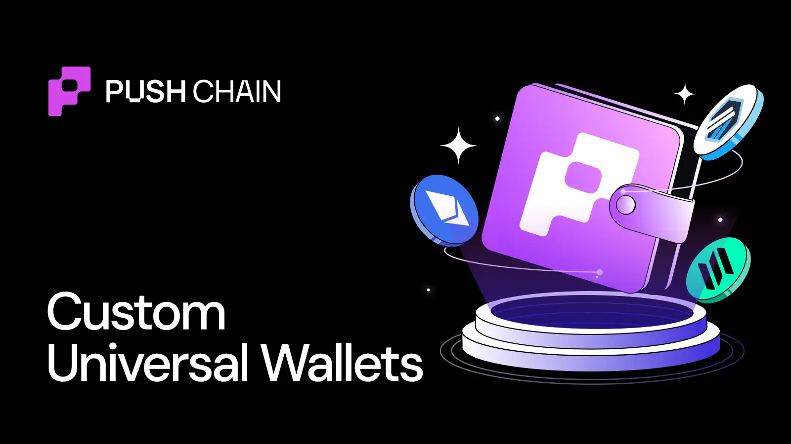

<!--truncate-->

The biggest maker or breaker for any cross-chain app is its wallet UX.

Most apps still ship a generic "Connect Wallet" popup that looks bolted on.
With Push Universal Wallet, the wallet becomes part of your product.

You control the branding, the flows and the chains.

Here is how to customize it.

## Step 1: Add one provider

[`PushUniversalWalletProvider`](https://push.org/docs/chain/ui-kit/integrate-push-universal-wallet/) becomes your app's wallet brain:

- Works across EVM, Solana and Push Chain
- Tracks connection, chain and account state in one place
- Applies your app name, logo and theme for every user

No wiring three different connection systems.

## Step 2: Control the wallet experience

With [`PushUniversalAccountButton`](https://push.org/docs/chain/ui-kit/) and hooks like `usePushWalletContext` and `usePushChainClient` you can:

- Decide when the wallet opens
- Check if the user is connected
- Access the already initialized Core SDK for the user's connected chain
- Pre wire Universal Transactions into your flows

You go from connected to ready to send tx or messages without custom glue per chain.

## Step 3: Make it look like your product

In the UI Kit theme you can override:
- Colors
- Radii
- Typography
- Light or dark mode defaults
Or just style the button.

Same engine, your brand.

Check out these live [playground examples](https://push.org/docs/chain/ui-kit/).

💫 That's it. You just turned a generic wallet popup into a custom universal wallet layer.

🚫 No separate EVM or Solana logic
🚫 No per chain connection flows
🚫 No hand-rolled modals
🚫 No signer juggling

Just one wallet that looks and feels like your app.

🦦 The Push way to build.
