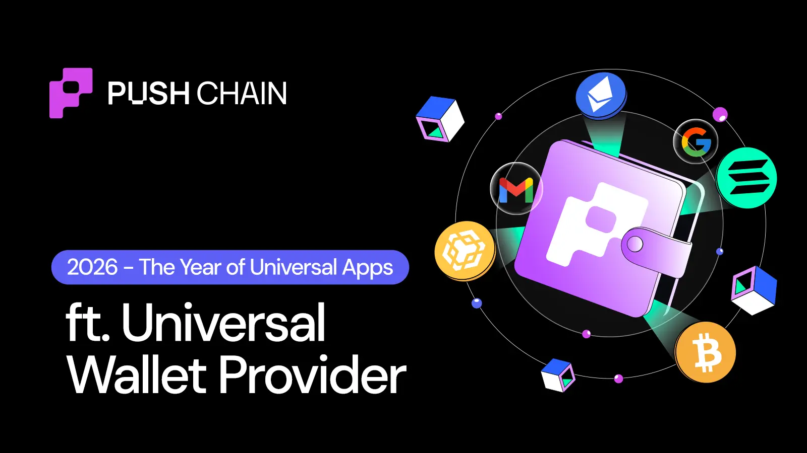
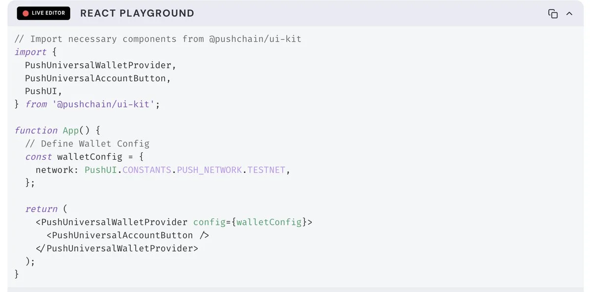
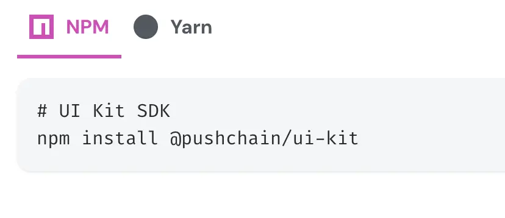
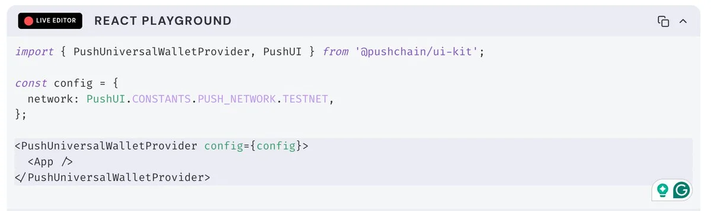
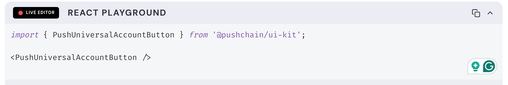
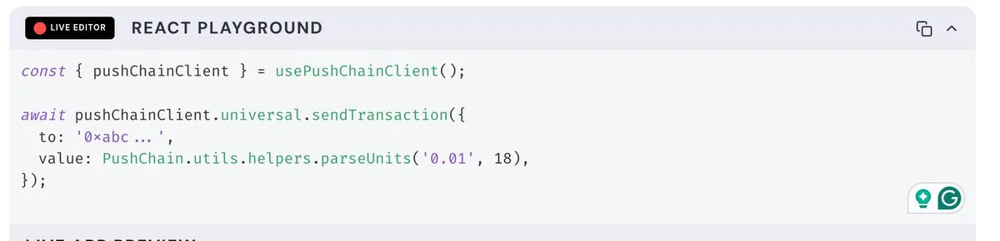
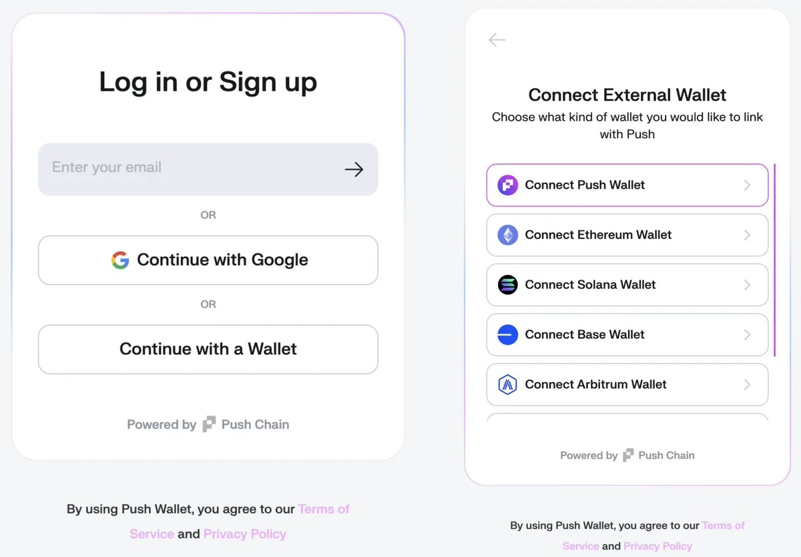

<!--truncate-->

2026 is the year of Universal Apps.

Apps that can be accessed by users of any chain using any wallet.
Without even needing to bridge!
Does that mean devs will have to integrate support for every chain and wallet manually?
Short Ans - **No**.
All you need is a **Universal Wrapper**.

Onboarding users across chains, wallets and various login methods using current interop protocols and tools is a super tiring process.

Universal Wrapper helps you abstract all manual complexities and configuration chaos.

The Universal Wrapper enables your app to:

- Support any EVM, non-EVM wallets.
- Seamlessly allow users to send cross-chain txns
- **Eliminate the need** to manage complex blockchain connections, authentication states, and cross-chain interactions manually.

## Let's make your app go universal!

**Step 1 — Install Push Chain UI Kit**

**Step 2: Wrap your app with the Universal WalletProvider**
**At the root of your app**

This gives access to the Universal wallet hooks, login state, and transaction tools required to support cross-chain txns and wallets.

**Step 3: Add the Universal Connect Button**
Now drop this button wherever you want users to log in or connect their wallet:

**Step 4: Access Wallet State via Hooks** to show whether a user is connected and display their address

**Step 5: Trigger Universal Transactions via Push Chain**

Want to send a transaction on Push Chain from the connected account?
Use the **usePushChainClient** hook:

This abstracts away all interop — the user can be from any chain. You just build like it's a native Push app.

This gives a universal modal that supports:

- Wallet login (via Wagmi & SolanaKit)
- Google login
- Email login (via Magic Link)

You can also choose to customize the look and feel to match with your app's theme.

Transform your single chain confined app into a universal one by integrating it with [Push Chain UI Kit](https://push.org/docs/chain/ui-kit/)
