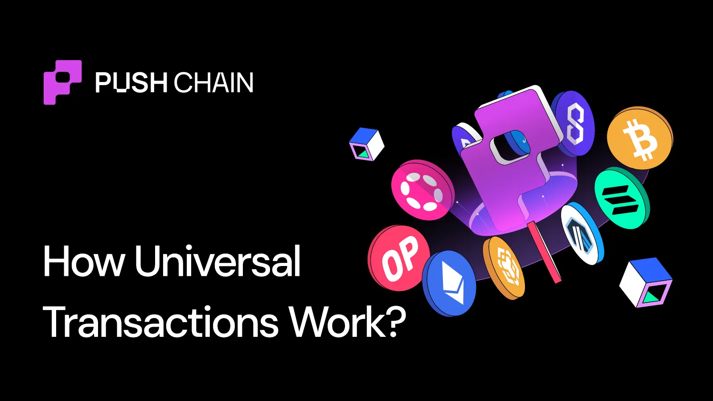

<!--truncate-->

A **Universal Transaction** lets any wallet from any blockchain execute transactions directly on Push Chain.

No bridging.
No wrapping.
No new wallets.
No extra tooling.

Users sign once from their existing wallet and Push Chain handles everything else.

In earlier guides, we covered:

- **[UEAs](https://push.org/blog/what-are-universal-executor-accounts/)**: accounts that preserve a user's identity across chains
- **[Fee Abstraction](https://push.org/blog/what-is-universal-abstraction/)**: paying gas in any token, from any chain

But there's still one mystery that's yet to be decoded.

**How does Push Chain understand, verify, and execute transactions coming from completely different blockchains?**

## TL;DR (2-Minute Read)

If you just want the mental model, here it is:

- You sign **once** on your origin chain (e.g. Solana)
- That signature locks fees **and** cryptographically binds a specific Push Chain transaction
- Validators:
  - Verify fee payment on the origin chain (x/UTV)
  - Verify the signature scheme and payload (USVL)
- A **UEA** executes the transaction on Push Chain
- Your original wallet address remains your identity

**One signature. Any wallet. Any chain.**

If you want the full behind-the-scenes flow, keep reading.

## The Core Problem - Every Chain is Different

Every blockchain speaks a different language.

- Ethereum uses ECDSA signatures
- Solana uses Ed25519 signatures
- Cosmos uses yet another signature scheme
- Each chain has different ways of encoding data, verifying signatures, and structuring transactions

So when you sign a transaction with your Solana wallet, how does Push Chain:

1. **Understand** that it's a Solana signature (not Ethereum)?
2. **Verify** it correctly using Solana's cryptography?
3. **Execute** it on your behalf?
4. **Manage and translate** the fees that you paid for in Solana? and...
5. **Allocate and reflect changes** to your actual Solana address?

All with **one signature/popup**!

This is where Universal Transactions are so powerful, and solves one of the core issues in crypto. The one that got created when we were solving scalability, speed or both. The one that makes the UX terrible for everyone.

## UX Simplification via Universal Transaction

**Scenario - "Alice wants to swap into a memecoin on Push Chain using a Universal DEX."**

### What Alice Sees

1. Clicks "BUY $100" worth of a Memecoin
2. Wallet shows: "Pay 0.5 SOL to complete purchase"
3. Signs once
4. Transaction executes
5. Memecoin appears in the wallet

### What Alice Never Sees

- Creating a new wallet
- Bridging assets
- Buying gas tokens
- Cross-chain coordination
- Signature translation
- Fee conversion

Push abstracts all of this away, leaving Alice to only use the features of the app.

## But how does a Universal Transaction Work?

Every Universal Transaction follows four phases:

1. **UEA Creation**
2. **Transaction Submission**
3. **Verifying the transaction**
4. **Executing the transaction**

### Phase 1: UEA Creation

A **UEA (Universal Execution Account)** executes transactions on behalf of the user on Push Chain while preserving their original wallet identity across chains.

When Alice clicks "Swap," the SDK checks whether she already has a UEA.

#### Case A: First-time User (UEA does not exist)

The SDK creates a single atomic flow consisting of:

- UEA Deployment
- Gas Estimation & Conversion
- Locking of Fees
- Executing the Transaction

To optimize UX and enable faster post execution, the SDK also preloads the UEA with $1 of gas on your first interaction. For instance:

- Alice spends $0.10
- $0.90 remains in her UEA
- Future transactions are instant until funds run low

No extra steps.

To know in-depth about the superpowers of UEAs and how they help developers save massive amounts of extra integration overhead and allow users to interact with universal apps without setting up new wallets, refer to the [Magic behind UEAs Guide](https://push.org/blog/what-are-universal-executor-accounts/).

#### Case B: Existing User, Low Gas

If Alice has a UEA but insufficient gas:

- She pays fees using her native token (e.g. SOL)
- Fees are locked, verified, converted, and credited automatically

No gas bridging required.

#### Case C: Existing User, Sufficient Gas

- SDK checks and confirms that the user's UOA has a mapped UEA with adequate funds
- No need to lock funds in the gateway contract
- Directly create the Txn payload and proceed

In all cases, the gas is completely abstracted away enabling Alice to just enjoy the app instead of thinking about $PC or how to get it.

### Phase 2: Transaction Submission

Once the UEA is ready, the SDK constructs a **Universal Transaction Envelope (UTxEnvelope)**. Here is what happens behind the scenes.

#### Origin Chain Detection

The SDK auto-detects the origin chain and prepares the correct signature, formatting, and proof routing.

#### Gas Estimation

The SDK simulates execution on Push Chain.

Example:

- Required gas: 1 PC (~$0.30)
- Converted to SOL: ~0.0003 SOL

#### Fee Locking (If Required)

If fees must be locked:

1. Alice signs a deposit to the **Universal Gateway**
2. SOL is locked
3. The deposit records the Push Chain transaction hash
4. A Solana transaction hash is returned as proof

**Key detail:** The gateway deposit includes the hash of the Push Chain transaction. By signing it, Alice authorizes this exact action. That's why only one signature is needed.

#### What the UTxEnvelope Contains

- Origin wallet address
- Push Chain transaction payload
- Fee payment proof (if applicable)
- User's cryptographic signature

This proves:

- ✅ Who initiated the transaction
- ✅ What action was authorized
- ✅ That execution fees were paid

### Phase 3: Verification (Deep Dive)

Validators now verify the Universal Transaction.

#### Fee Verification

- Validators check for the gateway fee memo
- The x/UTV module verifies the deposit via RPC calls to the origin chain

Based on this, validators determine whether to:

- Deploy a new UEA and credit funds (New User)
- Top up an existing UEA (Existing User, Low Gas)
- Proceed directly to execution (Existing User, Sufficient Gas)

#### Signature Verification: USV Precompile

Fee payment alone is not enough. The user must have actually signed the transaction. We need to prove consent which is handled by **USV (Universal Signature Verification)**.

USV (Universal Signature Verification) Precompile is a **special smart contract** deployed at address `0x...CA` on Push that handles cryptographic signature verification for multiple blockchain signature schemes.

The USV Precompile:

- Detects: "This is a Solana signature (Ed25519)"
- Extracts Alice's public key from your address
- Verifies signature against the transaction payload

**❌ If verification fails:** Transaction reverted, no gas charged.
**✅ If verification passes:** We move to execution.

### Phase 4: Execution

Validators execute the transaction on Push Chain.

The transaction is recorded with:

- **Executor:** the user's UEA
- **Origin identity:** the user's original wallet address

Alice's Solana address remains her canonical identity on Push Chain.

## Understanding Universal Transaction Finality

**After your transaction executes on Push Chain, the time it takes to reach final confirmation depends on the transaction value.**

This is a security feature that protects against blockchain [reorganization (re-org) attacks](https://www.alchemy.com/overviews/what-is-a-reorg).

### For Small Transactions (≤ $10): Instant Route
```
Transaction executes → 1 block confirmation → ✅ Final
Confirmation time: ~1 second
```

**Why instant?** The potential loss from a re-org attack is minimal compared to the cost of executing the attack. Single block confirmation is safe and provides the speed needed for everyday transactions.

### For Large Transactions (> $10): Standard Route (Multi-Block Confirmation)
```
Transaction executes → Waits for x block confirmations → ✅ Final
Confirmation time: x blocks + finality on Push Chain (~1s)
```

**Note:** x blocks depends on chain re-org risks. For deterministic finality chains (like Polygon, Cosmos, etc., it's 1 block). Any finality on Push Chain is always deterministic and final.

Large-value transactions need deeper security. Waiting for multiple blocks ensures **protection against re-org attacks**.

## The Single Signature Magic

**How does all of this happen with one signature?**

Because the Universal Gateway deposit on your source chain contains the hash of your Push Chain transaction payload.

**When you sign the Gateway deposit, you're simultaneously:**

1. Approving the fee lock
2. Authorizing the specific Push Chain transaction
3. Providing cryptographic proof validators can verify

Push Chain receives the transaction payload and reads the Universal Gateway to verify everything matches.

**One signature. Four stages. Complete execution.**

## Conclusion

Finally, this is how Universal Transactions ensure super swift, secure and abstracted cross-chain transactions.

**For users:** We understood how they can transact from their existing wallets—no new wallets required. No bridging. No gas hunting. Just connect, sign once and use any app, from any chain.

**For Developers:** We saw how there's no more need to integrate complex interop protocols for supporting every additional chain, one by one.

Instead, simply deploy once on Push Chain and let the chain take care of the interop.

Enough writing, let's actually experience the power of Universal Transactions by playing games, launching your tokens or building universal DeFi strategies with the [Push Chain Ecosystem](https://push.org/ecosystem).

Want to start building universal Apps? Get started with the [LIVE docs here](https://push.org/docs).
