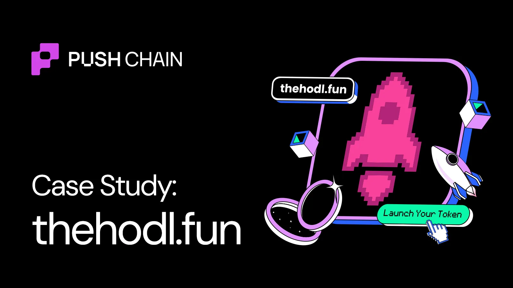

<!--truncate-->

[Hodl.fun](https://www.thehodl.fun/), a universal token launchpad that launched 400K+ tokens across 80+ countries using Push Chain's universal blockchain.
From hackathon idea to $1M volume in 60 days. Here’s how Hodl continues to crush the game

# What problem does Hodl solve?

Pump Fun, one of the most popular token launchpads in crypto, generates 100s of millions of volume everyday.

But the platform is limited to Solana. For a non native Solana user \- creating or trading a token on pumpfun requires multiple additional steps.

* Switching networks and wallet systems
* Bridging tokens
* Acquiring SOL for paying gas

What if any user belonging from any chain can launch and trade memecoins on Push Chain that are “**universally accessible from any chain”** \- without bridging, nor acquiring separate gas tokens, using the same everyday use wallets\!

That’s exactly what [Hodl fun](https://www.thehodl.fun/) enables.

* Launch tokens from any chain
* Attract trenchers and traders from every chain
* Trade tokens from any chain

![][image1]

The mission is simple:
*“Every creator should be able to launch a token as easily as they post on social media. And every crypto user should be able to buy it, regardless of their wallet."*

# Why are users loving hodl?

Just like supporting universal trading from every chain, Hodl houses a global user base spanning over 80 countries\!

🌏 **Asia-Pacific:** \~53%  
🌎 **Americas:** \~19%  
🌍 **Europe:** \~9%  
🌍 **Africa:** \~4%  
🌐 **Other regions (incl. Middle East, rest of world):** \~15%  

So far Hodl.fun has already:

* ✅ Launched **400K+ tokens**
* ✅ Executed **2,800+ universal trades**
* ✅ Processed \~**$1M in volume**
* ✅ Crossed \~**$200K TVL**

This is just the beginning

By building on Push Chain, Hodl eliminated the single biggest barrier in crypto:
 **"Which chain are you on?"**

**The answer:** All of them.

# What’s next with Hodl?

Hodl Fun v2 is launching soon. Here’s what makes it extra special:

\> Real AMM-based pricing for smooth price discovery
\> Creator fees enabled, token launchers earn from trading activity
\> Automatic Uniswap listing on token graduation
\> More immersive, polished UI for a better trading experience

We’re in the era of universal apps.
Any wallet. Any User. Any chain

Start your universal trenching journey with [Hodl Fun](https://www.thehodl.fun/) and win BIG\!\!
[Follow them on X](https://x.com/thehodldotfun) to get the latest Alpha\!
