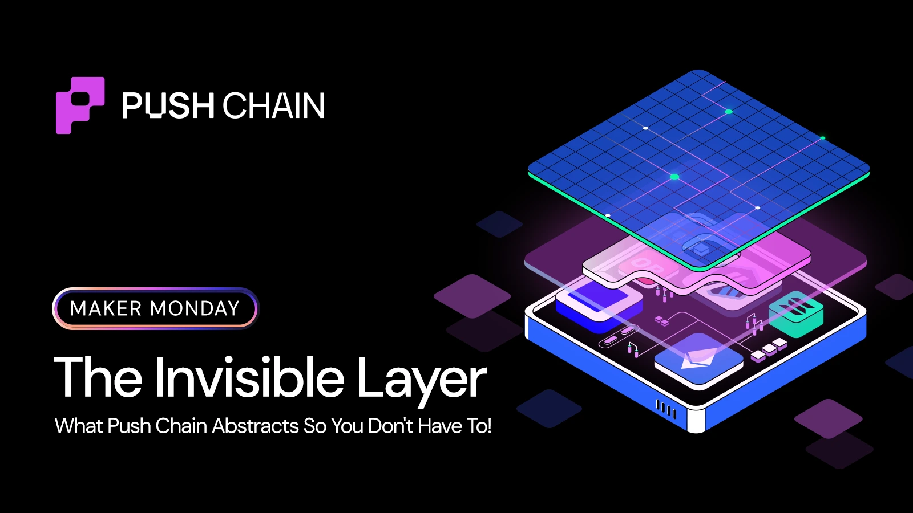
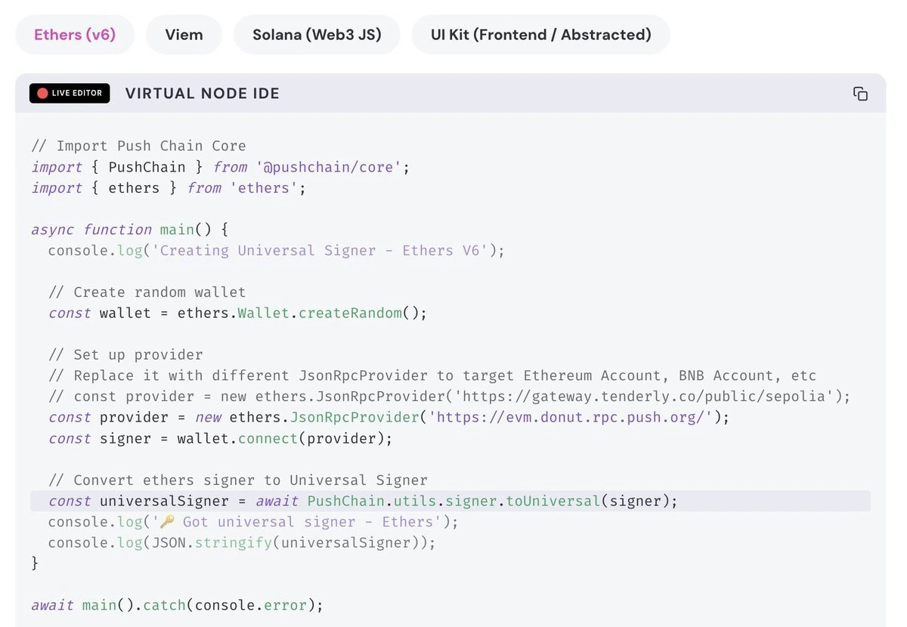

<!--truncate-->

Picture This:
You want to build a cross-chain DeFi app accessible from Ethereum, Arbitrum and Solana.

Here's what you actually have to do:

- Integrate different wallet adapters
- Add new providers
- Tackle between different account models
- Look after key management and so much more

That's spending more time on plumbing the infra than building the app!
*The best infrastructure is always invisible.*

**Universal Signer** makes your cross-chain infra invisible.
**You keep the signer you already use today** (Ethers, Viem, Solana Web3, etc.)
Push just *wraps* it into a Universal Signer and makes it speak "universal" under the hood.




## What pain does it kill?

Without Universal Signer, you'd normally:

- Maintain different wallet flows per chain
- Treat Solana / EVM / L2s as separate worlds
- Glue bridges + RPCs + signature formats by hand
- Rebuild the same "connect → sign → send" logic N times

With Universal Signer:

- You pass in one existing signer
- Push maps it to a Universal Executor Account (UEA) on Push Chain
- That account becomes your app's universal execution identity
- All the routing, gas, and cross-chain glue is done for you

You still code like it's a normal app.
And focus your energy where it matters the most — your app's features.

## The Magic of `toUniversal()`

When you call:

```js
const universalSigner = await PushChain.utils.signer.toUniversal(signer);
```

This is what happens under the hood:

**1. Signature Scheme Detection**

Push Chain detects:
- if (signer is ECDSA) → EVM chains (Ethereum, Polygon, Arbitrum, etc.)
- if (signer is Ed25519) → Solana, Cosmos, etc.

**2. Chain Origin Identification**

Push Chain reads RPC provider and determines whether the calling rpc network is Ethereum Sepolia, Solana Devnet or Push Chain itself.

**3. And Verifies the Signature Format**

- The user **never leaves their wallet of choice**
- The app **never re-implements cross-chain logic**
- The chain **handles all the ugly bits** (bridges, proofs, gas conversions, settlement)

For users the UX remains the same:

- Use the wallet they already trust
- Stay on their home chain
- Still interact with Universal Apps running on Push Chain

## How it fits into your app's flow

Think of your flow in three layers:

**1. Wallet / Signer** — Whatever you already use today
- Ethers Wallet + Provider
- Viem walletClient
- Solana Keypair

**2. Universal Signer (Push)**
You wrap that signer once:
*"Hey Push, this is my user. Make them universal."*

**3. Universal Client + Transactions**
Now your calls like `universal.sendTransaction(...)` automatically route from that user on that chain → Push Chain.

## As a Developer, Here's What You DON'T Write:

❌ Chain Detection Logic
❌ Signature Verification
❌ Gas Estimation Across Chains
❌ Settlement Tracking

**same signer → new superpowers.**

*The best infrastructure is invisible. Developers shouldn't think about chains — they should think about apps and its features.*

Build Universal Apps in weeks, not months — [push.org/docs](https://push.org/docs)
