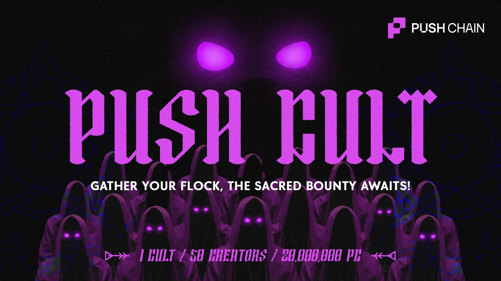

<!--truncate-->

import { CultContact } from '@site/src/components/CultContact';

# **A cult of curated yappers. Built for signal, not spam**

Crypto is drowning in noise. Timelines are rotting with AI slop and empty engagement. Push Cult rejects this decay. We do not seek the loud. We seek visionaries. We are anointing the shepherds who guide their flock with truth. Not louder. Not broader. Pure Signal. **Enter Push Cult.**

**An exclusive order of 50 creators selected to split a 20,000,000 PC token bounty by delivering pure signal.**

:::info Token not Live Yet
PC is the native token of Push Chain, token is not launched yet.
:::

## What is Push Cult

Push Cult is a curated, invite-only program designed to honor and reward real content creators. It rewards both emerging and established creators for delivering measurable results, not just noise.

**What's the vibe we are looking for**: If you create thoughtful, quality content that genuinely connects with your audience, you are a fit. If you rely on AI slop or post low-effort content, this is not for you.

## Why the Cult Exists

We are proving that 50 Disciples can outshine an army of mercenaries. We do not pay for empty reach. We reward the Truth, you are fit if you can deliver:

* Real usage.  
* Die-hard believers.  
* Original thinking.

This is not a marketing campaign. We’re not trying to create another influencer program or invent a new distribution meta. It is a multi-week crusade to deliver Push Chain to the masses. 

## The Rules - A Finite Order. You Perform, We Curate.

We cap the Disciples at 50 to ensure focus. But the doors are never locked. 

Participation is renewed weekly based on impact. If you fall below the threshold, you rotate out. If a new voice rises from the Flock, they rotate in. We do not gatekeep the table. We simply guard the standard. Great creators compete on quality, not volume.

**What Creators Actually Do**

We do not dictate the medium. **Threads, videos, articles the format is yours.** Your mandate is clear:

* Threads, articles, or videos explaining Push Chain concepts  
* Guide the Flock through the Testnet with tutorials.  
* Onboard believers to Season 3\.  
* Evangelize the era of Universal Execution.

**We arm the Disciples.** We provide the raw intel:

* Weekly missions and themes.  
* Alpha before the public sees it.

We provide the ammo. You shape the narrative. **We judge the resonance.**

## Measuring Impact - Proof of Devotion

We ignore vanity metrics. We track conversion. Each Disciple is judged weekly by the **Devotion Score**, a fusion of:

* **Signal:** Reach across the network.  
* **Gathering:** New believers onboarded.  
* **Faith:** User retention and activity.  
* **Craft:** Manual review by the Push Chain Team.

Spam burns to ash. Only the truth survives. A final warning:   
**Devotion is not declared. It is earned.**

## Incentives - The Sacred Bounty

This program is designed for creators who want long-term upside, not one-off payouts.

Top performers receive:

* **Guaranteed Allocation** from the 20M Pool.  
* Ultra Rare Shiny Pass, a mainnet NFT that grants:  
  * Revenue share from chain fees  
  * Validator rewards participation  
  * Staking multipliers  
  * VIP ecosystem perks

**Rank dictates the harvest.**  
There are no participation trophies.

## Who Should Apply - The Calling

The Cult is designed for creators who:

* Already create content like **guides, threads, or explainers**  
* Command an engaged audience (not necessarily a huge one)  
* Care about shipping clarity, not hype  
* Want to be early

You do not need an army, just a loyal following. If you seek a quick flip, walk away. **If you seek to build a legacy, step forward.**

## The Initiation - How to Join

The gates are open.

Registration gives you access to:

* Program details  
* Evaluation mechanics  
* Initial onboarding steps

From there, performance determines everything.

<CultContact />