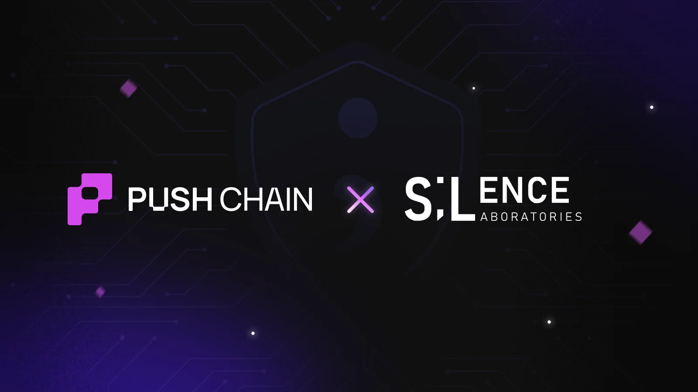
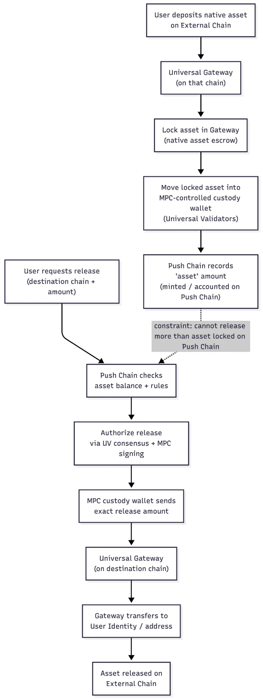
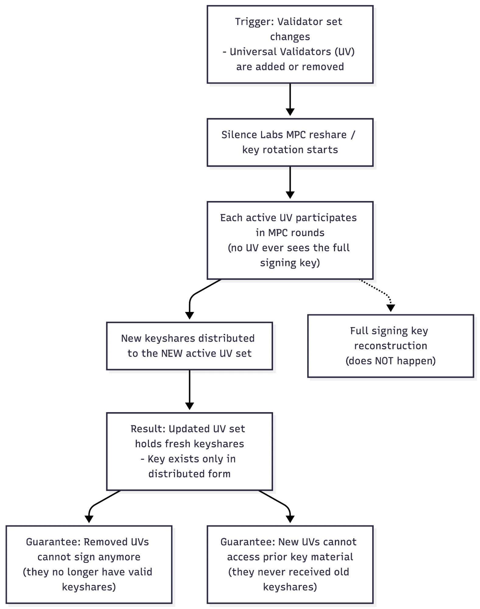

<!--truncate-->

Push Chain is partnering with Silence Labs to bring institutional-grade MPC security for super secure validator operations & cross chain asset management.

Understand what makes this integration special and how Push Chain becomes Universally Secure\!

We’ve integrated [Silence Laboratories](https://silencelaboratories.com/) threshold signing infrastructure into Push’s stack to eliminate mnemonic-based key reconstruction, eliminating single-point key exposure, and prepare Push Chain for high-throughput, multi-chain outbound execution under standard MPC security assumptions.

## TL;DR

**Before**: Universal Gateway controlled assets, key rotation was static

**After**: With threshold signing:

* Private key is never reconstructed in full
* Signatures are produced from partial signatures (e.g., 2-of-3 participants)
* Recovery becomes share re-establishment instead of a mnemonic rebuild
* Adding new validators or removing initiates key rotation without sharing the previous keys
* Universal Validators gain a clean path to distributed outbound signing without unilateral key control
* Assets are controlled via MPC

## Asset Movement via MPC

## Key Rotation

## What This Enables for Push Chain: Secure Cross-Chain Execution

Push Chain’s Universal Validators are responsible for authorizing outbound actions on external chains. These operations are high-value and security-critical, requiring a signing mechanism that is:

* distributed
* threshold-based
* and resilient against single-node compromise

Threshold signing shifts the authorization model from:

**“One machine can move funds.”**  to **“A threshold of validators must cooperate to move funds.”**

This materially improves compromise resistance, decentralization, and operational safety across the network.

### Universal Validators: Distributed Signing Architecture

**Core Components**

* **Validator node (Go):** Consensus, state machine, staking, governance

* **Signer sidecar:**
  Runs Silence Labs threshold signing logic
  Holds a single key share
  Isolated from validator execution paths

* **Coordinator/session router:**
  Orchestrates multi-party signing rounds
  Routes MPC messages
  Does not access private keys or partial signatures

* **Secure transport:**
  Authenticated P2P or mutually authenticated RPC for MPC messaging

**Key Lifecycle**

1. **DKG** – distributed key generation across validators
2. **Signing** – threshold partial signatures for outbound txns
3. **Resharing** – when validator membership changes
4. **Rotation** – under governance or incident-triggered updates

This architecture separates consensus from cryptography while supporting dynamic validator sets.

### Performance Requirements: What We’re Optimizing For

Universal Validator Throughput and Security

A naive “2/3 of 100 validators sign every outbound txn” approach does **not** scale.

The scalable design uses:

* Committees (Smaller signer subsets)
* Verifiable selection (stake-weighted or VRF)
* Parallel signing for multiple chains
* Pipelining of signing sessions
* Separation of approval vs. signature production

This supports sustained multi-chain throughput without weakening security assumptions.

### Go-First Integration: How It Fits Our Stack

Push Chain’s validator layer is written in Go language, so integration takes a Go-native approach:

* Keep validator logic (consensus/state) unchanged
* Run the threshold signer as:
  * a Go library, or
  * a sidecar with a stable gRPC/HTTP interface
* Treat the signer as a hardened cryptographic module with:
  * controlled key boundaries
  * audited dependencies
  * observability (latency, failure rates, abort reasons)

This cleanly separates distributed signing from validator consensus logic.

### Trust Model & Failure Modes (Explicit)

Who can sign?
Only the threshold of participants — never a single device or server.

If the Push co-signer is down?

* **Validators:** committee redundancy and threshold selection maintain liveness.

If a signer is compromised?
A single share cannot sign, a compromised participant triggers refresh/resharing procedures.

If validators churn?
Resharing/rotation ensures the threshold adapts safely.

This is the practical difference between:

**“We split a mnemonic.”** and **“We run a distributed signing system.”**

## What This Unlocks Next for Push Chain

Validator-side

* Safe, committee-based outbound signing
* Reduced reliance on static “bridge operators”
* Protocol-level control over validator churn
* Distributed trust across the validator set

Policy-based signing (Push-controlled co-signer policies enable:)

* spend limits
* allowlists
* session-based permissions
* anomaly/risk scoring
* Enterprise grade asset management

This lays the foundation for advanced asset security and validator capabilities built on top of threshold cryptography.

Integrating Silence Labs’ threshold signing infrastructure elevates Push Chain’s security and scalability across the validator layers. It removes mnemonic-based key reconstruction, decentralizes outbound execution, and provides the distributed signing foundation Push Chain needs for a multi-chain future.

This is next gen signing built for where Push Chain is going, not where it started.
