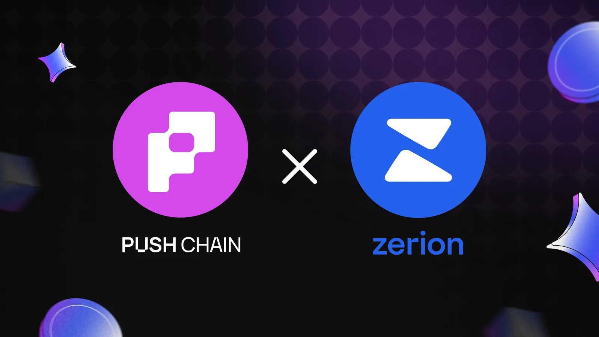

<!--truncate-->

Push Chain now supports [Zerion](https://www.zerion.io/) Wallet as a core login option for all universal apps. Users can authenticate through Zerion and interact with apps without manual network switching, fragmented balances, or chain-specific behavior, all powered entirely by Shared-State primitive.

This integration supports a shared goal: making universal apps simpler to use, easier to access, and consistent across environments.

## What is Zerion?

Zerion is a multichain wallet and portfolio tool that lets users track assets and transactions across 50+ networks from one interface. It supports a large set of networks and consolidates activity in one place.

## What does this integration unlock?

Zerion already gives users a unified view of their onchain activity across multiple networks.

Push Chain extends that unification into the app layer, ensuring users interact with universal apps the same way, no matter which chain they touch.

Together, we remove major friction points in the multichain journey, Zerion streamlines wallet management and provides users with a unified view of assets across chains, while Push Chain ensures consistent, predictable universal app behavior across chains through shared state.

## Unlock for Users:

**• One login that works everywhere:** A single Zerion connection unlocks universal apps with consistent behavior across all supported chains. Currently, supported chains mention ETH, Base, Arbitrum,BNB with support for more chains coming soon.

**• Zero-Friction Interoperability**: No network switching, ever. Users interact with one continuous surface while Push Chain resolves the complexity in the background.

## Unlock for Builders:

**•** **Out-of-the-box integration:** The latest Push UI Kit includes Zerion by default [https://push.org/docs/chain/ui-kit/](https://push.org/docs/chain/ui-kit/)

### Unifying the Multichain Experience with Zerion

Push Chain abstracts away network complexity to deliver a standardized user experience. By integrating Zerion Wallet as a core authentication method, we are eliminating chain fragmentation for users. Whether connecting via Mobile, Browser, EOA, or Smart Account, users now get a seamless, consumer-grade experience, while developers gain a stable, chain-agnostic infrastructure.

Explore Zerion support right away:

* Zerion in Push Chain’s UI Kit: [https://push.org/docs/chain/ui-kit/](https://push.org/docs/chain/ui-kit/)
* Try Ballsy (a universal app) via Zerion: [https://ballsy.push.org/](https://ballsy.push.org/)
* You can also check it out on [http://wallet.push.org](http://wallet.push.org)
