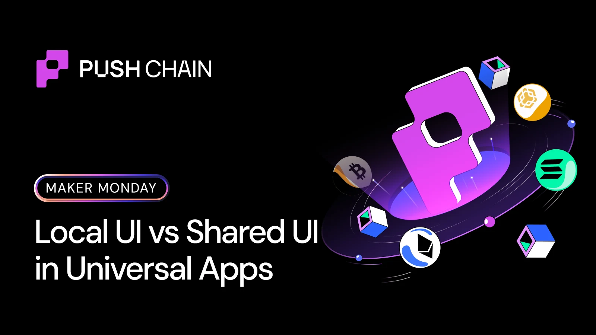
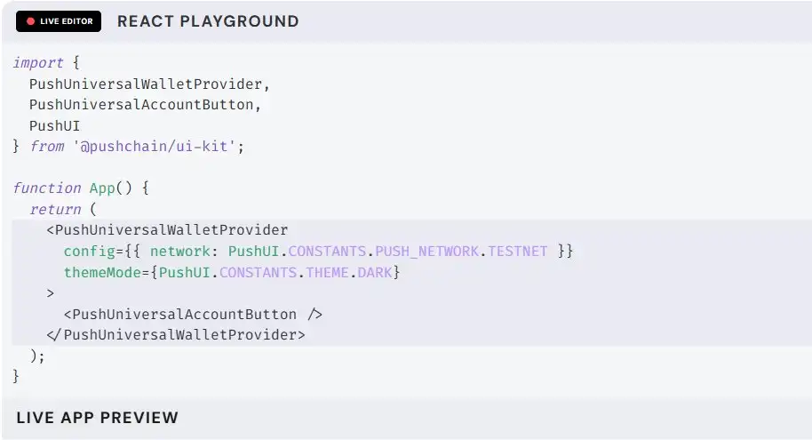
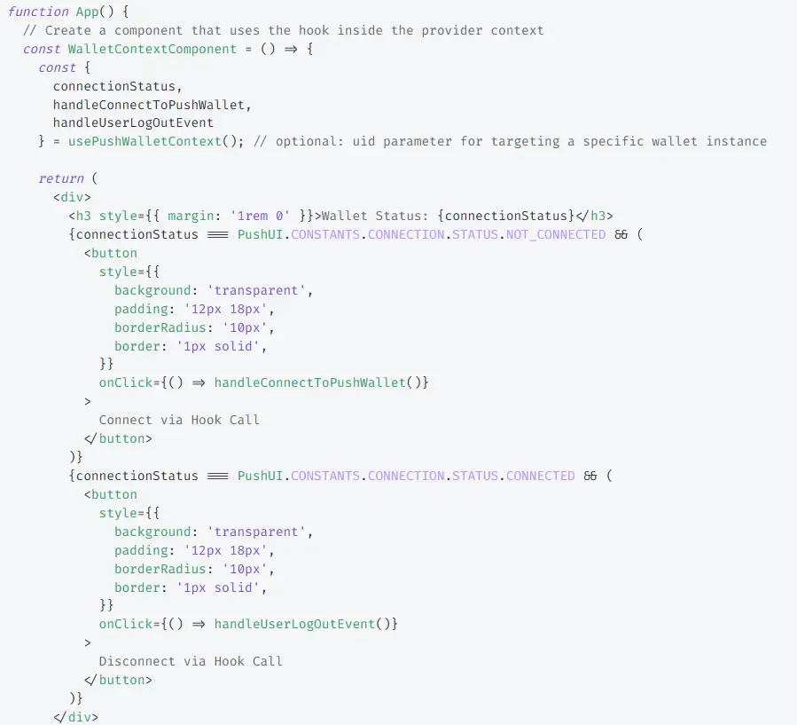
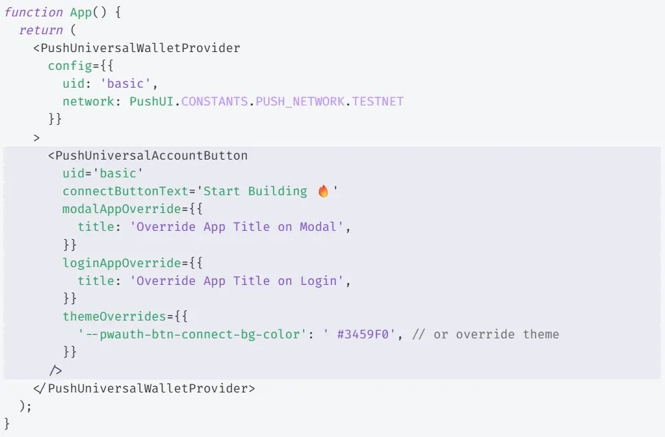

<!--truncate-->

Before you write a single line of smart contract code, most apps already end up with:

- Multiple wallet adapters
- Custom provider logic
- Inconsistent connect modals
- Repeated address display components

This is local UI state, every app rebuilding the same pieces.
[Push Chain's UI Kit](https://push.org/docs/chain/ui-kit/) replaces that with a shared wallet UX layer that any React app can use instantly.

## Local State vs Shared State

### Local UI State (how apps work today)

When every project builds wallet UX on its own, you get:

- Different **connect()** flows everywhere
- Custom logic in every repo
- Mismatched UI patterns
- Debugging the same provider errors repeatedly

Think of this as local state per app, isolated wallet UX that no two apps implement the same way.

### Shared UI State (how Universal Apps behave)

UI Kit gives your app a shared, standardized, reusable wallet layer:

- One provider wrapper
- One connection hook
- One modal system
- One consistent UX pattern
- One source of truth for wallet state

Every app plugs into the same wallet experience instead of reinventing it.

### ❌ Before (Local UI State)

- MetaMaskConnect.js
- CoinbaseConnect.js
- WalletConnectSetup.js
- Custom modals
- Custom provider setup
- Custom signer flows

### ✅ After (Shared UI State)

- `<PushUniversalWalletProvider>`
- `usePushWalletContext`
- `<PushUniversalAccountButton>`
- One wallet modal
- One consistent provider
- Fewer files, fewer bugs

## Here's how to do it in just 5 steps 👇

### Step 1 — Install the UI Kit

🔗 [push.org/docs/chain/ui-kit/integrate-push-universal-wallet/](https://push.org/docs/chain/ui-kit/integrate-push-universal-wallet/)

This starts the migration away from per-chain UI logic.

```bash
npm install @pushchain/ui-kit
```

### Step 2 — Add the Shared UI Context

`<PushUniversalWalletProvider>` sets up the shared wallet environment.

{/* image 1 - PushUniversalWalletProvider code example */}


What this unlocks:

- Universal session management
- Abstracted provider logic
- Identical state across all chains
- No chain-bound assumptions inside your UI

This is where your app stops being "local."

### Step 3 — Use the Shared Wallet Hook

The UI Kit exposes a **single wallet hook** that replaces multiple connectors.



Here:

- `address` → the connected wallet address
- `connect()` → initiates the connection flow
- `disconnect()` → resets wallet state

Single, unified wallet interface.
No more custom connection logic.

### Step 4 — Use Shared Components

The UI Kit includes ready-to-use components like:

- ConnectButton
- AddressDisplay
- WalletModal

You get a consistent modal + interaction pattern across all apps.



### Step 5 — Use Your Own Library for Transactions

UI Kit doesn't abstract execution.
It gives you the wallet provider so you can use ethers/viem normally.

**Boom! Your app Wallet UI is now Universal.**

---

UI Kit doesn't change your blockchain state.
But it does change your **UI state model: Local → Shared**

- From custom code → to a shared wallet layer
- From 6 files → to 2 lines
- From inconsistent UX → to predictable components
- From per-app logic → to a standard interface

You remove ~80% of the boilerplate that every app rewrites.

**Takeaway**: UI Kit standardizes wallet UX.
Your app stops rebuilding the same wallet flows, and starts using a shared, reliable UI layer instead.

Start here → [push.org/docs/chain/ui-kit/](https://push.org/docs/chain/ui-kit/)
