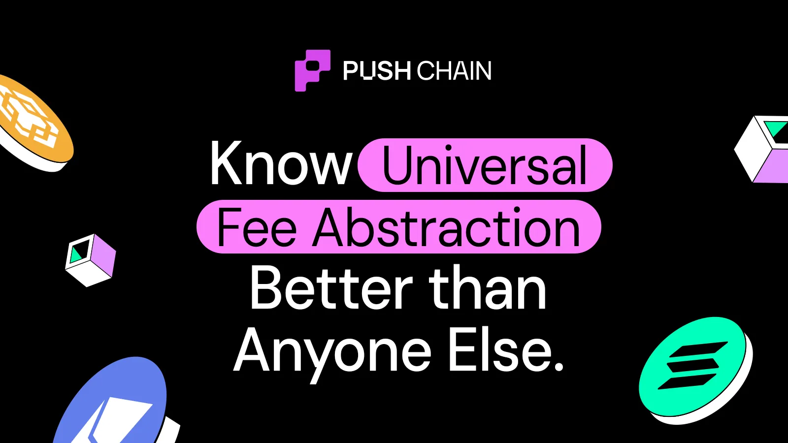

<!--truncate-->

User clicks “**Stake 500 USDC”** they expect **one outcome.**

What they get instead:

switch chain → find gas → bridge → swap → approve → stake → track 3 txs.

These aren’t UX bugs. But consequences of one **architectural constraint.**

Most multichain apps are built on **chain‑local state + chain‑bound execution.**

So UX fragments by design 👇

Every chain maintains its own isolated:

- balances
- contract storage
- liquidity
- fee market
- execution context

So your “single app” is actually **N different apps**, each running against a different local state.

These 5 issues aren't UI flaws, they're physics under today's architecture:

1. Chain-specific UX — Liquidity, quotes, and even features differ per chain → unpredictable results.
2. Forced network switching — Tx must execute inside a chain's rules → user is forced to change context.
3. Fragmented fees — Each chain has its own gas token + pricing → "wrong token" errors.
4. Bridge → Swap → Stake — User becomes the routing engine, manually navigating state islands.
5. Local wallet logic — App state ≠ wallet state ≠ RPC state → "works on my machine" failures.

You can redesign the UI forever, the architecture won't cooperate.

**Chain-specific UX: the most visible symptom**

Even before network switching or gas issues, users feel this one first:

**the same action behaves differently on each chain.**

Because every chain holds its own liquidity, balances, storage, and routing paths, apps quietly drift into N different versions of themselves.

- deeper pool on Chain A
- empty pool on Chain B
- different slippage on Chain C
- feature missing entirely on Chain D

**One UI → four different realities → zero predictability.**

**Why network switching exists?**

Everyone blames wallet UX.

It’s not the wallet.

It’s the fact that verification + execution must happen *inside* one chain’s domain:

- the signer binds to a chain
- the txn must follow that chain’s rules
- the state it touches lives only on that chain

So “switch network” is really:

→ switch verification domain

→ switch execution context

→ switch state machine

**The Fix:** **Universal Verification Layer (UVL)**

Sign once → verify once → not bound to a chain.

**Why fees feel chaotic?**

A single “Stake 100 USDC” intent touches **multiple fee systems**:

- different gas tokens
- different L2/L1 pricing
- different DA costs
- different mempools

Users end up needing gas on 2–3 chains for one outcome.

The UX feels random because the underlying fee markets are random.

**The Fix: Fee Abstraction + Solver Model**

User sees **one all-in cost**.

Solvers handle gas routing.

Apps can sponsor when needed.

**Conversion killer: “Bridge → Swap → Stake”**

This flow exists because you’re asking the user to manually cross isolated states:

bridge → wait → swap → approve → stake → reconcile

Each hop = new chain context, new gas token, new failure point.

This is where users drop.

**The Fix: UEA (Universal Execution Architecture)**

UEA treats the entire flow as **one intent**, not a sequence of user-driven hops.

**Human-readable intent:**

“Stake 100 USDC with 0.5% slippage, deadline 10 min.”

UEA coordinates the cross-chain work under the hood.

**Why “Local Wallet Logic” fails?**

Wallets today compute chain context locally:

- active network
- RPC endpoint
- pending tx tracking
- cached balances
- event subscriptions

Different devices = different behaviors = unpredictable UX.

**The Fix: Shared State + Unified Receipts**

Move session state + execution tracking off the device and into a shared execution model.

The app no longer depends on the fragility of per-device chain context.

**Everything maps back to one idea:**

UX follows state.
Fix the state model and the UX collapses to one chain-level simplicity.

Push Chain makes multichain apps behave like single-chain apps, not by hiding fragmentation, but by eliminating the architecture that causes it.

If you want to explore the primitives mentioned above UVL, UEA, shared-state, fee abstraction.

[push.org/docs](http://push.org/docs) is the best place to start.
