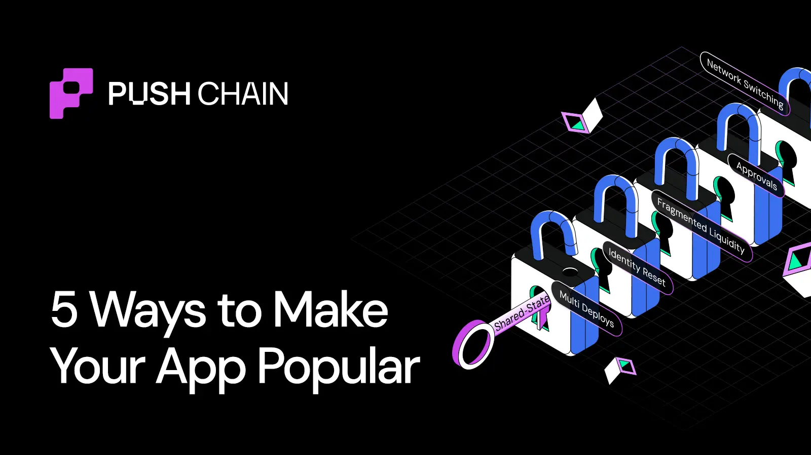

<!--truncate-->

Users don't quit because your app is bad.

They quit because the chain experience gets in the way — switches, mismatched balances, and endless approvals.

Shared-State removes the burden from your users' journey.

Here are five ways that will make your app go popular.

## Way #1 — No Wallet Switching

With Shared-State, your app lives in one global place, not many chain silos.

So users never hop networks; the whole app just works. It feels like entering one big open space instead of checking five different doors.

## Way #2 — One-Click Multi-Action

On most chains, simple tasks become multi-step obstacle courses.

Shared-State turns them into one intent with one signature.
Users love apps that feel like "Done," not "Next… next… next…"

## Way #3 — Predictable Liquidity & Quotes

Chain-by-chain apps show chain-by-chain results.

Shared-State gives your app one synced source of truth: balances, LP, quotes, all aligned.
Predictability = trust → trust = growth.

## Way #4 — Universal Identity

Today, changing chains feels like changing who you are.

Shared-State keeps identity in one place: same profile, same activity, same preferences.
Your app feels continuous instead of "resetting" each time.

## Way #5 — Universal Contracts

Instead of 10 versions of your app living on 10 chains, Shared-State lets you deploy once.

Every feature becomes available to every user instantly: no redeploying, no syncing headaches.
Consistency is a growth hack.

---

Apps don't become popular by adding more features.
They grow by removing friction.

Shared-State makes your app feel like one seamless experience, no matter what chain your users come from.

Build once → your users glide.

Want to build such universal apps? Or transform your existing app into one?
Follow the [quick transformation docs here](https://push.org/docs)

Experience Universal Apps: [https://push.org/ecosystem](https://push.org/ecosystem)
