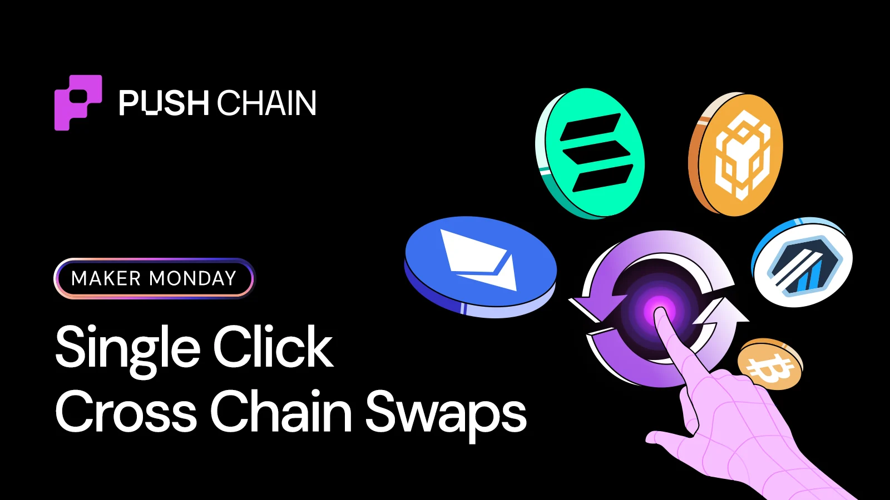
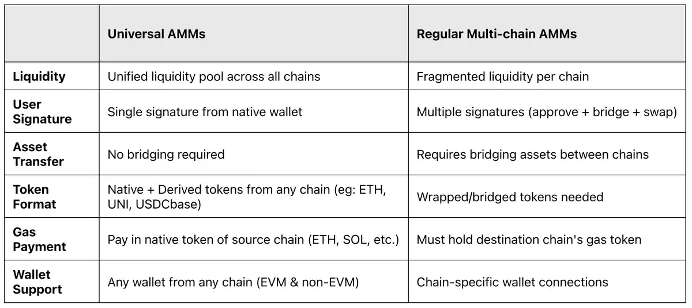
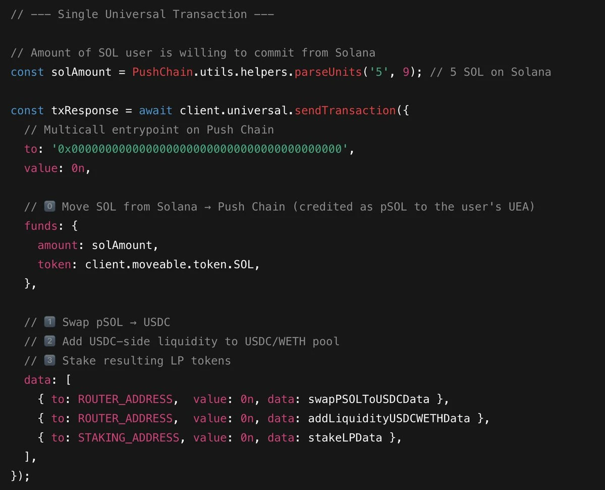

<!--truncate-->

Let's say Bob holds some SOL and wants to farm an attractive yield opportunity in a USDC/WETH universal pool on Push Chain.

On most chains, he'd have to:

- Bridge SOL → some EVM chain
- Swap into USDC + WETH
- Add liquidity
- Then stake LP tokens separately

These are 4 distinct manual actions for the user!

Through Universal AMMs, this entire intent combo collapses into a single unified step, requiring just **one wallet signature**!

Universal AMMs are decentralized defi platforms with unified liquidity pools accessible from any blockchain. Users trade directly from their source chain while accessing shared liquidity across all supported L1s, L2s, and L3s.

On Push Chain, you can build Universal AMMs that can execute any degree of complex cross chain defi actions in a single click — with ZERO restrictions.
Right now, "multichain AMMs" usually mean:

- Same contracts redeployed on 5+ chains
- Liquidity split into shallow ponds
- Bridging + routers + wrapped assets doing gymnastics in the background

Let's dive deeper to understand what powers a single-click universal AMM at the SDK level.

## Universal Transactions with Multicall

Universal transactions let you send native transactions from any Layer 1 chain — EVM or non-EVM, even Push Chain itself — without wrapping, bridging or extra tooling required.

With multicall, you can batch multiple universal transactions together to be executed as a single universal txn.

## Example: SOL user LPs & stakes in one click

What this one call does under the hood:

1. **Bridges SOL** → pSOL into Bob's UEA on Push Chain
2. **Swaps pSOL** → USDC + WETH in the right ratio
3. **Adds liquidity** to the USDC/WETH pool
4. **Stakes LP** tokens into the farm

All *atomically*, all settled on the **unified settlement layer** (Push Chain).

If we go a level deeper:

**On the origin chain (Solana in this case)**
- Bob's SOL wallet signs once.
- That signature:
  - Locks the SOL committed for the universal tx
  - Approves its use as "fuel" + funds for Push Chain
- This shows up as one Solana tx on the origin chain.

**Universal Gateway / Validators step**
- They see the locked SOL.
- They credit the equivalent pSOL to Bob's UEA on Push Chain.
- No extra signature, no separate user action — it's still the same logical universal tx.

**On Push Chain (UEA execution)**
- Bob's UEA now has pSOL (credited from the gateway step).
- The `data: []` part runs as a multicall:
  - swap pSOL → USDC
  - add USDC-only liquidity to USDC/WETH
  - stake the resulting LP

**From Bob's perspective:**
Either way, from the user side, it's still just:

*"I have SOL → I want to LP in USDC/WETH and start farming."*

**From a dev POV:**
bridge → swap internally → add liquidity → stake for farming
From the dev side, the universal transaction + multicall gives you exactly that in one shot.

*"Two contract calls, one universal transaction, settled on Push Chain."*

Give Universal Transactions a shot directly from the [LIVE docs](https://push.org/docs/chain/tutorials/power-features/tutorial-batch-transactions/) *(without needing to setup any environment)*

Want to build universal defi solutions that can house millions of users across all blockchains?
Join our **builder special tg chat** here: [https://t.me/+SFD4qD1JIF1jNTk1](https://t.me/+SFD4qD1JIF1jNTk1)
