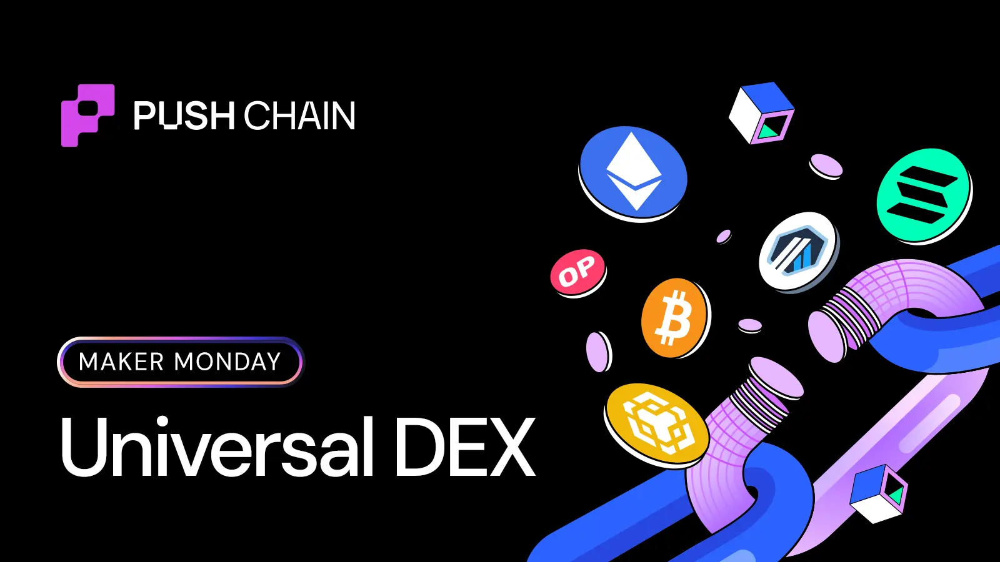
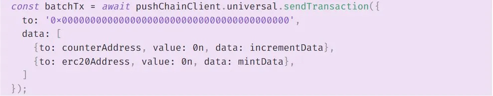
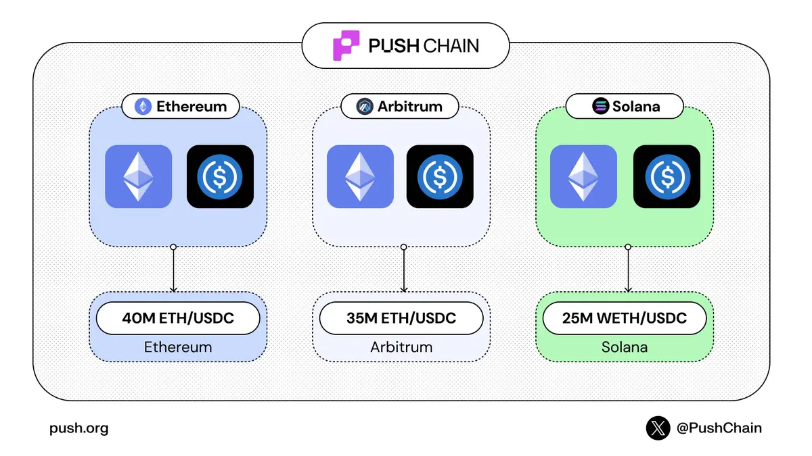
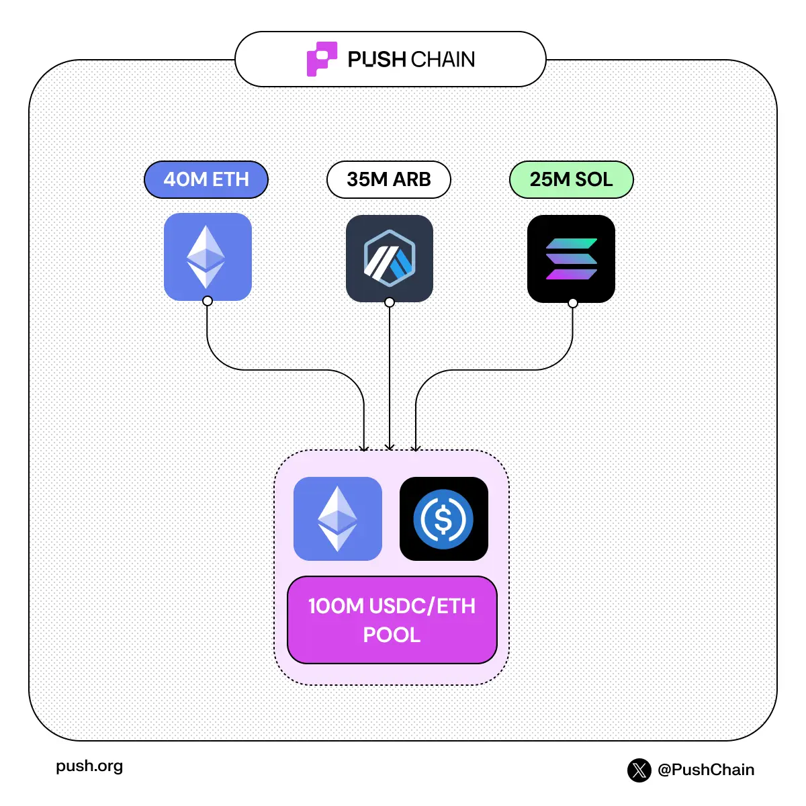

<!--truncate-->

Most "multichain" swaps today hide a multi-step flow:
**bridge → wait → swap → maybe bridge again → then LP**

On Push Chain, a Universal DEX can collapse that into a single multicall executed against shared state.

**One call, one intent.**

From a user's perspective, the intent is simple:
Use my WETH on Arbitrum to LP USDC on Base.
On Push Chain, that intent can be expressed as **one transaction**.

## With a single multicall:

- The swap executes against a global USDC/ETH pool
- The bridge moves the settlement to the destination chain
- **addLiquidity** mints LP shares into the same pool, now represented on Base

Same pool.
Same prices.
No manual bridging.

## Why this works: shared state + universal execution

This only works because the DEX's pool state is not local to a single chain.

Most AMMs are just:

- A pool state
- Deterministic rules to update it

But when that state lives on one chain, everything else has to move to it.
That's the real limitation.

## Local-State DEX vs Universal DEX

**Local-State DEX**

- Pool state is owned by one chain
- Execution must happen on that chain
- To swap or LP from elsewhere → you bridge first

Result:

- UX that forces users to think about chains
- Time-consuming and requires deep understanding

## Universal DEX on Push Chain

- Pool state lives once in Shared State
- Any connected chain can execute against it
- Swap, bridge, and LP are expressed in one multicall

So instead of:
*"Move the user to the liquidity."*

You get:
*"Execute against shared liquidity, settle wherever the user wants."*

## Why multicall actually matters here?

Multicall is only powerful if every step sees a **consistent view of state.**

Because the DEX on Push uses Shared State:

- Swap and addLiquidity operate on the same reserves
- Prices don't change between steps
- Bridging is part of execution, not a separate product

That's how you get:
**one intent → one pool → one coherent result.**

## What does this change for builders?

If you're building on Push Chain:

- You integrate with one pool state, not N deployments
- Users can swap, settle, and LP from any chain
- All via a single multicall

You don't manage:

- Duplicated liquidity
- Cross-chain price drift
- Bundles of routers and adapters

Your app thinks in outcomes, not "where does the pool live?"

**Takeaway**: If a DEX can't share its state, it can't truly share its liquidity.

On Push Chain, Shared-State + multicall turns:
**swap → bridge → LP (across chains)** into a single primitive devs can call, instead of a brittle bundle of bridges and routers they have to orchestrate manually.

Read more about what makes Push Chain [SPECIAL](https://push.org/knowledge/)

Experience what it feels like to transact universally on [anychain apps](https://push.org/ecosystem/)
