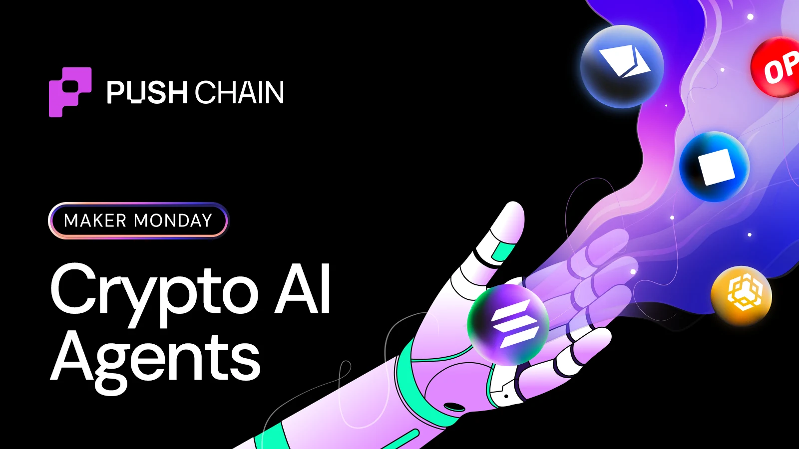
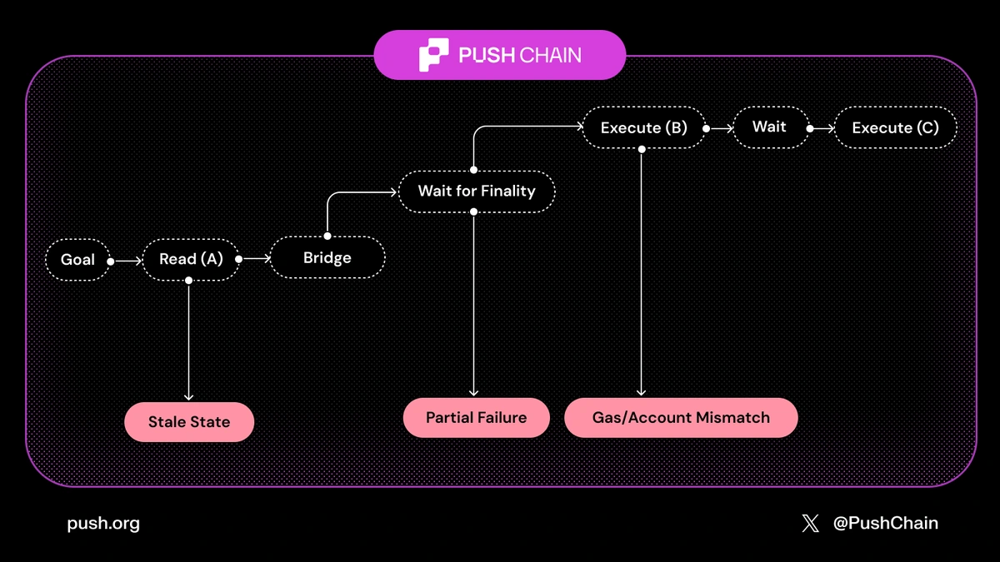
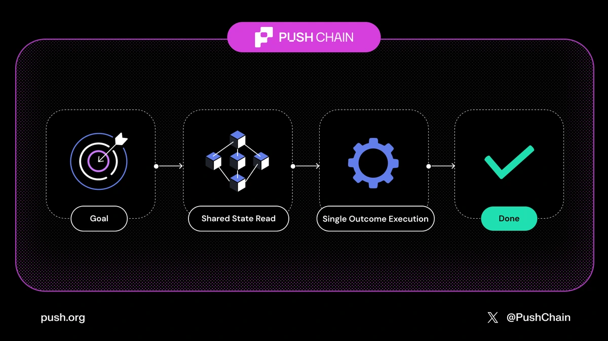
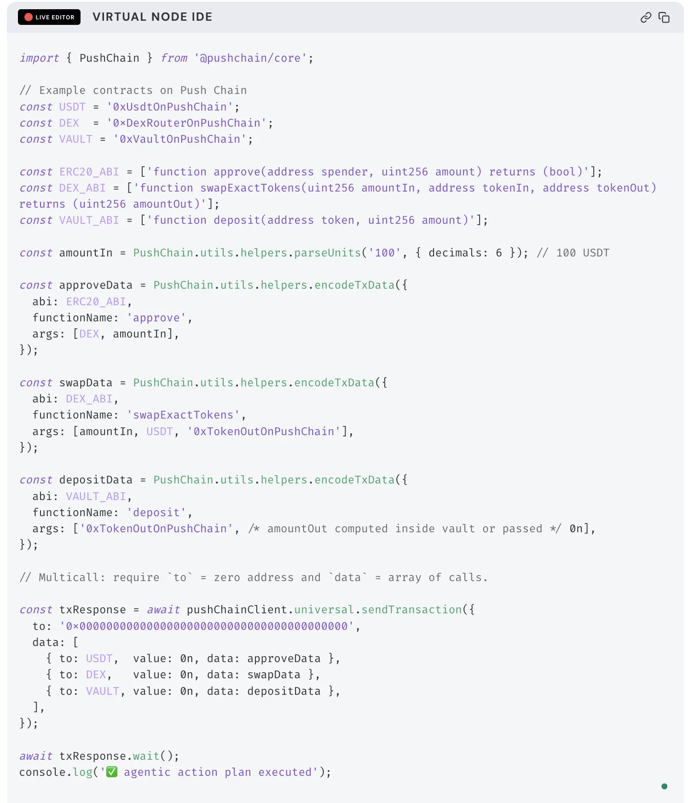

<!--truncate-->

## A regular cross-chain agent (today)

Let's say the objective is to ***rebalance, lend, and hedge.***
What it actually has to do:

- **Read state from multiple chains** (each with its own latency + finality assumptions)
- Route funds through bridges/message passing (often asynchronous)
- Manage **multiple gas tokens + accounts**
- Handle partial completion (step 1 succeeds, step 2 fails). The worst outcome for automation

Not only are these steps time-consuming, but they also introduce multiple points of failure:

## A shared-state agent (also possible today)

*'Shared state' is a unique feature of Push Chain through which its smart contracts have the ability to read state from any supported chain and perform an action based on that.*

Here the goal is the same. But the environment is different:

- The agent gets to read from a single coherent state surface
- It executes as one outcome-driven plan
- Fewer moving parts → fewer failure modes

If you're building "agent-ready" apps on Push Chain, you can assume a world where the agent doesn't need to be a bridge operator or a chain router.

## Universal Transactions

One of the mechanics that makes this possible on Push Chain is the **Universal Transaction** — a primitive that lets you bundle multi-chain intent/logic into a single atomic executable action.

With universal txns, the agent can express a plan (approve → swap → deposit, etc.) and execute atomically with no partial failure.

### What happens here:

- The agent ABI-encodes three onchain actions (approve → swap → deposit) using `PushChain.utils.helpers.encodeTxData`, so each step is a deterministic payload.

- It submits a single `pushChainClient.universal.sendTransaction()` where `"to"` is the zero address and `"data"` is an array of `{ to, value, data }` calls, which is the Push Chain multicall format.

- Push Chain executes those calls **atomically** on the user's [Universal Execution Account (UEA)](https://push.org/docs/chain/concepts/universal-execution-account/): either all three succeed, or the whole batch reverts (no partial completion).

- From agent's perspective, this turns a fragile cross-chain "sequence of transactions + confirmations" into **one outcome-driven transaction** with one hash and one confirmation path.

### Why this matters for agents

With universal transactions:

- The agent doesn't orchestrate multiple chains manually
- Reads and writes behave as if there's one state
- Outcomes become predictable instead of fragile

This drastically reduces failure modes that plague agents in today's fragmented environment.

---

Want to experience how it feels to transact universally?
Explore our Universal App Ecosystem here: [https://push.org/ecosystem/](https://push.org/ecosystem/)
