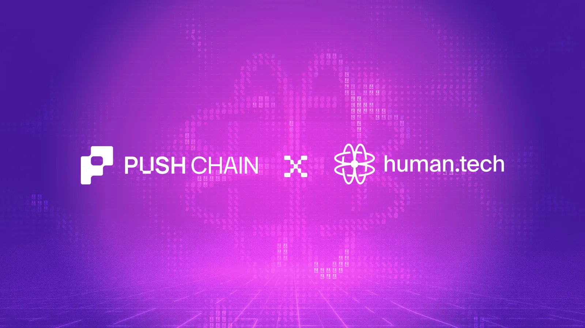

<!--truncate-->

Push Chain has integrated [human.tech’s](https://human.tech/) Wallet as a Protocol (WaaP) infrastructure to enable social login based, self-custodial wallet access directly within the Push Chain ecosystem.

This integration introduces embedded wallet infrastructure that allows users to authenticate using familiar methods such as email and social login, while retaining full cryptographic ownership of their wallets.

human.tech provides the authentication, key management, and signing layers, while Push Chain continues to manage wallet orchestration, transaction construction, and network execution.

### Architectural overview

This integration establishes a clear separation between authentication, signing, and execution responsibilities.

human.tech provides:

* User authentication via email, social login
* Human Key generation and distributed key management
* Secure key share storage using Trusted Execution Environments (TEE)
* MPC-based transaction authorization and signing

Push Chain provides:

* Wallet orchestration and account lifecycle management
* Transaction construction and formatting
* Transaction submission and execution on Push Chain
* Account state and network interaction

This separation ensures that human.tech handles identity and cryptographic authorization, while Push Chain remains fully responsible for transaction execution and settlement.

### Wallet creation and key generation flow

With human.tech integrated, wallet provisioning becomes an infrastructure-level process triggered during authentication.

When a user authenticates:

1. human.tech verifies the user’s authentication credentials
2. A key is generated as the root cryptographic identity
3. The private key is split into distributed cryptographic shares
4. One share is secured within human.tech’s TEE-protected infrastructure
5. The corresponding public key is used to derive a Push Chain wallet address
6. The wallet is registered and becomes immediately usable within Push Chain

This eliminates the need for seed phrases while preserving self custodial ownership.

### Distributed key management and signing model

human.tech uses a distributed key architecture based on secure multi-party cryptographic protocols.

Private keys are never reconstructed as a single entity. Instead, signing operations are performed collaboratively using independent key shares.

When a transaction is initiated:

1. Push Chain constructs the transaction payload
2. The unsigned transaction is passed to human.tech for authorization
3. human.tech performs 2PC-based signing using distributed key shares
4. The signed transaction is returned to Push Chain
5. Push Chain submits the transaction to the network for execution

This model ensures:

* Private keys are never exposed to applications, users, or external systems
* human.tech cannot independently control user funds
* Push Chain cannot access or reconstruct user private keys
* Users retain cryptographic ownership of their wallet

This preserves the non-custodial trust model while enabling embedded wallet infrastructure.

### Integration with Push Chain’s wallet and execution pipeline

human.tech operates as a cryptographic authorization layer beneath Push Chain’s existing wallet infrastructure.

Push Chain continues to manage wallet state, transaction construction, execution and settlement, and network interaction.

human.tech exclusively handles authentication, key generation and management, and transaction authorization and signing.

This ensures that Push Chain’s execution model remains unchanged while improving accessibility and onboarding.

### Developer implications

For devs building on Push Chain, wallet creation and authentication are now handled at the infrastructure layer.

This enables:

* Automatic wallet creation during user authentication
* Removal of seed phrase onboarding requirements
* Embedded self-custodial wallets within applications
* Elimination of external wallet dependencies
* Secure transaction signing without direct key management

Developers can focus on application logic while wallet infrastructure operates transparently.

### Trust model and self-custody guarantees

This integration preserves Push Chain’s self-custodial security model.

Key properties include:

* Key shares are distributed across independent secure environments
* Signing requires cryptographic coordination, not unilateral control
* Neither human.tech nor Push Chain can independently control user wallets

Users retain full cryptographic ownership and control over their assets.

### Enabling accessible self-custodial infrastructure

By integrating human.tech’s Wallet-as-a-Protocol infrastructure, Push Chain moves wallet authentication, key management, and signing into the protocol layer.

Users can authenticate using familiar login methods while securely interacting with Push Chain through self custodial wallets.

This reduces onboarding friction without compromising security, ownership, or execution integrity.

Push Chain continues to expand infrastructure that makes secure, self-custodial access more accessible to both users and developers.

**Try it out here:** [https://push.org/ecosystem](https://push.org/ecosystem)
