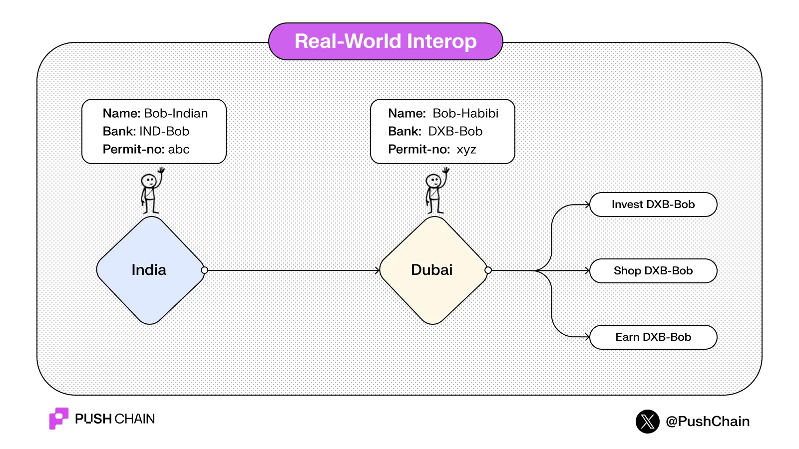
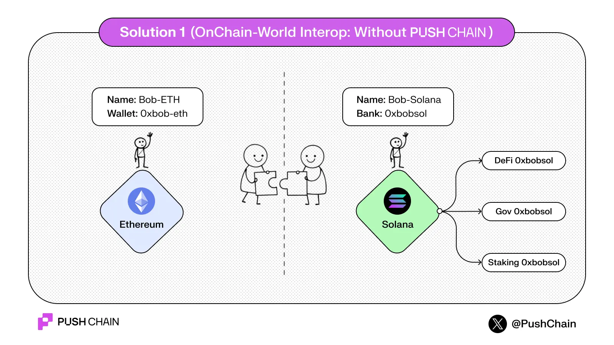
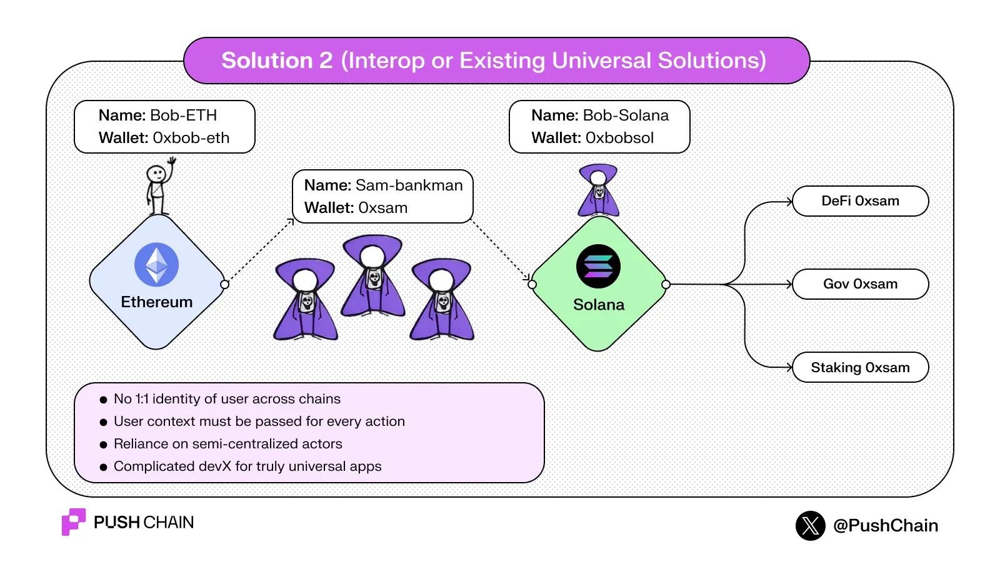
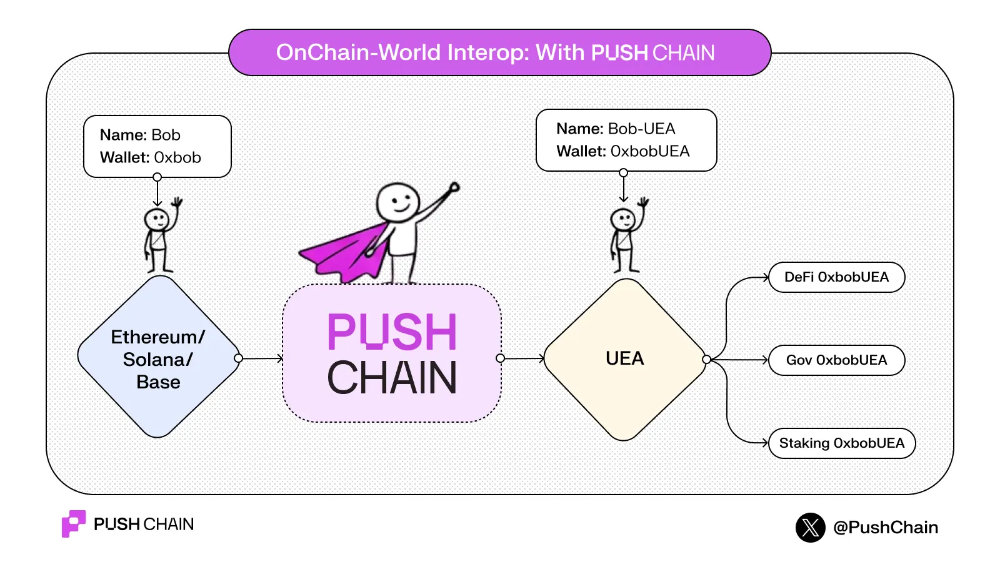

<!--truncate-->

Let's forget blockchains for a second.

Consider Bob, who lives in India.

Bob wishes to invest, shop and earn better revenue in another country — say Dubai.

So Bob:

- Opens a **Dubai bank account (DXB-Bob)**
- Gets a local **permit / ID**
- Starts using that one Dubai identity for **everything** in Dubai — invest, shop, earn.

Even when Bob goes back to India, that Dubai identity persists.

No middleman invests "for Bob." The statement in Dubai still shows **Bob-DXB**, not some proxy.

### TL;DR

In real-world interop situations, the control of users' identities remains in the users' control!

One human → many countries → **direct identity**, no impersonation.

---

## Interop v1

Now, let's bring blockchains back into the equation.

Replace:

- India → **Ethereum**
- Dubai → **Solana**

Bob has `Bob-ETH` with wallet `0xbobEth` on Ethereum.

Bob discovers cool stuff on Solana (DeFi, governance, staking).

One way for Bob-ETH to transact in Solana: *"Just bridge funds and open another wallet."*

So Bob ends up with:

- `Bob-ETH` → `0xbobEth`
- `Bob-SOL` → `0xbobSol`

But the pain points are too painful to ignore:

- Multiple wallets, seed phrases, UIs
- Extra systems to trust for bridging
- No *single* on-chain Bob across chains

### TL;DR

*Interop 1.0 moved **assets**, not **identity**.*

---

## Interop v2 — 'Universal... but not actually'

Next, "universal" chains and message-passing layers appeared.

The flow somewhat looks like this:

Bob (ETH) sends funds + context (origin chain, address, action).
A Relayer / Observer / Guardian executes on Solana — **through the relayer's identity**.

Bob sends:
- $100
- Plus a packed message: origin chain, origin address, intended call, etc.

The relayer:
- Holds the $100
- Executes the transaction on Solana
- Shows up on Solana as `0xRelayer`, not Bob

So on Solana's explorer, every action looks like:

*"Relayer 0xRelayer did X"*

Bob has **no native identity** on the destination chain.
Every action requires shipping context and trusting a third party to act "as if" Bob did it.

### Problems:

- No 1:1 identity for Bob across chains
- Custody and trust concentrated in relayers
- Devs must constantly pass, parse, and validate context blobs
- Apps cannot know *which chain* a user truly belongs to in a clean way

### TL;DR

*Interop v2 feels like the on-chain version of giving some agent your passport, bank login and signature every time an investment is made abroad — and accepting that the contract is in that agent's name.*

---

## Interop Final Version: Truly universal native identity for every user

This is where Push Chain's '**truly universal**' innovation comes into play.

Instead of:

> *"Send money + context to a middleman who pretends to be you on another chain,"*

Push Chain says:

> *"Every user gets a Universal Execution Account (UEA) — a native identity on Push Chain, controlled only by that user's signatures."*

**What happens under the hood when Bob interacts the first time:**

1. Bob signs **one** transaction from the origin chain (Ethereum, Solana, etc.).
2. Push Chain spins up a **UEA** for Bob — think of it as Bob's "Dubai account," but on Push Chain.
3. A precompile ("magic box") verifies Bob's signatures from that origin chain.
4. From that point on, the UEA executes any Push Chain app call in Bob's name.

No relayer owns Bob's funds.
No actor injects context on Bob's behalf.
The account that appears on Push Chain is **Bob-UEA**, not "0xRelayer".

## Why universal identity matters

### For users

- **One identity, many apps** — Bob uses the same origin wallet to access DeFi, governance, staking on Push Chain.
- **No extra citizenships** — No need to create a new wallet on every chain and juggle keys.
- **No "Sam" in the middle** — Transactions execute from Bob's own UEA, not a custodian or relayer.

### For builders

- **Build once, reach any chain's users** — Deploy contracts on Push Chain; the UEA layer handles cross-chain identity.
- **No context gymnastics** — No repeated "pack origin, verify origin, unpack origin" logic in contracts.
- **Cleaner security model** — The app interacts with one canonical account per user: the UEA.

---

Interop so far focused on moving tokens. The new phase is about moving identity without giving it away.

Read more about what makes Push Chain special here: [push.org/knowledge](https://push.org/knowledge)

Experience Universal apps here: [push.org/ecosystem](https://push.org/ecosystem)
