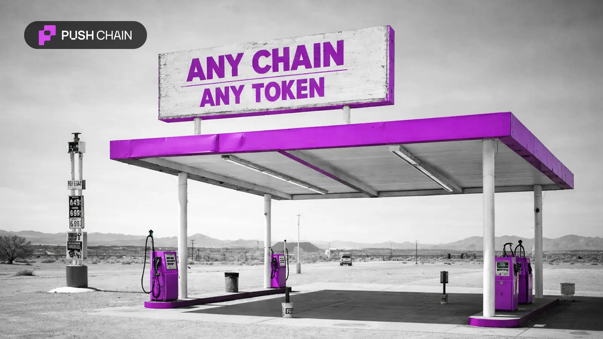
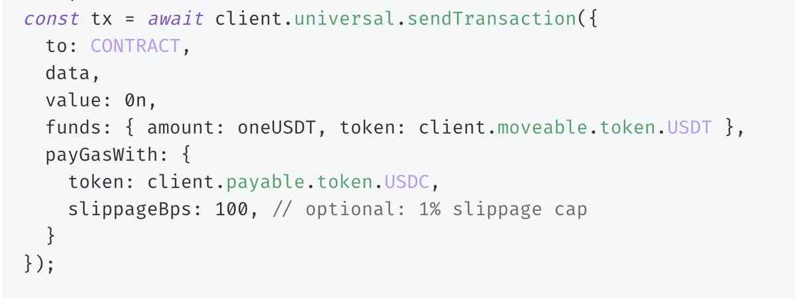

<!--truncate-->

Universal Transactions just got a huge upgrade ⚡️

You can now pay gas fees with ANY token on your native chain.

This means in one transaction, you can:
→ Send funds
→ Execute logic
→ Choose how to pay gas

All in one shot! 

## What makes this upgrade BIG?

Universal transactions can originate from ANY chain (EVM & non-EVM).
Normally, users must hold the native gas token of that origin chain.

With `payGasWith()` upgrade, the fee path becomes universal too.

This means:
- Devs don't have to rely on users to keep native gas.
- Users don't necessarily have to know how their chain's fee system works.

## Behind the scenes

Push Chain:
→ Takes the token you specify (USDT / USDC / anything)
→ Performs the necessary swap
→ Secures the gas
→ Executes + settles the universal txn

All packaged inside one atomic call, fully abstracting native gas.

## Fine-grained controls

- `slippageBps`: max allowed slippage on the ERC-20 → gas swap (100 = 1%).
- `minAmountOut`: the minimum acceptable output (in wei). If the swap can't meet this, the transaction reverts.

Perfect for guaranteeing predictable fee execution.

## Example

A universal prediction market with users from Base, Ethereum, and BNBChain
can all interact with the same liquidity pool.

✅ Base users → pay fees in Base USDT
✅ ETH users → pay in DAI
✅ BNB users → pay in BUSD

or through their native gas tokens. All supported in one pipeline.

## Universal Transactions keep getting stronger.

Gas abstraction + universal fee payment unlocks a truly chain-agnostic experience.

**Dive Deeper:**
- [SDK v3.0.8](https://npmjs.com/package/@pushchain/core?activeTab=readme)
- [Docs](https://push.org/docs/chain/build/send-universal-transaction/)
