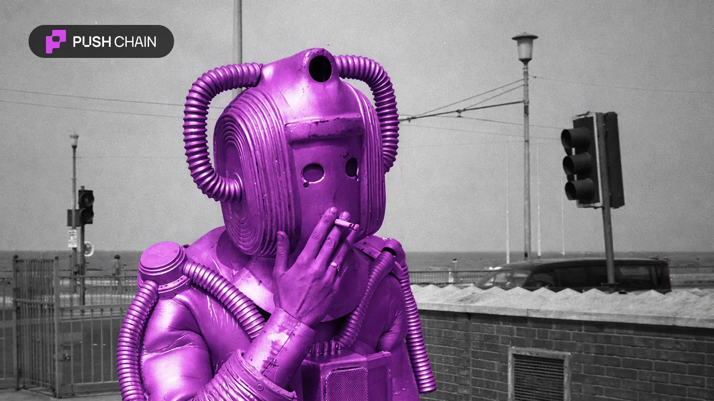
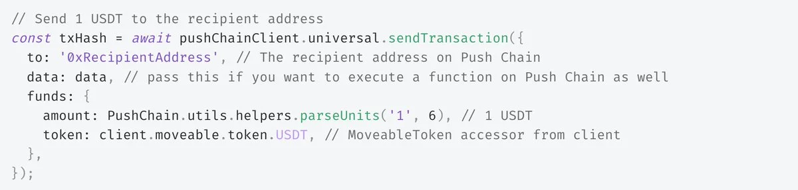
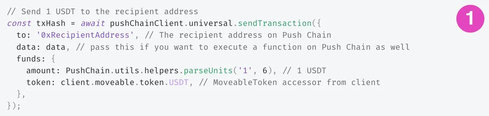
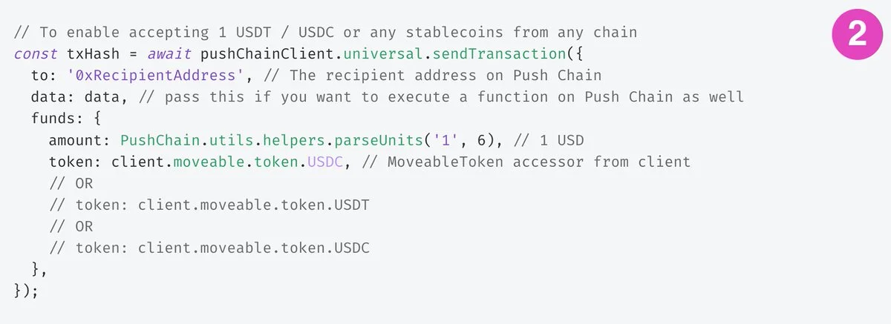
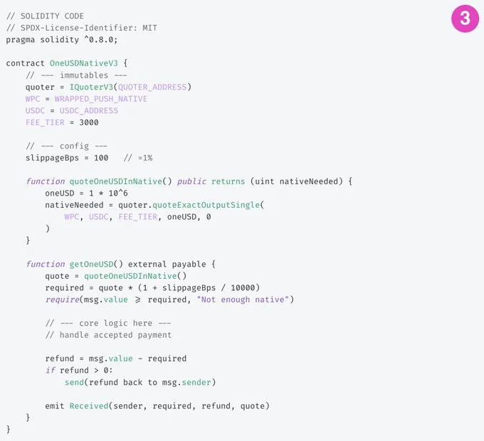
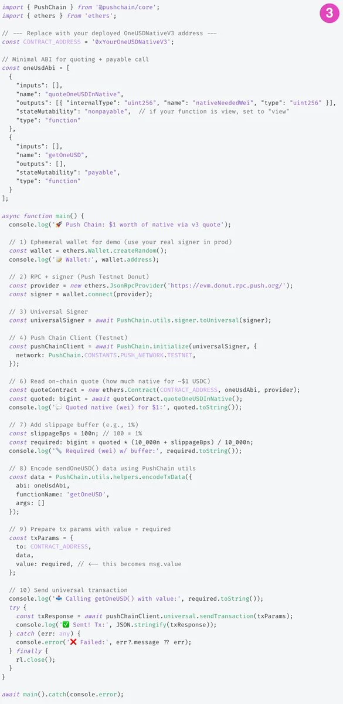

<!--truncate-->

💸 Crypto payments suck in 2025 — Siloed chains = lost users.

Accept USDC on ETH? Solana folks bounce.
Add SOL? Bye Polygon.

Push Chain's Universal Payments make that possible ⚙️
Accept ANY token from ANY chain in 1 line.

Just shipped. Devs, build once, pay everywhere.

## Push Chain handles payments like a boss.

3 levels to Unlock:
1️⃣ Accept one token (e.g. USDT) from every chain
2️⃣ Accept multiple tokens (e.g. USDT, USDC, DAI)
3️⃣ Or build a contract that accepts any token from any chain 🤯

## 1️⃣ Level 1 → Accept one token from every chain

Straightforward — just call [sendTransaction()](https://push.org/docs/chain/build/send-universal-transaction/) and pass the token you want to accept.
ETH, Solana, Base, BNB — all work.

## 2️⃣ Level 2 → Accept multiple tokens from any chain

Just:
- Detect all tokens a user holds when they connect
- Replace funds.token with their selected token

## 3️⃣ Level 3 → ANY token/native (Chad Mode 🤖)

This is the most fun to do, as it opens up payment from any token and requires users to only hold native token on the chain they are on.

**To do this:**
- Extend your contract to accept msg.value
- Pass in the value you want
- Chad Mode: Use an AMM to quote native → USD so you accept exactly $1 worth

**How does this work?**
- Since Push Chain abstracts Fees from any chain, the native token of that chain is calculated in relation to native token of Push Chain

- And the user pays the native token

- Under the hood, you get the native token and can choose to convert it to the stablecoin of your choice

These are pretty powerful on their own, but pair them with #x402 (Coinbase's protocol for AI agent payments) → seamless agentic economy.

Users: "Pay $1 for services from any chain" → Handled automagically.
Agent: "Pay $3 for coffee" → Handles token/chain automagically.

An economy that is suited both for Users and Agents → That is universal payments on Push Chain.

[Build now](http://push.org/docs/) | [Playground](https://push.org/docs/chain/build/send-universal-transaction/#live-playground)

Ready to accept ANY token from ANY chain?
