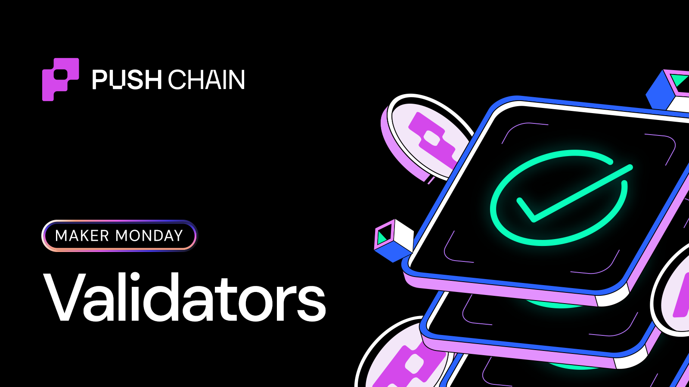
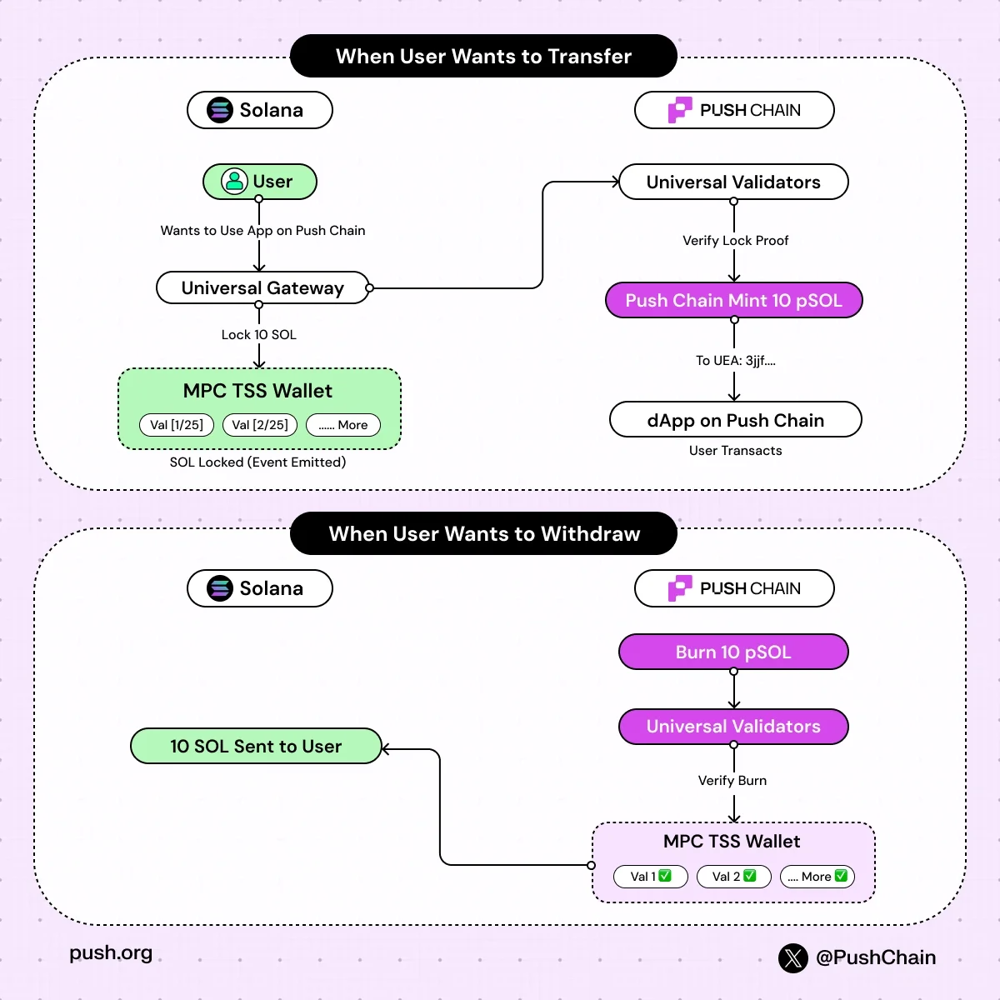

<!--truncate-->

You can hold “the same asset” across multiple chains and still get different prices, different slippage, and different borrowing costs.

Ever thought what the reason is?

Here’s a one-word answer - **Liquidity Wedge**

## What is the liquidity wedge trap?

Liquidity wedge is the gap between how liquid an asset should feel in a unified market and how illiquid it actually feels once its liquidity is split across chains, bridges, wrappers, and venues.

*How assets move between chains directly affects how liquid markets feel.*

It’s evident to all of us that too many L1s, L2s developed isolated economies leading to liquidiity fragmentation. Capital that should move freely and fluidly is constrained to silos.

Forcefully exposing users to increasingly complex and bridging processes.

**Bridging solved an important first problem:** moving value between chains. But at the same time it gave birth to many new problems.

For instance:

- Let’s suppose you locked a token on chain A
- A wrapped representation of it is created on chain B
- Another bridge may create another version of the same asset
- Now liquidity is split across versions, pools, and venues creating:
    - fragmented chain-local liquidity pools with smaller volumes.
    - separate markets for “the same asset” with separate prices.

This results in a significant loss of capital efficiency.

What you see is liquidity spreading thinner and getting more fragmented.

- DEX pools lose depth
- Prices diverge
- Borrow rates vary wildly

**How does this affect users?**

Liquidity fragmentation directly leads to:

- worse swap execution
- more slippage
- inconsistent borrowing costs
- extra routing complexity

This is the root of what later shows up as the **liquidity wedge**.

Now, what if there were a way to ensure asset movement across chains without creating new liquidity islands?

That’s exactly what Push Chain does.

## How does Push Chain solves the liquidity wedge?

Push Chain is designed so that asset movement doesn’t create multiple incompatible wrapped versions of the same asset.

This makes it easier for liquidity to converge on one execution environment, instead of splitting across bridge-specific representations

### **When assets move to Push Chain:**

- The original asset is locked on the source chain
- Push mints a strict **1:1 representation**
- No secondary markets needed to “defend” the price.

Value stays conserved, and the asset doesn’t splinter into multiple bridge-specific versions.

---

### When assets move **from** Push Chain:

- The representation is burned
- Release is triggered only for the exact burned amount
- The original asset returns to the source chain

Nothing gets duplicated.

Nothing is left behind as a competing synthetic copy.

That’s how Push tries to reduce fragmentation at the asset-flow layer itself.

Experience what's it like to transact on Push here - https://push.org/ecosystem
