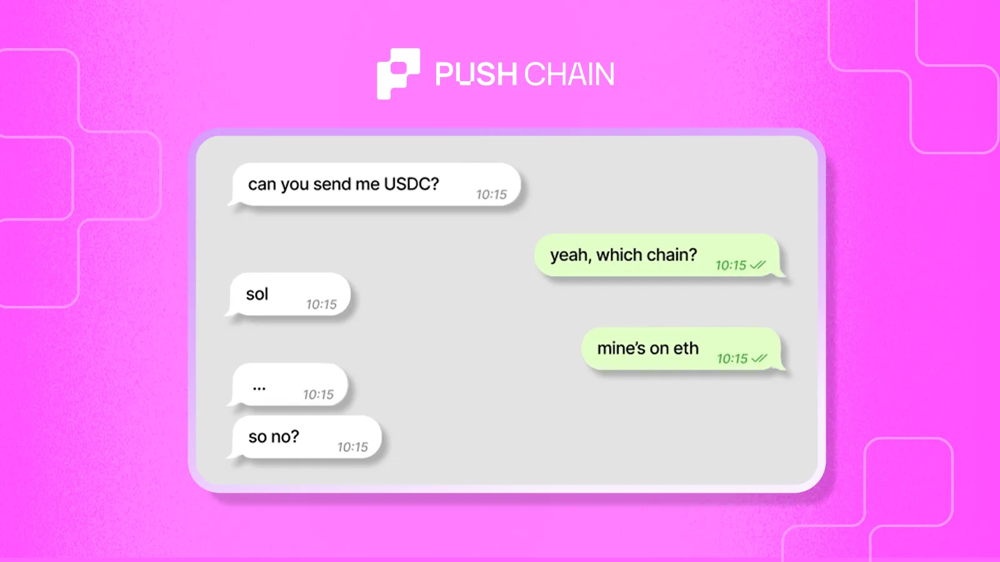
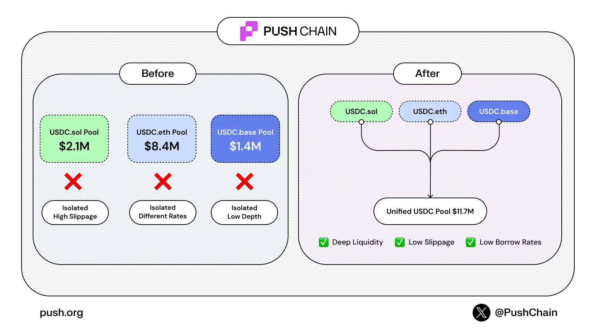

<!--truncate-->

You hold USDC. So does our intern.

But yours is on Solana. Intern on Ethereum.

Same issuer. Same dollar. Totally different liquidity.

Chain fragmentation got all the attention.

But this? This is the real problem 👇

Today's reality: USDC Sol, USDC ETH, USDC Base, all circle backed, all worth $1.

But they're isolated. Different pool depths. Different slippage. Different borrowing rates.

Defragmenting chains was step one. Defragmenting liquidity is what actually moves the needle.

This is what the Liquidity Wedge solves.

Powered by Push Chain's universal settlement layer, it takes stablecoins from all chains and combines them into one basket.

USDC.Sol + USDC.ETH + USDC.Base → One unified USDC pool.

Not a new stablecoin. Just the ones you trust; unified.

### **How the peg stays intact**

The basket balances based on cross-chain liquidity depth.
When you withdraw, protocol honors your preferred chain. Edge case: you might get USDC from a different chain.

But as the wedge deepens, that edge case basically disappears.

### **Why this matters for apps**

User on Solana? ETH? Base? Doesn't matter.

Apps like [HodlFun](https://www.thehodl.fun/en) and [beatbrawls](https://push.beatbrawls.com/) can onboard anyone, same app, same liquidity, no bridging required.
One DEEP pool for every chain's users.

### **And for DeFi, the math changes entirely**

→ DEX slippage becomes negligible  
→ Borrowing rates drop hard (3% → 0.3%)  
→ Capital efficiency goes through the roof  

You're not reinventing any DeFi primitives. You're unifying what already exists.

That's what an efficient financial layer actually looks like.

Chain fragmentation? Solved.
Liquidity fragmentation? That's the real wedge.

One settlement layer. One liquidity pool. Every chain's users.

That’s DeFi without walls.
