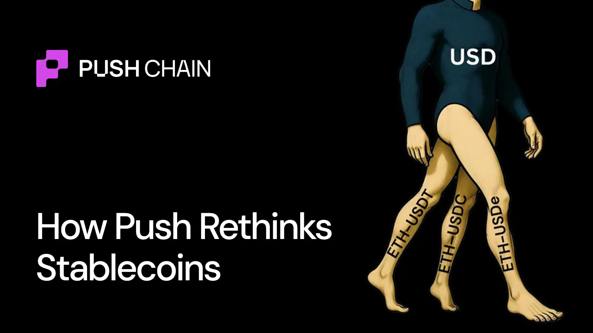
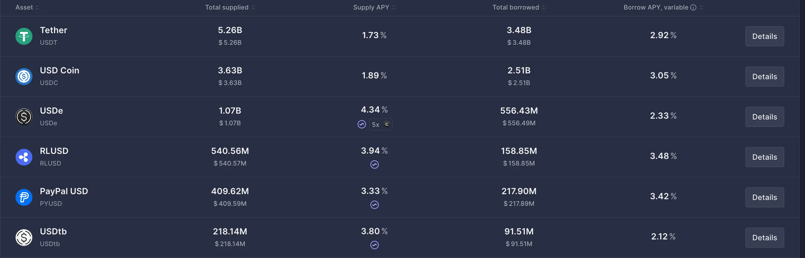
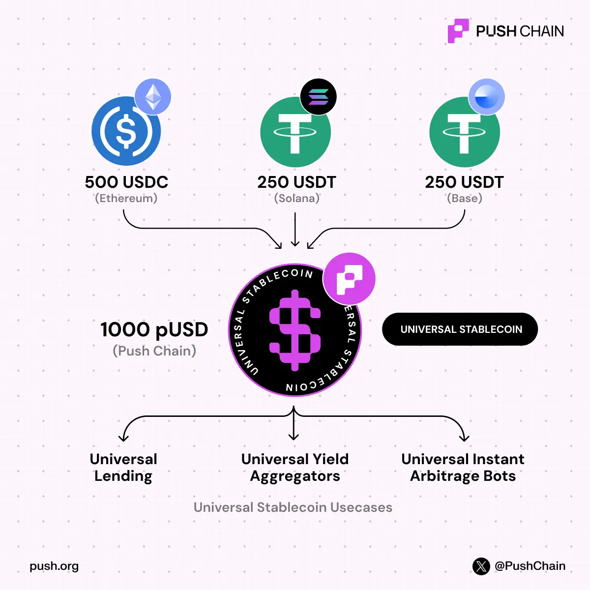

<!--truncate-->

Stablecoins removed volatility, fixing crypto’s biggest usability blocker.

That’s why today, one dollar in the real world means one dollar onchain. Further enabling trading, lending, payments, and most DeFi primitives.

But execution and settlement are two different things. Execution is fine. **Settlement is still broken**. They are not designed for a world where value lives across dozens of chains at the same time.

This blog dives into:

- where stablecoins quietly break
- why this isn’t a UX problem
- and how Push approaches stablecoins differently

# Issue: Dollars that exist, but don’t cooperate

USDC on Solana is worth $1

and USDC on Base is also worth $1

Same issuer. Same backing. Same trust assumptions

Yet the system we all built treats them like strangers.

They have separate liquidity pools, settle independently, and don’t share liquidity naturally. Even though economically, they represent the exact same dollar!

So you end up with money that’s globally trusted, but siloed on a single chain.

This is definitely not a bridging problem, nor a wallet problem.

It’s a **chain-bound settlement problem**.

# Fragmentation isn’t theoretical (it’s visible everywhere)

Let’s take @aave as an example on one chain

You see
• ETH–USDC

• ETH–USDT

• ETH–USDe

Three different pools & versions of same dollar with zero shared depth.

Theoretically, this looks reasonable. In practice, it creates friction we’ve learned to accept as “normal.”

Liquidity that should reinforce itself ends up competing with itself. Rates flatten out. Depth gets thinner. And execution quietly worsens, even when there’s plenty of capital.

Now extend this across:

→ hundreds of protocols

→ dozens of chains

→ multiple wrapped/bridged versions

Ecosystem isn’t suffering from a lack of capital.
It’s short on “**capital that can be aggregated”.**

# **Why this matters more than you think**

This fragmentation leaks into everything.

- **Liquidity stays shallow**

Even with high demand, split pools can’t compound efficiently. Yields look fine until you compare them to the depth potential of unified pools.

- **Execution degrades**

Stable-to-stable swaps still incur slippage, which feels wrong, but is considered normal.

- **Capital sits idle**

Bridges move balances, they don't unify state. Liquidity locked in siloed pools or sitting mid-bridge isn't doing anything.

Stablecoins make crypto usable for the masses.

Fragmentation makes it inefficient to use.

# **The** **bottleneck** **is** **settlement,** **not** **trust**

USDC issued by @circle is trusted across chains.

USDT from @tether is too.

The ecosystem already agrees on issuer trust, economic value, and redemption
assumptions.

What it doesn’t share is state.

Bridges move balances from one chain to another, but nothing is actually unified. They copy and leave liquidity in siloed pools.

This is where Push takes a unified stance.

# **Universal Settlement on Push Chain**

On Push, stablecoins don’t stay isolated just because they originated on different chains.

Instead of treating:

- USDC on Ethereum
- USDC on Solana
- USDC on Base as fundamentally separate assets

They are allowed to converge at settlement, as long as the underlying trust assumptions match.

The idea is simple, even if implementation isn’t: equivalent dollars shouldn’t fragment just because execution environments differ.

## A simple mental model (which actually holds)

You can think about universal stablecoins on Push in three steps

1. **Issuer Trust**

    If two stablecoins share the same issuer or equivalent trust model, they’re economically the same.

2. **Unified Settlement**

    That equivalent value converges into a shared settlement layer instead of staying split across chains.

3. **Universal Execution**

    Apps execute against shared liquidity, regardless of where users enter from.

No wrapping. No duplicated pools. No competing versions of the same dollar.

# **pUSD: The Universal Stablecoin**

This settlement model shows up as **pUSD**

pUSD is not:

- a new peg or
- a wrapper token

pUSD is a native settlement asset that represents converged stable value on Push Chain.

**Think of pUSD as a clearing layer, not a currency.**

Stablecoins with accepted trust assumptions settle into pUSD.
Where they come from doesn’t matter at execution.
Liquidity is shared, not mirrored.

For users, this looks like one balance which just works.
For builders, it’s one settlement asset to reason about instead of many.

# **How pUSD makes DeFi more efficient**

Once the settlement is unified, second-order effects compound fast:

- AMMs stop competing for liquidity and start sharing it
- Lending markets scale without chain specific ceilings
- Yield products don’t fragment by deployment
- Payments become globally native by default

pUSD not only cleans things up.

It makes certain kinds of apps possible, the kind that break down when liquidity and settlement are split across chains.

# TL;DR

Crypto already has global money.

What’s been missing is a global settlement.

Universal stablecoins don’t add complexity. They remove artificial distinctions between assets which were already economically equivalent.

That’s the direction Push Chain is moving ahead.

**Takeaway:**

Stablecoins solved volatility.

**Universal stablecoins solve fragmentation.**

Know about the underlying tech that's bringing this concept into reality - https://push.org/docs
