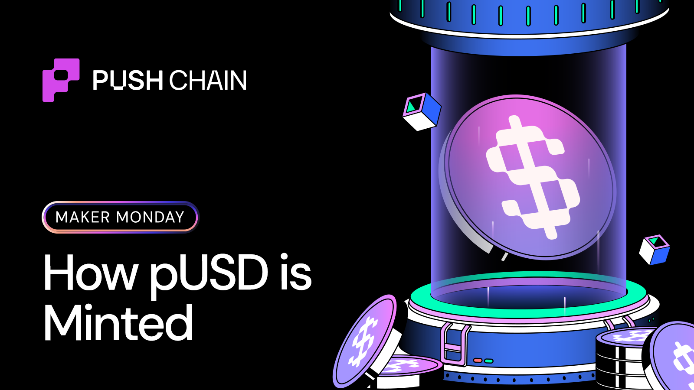
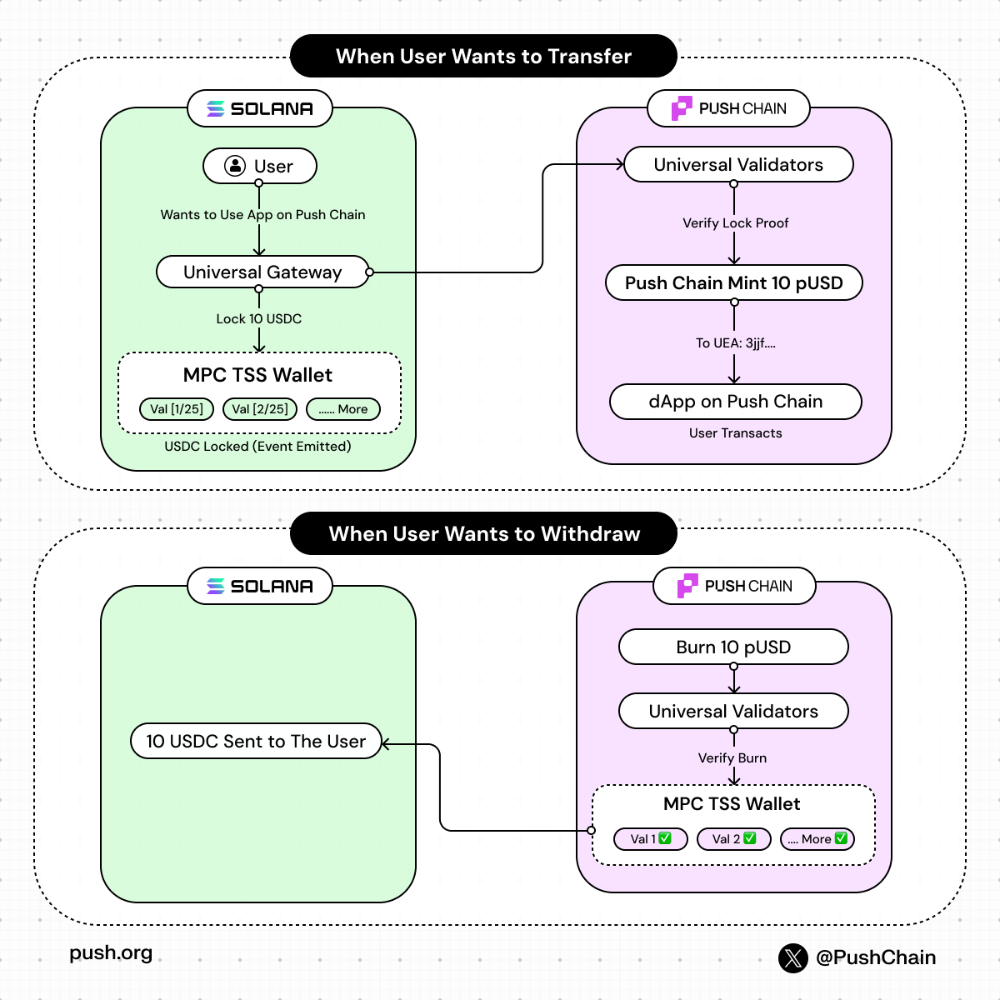
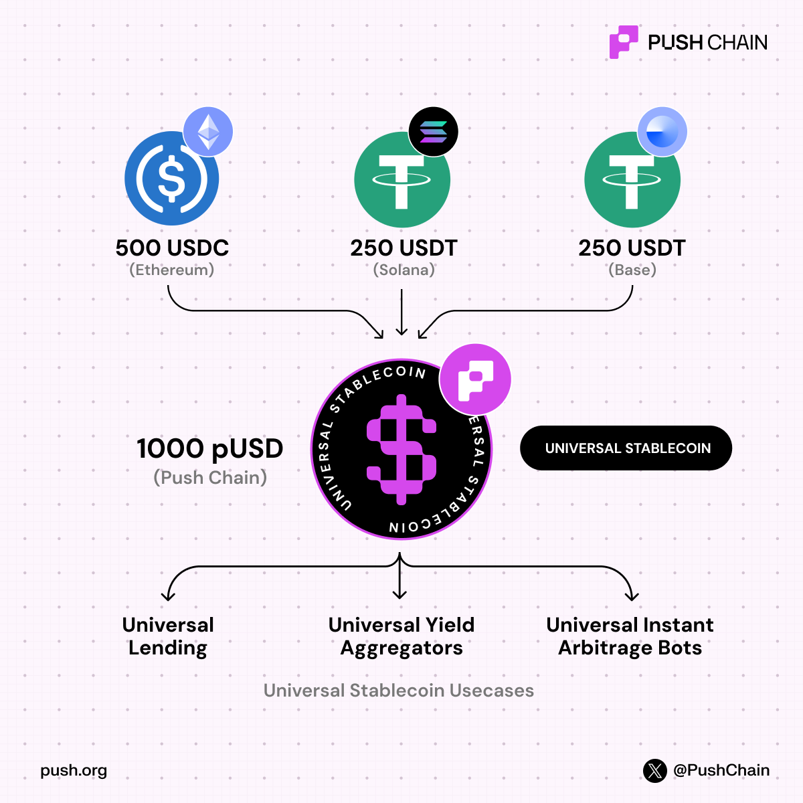

<!--truncate-->

## What is a Universal Stablecoin?

A universal stablecoin is a dollar you can use on one chain while the actual asset stays on another.

You don’t bridge it.

You don’t wrap it.

You don’t move liquidity around.

Instead, the original stablecoin is locked on its source chain, and Push Chain mints a 1:1 representation (pUSD) that you can use immediately.

From a user’s perspective, it behaves like any other stablecoin.
From the system’s perspective, nothing actually “moves”.

That distinction matters because it’s what lets Push avoid bridges without giving up security.

Push Chain doesn’t move dollars across chains.

It mirrors ownership.

The diagram here shows how a user from any EVM / non-EVM chain, like Solana here, can mint pUSD from USDC in just a couple of clicks:

**Lock on the source → mint on Push → burn on Push → release on source.**

No wrapping

No liquidity hops

No extra “claim your token” step

## Minting 1 pUSD

Example: A user has USDC on Ethereum and wants to use it on an app built on Push.

Here, the user just signs one txn on Ethereum.

Under the hood:

- The Universal Gateway receives the USDC
- Funds are transferred into an MPC TSS vault
- A lock event is emitted on the source chain

The asset never left Ethereum.

## Why does MPC vault matter here?

It isn’t a multisig that anyone controls

- The signing key is split across validators
- No single party can move funds
- Only threshold consensus can execute the txn

This is what makes the mint secure.

## How Push Chain verifies minting

Universal Validators watch the source chain.

They independently verify:

- The lock actually happened
- Funds are in the MPC vault
- The user signature is valid
- Amounts match exactly

Once enough no. of validators agree, Push Chain is told:

> “This lock is real.”
> 

That’s the only condition for minting.

Push mints exactly the locked amount of pUSD.

It’s credited to the user’s [UEA](https://push.org/blog/what-are-universal-executor-accounts/):

- Deterministically derived from their source address
- Same identity, just different execution layer

From the user’s POV:

- One signature
- pUSD usable immediately
- No follow up txn

> pUSD supply isn’t market-managed. It’s state-managed.
> 

## Withdrawing pUSD back to your chain's native stablecoin

**Nothing is released unless something is burned.**

When a user wants to withdraw a required amount:

- Exact number of pUSD is burned on Push Chain
- A burn proof is emitted
- Validators verify the burn

Only after threshold consensus:

- Validators generate partial signatures
- These combine to authorize the MPC vault
- The vault releases exactly the burned amount

Burn 100 pUSD → release 100 USDC on the source chain.

## What does the user get?

The asset lands:

- On the original chain
- At the original address
- As the original token

## Why pUSD matters to builders

This design quietly removes a lot of complexity:

- No bridge liquidity assumptions
- No fragmented balances
- No identity remapping

You can build apps assuming:

**one user, one balance, one execution surface,** even if assets live on external chains.

To know more about pUSD - [read our quick thesis](https://push.org/blog/how-push-rethinks-stablecoins/).

We’re about to launch pUSD very soon. Join our [Discord](https://push.org/blog/how-push-rethinks-stablecoins/) or [Telegram](https://t.me/epnsproject) to be the first to know when it’s live!