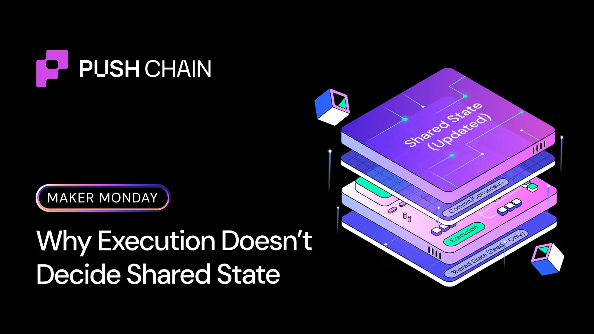
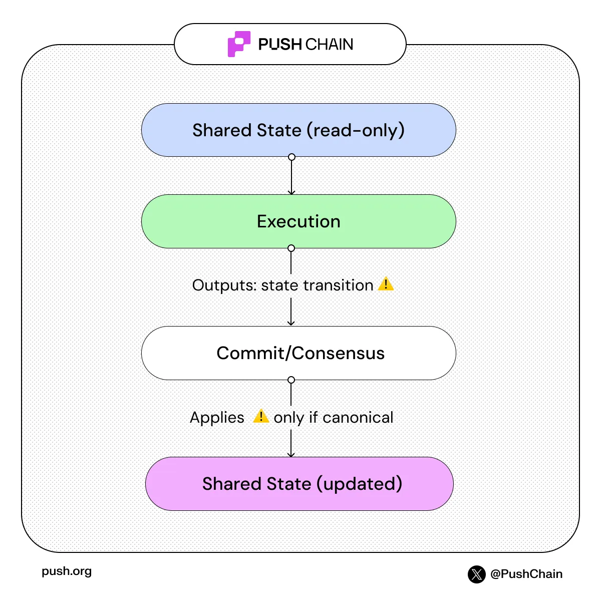

<!--truncate-->

“Shared State” sounds risky, and that instinct is correct.

If execution happens across chains, what stops?

→ partial updates
→ reorg bleed-through
→ inconsistent global state

## Not all chains finalize blocks the same way

Different chains provide different levels of finality:

### Deterministic style finality
- Once committed, blocks are effectively irreversible
- Confirmation is certain
- Reorg risk is negligible

### Probabilistic finality
- Blocks can be reorganized within a window
- Early confirmations are not absolute
- Finality strengthens over time

This difference is where most cross-chain complexity begins.

## How Push Chain separates execution from state

Push Chain enforces a strict rule:
#### Execution cannot directly mutate Shared State.

Execution can:
- read shared state
- run logic
- compute outcomes

But it cannot commit state changes directly.
Only canonical block commits can update Shared State.

## The mental model

Think of execution as a sandboxed simulation:
- Transactions propose changes
- Execution computes the result
- But nothing is applied yet

Only when a block becomes canonical:
- Results are committed
- Shared State is updated

If a block is dropped or reorganized:
#### its effects never enter the canonical Shared State

## Where risk is actually handled
Shared State does not mean shared risk.

Push Chain handles risk before state is committed, not during execution.

Transactions can be handled differently depending on:
- value sensitivity
- finality characteristics of the source chain

At a high level, this creates two modes:

1. **Fast path (UX-first, bounded risk)**

Used for:
- lower-value interactions
- cases where instant UX matters

How it works:
- execution proceeds without waiting for deep finality
- reorg risk is bounded at the protocol level
- safeguards limit worst-case exposure

Result:
- near-instant user experience
- controlled, limited risk
- no corruption of Shared State

2. **Finalized path (risk-minimized)**

Used for:
- higher-value transactions
- environments with probabilistic finality

How it works:
- waits for sufficient confirmation depth
- execution results are committed only after strong finality

Result:
- slower than fast path
- negligible reorg exposure
- fully stable canonical state

## What happens when things go wrong?

**Reorgs**

- Non-canonical blocks are discarded
- Their execution results are ignored

Shared State reflects only the surviving canonical chain.
No partial updates. No global drift.

**Execution failures**

If execution reverts:
- No canonical commit
- No state transition
- No cross-chain inconsistency

Execution failure ≠ state corruption.

**Why this distinction matters**

Shared State does not mean:
- shared execution risk
- shared failure modes
- shared reorg exposure

Instead:
- execution is isolated
- risk is handled before commit
- state updates happen only through canonical consensus

That’s the difference between:

“Everything touches everything,” and “everything resolves through one authority.”

### Takeaway

Even in a multi-chain environment:
- execution can fail
- chains can reorg
- transactions can be reordered

But Shared State remains predictable, consistent, and corruption-resistant

Because execution never had the authority to mutate it in the first place.

Try it before trusting it.
The boundary is visible at the client layer.

👉 [push.org/docs/chain/build/initialize-push-chain-client/](https://push.org/docs/chain/build/initialize-push-chain-client/)
