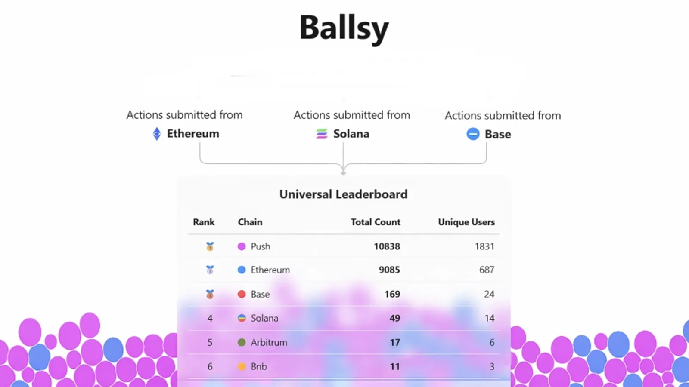

<!--truncate-->

### Ballsy looks singular on paper.

It’s one game with one rule set, producing a canonical outcome, and by web3 instinct, that immediately feels risky.

But that instinct confuses shared rules with shared control. You can have a shared state without giving up decentralized execution.

Ballsy is simple. But what it requires isn’t.
Ballsy is a cross-chain game where every player, no matter which chain they’re on, interacts with the same game state and gets the same outcome.

One game with one set of rules, and with one shared truth.

**Here’s how most teams would approach building something like Ballsy today:**
- Deploy the game separately on each chain
- Each deployment tracks its own state
- Outcomes are synced after the fact

There’s no shared state and no obvious center, which makes it feel decentralized, but in reality, it isn’t state-authoritative.

And this design doesn’t fail loudly; it fails quietly.
Rules start updating at different times, edge cases get handled inconsistently, and over time, state transitions stop lining up.

Each instance appears “correct,” but collectively, they drift apart. This is where the real issue begins.

You don’t actually have decentralization, what you have is duplicated authority over state across multiple consensus domains.

Push Chain solves this by removing duplication, not control.

Ballsy runs on:
- A single authoritative game state
- One source of truth for outcomes
- One consensus-enforced rule set

So execution remains decentralized.

Ballsy runs with a single authoritative game state, a single source of truth for outcomes, and one consensus-enforced rule set.

The distinction most systems miss is simple, but critical:
**State authority is not the same as execution authority.**

Push Chain unifies what counts as a valid action, how state progresses, and what the final outcome is without unifying where actions originate, who submits transactions, or how users retain sovereignty.

And when state authority is unified, a lot of unnecessary complexity simply disappears.

There’s no need for syncing logic, no reconciliation layer, and no debates over which deployment is “correct.”

Not because the complexity moved somewhere else but because it was never necessary to begin with.

Ballsy depends on this model.  
Without a single authoritative state, cross-chain determinism breaks, and outcomes eventually diverge.

If your app has multiple places that decide state truth, you don’t have resilience.
You have ambiguity.

Push Chain doesn’t centralize apps.

It unifies state authority under a single consensus domain, so execution can remain decentralized.

One source of truth, with many execution environments.

Don’t just read, experience it!
Interact with different chains and observe how the outcome remains consistent.
👉 https://ballsy.push.org/
