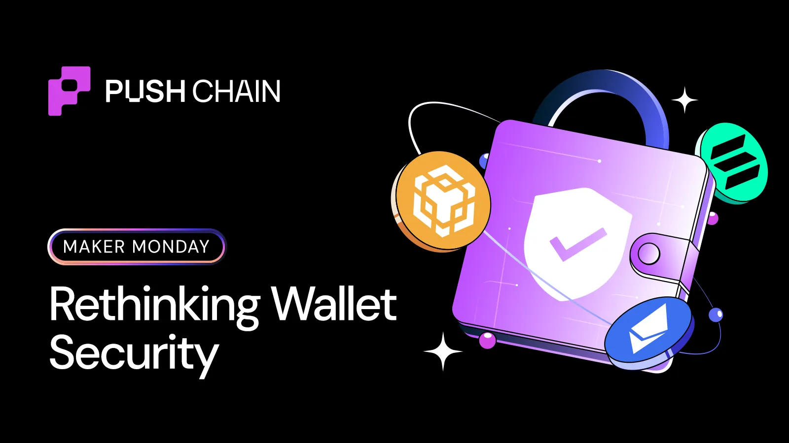
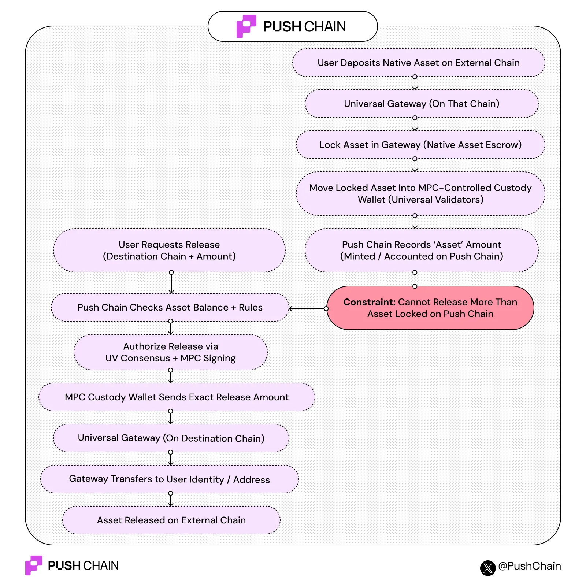

<!--truncate-->

Most people think wallet security is about private keys.  
Yet, most exploits happen when assets move between chains.

This Maker Monday explains how Push Chain handles asset movement across chains without bridges, and why that changes the security model completely. Let’s dive in!

**Usual problem with bridges**

Here’s how a bridge works & where it exploits the assets:

1️⃣ you lock assets on chain A  
2️⃣ a small set of signers controls a pool   
3️⃣ a wrapped version appears on chain B

If that signer set is compromised, the wrapped assets become useless.
That’s not a UX issue,  that’s a design issue.

Push doesn’t aim to fix the bridge’s security.
We avoid needing them in the first place.

If asset movement depends on a small signer set, security will always be fragile.

### Wallet security is really “who can approve a transfer.”

On Push, assets are controlled using MPC (Multi-Party Computation), built with Silence Labs. Read more about the integration [here](https://push.org/blog/push-chain-silence-labs/).

Here’s the simplest way to think about it:
- There is no single private key
- The “key” is split across multiple validators
- No validator can move funds alone
- A minimum number of signers must agree every time

Nothing gets signed unless the network agrees.   
This isn’t about hiding keys better.
It’s about removing unilateral control.

Even if one validator is hacked, nothing moves.

### What “Universal Assets” actually mean

Universal Assets let you use assets from other chains directly on Push.

Examples:  
ETH → pETH  
SOL → pSOL  
USDC → pUSDC

These are **not wrapped tokens**.

- 10 ETH locked → 10 pETH minted
- 10 pETH burned → 10 ETH released

Same amount. Same value. Always 1:1.

No pools.  
No peg maintenance.  
No oracle tricks.

There’s no scenario where users hold an unbacked asset.

### How assets are moved into Push:

Let’s say you’re a Solana user with SOL!

Here’s what actually happens:

1. You sign once on Solana
2. Your SOL is locked via a Universal Gateway
3. Funds move into an MPC-controlled vault
4. Validators verify:

    → Transaction happened  
    → Amount is correct  
    → Funds are secured

1. Push mints the same amount of pSOL to your account

That’s it.  
No second transaction.  
No bridge UI.  

No extra claiming step.  
Assets are secured before they’re usable.

Here is a flow diagram showing how a native asset moves from an external chain to the Push Chain and back, without bridges, wrapped tokens, or trusted relayers.

### How assets leave Push Chain:

Leaving Push is the reverse, and this is where security really shows.

1. You burn pSOL on Push
2. A burn proof is emitted
3. Validators independently verify it
4. A threshold of validators co-sign a release
5. Your original SOL is sent back to Solana

Key details:

- Validators never “send” funds directly
- They only produce partial signatures
- The MPC vault releases exactly what was burned

You can’t release more than you burned.  
The math won’t allow it.

There’s no bridge pool to drain ever.

Threshold signing doesn’t run inside the validator itself.

- Validators handle consensus and verification
- A separate MPC signer (sidecar) handles cryptography
- Even if validator logic fails, keys remain protected

This separation limits the blast radius.  
Breaking consensus logic doesn’t give you access to funds.

### How does this change failure modes?

Here’s the real difference compared to bridges:  
If a bridge breaks → wrapped assets break  
If Push halts → assets stay locked safely

Burn proofs still exist. Funds don’t disappear.
They just wait.

**Takeaway:**  
Most systems assume bridges are unavoidable.  
Push assumes asset movement itself must be constrained.

That’s the shift:

- from trusting signers
- to enforce rules at the protocol level

Wallet security isn’t about better warnings.  
It’s about making bad outcomes impossible.