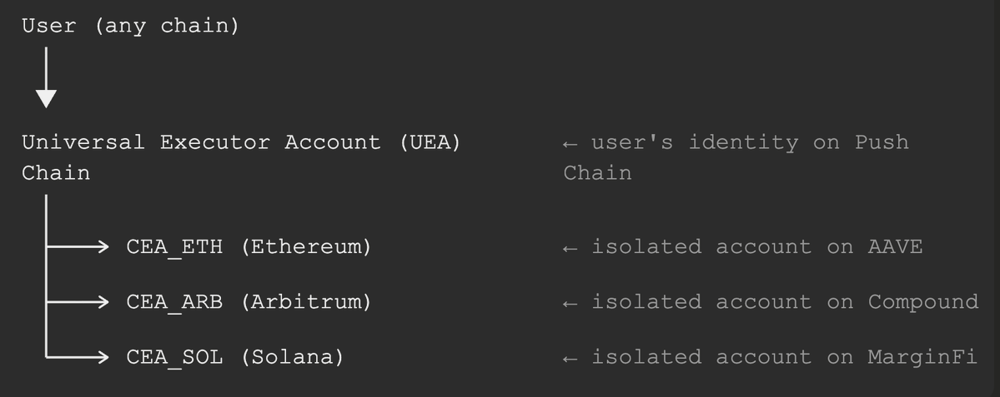
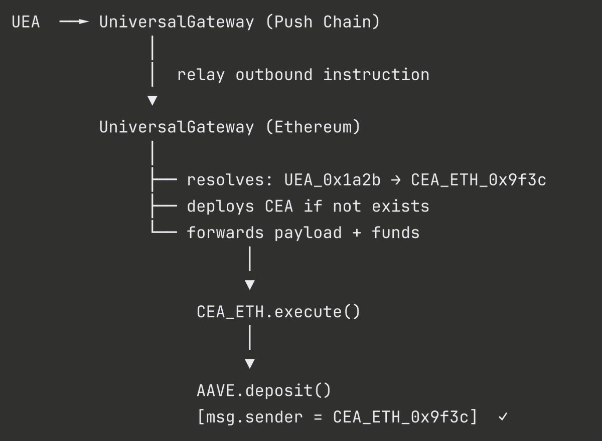

<!--truncate-->

If you’re building any cross-chain defi apps or want to upgrade your current app to cross-chain. This article’s for you.

We like to explain things with examples...

So let's say you’re building a lending aggregator that can read and route user deposits to the best yield across @aave  on Ethereum, @compoundfinance   on Base, and @marginfi  on Solana, or any other protocol on any chain.

Even though the idea sounds great and it would definitely attract an incredible amount of volume. But one honest fact that can't be ignored is how hectic it would be for devs to handle the cross-chain plumbing   

### A very unsexy problem

AAVE and most mature DeFi protocols let you specify who a deposit is for. There's a parameter called **onBehalfOf**, so the caller and the beneficiary don't have to be the same address.

Sounds like it solves the cross-chain problem, right?

Not quite. Because **onBehalfOf** just shifts the question, it doesn't answer it.
When a user from Solana, or any other chain, wants to deposit into AAVE on Ethereum: **what address do you actually put there?**

The user has no persistent Ethereum address. So you end up passing the bridge or relayer contract as the beneficiary. Which means every user's AAVE position lives under the same address, same health factor, same borrowing limit, same liquidation risk across all of them!!

And for borrowing, it gets worse. AAVE's **onBehalfOf** for borrows requires something called credit delegation. The beneficiary address has to have pre-approved the caller on Ethereum, before any borrowing can happen. A user with no Ethereum history can't do that.

So the real problem isn't **msg.sender**.  It's that cross-chain users have no persistent, protocol-recognised address on the destination chain to begin with.

**No consistent address = no isolated position = no real aggregator.**

This is the identity problem in cross-chain DeFi. And it's what most interop protocols have actually failed to efficiently solve.

The destination chain has no way to distinguish users because EVM only sees who called it last and not the original initiator. Solutions like per-user proxy contracts on the destination chain or smart account patterns (which is essentially what Push Chain's UEA and CEA model does) exist, but they require the dApp to architect around this. And most cross-chain interop layers don't handle it natively.

Digs aside.
Let’s actually acknowledge it and figure out a viable UNIVERSAL solution.

### 3 non-negotiable rules

For a lending aggregator to work correctly across chains, 3 things must hold:

1. Each user must have an isolated, persistent identity on every target chain.
2. That identity must be deterministically derivable.
3. And most imp: The user must be able to act from anywhere. Their home chain, a different L1, L2, doesn’t matter!

Most current approaches solve (3) at the cost of (1).
You do get semi-efficient cross-chain execution, but at the cost of identity collapse and extreme development overhead.

### The architecture that actually works

The pattern that solves this mess cleanly is called **CEA - Chain Execution Account**: A smart contract deployed on each target chain, deterministically derived from the user’s identity on the coordination layer (i.e Push Chain)

Each CEA is derived from the parent UEA plus the target chain ID.

Same user, different chains - but always the same deterministic address.

If you’re new to the concept of UEA would recommend checking this quick guide on UEAs first. [What are UEAs?](https://push.org/blog/what-are-universal-executor-accounts/)

The flow for a deposit looks like this:

Now AAVE sees a consistent, user-specific address every single time. The health factor is isolated. Borrow limits are per-user. Liquidations behave correctly.

### What This Unlocks for Aggregator Design

With per-user CEAs in place, the aggregator contract on Push Chain can do things that were structurally impossible before.

**Cross-chain collateral loops become straightforward:**
Deposit ETH on AAVE via CEA_ETH, borrow USDC against it, route the USDC back to the UEA, redeploy it on Base via CEA_BASE. Each hop preserves identity. No position bleed between users.

**Unified health factor monitoring is now coherent:**
Because each CEA maps 1:1 with a UEA, a smart contract on Push Chain can track CEA_ETH → AAVE position and CEA_ARB → Compound position for the same user and act on either.

A natural extension to this feature would also be:
**Automated liquidation protection:** trigger a repayment to CEA_ETH when health drops below threshold

**Withdrawals** route CEA → UEA via a funds transfer route, so capital can be swept back to the coordination layer and redeployed elsewhere without needing additional account infrastructure.

### The Part worth sitting with

Bridges solve asset movement. Relayers solve message passing. But neither solves the question of who is acting on the destination chain. CEAs answer that question cleanly, and once that's answered, the rest of the aggregator design becomes significantly less complicated.

If you're building cross-chain DeFi infrastructure, this is the piece to get right first.

Want to find out more cool things about Push Chain?

Check out our [knowledge base](https://push.org/knowledge/)

And experience the power of [UNIVERSAL APPS](https://push.org/ecosystem/) here.