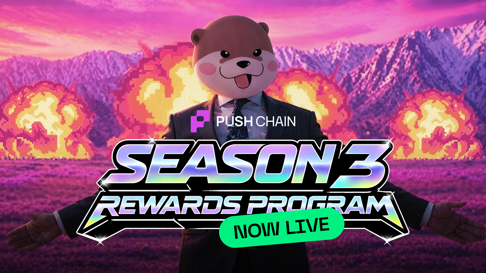
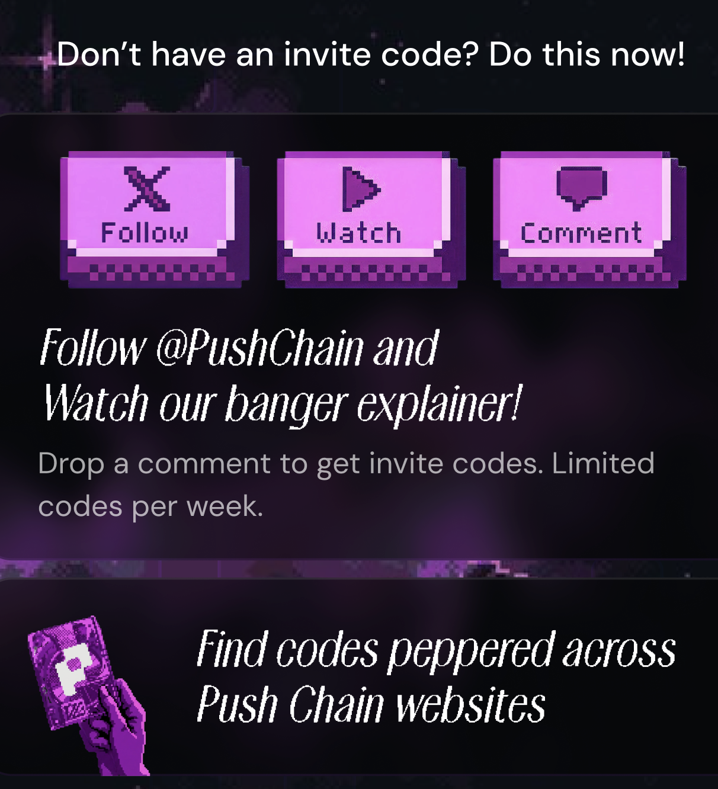

<!--truncate-->

Early Access for the [FINAL season of Push Points Program](https://portal.push.org?utm_source=blog&utm_medium=referral&utm_campaign=s3earlyaccess) before mainnet is live!

The hunt for the golden rare pass begins.

:::info Token not Live Yet
PC is the native token of Push Chain, token is not launched yet.
:::

## What is Points Program S3 about?

S3 is an incentivized testnet program created to reward honest users for exploring and experiencing the magic of Universal Apps on Push Chain.

**Use universal apps, earn points, collect rare passes, spin magic wheel, collect more rare passes, and top the leaderboard!**

Points earned will unlock your eligibility for the **Push Chain reward drop** during mainnet launch.

## What are the rewards?

Rare Shiny Pass holders become eligible for many exciting rewards on mainnet day 1

1. A unique mechanism with perpetual rewards for Shiny Pass holders
2. Boosted APY staking rewards
3. MORE BIGGER BANGERRR rewards will be revealed in the coming days!

Note: S3 [Leaderboard](https://portal.push.org/rewards/leaderboard) rankers unlock additional boosted rewards 

## What are Rare Passes? What do they unlock?

Rare passes are unique collectables that have the potential to unlock greater rewards during TGE.

**Only a tiny % of rare passes will evolve into golden shiny passes**, confirming your reward.

The more rare passes you collect. The higher your odds of winning a golden shiny pass.

## How can I get an entry into the early access?

Early Access is open to a limited number of users only.

You need an invite code in order to get in.

The best place to find invite codes is this:

Remember! 1 invite = 1 user entry.
Once you’re in, you can invite up to 3 more frens

## How can I make the most out of this program?

S3 is not just about play-to-earn. Look at the bigger scope here.

The apps you’ll be using are not normal crypto apps.

They are Universal in nature, meaning users across Solana and EVM, using wallets like MetaMask or Phantom, can interact with these apps without bridging.

Quick tips:

- Stay active on Discord and X for invite code giveaways.
- Collect as many rare passes as you can!
- Refer and onboard your frens and earn special multipliers
- The more you level up, the better your chances of winning a rare pass.

## How does Push Chain work?

Push Chain is an L1. But not ***“yet another L1”***. It is a shared state network designed to unite different chains together.

You can use apps that exist not just on Push but every popular chain including Solana, Ethereum, Base, BNB and more. Stronger volume, better yields, incredible fun.

No new wallet. No need to bridge funds. Sign in with Google or any of your existing wallets.

Builders can deploy apps on push and instantly support users from Solana, Base, BNB, any EVM chain!

## Participation Guidelines

We’ve implemented sybil resistance checks to discourage botting and farming that doesn’t contribute meaningful value to users or the network.

Please use wallets with sufficient history and genuine activity.

Fair participation will be rewarded, while misuse may lead to restrictions.

If you have any questions, feel free to reach out to us on [Discord](https://discord.com/invite/pushchain)

Join the program here - **[portal.push.org](https://portal.push.org?utm_source=blog&utm_medium=referral&utm_campaign=s3earlyaccess)**