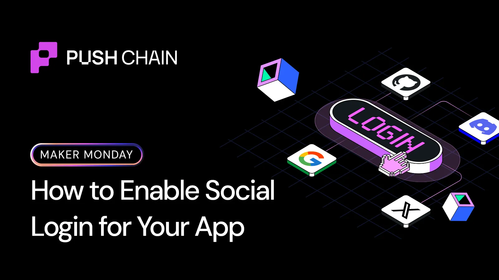
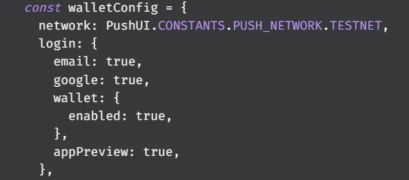
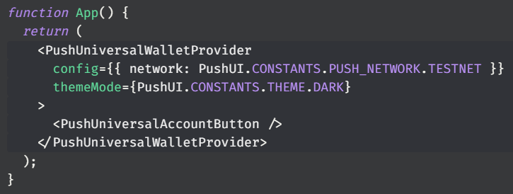
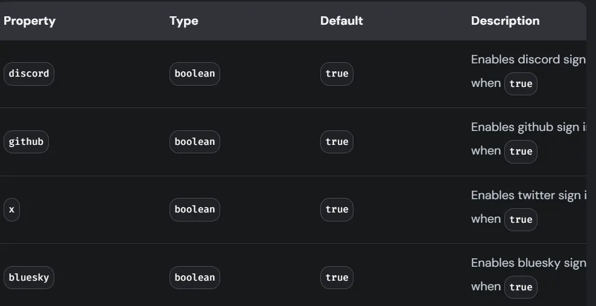

<!--truncate-->

Most apps lose on users before they’ve ever interacted with the product.

Not because the product feels complex to use.  
Because wallet creation is considered as a separate onboarding step.

Push Wallet Kit removes this separation.  
By provisioning a real wallet the moment a user signs up.

Here’s how to enable it in your app in just 4 steps:

### Authentication becomes identity provisioning

Usually onboarding requires two independent systems:

1️⃣ Authentication based (Google, email, socials)  
2️⃣ Wallet creation and connection

It creates friction because users must create/import wallets before interacting with your app.

Push Chain combines these into a single identity layer.  
When a user logs in, Push provisions a wallet automatically.  
This wallet becomes the user’s persistent onchain identity.

Your app can now interact with the user immediately, without requiring manual wallet setup.

### Step 1: Install Push Wallet Kit

npm install @pushprotocol/ui-kit

This will give your app access to authentication, wallet provisioning, and wallet access through one interface.

### Step 2: Configure social login methods

Define which login methods your app should support:

This configuration enables authentication via Google and email.

When users authenticate using these methods, Universal Wallet automatically provisions a wallet for them.

### Step 3: Initialize the Universal Wallet Provider

Wrap your app with the Universal Wallet Provider:

This activates the Universal Wallet layer. It handles:

• Authentication  
• Wallet provisioning  
• Secure key management  
• Session persistence  
• Wallet availability across your app

Your app now has an identity and wallet layer ready to onboard users.

### Step 4: Enable additional social login providers

Push Wallet Kit also supports additional identity providers beyond Google and email.

You can enable providers listed below:

Each authentication method provisions the same Universal Wallet identity.

This means users can log in using familiar platforms, while your app still interacts with a consistent wallet layer.

### What Universal Wallet enables

Once authenticated, the user immediately has a usable wallet. This wallet:

• Persists across sessions  
• Can sign transactions  
• Can interact with smart contracts  
• Is accessible programmatically inside your app

No extensions/manual wallet setup required.

### What you unlock as a builder

Users can log in and start using your app immediately.  
They can sign transactions, interact with contracts, and participate onchain, without creating or connecting a wallet manually.

Universal Wallet ensures wallet identity exists from the first interaction.

### Takeaway:
Push Wallet Kit unifies authentication and wallet provisioning into a single layer.

Authentication creates identity → Identity provisions the wallet → Wallet enables execution

Sounds game-changing, right? Explore <a href="https://push.org/docs/chain/ui-kit/customizations/push-universal-wallet-provider/">
  here
</a>
