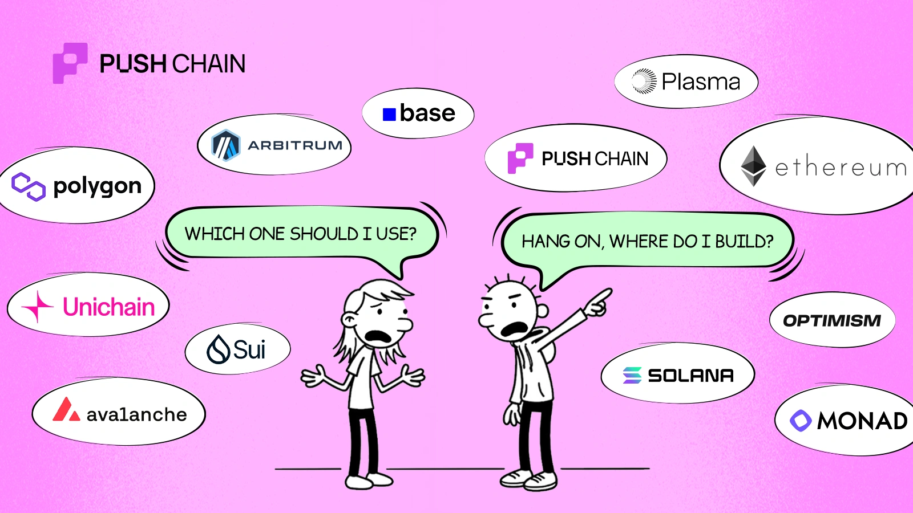
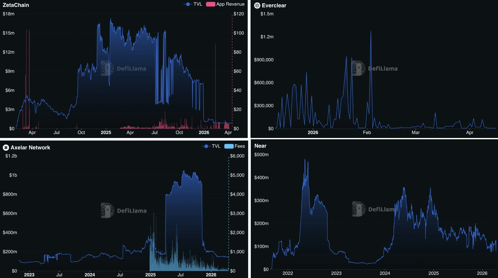
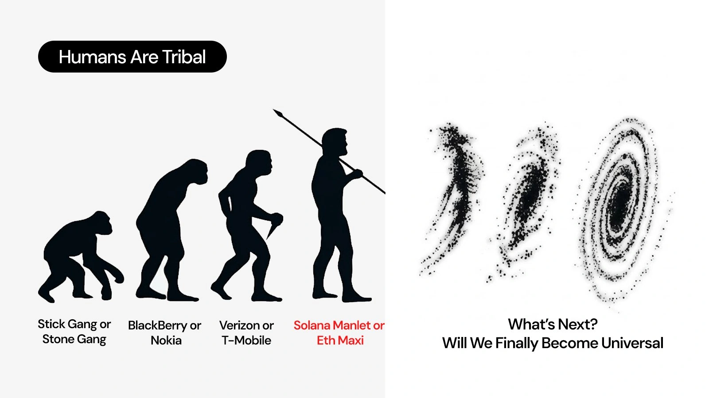

import { Tweet } from 'react-tweet';

<!--truncate-->

> _In Web3, the narrative always ships before the product. The product ships after the community leaves._

No matter the bear or bull market over the last decade, one sentiment in crypto has always remained true: **crypto is really hard to use.**

<Tweet id="1985438645130838068" />

This is the kind of feedback we still get today from the earliest degens and builders. Imagine the tyranny that hopeful newcomers and retail users had to face!

The sentiment wasn't always terrible.. There was an almost euphoric time when the entire industry thought that crypto was finally fixed.

_(Note the extra emphasis on "almost")_

---

## The Promise of Chain Abstraction

Sometime back in 2022, a new term was born — **"Chain Abstraction"**

The promise was simple: users would interact with apps in a way where they never even had to know they were using Web3 tech. The UX would be invisible. The chain would be invisible. Users would simply use crypto apps just like they use regular apps.

This framing was used everywhere: pitch decks, blog posts, conference keynotes, and even token launch announcements.

The idea felt so intuitive, so relatable, felt as if the dream of "onboarding a billion users" was finally turning into reality!

Hundreds of millions in funding. Super competitive landscape. Everything was looking ideal.

**But today, over 90% of these projects are dead.** (Quite literally)

**What the fuck exactly happened to chain abstraction?**

Who pulled the plug? Was the dream of uniting all chains just a hoax? Did VCs get rickrolled?

> _"In Web3, the narrative always ships before the product. The product ships after the community leaves."_

Chain abstraction was no different.

The idea was real. The problem was real. The money was very, very real. What wasn't real (at least not yet) was the part where any of it actually worked for the person on the other end of the screen.

---

## Why Abstraction Is So Hard to Build

Because the underlying networks are financially incentivized to fight it.

In the early 2020s, the multi-chain world was sold as a feature. More chains meant more choice, more specialisation, more innovation.

What wasn't said loudly was that every new chain also meant a new token, a new ecosystem fund, and a new set of VCs with a financial interest in making sure they 10x their pot — regardless of whether anyone used the product.

Hundreds of L1s and L2s. Each one with its own liquidity, its own gas token, its own community convinced that theirs was the true one.

**The industry is not fragmented by accident: it's fragmented because fragmentation is profitable.**

---

## The Intent Architecture Problem

Most modern chain abstraction runs on something called **intent-based architecture**. The user says what they want ("swap this token on Ethereum for that token on Solana") and a third party called a **Solver** figures out how to make it happen.

What could be better than completely disappearing complexity from the user's screen, right? But the truth is, the complexity does not disappear — it simply moves a few steps away from the user.

To execute a cross-chain intent instantly, a solver must front their own capital on the destination chain and take on immense inventory risk.

Now tell me, who has the capital to maintain deep liquidity across 50 different, incompatible Layer 2s? Definitely not decentralized retail users. Only massive, institutional market makers (Wintermute, Jane Street, etc.)

Does this mean we just abstract away a decentralised bridge and replace it with a **centralized cartel?**

When market volatility spikes, these centralized solvers widen their spreads to protect themselves, or they simply stop filling intents altogether. The user's so-called "seamless" abstracted transaction either fails silently or gets hit with massive slippage!

---

## The UX Illusion

From a psychological standpoint, hiding the network name doesn't solve the core anxiety of Web3.

To achieve chain abstraction, the industry added multiple layers of middleware (Application → Permission/Intent → Solver → Settlement). This architectural bloat increases latency.

If an abstracted transaction takes 45 seconds to clear because a Solver is routing it through a complex cross-chain message protocol like LayerZero, the user still experiences the cognitive friction of waiting, wondering if their funds are lost in the ether.

**Did we just paint over the rust instead of replacing the pipe?**

---

## The Identity Problem: Omnichain Networks

Omnichain networks promise a seamless multi-chain world, but their architecture fundamentally breaks Web3's most critical component: **persistent user identity.**

Because they rely on proxy signers (like Threshold Signature Schemes) to execute cross-chain actions, the destination EVM never sees who actually initiated the transaction. It only sees "who called it last" — which is the bridge's proxy address.

To understand why this is a major security vulnerability and a hindrance to adoption, imagine building a lending aggregator. If a user on Solana wants to route a deposit into Aave on Ethereum, they don't have a persistent Ethereum address. Even using Aave's `onBehalfOf` parameter just shifts the problem, forcing the protocol to use the relayer/gateway contract as the beneficiary.

**Now every single cross-chain user's Aave position risks getting pooled under the same proxy address!!**

- There is no isolated health factor.
- There is no individual borrowing limit.
- One user's bad cross-chain trade could trigger liquidations for everyone sharing that proxy.

Which, by the way, is a big honeypot for attackers to ignore.

<Tweet id="2048854107633631356" />

For borrowing, it gets worse. A user with no Ethereum history cannot pre-approve credit delegation for the proxy. Because ZetaChain doesn't natively solve this, developers are forced to build incredibly complex, per-user proxy architectures just to patch the bleeding.

---

## The Messaging Layer Problem: LayerZero

Protocols like LayerZero position their product as a universal messaging layer, allowing developers to build "Omnichain Applications" (OApps) that can seamlessly pass data and tokens across any network.

But behind the scenes, LayerZero's architecture heavily relies on off-chain Decentralized Verifier Networks (DVNs) and Executors. While marketed as modular and trust-minimized, the reality is that the underlying security is only as strong as the off-chain entities verifying the messages.

If a specific DVN configuration is compromised or colludes, the "immutable endpoint" on-chain is useless.

**The Contagion Risk:** LayerZero connects everything to everything. If a catastrophic vulnerability is found in a low-tier connected chain, or in the messaging standard itself, the blast radius is instantly transmitted across the entire ecosystem.

<Tweet id="2046567321494565365" />

The official docs of LayerZero say "LayerZero is an omnichain interoperability protocol."

When your interop is message-based, every chain needs its own:

- Contract deployment
- DVN configuration
- Audit cycle

LayerZero's own docs pitch `lzSend()` and `lzReceive()` functions as "one framework, every chain." But "one framework" still means deploying and maintaining that framework N times across N chains.

For a protocol promising omnichain composability, the developer experience scales **linearly** with every chain you add. Which, to me, does not sound like chain abstraction — but more like **managed fragmentation.**

---

## The Hope That Remains

Even though things aren't looking great for chain abstraction, the hope is still not lost.

The kind of hope that's not just coming from the users but also from devs — and most importantly from projects who're fighting all the odds to build tech that abstracts every user experience and unites every chain. No strings attached.

**All we need is one final Push.**
