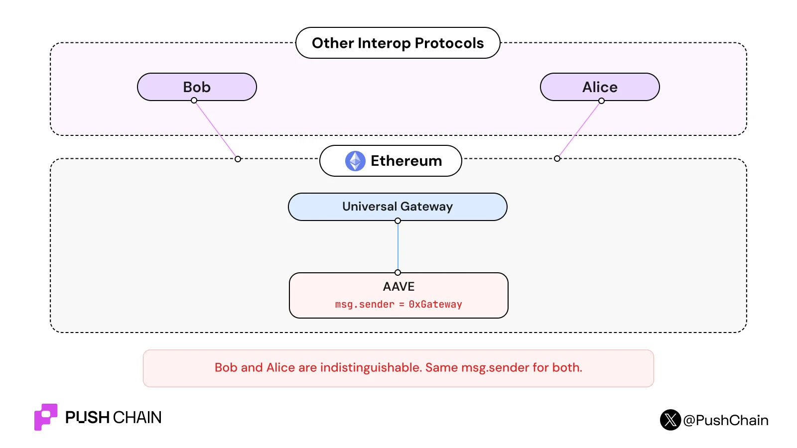
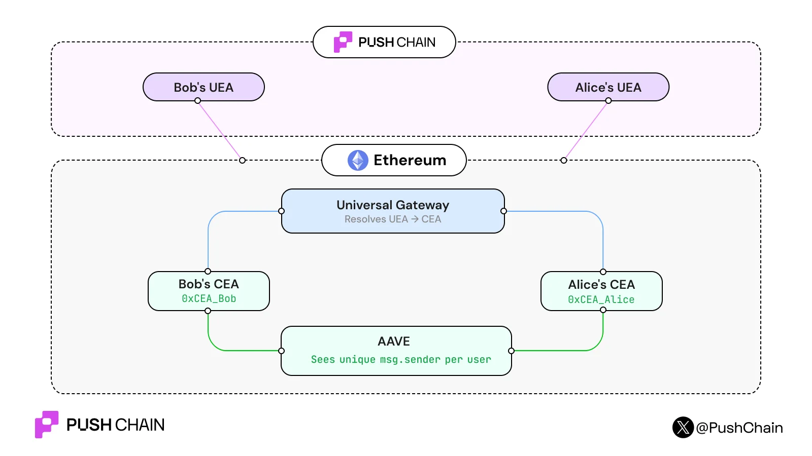
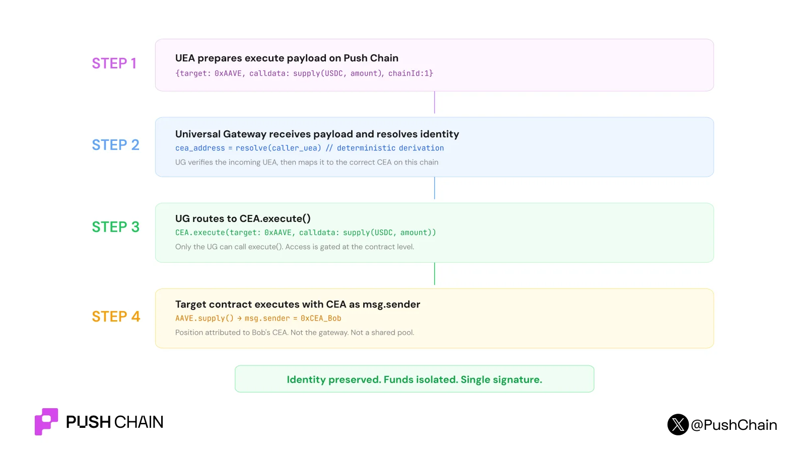

import BlogTweet from '@site/src/components/BlogTweet';

<!--truncate-->

This is one of our biggest security upgrades to date. Must read if you're a cross-chain user or a dev.

CEAs are per-user smart accounts that live on external chains and act on your behalf while keeping your funds and unified crosschain identity separate from everyone else.

Every cross-chain protocol routes your transaction through a shared gateway address.CEAs fix that by giving every user their own isolated smart account on every external chain.

# Why do we need CEAs?

Let's discuss about the darkest cross-chain secrets you’re probably unaware of.

Open any cross-chain protocol today. Bridge some tokens. Execute a swap. Deposit into a lending pool on the destination chain.

Now check the block explorer. Who made that deposit?

It's not you\!
It's either a gateway contract or any other intermediary relayer contract that deposits on your behalf.

And not just you, all the other users are mostly sharing the same gateway address for such actions. Using the same pipeline.

This creates two problems, both serious enough to keep you up at night.

## Identity Collapse:

The target protocol can't distinguish between users. Your lending position, your collateral, and all are attributed to a shared gateway address.

*msg.sender \= 0xGateway* for everyone.

## Shared custody risk

Every user's funds sit under one contract.

A single exploit doesn't drain one user; it would drain everyone who had pooled their funds in the gateway.

# How do CEAs work?

A Chain Executor Account is an isolated smart account deployed on an external chain, derived deterministically from a user's UEA on Push Chain.

:::success[note]

A [**Universal Executor Account (UEA)**](https://push.org/blog/what-are-universal-executor-accounts/) is a deterministic smart account on Push Chain, derived from an origin wallet (chain namespace \+ chain id \+ owner), that serves as the execution account for that origin wallet on Push Chain.

:::

:::info[Common Misconceptions]

• A UEA is not a new wallet on the origin chain  
• No private keys are created or stored on Push Chain  
• UEA addresses are deterministic, but the smart account is deployed lazily on first use  

:::

In plain English: instead of everyone sharing one gateway address on Ethereum, every user gets their own contract. Bob gets Bob's CEA. Alice gets Alice's CEA. The gateway routes to them without touching the target protocol directly.

Here's how the execution actually flows

#

**CEA’s objective is not only to patch the identity problem but make unified onchain identities a first-class architectural primitive.**

# How does CEA impact your security?

Identity is half the story. The other half is what happens when something goes wrong.

Without CEA, the gateway holds every user's funds, approvals, and positions under one address. It's a single point of failure with maximum blast radius. One vulnerability in the gateway contract and every user who ever routed through it loses everything.

*for instance:*

<BlogTweet id="2048854107633631356" />

We've seen this movie before. Bridge exploits have drained over $2.5 billion since 2021\. The root cause is almost always the same: shared custody.

CEA breaks the blast radius at the account level.

## Deterministic Mapping

One UEA, one CEA per chain. The mapping is 1:1 and deterministic. If you have UEAs derived from wallets on Ethereum, Solana, and Base, you get three CEAs, one on each respective external chain. No ambiguity, no collisions.

Fund withdrawal. Assets locked in a CEA can always be moved back to the user's UEA on Push Chain. No funds get stuck.

## Deterministic derivation

Each CEA is derived from its underlying UEA. One UEA maps to exactly one CEA per external chain. You can't deploy a counterfeit CEA that claims to be Bob's since the derivation is verifiable.

## Strict access control

*CEA.execute()* only accepts calls from the Universal Gateway on that chain. Nobody else can trigger it. Not an EOA, not another contract, not another CEA. The gateway, in turn, only routes to a CEA after resolving which UEA initiated the call. Bob's UEA can only trigger Bob's CEA. The resolution is deterministic and verifiable on-chain.

With CEA, a compromised account means one user is affected and not the entire user base.

Token approvals are scoped per-CEA. Fund isolation is structural. There's no shared pool to drain because there's no shared pool\!

**One wallet. One signature. Universal identity preservation. Isolated risk.**

[**Refer this integration guide**](https://push.org/docs/chain/build/understanding-universal-transactions/#chain-executor-account-cea) to make your app universally accessible and secure in hours not months.

Got any Questions? Reach out to us via our  [Dev Telegram Chat](https://t.me/+SFD4qD1JIF1jNTk1) or community [Discord](https://discord.com/invite/pushchain).
