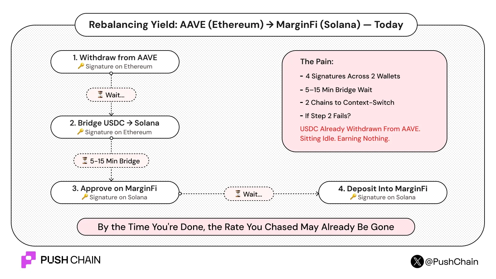
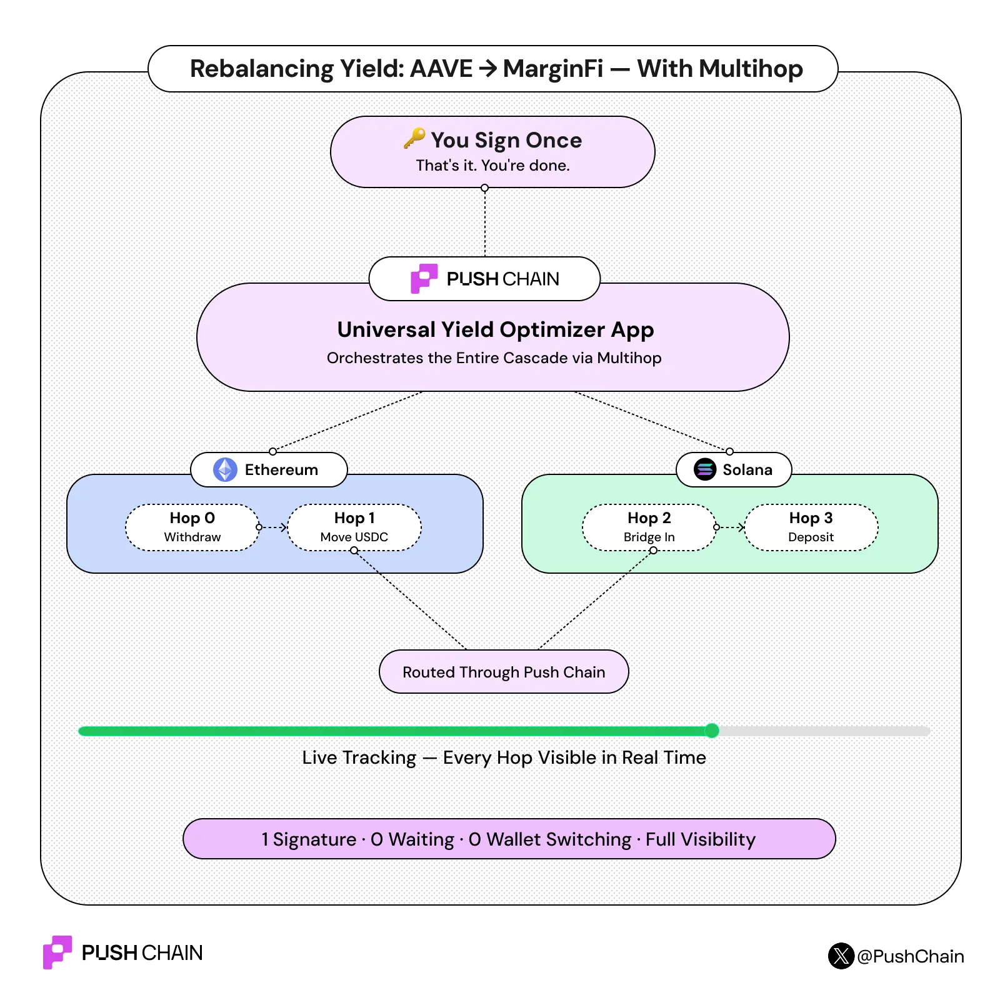

<!--truncate-->

# Introducing Multihop on Push Chain

Multihop allows you to compose multiple cross-chain operations into a single signed transaction. Ordered and tracked end-to-end.

# Cross-chain today is still manual and bumpy

## For users:

Try doing anything non-trivial across chains right now. Swap ETH for a Solana token. Move collateral from BNB to Ethereum and deposit it into a lending protocol.

Every step is a separate transaction. And every transaction needs a separate signature.
This means multiple interruptions, multiple clicks and many minutes wasted in preparing a transaction before actually executing it.

The question worth asking is: why do users have to heavy lift all these precursor steps? Shouldn’t the underlying tech handle everything on its own\!?

Take a cross-chain yield balancing app as an example:

## For developers:

Today, building cross-chain apps is 30% business logic and 70% orchestration and plumbing.
Instead of focusing on app features and logic, devs are forced to integrate multiple SDKs and interop protocols with a bumpy learning curve.

Then comes another headache. **Cross-protocol compatibility and debugging hell**.
Writing complex retry handles, timeout watches and manual rollback scripts

What devs often fail to understand is that the cross-chain part of their codebase isn't the true product. It’s just plumbing. Which (again) should be abstracted and handled by the underlying protocol itself.

# What multihop changes?

## For users:

Multihop lets you compose multiple cross-chain transactions into a single ordered flow.

You simply specify your steps or intent and watch Push Chain execute them all at once, with just one signature.

Push handles all the cross chain coordination across multiple chains (be it EVM, Solana, or Push Chain itself).

## For devs:

The API surface is two functions. That's it.

prepareTransaction takes a transaction description, target address, calldata, chain, optional fund movement and returns a  PreparedUniversalTx object. This object contains the resolved route (where does this hop execute?), estimated gas, nonce, deadline, and the encoded payload. You don't need to inspect any of this. You just pass it forward.

executeTransactions takes an ordered array of prepared transactions and submits them as a single cascade to Push Chain. One signature. The SDK figures out the routing: *which hops stay on Push Chain, which go outbound to external chains via CEAs, which move funds between chains.*

Refer to the docs for more [detailed insights](https://push.org/docs/chain/build/send-multichain-transactions/).

**Routing is automatic:**
You don't think about routes. Pass a plain address in to and the hop stays on Push Chain. Pass `{ address, chain }` and it goes outbound (from push to ext chain)  via CEA.

Need a hop to originate from an external chain? Set `from: { chain }` and the SDK handles the rest.

:::info[CEA TL;DR]
Chain Executor Accounts are per-user smart accounts that live on external chains and act on your behalf while keeping your funds and unified crosschain identity separate from everyone else.

[Read more about CEAs](/blog/introducing-chain-executor-account).

:::

**Funds can move with any hop**
Any hop can carry token movement alongside its contract call via the funds parameter. Bridge ETH into Push Chain and call a contract in the same hop. No separate bridging steps needed.

**Multiple calls can be batched into a single hop**
The data field accepts either a single calldata or an array of calls. So approve \+ deposit can be one hop instead of two. Fewer hops, tighter cascades.

# Try It

Multihop is live on testnet.
Experience it through our ecosystem apps like [RamenFi](https://www.ramenfi.xyz/).

[Multihop docs also include playground environments](https://push.org/docs/chain/build/send-multichain-transactions/) where you can test directly in your browser, no local setup needed.
