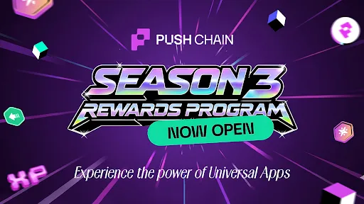

<!--truncate-->

Following the launch of Donut Testnet and $PC ticker reveal, Push Chain has continued to gain strong momentum. Over the past few months, we’ve seen increasing [activity](https://donut.push.network/stats) across users, developers, and validators as the ecosystem around universal apps begins to take shape.

Push Chain has processed **15M+ transactions across 400k+ active addresses, secured by 35+ validators.** We’ve seen massive developer interest in building DeFi, RWAs, and AI Agents. With over 25 universal apps already [live](https://push.org/ecosystem/)  like [RamenFi](http://ramenfi.xyz), [PUSD](http://pusd.push.org), and [Degen Chess](http://degenchess.fun), users from Ethereum, Solana, Arbitrum, BNB, and Base are interacting seamlessly without needing complex and unsafe bridging to get started.

Rewards Portal [https://portal.push.org/](https://portal.push.org/?utm_source=blog&utm_medium=referral&utm_campaign=s3launch)

## A program beyond social farming

**With the launch of Season 3, we wanted to avoid the typical incentivized testnet playbook.** Most campaigns often resort to social farming where users click buttons to join Discord or post on X for points that are pointless. Participating without ever meaningfully touching the network.

Testnets exist to stress test real infrastructure with real users. With Push Chain S3 you are using the actual network with EVM and non EVM wallets on the exact same platform in realtime. Every point in Season 3 flows from on-chain activity and the usage of $PC.

Leaderboards reflect who is actually putting the network through its paces and instead of a static points system, Season 3 introduces a fully gamified reward loop.

## Enter Push Chain Pass (Rare/Shinies)

Rare Passes are collectibles earned purely through active testnet participation. They are your ticket to the endgame of Season 3. **At TGE, users will burn their Rare Passes for a chance to mint and convert them into a Shiny Pass, maxed with rewards for Push Chain supporters.** But even if you miss the Shiny, every burned pass guarantees a boost. 

Hit your daily spins, grind your levels, score $PC and stack as many passes as you can. The bigger your stash, the better your odds. 

## Season 3 is Open: Here’s how it works

Season 3 is now open to everyone. **No invite codes, no waitlists.** Here is how you play the meta: 

- **Weekly Airdrops:** Every week, a new universal app built on Push Chain drops into the rotation. 
- **Quest loops:** Complete on-chain tasks on Push Chains [testnet portal](https://portal.push.org/?utm_source=blog&utm_medium=referral&utm_campaign=s3launch) (providing liquidity, swapping, playing, or predicting) to earn XP.
- **Progresssion:** Level up to score 2 Rare Passes, Points, Buffs, and more.
- **Spins:** Hit the daily Spin 2 Win wheel to score more Rare Passes, $PC and hoard your stock.
- **Referral System:** Invite your friends using your special link and earn a chunk of any points your invites earn.

Early access users already have a head start, leaderboards are live, and a new banger app drops every week. Dive in and claim your spot on the board. 

Head over to [Push Chain Portal](https://portal.push.org/?utm_source=blog&utm_medium=referral&utm_campaign=s3launch), login using your favorite socials or wallet, and start collecting.

⚠️ **Note:** The token is currently live on testnet and not in mainnet. $PC is the only official token that will power all native functionalities on Push Chain. As a reminder, $PUSH holders will be able to migrate their tokens to $PC.