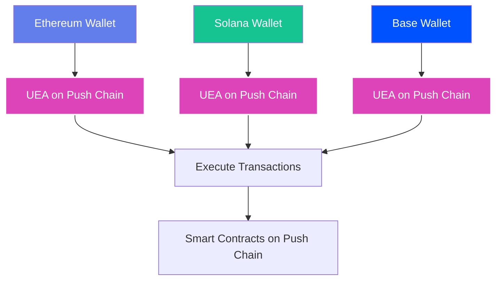
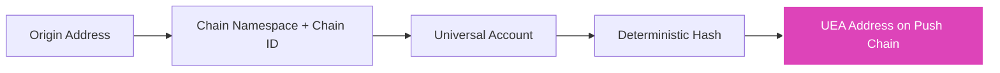
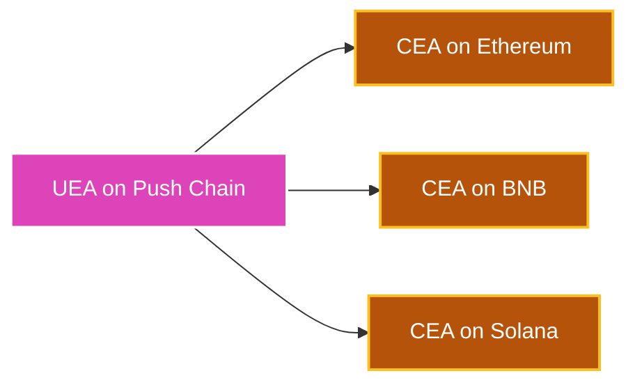

<head>
  <title>Derive Universal Executor Accounts | Tutorials | Push Chain Docs</title>
</head>

import Tabs from '@theme/Tabs';
import TabItem from '@theme/TabItem';
import Details from '@theme/Details';
import TutorialTimer from '@site/src/components/TutorialTimer';
import { SolidityCode } from '@site/src/components/SolidityCode';
import { GitHubRepo } from '@site/src/components/GitHubRepo';

<!-- Content Start -->

<TutorialTimer estimatedMinutes={10} />

In this tutorial, you'll learn how to **derive Universal Executor Accounts (UEAs)** from any wallet address on any blockchain. This is the foundational concept that enables Push Chain's universal execution model.

By the end of this tutorial, you'll be able to:

- ✅ Understand how UEAs map origin wallets to Push Chain addresses
- ✅ Derive UEA addresses from any wallet (Ethereum, Solana, etc.)
- ✅ Query UEAs programmatically using the SDK
- ✅ Use the UEAFactory contract to derive UEAs on-chain

## Understanding Universal Executor Accounts (UEAs)

A **Universal Executor Account (UEA)** is a deterministic smart account on Push Chain, derived from an origin wallet (chain namespace + chain id + owner), that serves as the execution account for that origin wallet on Push Chain.

:::note Common Misconceptions
- A UEA is not a new wallet on the origin chain
- No private keys are created or stored on Push Chain
- UEA addresses are deterministic, but the smart account is deployed lazily on first use
:::

### Key Concepts

**Origin Wallet → UEA Mapping**
- Every wallet on every chain has a unique, deterministic UEA on Push Chain
- Same origin address always produces the same UEA
- The UEA is the execution surface for all transactions on Push Chain

**Example:**
```
Ethereum Wallet: 0xABC...123
    ↓ (deterministic derivation)
Push Chain UEA: 0x456...789

Solana Wallet: 7xKX...ABC
    ↓ (deterministic derivation)
Push Chain UEA: 0x789...DEF
```

### Why UEAs Matter

**Traditional Multi-Chain Problem:**
- Users need different wallets for different chains
- Each chain requires separate gas tokens
- No unified identity across chains

**Push Chain Solution with UEAs:**
- One origin wallet → One UEA on Push Chain
- UEA is controlled by the origin wallet of the user
- The UEA executes transactions on behalf of the origin wallet
- Users interact from their preferred chain seamlessly




## Deriving UEAs with the SDK

The Push Chain SDK provides utilities to derive UEAs from any wallet address.

#### Basic UEA Derivation

```typescript
import { PushChain } from '@pushchain/core';

// Convert origin address to Universal Account
const account = PushChain.utils.account.toUniversal(
  '0xYourEthereumAddress', 
  {
    chain: PushChain.CONSTANTS.CHAIN.ETHEREUM_SEPOLIA
  }
);

// Derive the UEA address
const executorAddress = await PushChain.utils.account.deriveExecutorAccount(account);

console.log('UEA Address:', executorAddress.address);
// Output: 0x... (deterministic Push Chain address)
```

#### Understanding the Process

**Step 1: Create Universal Account**
```typescript
const account = PushChain.utils.account.toUniversal(originAddress, { chain });
```
This creates a `UniversalAccount` object containing:
- `chainNamespace`: e.g., "eip155" for EVM chains, "solana" for Solana
- `chainId`: e.g., "11155111" for Ethereum Sepolia
- `owner`: The origin wallet address

**Step 2: Derive the Executor Account**
```typescript
const executorAddress = await PushChain.utils.account.deriveExecutorAccount(account);
```
This performs the deterministic derivation to get the UEA address on Push Chain. The returned object also includes a `deployed` boolean indicating whether the UEA contract has been lazily deployed yet (pass `{ skipNetworkCheck: true }` to skip the deployment check and get the address only).

#### Supported Chains

The SDK supports UEA derivation for supported chains:

| Chain | Namespace | Example Chain ID |
|-------|-----------|------------------|
| Ethereum | eip155 | 11155111 (Sepolia) |
| Solana | solana | EtWTRABZaYq6iMfeYKouRu166VU2xqa1 (Devnet) |
| Base | eip155 | 84532 (Sepolia) |
| Arbitrum | eip155 | 421614 (Sepolia) |
| BNB Chain | eip155 | 97 (Testnet) |
| Push Chain | eip155 | 42101 (Testnet) |

To get a list of all supported chains, see the [Get Supported Chains](/docs/chain/build/utility-functions/#get-supported-chains) utility function.

## Deriving UEAs in Smart Contracts

You can also derive UEAs directly in your Solidity contracts using the `UEAFactory` precompile.

#### UEAFactory Contract

The `UEAFactory` is deployed at a fixed address on Push Chain:

```
0x00000000000000000000000000000000000000eA
```

#### Interface

<SolidityCode
  title="IUEAFactory Interface"
  fileName="IUEAFactory.sol"
  url="https://github.com/pushchain/push-chain-core-contracts/blob/main/src/Interfaces/IUEAFactory.sol"
>

```solidity
// SPDX-License-Identifier: MIT
pragma solidity ^0.8.0;

struct UniversalAccountId {
    string chainNamespace;
    string chainId;
    bytes owner;
}

interface IUEAFactory {
    function getUEAForOrigin(
        UniversalAccountId memory account
    ) external view returns (address uea, bool isDeployed);
    
    function getOriginForUEA(
        address uea
    ) external view returns (UniversalAccountId memory, bool);
}
```

</SolidityCode>

#### Example Contract

<SolidityCode
  title="UEA Lookup Contract"
  fileName="UEALookup.sol"
  url="https://github.com/pushchain/push-chain-examples/blob/main/tutorials/derive-universal-executor-account/contracts/src/UEALookup.sol"
>

```solidity
// SPDX-License-Identifier: MIT
pragma solidity ^0.8.22;

import "push-chain-core-contracts/src/Interfaces/IUEAFactory.sol";

contract UEALookup {
    IUEAFactory constant FACTORY = 
        IUEAFactory(0x00000000000000000000000000000000000000eA);

    // Get UEA address for any origin wallet
    function getUEAForUser(
        string memory chainNamespace,
        string memory chainId,
        bytes memory owner
    ) public view returns (address uea, bool isDeployed) {
        UniversalAccountId memory account = UniversalAccountId({
            chainNamespace: chainNamespace,
            chainId: chainId,
            owner: owner
        });
        
        return FACTORY.getUEAForOrigin(account);
    }
    
    // Get origin wallet info from UEA address
    function getOriginForUEA(address ueaAddress) 
        public view returns (
            string memory chainNamespace,
            string memory chainId,
            bytes memory owner,
            bool exists
        ) 
    {
        (UniversalAccountId memory account, bool found) = 
            FACTORY.getOriginForUEA(ueaAddress);
        
        return (
            account.chainNamespace,
            account.chainId,
            account.owner,
            found
        );
    }
    
    // Check if a UEA is deployed
    function isUEADeployed(
        string memory chainNamespace,
        string memory chainId,
        bytes memory owner
    ) public view returns (bool) {
        UniversalAccountId memory account = UniversalAccountId({
            chainNamespace: chainNamespace,
            chainId: chainId,
            owner: owner
        });
        
        (, bool deployed) = FACTORY.getUEAForOrigin(account);
        return deployed;
    }
}
```

</SolidityCode>

**Key Methods:**

- **`getUEAForOrigin()`** - Get the UEA address for any origin wallet
  - Returns the UEA address and whether it's been deployed
  - Works for any chain (Ethereum, Solana, etc.)

- **`getOriginForUEA()`** - Reverse lookup: get origin wallet from UEA
  - Returns the chain namespace, chain ID, and owner address
  - Useful for verifying the origin of a transaction

#### Usage Example

```solidity
// Get UEA for an Ethereum Sepolia wallet
(address uea, bool deployed) = getUEAForUser(
    "eip155",
    "11155111",
    abi.encodePacked(0xYourEthereumAddress)
);

// Get UEA for a Solana wallet
(address solanaUEA, bool deployed) = getUEAForUser(
    "solana",
    "EtWTRABZaYq6iMfeYKouRu166VU2xqa1",
    abi.encodePacked("Base58SolanaAddress")
);
```
:::warning Derivation Note
For Solana wallets, owner must be the raw public key bytes (decoded from base58), not the base58 string.
:::

## Understanding UEA Derivation

#### The Derivation Process



**Step-by-step:**

1. **Input**: Origin wallet address + chain information
2. **Create Universal Account**: Combine namespace, chain ID, and owner
3. **Deterministic Derivation**: Apply cryptographic hash function
4. **Output**: UEA address on Push Chain

#### Key Properties

**Deterministic**
- Same input always produces same output
- Can be computed off-chain before any transaction
- No registration or setup required

**Unique**
- Each origin wallet has exactly one UEA
- Different chains produce different UEAs for the same address
- Example: `0xABC` on Ethereum ≠ `0xABC` on Base

**Bidirectional**
- Can derive UEA from origin wallet
- Can query origin wallet from UEA (using `getOriginForUEA`)

## What UEAs Unlock

UEAs enable app patterns that are extremely complex, awkward, or outright impossible to implement on single-chain stacks.

#### Frictionless Multi-Chain Onboarding
Skip the "create a new wallet for chain X" step entirely. Users keep their existing Ethereum, Solana, or any other wallet. Your contract sees their UEA regardless of which chain they signed from. New-user activation collapses from minutes to seconds with no chain-switching, no bridging, and no extra gas token setup.

#### One Contract, Every Chain
Deploy a single contract on Push Chain and accept interactions from users on any chain. No per-chain deployments, no relayer infrastructure, no state fragmentation across instances. One address, one state, every chain.

#### Unified Protocol Liquidity
Pool liquidity, balances, and protocol state under a single contract instead of sharding it across chains. Users from Ethereum, Solana, and Base all contribute to and draw from the same pool. This eliminates bridging friction and gives your protocol a single, accurate view of total liquidity.

#### Universal Identity and Permissions
Allowlists, reputation scores, KYC attestations, and access tiers all key against UEAs. The same person has the same UEA whether they sign from Ethereum or Solana, so trust accrues to them and not to a per-chain alias they have to maintain.

## What You Can Build

UEAs are the primitive. Here are the product verticals they unlock:

### Universal RWAs
Tokenized real-world assets accessible to holders on any chain. Ownership records, compliance checks, and transfer logic all live in one contract, keyed by UEA.

### Universal DeFi
Lending, borrowing, swaps, and yield strategies that accept liquidity from every chain without bridges. Users interact from their home chain; your protocol sees a single, unified pool.

### Universal Airdrops
Distribute tokens to recipients across Ethereum, Solana, Base, and BNB from a single contract. Recipients claim with their existing wallet on their existing chain, with no bridging and no per-chain deployments.

Build it end-to-end: [Build a Universal Airdrop](/docs/chain/tutorials/token-systems/tutorial-universal-airdrop/)

### Universal Agents
AI agents or autonomous bots that hold a UEA and act on behalf of users across chains with no per-chain wallets or bridging logic required.

### Universal Gaming
A single game contract where players from every chain compete on the same leaderboard. UEA-keyed state means a Solana player and an Ethereum player appear side-by-side without per-chain accounts. See [Ballsy](https://ballsy.push.org) for a live example of chain-vs-chain gameplay built on UEA primitives.

## Live Playground

Try deriving UEAs from any wallet address in real-time:

```jsx live
// customPropMinimized='true'
import {
  PushUniversalAccountButton,
  usePushChain,
  usePushChainClient,
  usePushWalletContext,
  PushUniversalWalletProvider,
  PushUI,
} from "@pushchain/ui-kit";
import { useState } from "react";

function DeriveUEAExample() {
  const walletConfig = {
    network: PushUI.CONSTANTS.PUSH_NETWORK.TESTNET,
  };

  function Component() {
    const { connectionStatus } = usePushWalletContext();
    const { pushChainClient } = usePushChainClient();
    const { PushChain } = usePushChain();

    const [manualLookupAddress, setManualLookupAddress] = useState("");
    const [manualLookupChain, setManualLookupChain] = useState(
      PushChain.CONSTANTS.CHAIN.ETHEREUM_SEPOLIA
    );
    const [manualLookupResult, setManualLookupResult] = useState("");
    const [isCheckingUEA, setIsCheckingUEA] = useState(false);
    const [error, setError] = useState("");

    const chains = [
      { value: PushChain.CONSTANTS.CHAIN.PUSH_TESTNET, label: "Push Chain" },
      { value: PushChain.CONSTANTS.CHAIN.ETHEREUM_SEPOLIA, label: "Ethereum Sepolia" },
      { value: PushChain.CONSTANTS.CHAIN.SOLANA_DEVNET, label: "Solana Devnet" },
      { value: PushChain.CONSTANTS.CHAIN.BASE_SEPOLIA, label: "Base Sepolia" },
      { value: PushChain.CONSTANTS.CHAIN.ARBITRUM_SEPOLIA, label: "Arbitrum Sepolia" },
      { value: PushChain.CONSTANTS.CHAIN.BNB_TESTNET, label: "BNB Testnet" },
    ];

    const handleDeriveUEA = async () => {
      if (!manualLookupAddress.trim()) {
        setError("Please enter an address");
        return;
      }

      setIsCheckingUEA(true);
      setError("");
      setManualLookupResult("");

      try {
        const account = PushChain.utils.account.toUniversal(
          manualLookupAddress,
          { chain: manualLookupChain }
        );

        const executorAddress = await PushChain.utils.account.deriveExecutorAccount(account);
        setManualLookupResult(executorAddress.address);
      } catch (err) {
        console.error("Error deriving UEA:", err);
        setError("Failed to derive Universal Executor Account");
      } finally {
        setIsCheckingUEA(false);
      }
    };

    return (
      <div style={{ maxWidth: "600px", margin: "0 auto", padding: "20px", fontFamily: "system-ui" }}>
        <h2 style={{ textAlign: "center", marginBottom: "10px" }}>Derive Universal Executor Account</h2>
        <p style={{ textAlign: "center", color: "#666", fontSize: "14px", marginBottom: "30px" }}>
          Enter any wallet address to derive its deterministic UEA on Push Chain
        </p>

        <div style={{ marginBottom: "30px", display: "flex", justifyContent: "center" }}>
          <PushUniversalAccountButton />
        </div>

        {connectionStatus === PushUI.CONSTANTS.CONNECTION.STATUS.CONNECTED && pushChainClient && (
          <div style={{ marginBottom: "30px", padding: "20px", backgroundColor: "#f0f7ff", borderRadius: "12px", border: "1px solid #d0e7ff" }}>
            <h3 style={{ fontSize: "16px", marginBottom: "16px", color: "#0066cc", fontWeight: "bold" }}>
              🔑 Your Connected Wallet
            </h3>
            
            <div style={{ marginBottom: "12px", padding: "12px", backgroundColor: "white", borderRadius: "8px" }}>
              <p style={{ fontSize: "12px", color: "#666", marginBottom: "4px", fontWeight: "bold" }}>Origin Wallet:</p>
              <p style={{ fontSize: "14px", fontFamily: "monospace", wordBreak: "break-all", margin: 0 }}>
                {pushChainClient.universal.origin.address}
              </p>
              <p style={{ fontSize: "12px", color: "#666", marginTop: "4px" }}>
                Chain: {PushChain.utils.chains.getChainName(pushChainClient.universal.origin.chain)}
              </p>
            </div>
            
            <div style={{ padding: "12px", backgroundColor: "white", borderRadius: "8px", border: "2px solid #d946ef" }}>
              <p style={{ fontSize: "12px", color: "#666", marginBottom: "4px", fontWeight: "bold" }}>Universal Executor Account (UEA):</p>
              <p style={{ fontSize: "14px", fontFamily: "monospace", wordBreak: "break-all", margin: 0, color: "#d946ef", fontWeight: "bold" }}>
                {pushChainClient.universal.account}
              </p>
            </div>
          </div>
        )}

        <div style={{ padding: "20px", backgroundColor: "#f9f9f9", borderRadius: "12px", border: "1px solid #ddd" }}>
          <h3 style={{ fontSize: "16px", marginBottom: "16px", fontWeight: "bold" }}>
            Derive UEA from Any Wallet
          </h3>
          <p style={{ fontSize: "14px", color: "#666", marginBottom: "16px" }}>
            Enter any wallet address and chain to derive its Universal Executor Account:
          </p>

          <label style={{ display: "block", marginBottom: "8px", fontSize: "14px", fontWeight: "bold" }}>
            Chain:
          </label>
          <select
            value={manualLookupChain}
            onChange={(e) => setManualLookupChain(e.target.value)}
            style={{ width: "100%", padding: "10px", marginBottom: "16px", borderRadius: "6px", border: "1px solid #ddd", fontSize: "14px" }}
          >
            {chains.map((chain) => (
              <option key={chain.value} value={chain.value}>
                {chain.label}
              </option>
            ))}
          </select>

          <label style={{ display: "block", marginBottom: "8px", fontSize: "14px", fontWeight: "bold" }}>
            Wallet Address:
          </label>
          <input
            type="text"
            value={manualLookupAddress}
            onChange={(e) => setManualLookupAddress(e.target.value)}
            placeholder="Enter address (e.g., 0x...)"
            style={{ width: "100%", padding: "10px", marginBottom: "16px", borderRadius: "6px", border: "1px solid #ddd", fontSize: "14px", fontFamily: "monospace" }}
          />

          <button
            onClick={handleDeriveUEA}
            disabled={isCheckingUEA}
            style={{
              width: "100%",
              padding: "12px",
              fontSize: "16px",
              fontWeight: "bold",
              backgroundColor: isCheckingUEA ? "#999" : "#d946ef",
              color: "white",
              border: "none",
              borderRadius: "8px",
              cursor: isCheckingUEA ? "not-allowed" : "pointer",
            }}
          >
            {isCheckingUEA ? "Deriving..." : "Derive UEA"}
          </button>

          {error && (
            <div style={{ marginTop: "16px", padding: "12px", backgroundColor: "#ffebee", color: "#c62828", borderRadius: "6px", fontSize: "14px" }}>
              {error}
            </div>
          )}

          {manualLookupResult && (
            <div style={{ marginTop: "16px", padding: "16px", backgroundColor: "#e8f5e9", borderRadius: "8px", border: "2px solid #4caf50" }}>
              <p style={{ fontSize: "14px", fontWeight: "bold", color: "#2e7d32", marginBottom: "8px" }}>
                ✅ Universal Executor Account (UEA):
              </p>
              <p style={{ fontSize: "14px", fontFamily: "monospace", wordBreak: "break-all", margin: 0, color: "#333" }}>
                {manualLookupResult}
              </p>
            </div>
          )}
        </div>

        <div style={{ marginTop: "30px", padding: "16px", backgroundColor: "#fff3e0", borderRadius: "8px", border: "1px solid #ffe0b2" }}>
          <h4 style={{ fontSize: "14px", marginBottom: "8px", color: "#e65100", fontWeight: "bold" }}>
            💡 How It Works
          </h4>
          <ul style={{ fontSize: "14px", color: "#666", lineHeight: "1.6", margin: 0, paddingLeft: "20px" }}>
            <li>The same origin address always produces the same UEA</li>
            <li>UEAs are deterministic and can be computed off-chain</li>
            <li>No manual deployment needed - UEAs are lazily and gaslessly deployed</li>
            <li>Works for any blockchain (Ethereum, Solana, etc.)</li>
          </ul>
        </div>
      </div>
    );
  }

  return (
    <PushUniversalWalletProvider config={walletConfig}>
      <Component />
    </PushUniversalWalletProvider>
  );
}
```

## Source Code

<GitHubRepo
  title="Derive Universal Executor Account Tutorial"
  repoUrl="https://github.com/pushchain/push-chain-examples/tree/main/tutorials/derive-universal-executor-account"
  description="Full source code for deriving UEAs with SDK and smart contracts."
/>

## What We Achieved

In this tutorial, we explored Universal Executor Accounts:

- **Understood UEAs** - How origin wallets map to Push Chain addresses
- **Derived UEAs** - Used the SDK to compute UEAs from any wallet
- **On-Chain Queries** - Used UEAFactory to derive UEAs in smart contracts
- **Practical Applications** - Saw how UEAs enable universal systems

## Key Takeaways

**1. One Wallet, One UEA**
- Every wallet on every chain has a unique UEA on Push Chain
- The mapping is deterministic and permanent
- No setup or registration required

**2. Universal Identity**
- UEAs provide a unified identity across all chains
- Users interact from their preferred chain
- Developers build once, reach everyone

**3. Powerful Primitives**
- UEAs enable universal airdrops, allowlists, and more
- On-chain derivation with UEAFactory
- Off-chain computation with the SDK

## What's Next?

UEAs are how external wallets execute **on** Push Chain. The mirror image, how a Push Chain account executes **on every external chain**, is the **Chain Executor Account (CEA)**. 

Every Push-side account, whether a user, a contract, or an AI agent, gets a deterministic CEA on every supported destination, ready to be authorised on day zero.

<div style={{textAlign: 'center'}}>



</div>

<hr />

In the next tutorial, you'll learn how to [derive Chain Executor Accounts (CEAs)](/docs/chain/tutorials/power-features/tutorial-derive-chain-executor-account/), off-chain via the SDK and on-chain via `ICEAFactory`, and use them to pre-authorise destination-chain protocols before any cross-chain activity has happened.