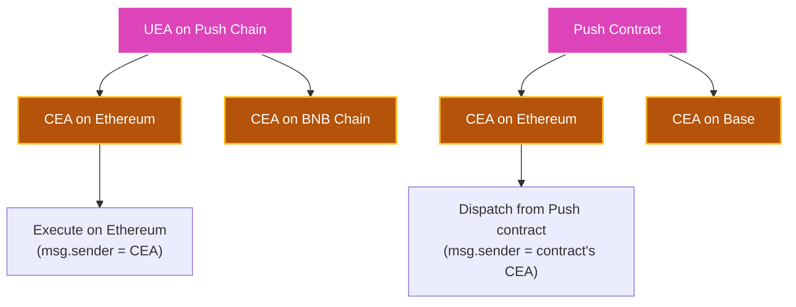
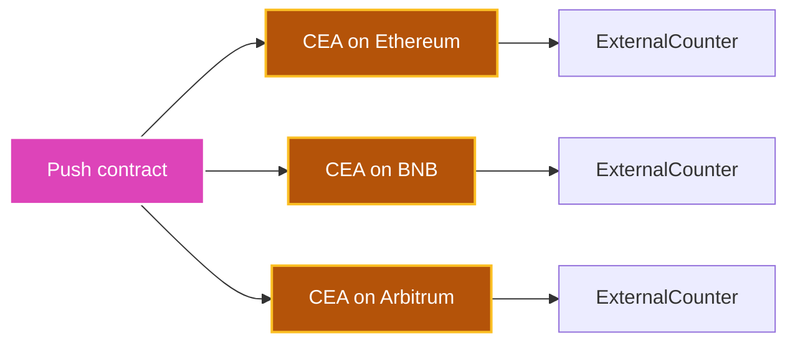

<head>
  <title>Derive Chain Executor Accounts | Tutorials | Push Chain Docs</title>
</head>

import Tabs from '@theme/Tabs';
import TabItem from '@theme/TabItem';
import Details from '@theme/Details';
import TutorialTimer from '@site/src/components/TutorialTimer';
import { SolidityCode } from '@site/src/components/SolidityCode';
import { GitHubRepo } from '@site/src/components/GitHubRepo';

{/* Content Start */}

<TutorialTimer estimatedMinutes={10} />

In this tutorial, you'll learn how to **derive Chain Executor Accounts (CEAs)**. A CEA is the destination-chain identity a Push Chain account uses when it executes on an external chain. This tutorial pairs with the [Derive UEA tutorial](/docs/chain/tutorials/power-features/tutorial-derive-universal-executor-account). UEAs are how external wallets execute on Push Chain; CEAs work in the opposite direction.

By the end of this tutorial, you'll be able to:

- ✅ Understand how CEAs map Push Chain accounts to addresses on every external chain
- ✅ Derive CEA addresses from any Push Chain account using the SDK
- ✅ Derive CEAs on-chain from an external EVM contract via `ICEAFactory`
- ✅ Use CEA derivation to fund and pre-authorize cross-chain flows

## Understanding Chain Executor Accounts (CEAs)

A **Chain Executor Account (CEA)** is a deterministic smart account on an **external chain** (Ethereum, Solana, BSC, and others), derived from a **Push Chain account** (a UEA, a Push-native EOA, or a Push Chain contract). It is the execution surface a Push-side account uses when it dispatches an outbound. Every outbound goes through `UniversalGatewayPC`, which is Push's cross-chain gateway contract.

### CEAs vs UEAs

| | UEA | CEA |
|---|---|---|
| Lives on | Push Chain | External chain (one per chain) |
| Derived from | An external-chain wallet | A Push Chain account (UEA, EOA, or contract) |
| Acts as `msg.sender` for | Push Chain transactions | External-chain transactions |
| Bound to | A user wallet | A user **or** a contract |
| Deployed by | UEAFactory on Push Chain (lazy) | CEAFactory on the destination chain (lazy, by TSS) |


### CEAs are deterministic

- Every Push Chain account has a unique, deterministic CEA on every supported external chain.
- Same Push-side account always produces the same CEA on the same destination chain.
- A different destination chain produces a different CEA (CEA addresses are scoped per chain).

```
Push Chain Account: 0xABC...123 (UEA, EOA, or contract)
    ↓ (deterministic derivation, per destination chain)
CEA on Ethereum Sepolia: 0x111...222
CEA on BNB Testnet:      0x333...444
CEA on Base Sepolia:     0x555...666
```

### Why CEAs matter

- **Self-Custody**<br />
  CEAs are self-custodial. They can only be controlled by the Push-side account, so your funds and actions always remain under your control.

- **Identity portability**<br />
  Your account identity follows you across all chains without any bridging or wrapping.

- **Contract-initiated execution**<br />
  When a Push Chain contract dispatches outbound, its CEA acts as _`msg.sender`_ on the destination chain. The CEA ensures your identity and actions are preserved across chains.



## Deriving CEAs with the SDK

The Push Chain SDK derives CEAs from any Push Chain account using `deriveExecutorAccount` with a `chain` option that selects the destination chain.

#### Basic CEA Derivation

```typescript
import { PushChain } from '@pushchain/core';

// Step 1: wrap the Push-side account in a UniversalAccount.
const pushAccount = PushChain.utils.account.toUniversal(
  '0x98cA97d2FB78B3C0597E2F78cd11868cACF423C5',
  { chain: PushChain.CONSTANTS.CHAIN.PUSH_TESTNET }
);

// Step 2: derive the CEA on the destination chain.
const ceaResult = await PushChain.utils.account.deriveExecutorAccount(
  pushAccount,
  { chain: PushChain.CONSTANTS.CHAIN.BNB_TESTNET }
);

console.log('CEA on BNB Testnet:', ceaResult.address);
console.log('Deployed:',           ceaResult.deployed);
```

#### Deriving from non-Push origins

`deriveExecutorAccount` accepts any `UniversalAccount`. When the input is a UOA (an origin wallet on an external chain), the SDK first resolves its UEA and then derives the CEA on the target chain. You can answer "where will this user act on chain X?" with a single call.

```typescript
const solanaAccount = PushChain.utils.account.toUniversal(
  'EUYcfSUScdFgKMbB3rRdgRZwXmcxY7QCRQa2JwrchP1Q',
  { chain: PushChain.CONSTANTS.CHAIN.SOLANA_DEVNET }
);

const ceaSolanaUserOnBnb = await PushChain.utils.account.deriveExecutorAccount(
  solanaAccount,
  { chain: PushChain.CONSTANTS.CHAIN.BNB_TESTNET }
);
```

`skipNetworkCheck: true` returns the deterministic address without making an RPC call. Use this when you need the address but do not need to know whether the CEA has been deployed yet.

```typescript
const result = await PushChain.utils.account.deriveExecutorAccount(
  pushAccount,
  { chain: PushChain.CONSTANTS.CHAIN.BNB_TESTNET, skipNetworkCheck: true }
);
// result.address is set; result.deployed is omitted.
```

For the full SDK reference (arguments, return shape, and a live playground), see [deriveExecutorAccount in Utility Functions](/docs/chain/build/utility-functions/#derive-executor-account).

#### Supported destination chains

Use `PushChain.CONSTANTS.CHAIN` values for the `chain` option. The supported set matches the chains documented in the [Smart Contract Address Book](/docs/chain/setup/smart-contract-address-book) (Ethereum Sepolia, Base Sepolia, Arbitrum Sepolia, BNB Testnet, Solana Devnet, ...).

## Deriving CEAs in Smart Contracts

`ICEAFactory` is deployed on **each external chain** (not on Push Chain) and exposes the on-chain mapping between a Push-side account and its CEA on that chain. From an external EVM chain, you can look up or pre-compute any CEA without making a call back to Push Chain.

#### ICEAFactory Interface

<SolidityCode
  title="ICEAFactory Interface"
  fileName="ICEAFactory.sol"
  url="https://github.com/pushchain/push-chain-gateway-contracts/blob/main/contracts/evm-gateway/src/interfaces/ICEAFactory.sol"
>

```solidity
// SPDX-License-Identifier: MIT
pragma solidity 0.8.26;

interface ICEAFactory {
    /// @notice Returns the CEA address and deployment status for a given Push Chain account.
    /// @dev    If the CEA has not been deployed, returns (predictedAddress, false).
    /// @param  _pushAccount  Address of the Push Chain account (UEA, EOA, or contract).
    /// @return cea           CEA address (deployed or predicted via CREATE2).
    /// @return isDeployed    True if the CEA has code at that address.
    function getCEAForPushAccount(address _pushAccount)
        external view returns (address cea, bool isDeployed);

    /// @notice Returns true if `_cea` was deployed by this factory.
    function isCEA(address _cea) external view returns (bool);

    /// @notice Reverse lookup: returns the Push Chain account mapped to this CEA.
    function getPushAccountForCEA(address _cea)
        external view returns (address pushAccount);
}
```

</SolidityCode>

:::info CEAFactory address
The CEAFactory is deployed on each external chain. Find the per-chain address in the [Smart Contract Address Book](/docs/chain/setup/smart-contract-address-book). Unlike `IUEAFactory`, there is no precompile address for the CEAFactory; it is a regular contract.
:::

#### Example: pre-compute and authorize a Push contract's CEA

A common pattern is to whitelist a Push Chain contract's CEA on a destination-chain protocol before the Push contract has dispatched anything. Compute the CEA on-chain via `getCEAForPushAccount`, then authorize it.

<SolidityCode
  title="CEA Lookup on Destination Chain"
  fileName="CEALookup.sol"
>

```solidity
// SPDX-License-Identifier: MIT
pragma solidity ^0.8.26;

interface ICEAFactory {
    function getCEAForPushAccount(address _pushAccount)
        external view returns (address cea, bool isDeployed);

    function getPushAccountForCEA(address _cea)
        external view returns (address pushAccount);
}

contract CEALookup {
    ICEAFactory public immutable FACTORY;
    mapping(address => bool) public allowedCEAs;

    constructor(address ceaFactory) {
        FACTORY = ICEAFactory(ceaFactory);
    }

    /// @notice Look up the CEA on this chain for a given Push-side account.
    function ceaFor(address pushAccount)
        external view returns (address cea, bool isDeployed)
    {
        return FACTORY.getCEAForPushAccount(pushAccount);
    }

    /// @notice Pre-authorize a Push-side account's CEA before it has been deployed.
    ///         Useful for whitelists that need to allow contract-initiated cross-chain
    ///         calls on day zero.
    function preAuthorize(address pushAccount) external {
        (address cea, ) = FACTORY.getCEAForPushAccount(pushAccount);
        allowedCEAs[cea] = true;
    }

    /// @notice Reverse: given a CEA, find which Push-side account owns it.
    function pushAccountFor(address cea) external view returns (address) {
        return FACTORY.getPushAccountForCEA(cea);
    }
}
```

</SolidityCode>

#### Example: gate destination-chain calls to a known agent's CEA

A second common pattern: a destination-chain vault that only accepts calls coming from an authorized Push-side agent's CEA. Use `getPushAccountForCEA(msg.sender)` to resolve `msg.sender` back to the Push-side account, then check it against an allowlist. Anyone calling from an unauthorized address (or from a non-CEA address) reverts.

<SolidityCode
  title="CEA-Gated Destination Vault"
  fileName="AgentGatedVault.sol"
>

```solidity
// SPDX-License-Identifier: MIT
pragma solidity ^0.8.26;

interface ICEAFactory {
    function getCEAForPushAccount(address _pushAccount)
        external view returns (address cea, bool isDeployed);

    function getPushAccountForCEA(address _cea)
        external view returns (address pushAccount);
}

contract AgentGatedVault {
    ICEAFactory public immutable FACTORY;
    address public owner;

    /// @dev Push-side agent address => authorized.
    mapping(address => bool) public authorizedAgents;

    event AgentAuthorized(address indexed agentPushAccount, address indexed cea);
    error UnknownAgent();
    error NotOwner();

    modifier onlyOwner() {
        if (msg.sender != owner) revert NotOwner();
        _;
    }

    constructor(address ceaFactory) {
        FACTORY = ICEAFactory(ceaFactory);
        owner = msg.sender;
    }

    /// @notice Authorize a known AI agent (or any Push-side contract / account)
    ///         to call this vault. The CEA address is logged for auditability.
    function authorizeAgent(address agentPushAccount) external onlyOwner {
        (address cea, ) = FACTORY.getCEAForPushAccount(agentPushAccount);
        authorizedAgents[agentPushAccount] = true;
        emit AgentAuthorized(agentPushAccount, cea);
    }

    /// @notice Resolve msg.sender's CEA back to its Push-side owner and check
    ///         that the owner is authorized. Calls from unknown CEAs or from
    ///         non-CEA addresses revert.
    function execute(bytes calldata data) external {
        address agentPushAccount = FACTORY.getPushAccountForCEA(msg.sender);
        if (!authorizedAgents[agentPushAccount]) revert UnknownAgent();
        _execute(data);
    }

    function _execute(bytes calldata /* data */) internal {
        // Vault-specific logic goes here.
    }
}
```

</SolidityCode>

This is the pattern most multi-agent or multi-tenant cross-chain protocols want: every authorized Push-side actor maps to exactly one CEA on this chain, and the protocol enforces that mapping at the destination layer without trusting any off-chain signal.

:::warning Push Chain has no on-chain CEA derivation
There is no precompile on Push Chain for deriving CEAs. `ICEAFactory` only exists on external chains. From a Push Chain contract, derive the CEA off-chain via the SDK and pass it in as a constructor argument or an authorized configuration update.
:::

## What CEAs Unlock

CEAs make a Push Chain account a first-class citizen on every external chain. One key, one identity, real on-chain authority everywhere.

#### True Self-Custody on Every Chain
Assets in a CEA belong to exactly one person: the Push-side account that owns it. No bridge operator, no relayer, no protocol admin can move them. Acting on a CEA requires the original wallet's signature, whether that signer lives on Ethereum, Solana, or any other supported chain. The custody chain runs unbroken from origin wallet to destination-chain action.

#### Deterministic Cross-Chain Identity
Every Push-side account has a pre-computable, stable address on every external chain. You can whitelist it, fund it, or pre-authorize it on a destination protocol on day zero, before a single cross-chain transaction has happened. When the first one does, the TSS network deploys the CEA contract at exactly the address you computed months earlier.

#### Programmable Reach Without Bots
Push Chain *contracts*, not just users, get their own CEAs. A single contract on Push can act on Ethereum, BNB, Base, and Arbitrum through a stable on-chain identity per chain. No off-chain bots, no per-chain hot keys, no relayer infrastructure to maintain. Cross-chain orchestration becomes ordinary on-chain logic.

#### Native `msg.sender` on Every Destination
A CEA looks like an ordinary address on its destination chain. Destination protocols need zero Push-specific awareness; they whitelist or fund the CEA, and Push Chain enforces who can speak for it. Universal execution is invisible at the destination layer.

## What You Can Build

CEAs are the primitive. Here are the product verticals they unlock:

### Universal Self-Custody
One key, every chain's assets. ETH on Ethereum, NFTs on Base, LP positions on Arbitrum, staked tokens on BSC, all sitting in CEAs controlled by a single Solana or Ethereum signer on Push Chain. No wrapped tokens, no bridges, no custodian.

### Cross-Chain DeFi
Lending with isolated risk per CEA, yield strategies that route to the deepest liquidity on whichever chain has it, perp trading that settles on the destination chain natively. Each user's CEA is a self-contained position; collateral, debt, and health factor can never bleed across users.

### Cross-Chain AI Agents
AI agents and autonomous bots deployed as Push Chain contracts that interact with Aave on Ethereum, perp DEXes on Arbitrum, and vaults on Base, all under one verifiable identity. [EIP-8004](https://eips.ethereum.org/EIPS/eip-8004) cross-chain native from day one.

### Cross-Chain Keepers and Liquidators
Liquidation engines, oracle pokes, vault rebalancers, scheduled jobs. The Push contract watches conditions and dispatches the destination call through `UniversalGatewayPC`; destination protocols see a stable, attributable Push-side actor. No race-the-other-bot infrastructure required.

### Multi-Chain Treasury and Payroll
A DAO whose treasury is conceptually on Push but physically lives on whichever chain has the deepest liquidity, the cheapest gas, or the contributor's preferred wallet. Pay contributors in the chain they want, deploy idle funds where they earn most, repatriate when needed.

## Live Playground

Connect a Push wallet and watch its deterministic CEA appear on every supported external chain at once. CEAs derive from your **UEA on Push Chain**, so it doesn't matter whether you log in via MetaMask, Phantom, email, or social; the same Push account always produces the same CEAs.

```jsx live
// customPropMinimized='true'
import {
  PushUniversalAccountButton,
  usePushChain,
  usePushChainClient,
  usePushWalletContext,
  PushUniversalWalletProvider,
  PushUI,
} from "@pushchain/ui-kit";
import { useEffect, useMemo, useState } from "react";

function DeriveCEAExample() {
  const walletConfig = {
    network: PushUI.CONSTANTS.PUSH_NETWORK.TESTNET,
  };

  function Component() {
    const { connectionStatus } = usePushWalletContext();
    const { pushChainClient } = usePushChainClient();
    const { PushChain } = usePushChain();

    const [rows, setRows] = useState([]);
    const [loading, setLoading] = useState(false);
    const [error, setError] = useState("");

    const ueaAddress = useMemo(
      () => (pushChainClient ? pushChainClient.universal.account : null),
      [pushChainClient]
    );

    useEffect(() => {
      if (!ueaAddress || !PushChain) {
        setRows([]);
        return;
      }
      let cancelled = false;
      (async () => {
        setLoading(true);
        setError("");
        try {
          // Step 1: wrap the UEA into a UniversalAccount on Push Chain.
          const pushAccount = PushChain.utils.account.toUniversal(ueaAddress, {
            chain: PushChain.CONSTANTS.CHAIN.PUSH_TESTNET,
          });

          // Step 2: list every chain supported on the current network.
          const { chains } = PushChain.utils.chains.getSupportedChains(
            PushChain.CONSTANTS.PUSH_NETWORK.TESTNET
          );

          // Step 3: derive the CEA on each external chain via the
          // documented PushChain.utils.account.deriveExecutorAccount(account, { chain }) call.
          // The `chain` option flips the call from "UEA on Push" to "CEA on chain".
          const out = [];
          for (const chain of chains) {
            if (chain === PushChain.CONSTANTS.CHAIN.PUSH_TESTNET) continue;
            const chainName = PushChain.utils.chains.getChainName(chain) ?? chain;
            try {
              const cea = await PushChain.utils.account.deriveExecutorAccount(
                pushAccount,
                { chain }
              );
              out.push({
                chainNamespace: chain,
                chainName,
                ceaAddress: cea.address,
                isDeployed: cea.deployed === true,
              });
            } catch (err) {
              out.push({
                chainNamespace: chain,
                chainName,
                ceaAddress: "",
                isDeployed: false,
                error: err instanceof Error ? err.message : String(err),
              });
            }
          }

          if (!cancelled) setRows(out);
        } catch (err) {
          if (!cancelled) setError(err instanceof Error ? err.message : String(err));
        } finally {
          if (!cancelled) setLoading(false);
        }
      })();
      return () => {
        cancelled = true;
      };
    }, [ueaAddress, PushChain]);

    return (
      <div style={{ maxWidth: "640px", margin: "0 auto", padding: "20px", fontFamily: "system-ui" }}>
        <h2 style={{ textAlign: "center", marginBottom: "10px" }}>Derive Chain Executor Accounts</h2>
        <p style={{ textAlign: "center", color: "#666", fontSize: "14px", marginBottom: "30px" }}>
          Connect a Push wallet and see its deterministic CEA on every supported external chain
        </p>

        <div style={{ marginBottom: "30px", display: "flex", justifyContent: "center" }}>
          <PushUniversalAccountButton />
        </div>

        {connectionStatus === PushUI.CONSTANTS.CONNECTION.STATUS.CONNECTED && pushChainClient && (
          <div style={{ marginBottom: "30px", padding: "20px", backgroundColor: "#f0f7ff", borderRadius: "12px", border: "1px solid #d0e7ff" }}>
            <h3 style={{ fontSize: "16px", marginBottom: "16px", color: "#0066cc", fontWeight: "bold" }}>
              🔑 Your Push Chain Account
            </h3>

            <div style={{ marginBottom: "12px", padding: "12px", backgroundColor: "white", borderRadius: "8px" }}>
              <p style={{ fontSize: "12px", color: "#666", marginBottom: "4px", fontWeight: "bold" }}>Origin Wallet:</p>
              <p style={{ fontSize: "14px", fontFamily: "monospace", wordBreak: "break-all", margin: 0 }}>
                {pushChainClient.universal.origin.address}
              </p>
              <p style={{ fontSize: "12px", color: "#666", marginTop: "4px" }}>
                Chain: {PushChain.utils.chains.getChainName(pushChainClient.universal.origin.chain) ?? pushChainClient.universal.origin.chain}
              </p>
            </div>

            <div style={{ padding: "12px", backgroundColor: "white", borderRadius: "8px", border: "2px solid #d946ef" }}>
              <p style={{ fontSize: "12px", color: "#666", marginBottom: "4px", fontWeight: "bold" }}>UEA on Push Chain:</p>
              <p style={{ fontSize: "14px", fontFamily: "monospace", wordBreak: "break-all", margin: 0, color: "#d946ef", fontWeight: "bold" }}>
                {pushChainClient.universal.account}
              </p>
            </div>
          </div>
        )}

        {connectionStatus === PushUI.CONSTANTS.CONNECTION.STATUS.CONNECTED && pushChainClient && (
          <div style={{ padding: "20px", backgroundColor: "#f9f9f9", borderRadius: "12px", border: "1px solid #ddd" }}>
            <h3 style={{ fontSize: "16px", marginBottom: "16px", fontWeight: "bold", color: "#d946ef" }}>
              🛰️ CEAs Across External Chains
            </h3>

            {loading && (
              <p style={{ fontSize: "14px", color: "#666", margin: 0 }}>
                Deriving CEAs across supported chains…
              </p>
            )}
            {error && (
              <p style={{ fontSize: "14px", color: "#c62828", margin: 0 }}>
                Failed to load CEAs: {error}
              </p>
            )}

            {!loading && rows.map((row) => (
              <div key={row.chainNamespace} style={{ marginBottom: "12px", padding: "12px", backgroundColor: "white", borderRadius: "8px", border: "1px solid #eee" }}>
                <div style={{ display: "flex", justifyContent: "space-between", alignItems: "center", marginBottom: "6px" }}>
                  <span style={{ fontSize: "13px", fontWeight: "bold", color: "#333" }}>{row.chainName}</span>
                  <span style={{ fontSize: "11px", color: "#999", fontFamily: "monospace" }}>{row.chainNamespace}</span>
                </div>

                {row.error ? (
                  <p style={{ fontSize: "13px", color: "#c62828", margin: 0 }}>— {row.error}</p>
                ) : (
                  <p style={{ fontSize: "13px", fontFamily: "monospace", wordBreak: "break-all", margin: "4px 0" }}>
                    {row.ceaAddress}
                  </p>
                )}

                <div style={{ marginTop: "6px" }}>
                  <span
                    style={{
                      fontSize: "11px",
                      padding: "3px 8px",
                      borderRadius: "4px",
                      fontWeight: "bold",
                      backgroundColor: row.isDeployed ? "#e8f5e9" : "#fff3e0",
                      color: row.isDeployed ? "#2e7d32" : "#e65100",
                    }}
                  >
                    {row.isDeployed ? "Deployed" : "Not deployed"}
                  </span>
                </div>
              </div>
            ))}

            <div style={{ marginTop: "16px", padding: "12px", backgroundColor: "#fff3e0", borderRadius: "8px", border: "1px solid #ffe0b2" }}>
              <h4 style={{ fontSize: "13px", marginBottom: "6px", color: "#e65100", fontWeight: "bold" }}>
                💡 How CEAs Activate
              </h4>
              <p style={{ fontSize: "13px", color: "#666", lineHeight: "1.5", margin: 0 }}>
                CEAs start undeployed. They activate the first time you target their chain via a contract-initiated outbound or a user-initiated cross-chain transaction. Once deployed, the CEA can also originate transactions back to Push Chain.
              </p>
            </div>
          </div>
        )}
      </div>
    );
  }

  return (
    <PushUniversalWalletProvider config={walletConfig}>
      <Component />
    </PushUniversalWalletProvider>
  );
}
```

## Source code

<GitHubRepo
  title="Derive Chain Executor Account Tutorial"
  repoUrl="https://github.com/pushchain/push-chain-examples/tree/main/tutorials/derive-chain-executor-account"
  description="Full frontend source for discovering a Push wallet's CEAs across every supported external chain."
/>

## What we achieved

In this tutorial, we explored Chain Executor Accounts:

- **Understood CEAs**: how Push Chain accounts map to addresses on every external chain
- **Derived CEAs with the SDK**: `deriveExecutorAccount` with a `chain` option
- **Derived CEAs on-chain**: `ICEAFactory.getCEAForPushAccount` from an external EVM chain
- **Practical applications**: lending, self-custody, omnichain yield, perpetuals, and AI agent identity

## Key takeaways

**1. One Push account, one CEA per chain**
- Same Push-side account always derives the same CEA on the same destination chain
- Different destination chains have different CEAs
- Mappings are deterministic and persistent

**2. CEAs are bound to the Push-side address**
- For users: bound to their UEA
- For contracts: bound to the contract's Push Chain address
- A new contract deployment at a different address has a different CEA

**3. Powerful primitives**
- Pre-compute CEAs off-chain via SDK or on the destination chain via `ICEAFactory`
- Whitelist them before any cross-chain activity has happened
- Reverse-lookup to credit the right Push-side user for inbound flows

## What's Next?

You can derive a Push contract's CEA on every destination. Now wire one Push contract to drive state on three chains at once. 

The next tutorial fans out a single click on Push Chain into simultaneous `increment()` calls on Ethereum Sepolia, BNB Testnet, and Arbitrum Sepolia, all signed by the orchestrator's deterministic CEA on each.

<div style={{textAlign: 'center'}}>



</div>

<hr />

Check out the next tutorial to learn how to [build universal cross-chain counters](/docs/chain/tutorials/power-features/tutorial-universal-cross-chain-counters/): one Push contract, many destination chains, one transaction.
