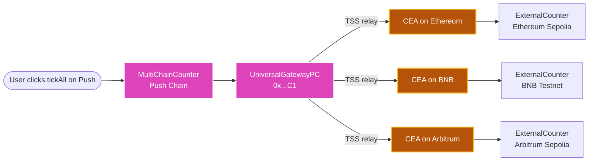
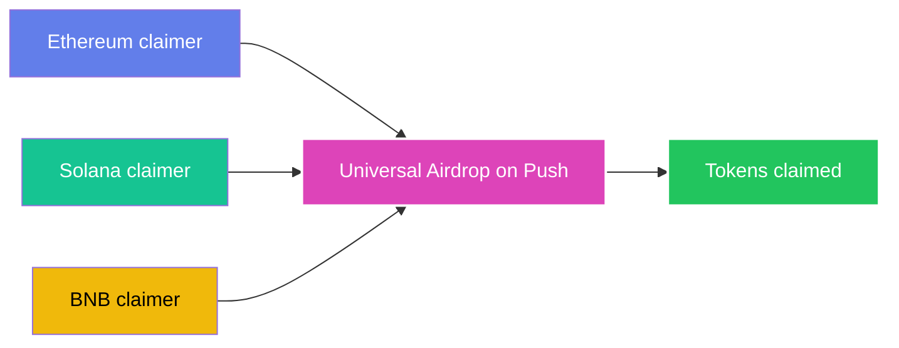

<head>
  <title>Build Universal Cross-Chain Counters | Tutorials | Push Chain Docs</title>
</head>

import Tabs from '@theme/Tabs';
import TabItem from '@theme/TabItem';
import Details from '@theme/Details';
import TutorialTimer from '@site/src/components/TutorialTimer';
import { SolidityCode } from '@site/src/components/SolidityCode';
import { GitHubRepo } from '@site/src/components/GitHubRepo';

{/* Content Start */}

<TutorialTimer estimatedMinutes={20} />

In the [Counter](/docs/chain/tutorials/basics/tutorial-simple-counter/) and [Universal Counter](/docs/chain/tutorials/basics/tutorial-universal-counter/) tutorials every increment landed on **one** Push Chain contract. Here we flip the model. A single click on a Push Chain contract increments separate counters on **Ethereum Sepolia, BNB Testnet, and Arbitrum Sepolia** at once. One contract orchestrates many.

By the end of this tutorial you'll be able to:

- ✅ Deploy a Push Chain contract that fans out to multiple destination chains in one call
- ✅ Use **IUniversalGatewayPC** (UGPC) to dispatch outbound transactions
- ✅ Compute a contract's destination-chain CEA before any cross-chain activity has happened
- ✅ See and verify `msg.sender` on the destination chain resolve to the deterministic CEA
- ✅ (Optional) Harden the destination by gating `increment()` to the CEA so only your Push contract can drive it

:::info Builds on Derive CEA
This tutorial puts the [Derive Chain Executor Account (CEA)](/docs/chain/tutorials/power-features/tutorial-derive-chain-executor-account/) primitive to work. If you haven't read that one yet, skim it first. We'll be deriving CEAs and authorising them on destination chains.
:::

## Understanding the Pattern

In order to create ticks across multiple chains, we need to design two contracts.

- **MultiChainCounter**: This contract runs on Push Chain and is responsible for orchestrating the cross-chain increments.
- **ExternalCounter**: This contract runs on each destination chain and is responsible for incrementing the counter.

The transaction from users from any chain lands on Push Chain, where the `MultiChainCounter` contract is deployed. It then uses the **IUniversalGatewayPC** (UGPC) to dispatch outbound transactions to each of the **ExternalCounter** contracts on the destination chains.




> **🚀 Why this matters**
>
> No off-chain bots. No relayer keys. No per-chain hot wallets. The orchestrator lives entirely on Push Chain and reaches every external chain through a deterministic identity (its CEA) that destination protocols can pre-authorise from day zero.

## Write the Contracts

### Per Destination Chain → ExternalCounter.sol

This contract lives on **each destination chain**. It stores a `count` and records `lastCaller` on every increment so you can observe the orchestrator's CEA showing up after each tick.

<SolidityCode
  title="External Counter (one per destination chain)"
  fileName="ExternalCounter.sol"
  url="https://github.com/pushchain/push-chain-examples/blob/main/tutorials/universal-cross-chain-counters/contracts/src/ExternalCounter.sol"
>

```solidity
// SPDX-License-Identifier: MIT
pragma solidity ^0.8.22;

contract ExternalCounter {
    uint256 public count;

    /// The address that most recently incremented. After a tickAll this will
    /// be the orchestrator's deterministic CEA on this chain.
    address public lastCaller;

    event CountIncremented(uint256 indexed newCount, address indexed caller);

    function increment() external {
        unchecked { count += 1; }
        lastCaller = msg.sender;
        emit CountIncremented(count, msg.sender);
    }
}
```

</SolidityCode>

When the orchestrator dispatches via UGPC, the TSS network signs the destination tx **as the orchestrator's CEA on this chain**, so `lastCaller` ends up being that deterministic CEA address. 

From the destination contract's perspective the CEA is just a regular address, but Push Chain guarantees only one Push-side contract can produce calls from it. Visible proof of identity, with no mandatory destination-side auth.

:::info Why is `ExternalCounter.increment()` open?
We deliberately keep `increment()` callable by anyone in this tutorial so you can run the live playground below without a per-chain redeploy. <br /><br />

To **enforce** that only the orchestrator's CEA can drive it, see the [production hardening snippet at the bottom of this tutorial](#production-hardening-gate-increment-to-the-cea).
:::


### On Push Chain → MultiChainCounter.sol

This contract lives on **Push Chain**. It holds the list of destinations and fans out a single payload (the `increment()` calldata) to each one through `UGPC`.

<SolidityCode
  title="Push-Chain Orchestrator"
  fileName="MultiChainCounter.sol"
  url="https://github.com/pushchain/push-chain-examples/blob/main/tutorials/universal-cross-chain-counters/contracts/src/MultiChainCounter.sol"
>

```solidity
// SPDX-License-Identifier: MIT
pragma solidity ^0.8.26;

/// @notice UGPC outbound request shape. Mirrors the production type so this
/// tutorial doesn't need a hard dependency on push-chain-gateway-contracts.
struct UniversalOutboundTxRequest {
    bytes recipient;         // bytes-packed ExternalCounter address on the destination chain
    address token;           // address(0) — we are not bridging funds, just executing a payload
    uint256 amount;          // 0 because we are not bridging funds
    uint256 gasLimit;        // gas the destination CEA gets to run `increment()`
    uint256 gasPrice;        // 0 → per-chain default from UniversalCore (new in SDK v6)
    uint256 maxPCForGas;     // 0 → no cap on PC the AMM may spend on the gas swap (new in SDK v6)
    bytes payload;           // ABI-encoded calldata for the destination contract
    address revertRecipient; // refunded if the outbound cannot finalise
}

interface IUniversalGatewayPC {
    function sendUniversalTxOutbound(UniversalOutboundTxRequest calldata req) external payable;
}

interface IExternalCounter {
    function increment() external;
}

contract MultiChainCounter {
    /// @notice Predeploy address of UniversalGatewayPC on every Push Chain network.
    IUniversalGatewayPC public constant UGPC =
        IUniversalGatewayPC(0x00000000000000000000000000000000000000C1);

    struct Destination {
        bytes target;        // bytes-packed ExternalCounter address
        uint256 gasLimit;    // destination-chain gas budget for the CEA's call
    }

    Destination[] public destinations;
    address public immutable OWNER;

    event DestinationAdded(uint256 indexed index, bytes target);
    event DestinationGasLimitUpdated(uint256 indexed index, uint256 oldGasLimit, uint256 newGasLimit);
    event Ticked(uint256 nDestinations, uint256 totalValue);

    error NotOwner();
    error LengthMismatch();
    error InsufficientValue();
    error InvalidIndex();
    error ZeroGasLimit();

    modifier onlyOwner() {
        if (msg.sender != OWNER) revert NotOwner();
        _;
    }

    constructor() {
        OWNER = msg.sender;
    }

    /// @notice Register an `ExternalCounter` on a destination chain.
    function addDestination(bytes calldata target, uint256 gasLimit) external onlyOwner {
        destinations.push(Destination({ target: target, gasLimit: gasLimit }));
        emit DestinationAdded(destinations.length - 1, target);
    }

    /// @notice Update the gas budget granted to a registered destination's CEA
    /// without redeploying.
    function setDestinationGasLimit(uint256 index, uint256 newGasLimit) external onlyOwner {
        if (index >= destinations.length) revert InvalidIndex();
        if (newGasLimit == 0) revert ZeroGasLimit();
        uint256 oldGasLimit = destinations[index].gasLimit;
        destinations[index].gasLimit = newGasLimit;
        emit DestinationGasLimitUpdated(index, oldGasLimit, newGasLimit);
    }

    /// @notice Tick every registered destination's counter.
    /// @param  perCallFee  protocolFee + gasFee for each destination, quoted via
    ///                     `UniversalCore.getOutboundTxGasAndFees(...)`.
    /// @param  revertRecipient Push-side address credited if any outbound reverts.
    function tickAll(uint256[] calldata perCallFee, address revertRecipient) external payable {
        if (perCallFee.length != destinations.length) revert LengthMismatch();

        bytes memory payload = abi.encodeCall(IExternalCounter.increment, ());

        uint256 total;
        uint256 n = destinations.length;
        for (uint256 i = 0; i < n; i++) {
            Destination memory d = destinations[i];

            UGPC.sendUniversalTxOutbound{value: perCallFee[i]}(
                UniversalOutboundTxRequest({
                    recipient: d.target,
                    token: address(0),
                    amount: 0,
                    gasLimit: d.gasLimit,
                    gasPrice: 0,            // per-chain default from UniversalCore
                    maxPCForGas: 0,         // no cap on PC for the gas swap
                    payload: payload,
                    revertRecipient: revertRecipient
                })
            );
            total += perCallFee[i];
        }

        if (msg.value < total) revert InsufficientValue();
        emit Ticked(n, msg.value);
    }

    /// @notice View helper. Returns the number of registered destinations.
    function destinationCount() external view returns (uint256) {
        return destinations.length;
    }

    /// @notice Receive UniversalCore refunds and any incoming PC.
    receive() external payable {}
}
```

</SolidityCode>

A few things to note about the outbound shape:

- **`token` is `address(0)`.** We're executing a payload, not bridging funds. UGPC infers `TX_TYPE = GAS_AND_PAYLOAD` from `token == address(0) && payload.length > 0`.
- **`recipient` is `bytes`, not `address`.** UGPC supports non-EVM destinations too, so addresses are bytes-packed (`abi.encodePacked(externalCounterAddress)` for EVM destinations).
- **`payload` is the raw single-call calldata.** No multicall marker prefix — that's only required for multi-step destination payloads.
- **Per-call fees, not flat.** Each destination has its own protocolFee + gasFee depending on its current gas price and configured `gasLimit`. Quote each one separately off-chain.

## Wire It Up

Three things to wire up, then we tick.


### Deploy the contracts

Deploy `MultiChainCounter` on Push Chain and `ExternalCounter` on each destination — Foundry, Hardhat, or Remix all work. See [smart contract deployment](/docs/chain/setup/smart-contract-environment/) for setup.

<Details summary="Foundry one-liner per chain">

```bash
# Push Chain Donut Testnet (orchestrator)
forge create src/MultiChainCounter.sol:MultiChainCounter \
  --rpc-url $PUSH_TESTNET_RPC --private-key $DEPLOYER_KEY --broadcast

# Each destination — same command, different RPC + key
forge create src/ExternalCounter.sol:ExternalCounter \
  --rpc-url $DEST_RPC --private-key $DEST_KEY --broadcast
```

</Details>

### Register each destination

```typescript
import { PushChain } from '@pushchain/core';
import { encodePacked } from 'viem';

const DESTINATIONS = [
  { counter: '0xCounterEth...', gasLimit: 1_000_000n },
  { counter: '0xCounterBnb...', gasLimit: 1_000_000n },
  { counter: '0xCounterArb...', gasLimit: 1_000_000n },
];

for (const d of DESTINATIONS) {
  await pushChainClient.universal.sendTransaction({
    to: MULTICHAIN_COUNTER_ADDRESS,
    data: PushChain.utils.helpers.encodeTxData({
      abi: MULTICHAIN_COUNTER_ABI,
      functionName: 'addDestination',
      args: [encodePacked(['address'], [d.counter]), d.gasLimit],
    }),
  });
}
```

### Tick every counter

```typescript
const PER_CALL_FEE = 5n * 10n ** 18n; // 5 PC per destination — comfortable testnet headroom
const fees = DESTINATIONS.map(() => PER_CALL_FEE);
const total = fees.reduce((a, b) => a + b, 0n);

await pushChainClient.universal.sendTransaction({
  to:    MULTICHAIN_COUNTER_ADDRESS,
  value: total,
  data:  PushChain.utils.helpers.encodeTxData({
    abi: MULTICHAIN_COUNTER_ABI,
    functionName: 'tickAll',
    args: [fees, REVERT_RECIPIENT_ADDRESS],
  }),
});
```

A few seconds later, once the TSS network has relayed each outbound. You will see every `ExternalCounter` will have ticked exactly once. Verify with `count()` and `lastCaller()` reads on each destination chain.

:::warning Use a roomy `gasLimit` (>= 1_000_000)
The destination's CEA has to execute the Vault wrapper, decode the payload, and call your target, which requires more gas than the bare `increment()` itself.<br /><br />Tight budgets revert with selector `0xff633a38`. **Default to 1_000_000 per destination**, bump higher for complex payloads, and use `setDestinationGasLimit(index, newGasLimit)` to fix a too-low budget without redeploying.
:::

## Understanding msg.sender on the Destination

When `ExternalCounter.increment()` runs on Ethereum from a `tickAll`, what does `msg.sender` resolve to?

```
msg.sender == lastCaller
           == CEAFactory.getCEAForPushAccount(MULTICHAIN_COUNTER_ADDRESS)
           == ceaOnEth.address
```

This is the unique guarantee CEAs provide:

- The Ethereum contract sees a normal `msg.sender` address. No exotic format, no special handling.
- That address can only be **controlled** by exactly one Push Chain contract (`MultiChainCounter`).
- The relationship is enforced by the destination chain's `CEAFactory`, not by anything off-chain.

In this base example anyone *can* still call `increment()`, but only the orchestrator's CEA will appear as `lastCaller` when the call comes through UGPC. To enforce that only the CEA can drive the counter, see the next section.

## Production hardening → gate _increment()_ to the CEA {#production-hardening-gate-increment-to-the-cea}

When you're ready to make the counter authoritative, where destination state can only advance through the orchestrator, swap `ExternalCounter` for the auth-gated variant. The diff is small:

<SolidityCode
  title="ExternalCounter (production-hardened)"
  fileName="ExternalCounter.sol"
>

```solidity
// SPDX-License-Identifier: MIT
pragma solidity ^0.8.22;

contract ExternalCounter {
    uint256 public count;
    address public immutable AUTHORIZED_CEA;

    event CountIncremented(uint256 indexed newCount, address indexed caller);
    error NotAuthorizedCEA();

    constructor(address authorizedCEA) {
        AUTHORIZED_CEA = authorizedCEA;
    }

    function increment() external {
        if (msg.sender != AUTHORIZED_CEA) revert NotAuthorizedCEA();
        unchecked { count += 1; }
        emit CountIncremented(count, msg.sender);
    }
}
```

</SolidityCode>

Pass the orchestrator's per-chain CEA (from step 2 above) as the constructor argument. Now `increment()` reverts for anyone except the orchestrator's CEA. The destination chain's `CEAFactory` enforces that the CEA can only be controlled by your `MultiChainCounter` on Push, so the gating is end-to-end without any off-chain trust.

You can also pre-authorise the CEA on third-party destination protocols this way (whitelists, vault gating, etc.) before any cross-chain activity has happened. That's the [pre-authorise pattern from the Derive CEA tutorial](/docs/chain/tutorials/power-features/tutorial-derive-chain-executor-account#example-pre-compute-and-authorize-a-push-contracts-cea).

## Live Playground

Connect a wallet and click **Tick all destinations**. One Push transaction fans out three outbounds; when each `lastCaller` matches the derived CEA, you've watched the identity round-trip end to end. A **Lifecycle events** panel below the buttons surfaces every step from the SDK's `tx.progressHook(callback)`.

Wired to a reference deployment:

| Contract | Chain | Address |
|---|---|---|
| `MultiChainCounter` | Push Donut Testnet | [`0x7dd8...fBDd`](https://donut.push.network/address/0x7dd80f17C593F73292b3c4B785C4dD0100C4fBDd) |
| `ExternalCounter` | Ethereum Sepolia | [`0xCf5D...Ee92`](https://sepolia.etherscan.io/address/0xCf5DB8F40F7dAA8Aa8Cb36C880F7207a65e2Ee92) |
| `ExternalCounter` | BNB Testnet | [`0xfEe7...57D5`](https://testnet.bscscan.com/address/0xfEe777Fbd341AC02d105037022fc03D3CcD757D5) |
| `ExternalCounter` | Arbitrum Sepolia | [`0xb3fB...6E79`](https://sepolia.arbiscan.io/address/0xb3fB98A3C6EEA643532198CF22cc50BC48026E79) |

To drive your own deployments, edit `ORCHESTRATOR` and `DEMO_DESTINATIONS` at the top of the playground source.

```jsx live
// customPropMinimized='true'
import {
  PushUniversalAccountButton,
  usePushChain,
  usePushChainClient,
  usePushWalletContext,
  PushUniversalWalletProvider,
  PushUI,
} from "@pushchain/ui-kit";
import { useEffect, useState } from "react";

function CrossChainCounterExample() {
  // Pre-deployed demo addresses. Replace with your own deploys to drive your own counters.
  const ORCHESTRATOR = "0x7dd80f17C593F73292b3c4B785C4dD0100C4fBDd";
  const PER_CALL_FEE_PC_WEI = 5n * 10n ** 18n; // 5 PC per destination, comfortable testnet headroom

  const DEMO_DESTINATIONS = [
    {
      label: "Ethereum Sepolia",
      chainKey: "ETHEREUM_SEPOLIA",
      counterAddress: "0xCf5DB8F40F7dAA8Aa8Cb36C880F7207a65e2Ee92",
      rpc: "https://ethereum-sepolia-rpc.publicnode.com",
    },
    {
      label: "BNB Testnet",
      chainKey: "BNB_TESTNET",
      counterAddress: "0xfEe777Fbd341AC02d105037022fc03D3CcD757D5",
      rpc: "https://bsc-testnet-rpc.publicnode.com",
    },
    {
      label: "Arbitrum Sepolia",
      chainKey: "ARBITRUM_SEPOLIA",
      counterAddress: "0xb3fB98A3C6EEA643532198CF22cc50BC48026E79",
      rpc: "https://sepolia-rollup.arbitrum.io/rpc",
    },
  ];

  const MULTICHAIN_ABI = [
    {
      inputs: [
        { name: 'perCallFee', type: 'uint256[]' },
        { name: 'revertRecipient', type: 'address' },
      ],
      name: 'tickAll',
      outputs: [],
      stateMutability: 'payable',
      type: 'function',
    },
  ];

  const walletConfig = { network: PushUI.CONSTANTS.PUSH_NETWORK.TESTNET };

  function Component() {
    const { connectionStatus } = usePushWalletContext();
    const { pushChainClient } = usePushChainClient();
    const { PushChain } = usePushChain();

    const [ceaAddrs, setCeaAddrs] = useState({});
    const [counts, setCounts] = useState({});
    const [lastCallers, setLastCallers] = useState({});
    const [loading, setLoading] = useState(false);
    const [tickLoading, setTickLoading] = useState(false);
    const [txHash, setTxHash] = useState("");
    const [error, setError] = useState("");
    const [progressEvents, setProgressEvents] = useState([]);

    useEffect(() => {
      if (!PushChain) return;
      (async () => {
        const orchestratorOnPush = PushChain.utils.account.toUniversal(ORCHESTRATOR, {
          chain: PushChain.CONSTANTS.CHAIN.PUSH_TESTNET,
        });
        const next = {};
        for (const d of DEMO_DESTINATIONS) {
          try {
            const cea = await PushChain.utils.account.deriveExecutorAccount(orchestratorOnPush, {
              chain: PushChain.CONSTANTS.CHAIN[d.chainKey],
              skipNetworkCheck: true,
            });
            next[d.label] = cea.address;
          } catch (e) {
            // Skip destinations the SDK can't derive on this network.
          }
        }
        setCeaAddrs(next);
      })();
    }, [PushChain]);

    const refresh = async () => {
      setLoading(true);
      const c = {};
      const lc = {};
      await Promise.all(
        DEMO_DESTINATIONS.map(async (d) => {
          try {
            const res = await fetch(d.rpc, {
              method: "POST",
              headers: { "Content-Type": "application/json" },
              body: JSON.stringify({
                jsonrpc: "2.0",
                method: "eth_call",
                params: [{ to: d.counterAddress, data: "0x06661abd" }, "latest"],
                id: 1,
              }),
            }).then((r) => r.json());
            c[d.label] = BigInt(res.result || "0x0");
            const res2 = await fetch(d.rpc, {
              method: "POST",
              headers: { "Content-Type": "application/json" },
              body: JSON.stringify({
                jsonrpc: "2.0",
                method: "eth_call",
                params: [{ to: d.counterAddress, data: "0x6c428e98" }, "latest"],
                id: 2,
              }),
            }).then((r) => r.json());
            lc[d.label] = "0x" + (res2.result || "").slice(-40);
          } catch (e) {
            // Skip RPC errors silently.
          }
        })
      );
      setCounts(c);
      setLastCallers(lc);
      setLoading(false);
    };

    useEffect(() => {
      refresh();
    }, []);

    const tickAll = async () => {
      if (!pushChainClient || !PushChain) return;
      setTickLoading(true);
      setError("");
      setTxHash("");
      setProgressEvents([]);
      try {
        const fees = DEMO_DESTINATIONS.map(() => PER_CALL_FEE_PC_WEI);
        const total = fees.reduce((a, b) => a + b, 0n);
        const data = PushChain.utils.helpers.encodeTxData({
          abi: MULTICHAIN_ABI,
          functionName: "tickAll",
          args: [fees, ORCHESTRATOR],
        });
        const tx = await pushChainClient.universal.sendTransaction({
          to: ORCHESTRATOR,
          value: total,
          data,
        });
        setTxHash(tx.hash);
        // Subscribe to per-step lifecycle events the SDK fires for this tx.
        // Each event has { id, title, message, level, response, timestamp }.
        tx.progressHook((event) => {
          setProgressEvents((prev) => [...prev, event]);
        });
        await tx.wait();
        for (let i = 0; i < 6; i++) {
          await new Promise((r) => setTimeout(r, 15000));
          await refresh();
        }
      } catch (e) {
        setError(e instanceof Error ? e.message : String(e));
      } finally {
        setTickLoading(false);
      }
    };

    return (
      <div style={{ maxWidth: "720px", margin: "0 auto", padding: "20px", fontFamily: "system-ui" }}>
        <h2 style={{ textAlign: "center", marginBottom: "10px" }}>Universal Cross-Chain Counters</h2>
        <p style={{ textAlign: "center", color: "#666", fontSize: "14px", marginBottom: "20px" }}>
          One Push tx, three destination chains tick at once
        </p>

        <div style={{ display: "flex", justifyContent: "center", marginBottom: "20px" }}>
          <PushUniversalAccountButton />
        </div>

        <table style={{ width: "100%", borderCollapse: "collapse", fontSize: "13px", marginBottom: "16px" }}>
          <thead>
            <tr style={{ textAlign: "left", color: "#666" }}>
              <th style={{ padding: "8px 10px", borderBottom: "1px solid #ddd" }}>Chain</th>
              <th style={{ padding: "8px 10px", borderBottom: "1px solid #ddd" }}>CEA</th>
              <th style={{ padding: "8px 10px", borderBottom: "1px solid #ddd" }}>count</th>
              <th style={{ padding: "8px 10px", borderBottom: "1px solid #ddd" }}>lastCaller</th>
            </tr>
          </thead>
          <tbody>
            {DEMO_DESTINATIONS.map((d) => {
              const cea = ceaAddrs[d.label];
              const lc = lastCallers[d.label];
              const match = cea && lc && cea.toLowerCase() === lc.toLowerCase();
              const short = (a) => (a && a.length >= 12 ? `${a.slice(0, 6)}...${a.slice(-4)}` : "-");
              return (
                <tr key={d.label}>
                  <td style={{ padding: "8px 10px", borderBottom: "1px solid #eee", fontWeight: 600 }}>{d.label}</td>
                  <td style={{ padding: "8px 10px", borderBottom: "1px solid #eee", fontFamily: "monospace", fontSize: "12px" }}>{short(cea)}</td>
                  <td style={{ padding: "8px 10px", borderBottom: "1px solid #eee" }}>
                    {counts[d.label] !== undefined ? counts[d.label].toString() : "-"}
                  </td>
                  <td style={{ padding: "8px 10px", borderBottom: "1px solid #eee", fontFamily: "monospace", fontSize: "12px" }}>
                    {short(lc)}
                    {match && <span style={{ marginLeft: "6px", color: "#15803d", fontWeight: 600 }}>✓ CEA</span>}
                  </td>
                </tr>
              );
            })}
          </tbody>
        </table>

        <div style={{ display: "flex", gap: "10px", justifyContent: "center", marginBottom: "12px" }}>
          <button onClick={refresh} disabled={loading} style={{ padding: "8px 14px", borderRadius: "8px", border: "1px solid #ddd", background: loading ? "#eee" : "#f3f4f6", cursor: loading ? "not-allowed" : "pointer" }}>
            {loading ? "Reading..." : "Refresh"}
          </button>
          {connectionStatus === PushUI.CONSTANTS.CONNECTION.STATUS.CONNECTED && (
            <button onClick={tickAll} disabled={tickLoading} style={{ padding: "8px 14px", borderRadius: "8px", border: "none", background: tickLoading ? "#ccc" : "#d548ec", color: "white", fontWeight: 600, cursor: tickLoading ? "not-allowed" : "pointer" }}>
              {tickLoading ? "Ticking..." : "Tick all destinations"}
            </button>
          )}
        </div>

        {error && (
          <div style={{ color: "#b91c1c", fontSize: "13px", textAlign: "center", marginBottom: "8px" }}>{error}</div>
        )}

        {progressEvents.length > 0 && (
          <div
            style={{
              marginTop: "12px",
              padding: "12px 14px",
              backgroundColor: "#fafafa",
              border: "1px solid #e5e5e5",
              borderRadius: "10px",
              fontSize: "12px",
            }}
          >
            <div style={{ display: "flex", justifyContent: "space-between", alignItems: "baseline", marginBottom: "6px" }}>
              <strong style={{ fontSize: "13px", color: "#444" }}>Lifecycle events</strong>
              <span style={{ color: "#999", fontSize: "10px" }}>
                from <code>tx.progressHook(...)</code>
              </span>
            </div>
            <ul style={{ listStyle: "none", padding: 0, margin: 0 }}>
              {progressEvents.map((p, i) => {
                const dot = p.level === "SUCCESS" ? "#16a34a" : p.level === "ERROR" ? "#b91c1c" : "#6b7280";
                return (
                  <li
                    key={`${p.id}-${i}`}
                    style={{
                      display: "flex",
                      alignItems: "flex-start",
                      gap: "10px",
                      padding: "5px 0",
                      borderBottom: i < progressEvents.length - 1 ? "1px solid #eee" : "none",
                    }}
                  >
                    <span
                      style={{
                        width: "8px",
                        height: "8px",
                        borderRadius: "50%",
                        backgroundColor: dot,
                        marginTop: "5px",
                        flexShrink: 0,
                      }}
                    />
                    <div style={{ flex: 1, minWidth: 0 }}>
                      <div style={{ display: "flex", gap: "8px", alignItems: "baseline" }}>
                        <code style={{ fontSize: "10px", color: "#666" }}>{p.id}</code>
                        <strong style={{ fontSize: "12px", color: "#222" }}>{p.title}</strong>
                      </div>
                      {p.message && (
                        <div style={{ fontSize: "11px", color: "#555", marginTop: "2px", wordBreak: "break-word" }}>
                          {p.message}
                        </div>
                      )}
                    </div>
                  </li>
                );
              })}
            </ul>
          </div>
        )}

        {txHash && pushChainClient && (
          <div style={{ textAlign: "center", fontSize: "13px", color: "#555", marginTop: "12px" }}>
            <a
              href={pushChainClient.explorer.getTransactionUrl(txHash)}
              target="_blank"
              rel="noopener noreferrer"
              style={{ color: "#d548ec", textDecoration: "none" }}
            >
              View Push tx on explorer →
            </a>
          </div>
        )}
      </div>
    );
  }

  return (
    <PushUniversalWalletProvider config={walletConfig}>
      <Component />
    </PushUniversalWalletProvider>
  );
}
```

## Source code

<GitHubRepo
  title="Universal Cross-Chain Counters Tutorial"
  repoUrl="https://github.com/pushchain/push-chain-examples/tree/main/tutorials/universal-cross-chain-counters"
  description="Two contracts (Push-side orchestrator, destination-side counter) plus a React app that derives CEAs, polls counts across chains, and triggers tickAll."
/>

## What we achieved

In this tutorial, we built a true cross-chain orchestrator:

- **One Push contract, many destinations.** `MultiChainCounter` fans out to Ethereum, BNB, and Arbitrum in a single Push transaction.
- **Deterministic identity.** Each destination's CEA is computable from the orchestrator's address alone, before any deployment.
- **Visible identity proof.** `ExternalCounter.lastCaller()` records exactly the deterministic CEA after each tick.
- **Optional production gating.** Drop in the auth-gated `ExternalCounter` and only the orchestrator's CEA can drive destination state.
- **One-shot UX.** Users (or other contracts) call `tickAll()` once on Push, and three chains' state updates as a result.

## Key takeaways

**1. CEAs are computed before they exist**
- `getCEAForPushAccount` (or the SDK's `deriveExecutorAccount`) returns a deterministic address.
- That address can be authorised on destination protocols on day zero.
- The TSS network deploys the actual contract on first use.

**2. The Push-side address is the identity anchor**
- A different `MultiChainCounter` deployment has a different CEA on every chain.
- Re-deploying the orchestrator means re-authorising on every destination.
- For upgradeable systems, use a proxy. The CEA stays bound to the proxy address.

**3. Destination protocols don't need any Push Chain awareness**
- `ExternalCounter` is plain Solidity. No Push-specific imports, no signatures to verify, no gateway calls.
- The CEA looks like a normal EOA from the destination's perspective.
- Universal execution is invisible at the destination layer.

## What's Next?

You've fanned **one Push contract out to many chains**. Now flip the direction. Let users on every chain claim from a single Push Chain contract. The Universal Airdrop tutorial uses Merkle proofs and UEAs to distribute tokens to recipients on Ethereum, Solana, BNB, and beyond, all from one contract on Push.

<div style={{textAlign: 'center'}}>



</div>

<hr />

Check out the next tutorial to learn how to [build a Universal Airdrop](/docs/chain/tutorials/token-systems/tutorial-universal-airdrop/): one contract, every chain, no bridging.
