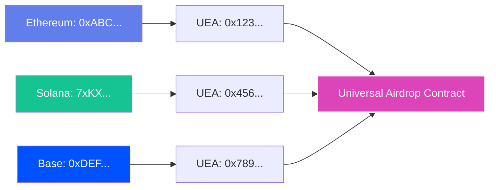

<head>
  <title>Build a Universal Airdrop | Tutorials | Push Chain Docs</title>
</head>

import Tabs from '@theme/Tabs';
import TabItem from '@theme/TabItem';
import Details from '@theme/Details';
import IFrameModal from '@site/src/components/IFrameModal/IFrameModal';
import TutorialTimer from '@site/src/components/TutorialTimer';
import { SolidityCode } from '@site/src/components/SolidityCode';
import { GitHubRepo } from '@site/src/components/GitHubRepo';

<!-- Content Start -->

<TutorialTimer estimatedMinutes={25} />

In this tutorial, you'll build a **Universal Claimable Airdrop** system on Push Chain. You deploy an airdrop contract **once** on Push Chain, and users from **any supported chain** can claim using their existing wallets.

By the end of this tutorial you'll be able to:

- ✅ Convert addresses from any chain to deterministic Push Chain addresses ([UEAs](/docs/chain/tutorials/power-features/tutorial-derive-universal-executor-account/))
- ✅ Generate Merkle trees for efficient airdrop verification
- ✅ Deploy a universal airdrop contract with OpenZeppelin's Merkle proof system
- ✅ Build a claim UI that works for users on any chain
- ✅ Understand how Universal Executor Accounts enable cross-chain claiming

## What Makes This Universal?

Traditional airdrops often require:

- Deploying contracts on multiple chains
- Managing separate token supplies per chain
- Forcing users to claim on a specific chain or do extra wallet ops

**Universal Airdrops on Push Chain:**

- **Deploy once** on Push Chain
- Users from **any chain** claim with their **existing wallet**
- **No bridging** or chain-switching required
- One contract, one token supply, reaching every chain
- No per chain deployments or per chain token supplies

### Example Flow

- Alice (Ethereum wallet `0xABC...`) → Claims directly from Ethereum
- Bob (Solana wallet `7xKX...`) → Claims directly from Solana
- Charlie (Base wallet `0xDEF...`) → Claims directly from Base

All three interact with the **same contract** on Push Chain through their [Universal Executor Accounts (UEAs)](/docs/chain/tutorials/power-features/tutorial-derive-universal-executor-account/).

> **🚀 Why this matters**
>
> This is the future of token distribution. Deploy once, reach everyone. No multi-chain complexity, no fragmented liquidity, just pure universal access.

## Understanding the Architecture

The Universal Airdrop system consists of four key components:

### 1. Address Conversion

For each recipient, we convert their origin address to a deterministic **[Universal Executor Account (UEA)](/docs/chain/tutorials/power-features/tutorial-derive-universal-executor-account/)** address on Push Chain:



### 2. Merkle Tree Generation

We create a Merkle tree where each leaf contains:

- UEA address (converted from origin address)
- Token amount

Note: the demo stores origin address and chain only in the UI for display. They are not part of the Merkle leaf.

### 3. Smart Contract Deployment

The airdrop contract:

- Stores the Merkle root
- Verifies proofs on-chain
- Prevents double claiming
- Distributes tokens to claimants

### 4. Claim Interface

Users connect with their origin wallet and claim tokens through their UEA.

## Write the Contracts

We'll need two contracts for this tutorial:

1. **ERC-20 Token Contract** - The token being airdropped ($UNICORN) - see [Mint Universal ERC-20 Tokens](/docs/chain/tutorials/basics/tutorial-mint-erc-20-tokens/) for basics
2. **Universal Airdrop Contract** - Handles Merkle proof verification and token distribution

> **Production note:** most real airdrops distribute an existing token. This tutorial deploys a fresh $UNICORN token to keep the demo self-contained. In production, deploy the airdrop against your existing token address and fund it with the distribution supply.

<br />

<Tabs className="liveplaytab" groupId="universal-airdrop-contracts">
  <TabItem value='erc20_token' label='ERC-20 Token ($UNICORN)'>

<SolidityCode
  title="Universal ERC-20 Token Contract"
  fileName="Token.sol"
  url="https://github.com/pushchain/push-chain-examples/blob/main/tutorials/universal-claimable-airdrop/contracts/src/Token.sol"
>

```solidity
// SPDX-License-Identifier: MIT
pragma solidity ^0.8.22;

import "@openzeppelin/contracts/token/ERC20/ERC20.sol";

contract Token is ERC20 {
    constructor(string memory name, string memory symbol) ERC20(name, symbol) {
        _mint(msg.sender, 1_000_000 * 10 ** decimals());
    }

    function mint(address to, uint256 amount) external {
        _mint(to, amount);
    }
}
```

</SolidityCode>

**Key Features:**

- Mints 1,000,000 tokens to the deployer
- Has an open `mint()` function for easy testing
- Uses OpenZeppelin's battle-tested ERC-20 implementation

:::warning Demo Only

Token.sol is a demo contract. Do not ship an open `mint()` in production. Gate minting (Ownable/AccessControl) or distribute from a fixed supply.

:::

</TabItem>

  <TabItem value='airdrop_factory' label='Airdrop Factory'>

<SolidityCode
  title="Universal Airdrop Factory Contract"
  fileName="UniversalAirdropFactory.sol"
  url="https://github.com/pushchain/push-chain-examples/blob/main/tutorials/universal-claimable-airdrop/contracts/src/UniversalAirdropFactory.sol"
>

```solidity
// SPDX-License-Identifier: MIT
pragma solidity ^0.8.22;

import "./UniversalAirdrop.sol";
import "./Token.sol";

contract UniversalAirdropFactory {
    event AirdropCreated(
        address indexed airdrop,
        address indexed owner,
        uint256 totalAmount,
        bytes32 merkleRoot
    );

    function createAirdrop(
        uint256 _totalAmount,
        bytes32 _merkleRoot
    ) external returns (address) {
        // Deploy new Token contract
        Token token = new Token("Unicorn Token", "UNICORN");

        // Mint tokens to this factory
        token.mint(address(this), _totalAmount);

        // Deploy new UniversalAirdrop contract
        UniversalAirdrop airdrop = new UniversalAirdrop(
            address(token),
            _merkleRoot,
            msg.sender
        );

        // Transfer tokens to airdrop contract
        require(
            token.transfer(address(airdrop), _totalAmount),
            "Token transfer failed"
        );

        emit AirdropCreated(
            address(airdrop),
            msg.sender,
            _totalAmount,
            _merkleRoot
        );

        return address(airdrop);
    }
}
```

</SolidityCode>

**Key Features:**

- Deploys both the token and airdrop contracts in one transaction
- Mints the required tokens automatically
- Transfers tokens to the airdrop contract
- Emits an event with the deployed addresses

</TabItem>

  <TabItem value='airdrop_contract' label='Universal Airdrop'>

<SolidityCode
  title="Universal Airdrop Contract"
  fileName="UniversalAirdrop.sol"
  url="https://github.com/pushchain/push-chain-examples/blob/main/tutorials/universal-claimable-airdrop/contracts/src/UniversalAirdrop.sol"
>

```solidity
// SPDX-License-Identifier: MIT
pragma solidity ^0.8.22;

import "@openzeppelin/contracts/token/ERC20/IERC20.sol";
import "@openzeppelin/contracts/utils/cryptography/MerkleProof.sol";
import "@openzeppelin/contracts/access/Ownable.sol";
import "@openzeppelin/contracts/utils/ReentrancyGuard.sol";

contract UniversalAirdrop is Ownable, ReentrancyGuard {
    IERC20 public immutable token;
    bytes32 public merkleRoot;

    mapping(address => bool) public hasClaimed;

    event Claimed(address indexed claimer, uint256 amount);
    event MerkleRootUpdated(bytes32 newRoot);

    constructor(
        address _token,
        bytes32 _merkleRoot,
        address _owner
    ) Ownable(_owner) {
        token = IERC20(_token);
        merkleRoot = _merkleRoot;
    }

    function claim(
        uint256 amount,
        bytes32[] calldata proof
    ) external nonReentrant {
        require(!hasClaimed[msg.sender], "Already claimed");

        bytes32 leaf = keccak256(
            bytes.concat(keccak256(abi.encode(msg.sender, amount)))
        );

        require(
            MerkleProof.verify(proof, merkleRoot, leaf),
            "Invalid proof"
        );

        hasClaimed[msg.sender] = true;

        require(
            token.transfer(msg.sender, amount),
            "Token transfer failed"
        );

        emit Claimed(msg.sender, amount);
    }

    function updateMerkleRoot(bytes32 newRoot) external onlyOwner {
        merkleRoot = newRoot;
        emit MerkleRootUpdated(newRoot);
    }

    function withdrawTokens(address to, uint256 amount) external onlyOwner {
        require(token.transfer(to, amount), "Transfer failed");
    }
}
```

</SolidityCode>

**Key Features:**

- Uses OpenZeppelin's `MerkleProof.verify()` for efficient proof verification
- Tracks claims with a mapping to prevent double-claiming
- Includes reentrancy protection
- Allows owner to update Merkle root for future rounds
- Provides emergency withdrawal function

</TabItem>
</Tabs>

## Understanding the Contracts

### Key Concepts

**1. Merkle Proof Verification**

The contract uses OpenZeppelin's standard Merkle proof implementation:

```solidity
bytes32 leaf = keccak256(
    bytes.concat(keccak256(abi.encode(msg.sender, amount)))
);

require(
    MerkleProof.verify(proof, merkleRoot, leaf),
    "Invalid proof"
);
```

**Important:** the leaf encoding used in the frontend and the leaf hash computed in the contract must match exactly. This tutorial uses OpenZeppelin `StandardMerkleTree` for proofs and OpenZeppelin `MerkleProof.verify()` in the contract so the hashing/ordering stays consistent.

**2. Universal Executor Accounts (UEAs)**

When a user from Ethereum, Solana, or any other chain interacts with this contract:

- Their wallet signs a transaction on their origin chain
- Push Chain creates/uses their deterministic UEA address
- The UEA executes the `claim()` function
- `msg.sender` in the contract is the UEA address

This means the Merkle tree must contain **UEA addresses**, not origin addresses.

**3. Address Conversion Process**

```typescript
// Convert origin address to UEA
const account = PushChain.utils.account.toUniversal(originAddress, {
  chain: originChain,
});

const executorAddress =
  await PushChain.utils.account.convertOriginToExecutor(account);
```

This deterministic conversion ensures:

- Same origin address always maps to same UEA
- Works across all supported chains
- No registration or setup required

## Live Playground

Now let's build a complete frontend that handles the entire airdrop flow. This example demonstrates all four steps: adding recipients, generating Merkle tree, deploying contracts, and claiming tokens.

The deployed contracts are available on Push Chain Testnet:

> **Factory Contract:** [0xf5059a5D33d5853360D16C683c16e67980206f36](https://donut.push.network/address/0xf5059a5D33d5853360D16C683c16e67980206f36?tab=contract)

**Steps to interact:**

1. **Step 1**: Add wallet addresses from different chains to your airdrop list
2. **Step 2**: Generate Merkle tree and get the root hash
3. **Step 3**: Deploy the airdrop contract with the Merkle root
4. **Step 4**: Connect with a claimer wallet and claim tokens

```jsx live
// customPropMinimized='true'
import { StandardMerkleTree } from "@openzeppelin/merkle-tree";
import {
  PushUniversalAccountButton,
  usePushChain,
  usePushChainClient,
  usePushWalletContext,
  PushUniversalWalletProvider,
  PushUI,
} from "@pushchain/ui-kit";
import { ethers } from "ethers";
import { useEffect, useState } from "react";

function UniversalAirdropTutorial() {
  const walletConfig = {
    network: PushUI.CONSTANTS.PUSH_NETWORK.TESTNET,
  };

  const UniversalAirdropABI = [
    {
      inputs: [
        { internalType: "uint256", name: "amount", type: "uint256" },
        { internalType: "bytes32[]", name: "proof", type: "bytes32[]" }
      ],
      name: "claim",
      outputs: [],
      stateMutability: "nonpayable",
      type: "function"
    },
    {
      inputs: [{ internalType: "address", name: "", type: "address" }],
      name: "hasClaimed",
      outputs: [{ internalType: "bool", name: "", type: "bool" }],
      stateMutability: "view",
      type: "function"
    }
  ];

  const factoryEventABI = [
    "event AirdropCreated(address indexed airdrop, address indexed owner, uint256 totalAmount, bytes32 merkleRoot)"
  ];

  function Component() {
    const { PushChain } = usePushChain();
    const { pushChainClient } = usePushChainClient();
    const { connectionStatus } = usePushWalletContext();

    const [currentStep, setCurrentStep] = useState(1);
    const [walletList, setWalletList] = useState([]);
    const [newWalletAddress, setNewWalletAddress] = useState("");
    const [selectedChain, setSelectedChain] = useState(PushChain.CONSTANTS.CHAIN.PUSH_TESTNET);
    const [airdropAmount, setAirdropAmount] = useState("100");
    const [convertedAddresses, setConvertedAddresses] = useState([]);
    const [merkleRoot, setMerkleRoot] = useState("");
    const [merkleTree, setMerkleTree] = useState(null);
    const [deployedAirdropAddress, setDeployedAirdropAddress] = useState("");
    const [isDeploying, setIsDeploying] = useState(false);
    const [isClaiming, setIsClaiming] = useState(false);
    const [claimerEligibility, setClaimerEligibility] = useState(null);
    const [error, setError] = useState("");

    const FACTORY_ADDRESS = "0xf5059a5D33d5853360D16C683c16e67980206f36";

    const chains = [
      { value: PushChain.CONSTANTS.CHAIN.PUSH_TESTNET, label: "Push Chain" },
      { value: PushChain.CONSTANTS.CHAIN.ETHEREUM_SEPOLIA, label: "Ethereum Sepolia" },
      { value: PushChain.CONSTANTS.CHAIN.SOLANA_DEVNET, label: "Solana Devnet" },
      { value: PushChain.CONSTANTS.CHAIN.BASE_SEPOLIA, label: "Base Sepolia" },
      { value: PushChain.CONSTANTS.CHAIN.ARBITRUM_SEPOLIA, label: "Arbitrum Sepolia" },
      { value: PushChain.CONSTANTS.CHAIN.BNB_TESTNET, label: "BNB Testnet" },
    ];

    const factoryInterface = new ethers.Interface(factoryEventABI);

    useEffect(() => {
      if (connectionStatus === "connected" && pushChainClient?.universal.account && currentStep === 1) {
        setWalletList((prevList) => {
          const isAlreadyAdded = prevList.some(
            (entry) => entry.address.toLowerCase() === pushChainClient.universal.origin.address.toLowerCase()
          );
          if (!isAlreadyAdded) {
            return [{
              address: pushChainClient.universal.origin.address,
              chain: pushChainClient.universal.origin.chain,
              amount: airdropAmount.toString(),
            }, ...prevList];
          }
          return prevList;
        });
      }
    }, [connectionStatus, pushChainClient, currentStep, airdropAmount]);

    const addWalletToList = () => {
      if (!newWalletAddress.trim()) {
        setError("Please enter a wallet address");
        return;
      }
      setWalletList([...walletList, {
        address: newWalletAddress.trim(),
        chain: selectedChain,
        amount: airdropAmount,
      }]);
      setNewWalletAddress("");
      setError("");
    };

    const removeWallet = (index) => {
      setWalletList(walletList.filter((_, i) => i !== index));
    };

    const convertToPushChainAddresses = async () => {
      if (walletList.length === 0) {
        setError("Please add at least one wallet to the list");
        return;
      }
      try {
        const addressPromises = walletList.map(async (entry) => {
          const account = PushChain.utils.account.toUniversal(entry.address, {
            chain: entry.chain
          });
          const executorAddress = await PushChain.utils.account.convertOriginToExecutor(account);
          return [
            executorAddress.address,
            ethers.parseUnits(entry.amount, 18).toString(),
            entry.address,
            entry.chain
          ];
        });
        const addresses = await Promise.all(addressPromises);
        setConvertedAddresses(addresses);
        setError("");
        setCurrentStep(2);
      } catch (err) {
        console.error("Error generating deterministic addresses:", err);
        setError("Failed to generate deterministic addresses on Push Chain");
      }
    };

    const generateMerkleTree = () => {
      if (convertedAddresses.length === 0) {
        setError("No converted addresses available");
        return;
      }
      if (!StandardMerkleTree) {
        setError("Merkle tree library is still loading. Please wait a moment and try again.");
        return;
      }
      try {
        const values = convertedAddresses.map(([address, amount]) => [address, amount]);
        const tree = StandardMerkleTree.of(values, ["address", "uint256"]);
        const root = tree.root;
        setMerkleRoot(root);
        setMerkleTree({ tree, root });
        setError("");
        setCurrentStep(3);
      } catch (err) {
        console.error("Error generating merkle tree:", err);
        setError("Failed to generate merkle tree");
      }
    };

    const deployAirdrop = async () => {
      if (!pushChainClient || !merkleRoot) {
        setError("Wallet not connected or Merkle root not generated");
        return;
      }
      setIsDeploying(true);
      setError("");
      try {
        const totalAmount = convertedAddresses.reduce(
          (sum, [, amount]) => sum + BigInt(amount),
          BigInt(0)
        );
        const factoryABI = [{
          inputs: [
            { internalType: "uint256", name: "_totalAmount", type: "uint256" },
            { internalType: "bytes32", name: "_merkleRoot", type: "bytes32" }
          ],
          name: "createAirdrop",
          outputs: [{ internalType: "address", name: "", type: "address" }],
          stateMutability: "nonpayable",
          type: "function"
        }];
        const txData = PushChain.utils.helpers.encodeTxData({
          abi: factoryABI,
          functionName: "createAirdrop",
          args: [totalAmount, merkleRoot]
        });
        const tx = await pushChainClient.universal.sendTransaction({
          to: FACTORY_ADDRESS,
          data: txData,
          value: BigInt(0),
        });
        const receipt = await tx.wait();
        if (!receipt.logs || receipt.logs.length === 0) {
          setError("No logs found in transaction receipt");
          setIsDeploying(false);
          return;
        }

        const factoryLog = receipt.logs.find(
          (log) => log.address.toLowerCase() === FACTORY_ADDRESS.toLowerCase()
        );

        if (!factoryLog) {
          setError("Airdrop creation event not found");
          setIsDeploying(false);
          return;
        }

        let parsed;
        try {
          parsed = factoryInterface.parseLog(factoryLog);
        } catch (e) {
          setError("Failed to decode AirdropCreated event");
          setIsDeploying(false);
          return;
        }

        const airdropAddress = parsed.args.airdrop;
        setDeployedAirdropAddress(airdropAddress);
        setCurrentStep(4);
        setIsDeploying(false);
      } catch (err) {
        console.error("Error deploying airdrop:", err);
        setError("Failed to deploy airdrop contract");
        setIsDeploying(false);
      }
    };

    useEffect(() => {
      const checkClaimerEligibility = async () => {
        if (connectionStatus === "connected" && pushChainClient?.universal.account && deployedAirdropAddress) {
          const claimerAddress = pushChainClient.universal.account;
          const entry = convertedAddresses.find(
            ([addr]) => addr.toLowerCase() === claimerAddress.toLowerCase()
          );
          if (entry) {
            const [executorAddr, amount] = entry;
            let hasClaimed = false;
            try {
              const provider = new ethers.JsonRpcProvider("https://evm.donut.rpc.push.org/");
              const contract = new ethers.Contract(deployedAirdropAddress, UniversalAirdropABI, provider);
              hasClaimed = await contract.hasClaimed(claimerAddress);
            } catch (err) {
              console.error("Error checking claim status:", err);
            }
            setClaimerEligibility({
              isEligible: true,
              hasClaimed: hasClaimed,
              amount: amount,
              executorAddress: executorAddr,
            });
          } else {
            setClaimerEligibility({
              isEligible: false,
              hasClaimed: false,
              amount: "0",
              executorAddress: "",
            });
          }
        } else {
          setClaimerEligibility(null);
        }
      };
      checkClaimerEligibility();
    }, [connectionStatus, pushChainClient, deployedAirdropAddress, convertedAddresses]);

    const claimAirdrop = async () => {
      if (!pushChainClient || !deployedAirdropAddress) {
        setError("Wallet not connected or no deployed airdrop contract");
        return;
      }
      setIsClaiming(true);
      setError("");
      try {
        const claimAddr = pushChainClient.universal.account;
        const entry = convertedAddresses.find(
          ([addr]) => addr.toLowerCase() === claimAddr.toLowerCase()
        );
        if (!entry) {
          setError("Address not found in airdrop list");
          setIsClaiming(false);
          return;
        }
        const [, amount] = entry;
        const provider = new ethers.JsonRpcProvider("https://evm.donut.rpc.push.org/");
        const contract = new ethers.Contract(deployedAirdropAddress, UniversalAirdropABI, provider);
        const hasClaimed = await contract.hasClaimed(claimAddr);
        if (hasClaimed) {
          setError("This address has already claimed the airdrop");
          setIsClaiming(false);
          setClaimerEligibility({ ...claimerEligibility, hasClaimed: true });
          return;
        }
        if (!merkleTree) {
          setError("Merkle tree not generated");
          setIsClaiming(false);
          return;
        }
        let proof = [];
        for (const [i, v] of merkleTree.tree.entries()) {
          if (v[0].toLowerCase() === claimAddr.toLowerCase()) {
            proof = merkleTree.tree.getProof(i);
            break;
          }
        }
        const txData = PushChain.utils.helpers.encodeTxData({
          abi: UniversalAirdropABI,
          functionName: "claim",
          args: [amount, proof]
        });
        const tx = await pushChainClient.universal.sendTransaction({
          to: deployedAirdropAddress,
          data: txData,
          value: BigInt(0),
        });
        await tx.wait();
        alert(`Successfully claimed ${ethers.formatEther(amount)} $UNICORN tokens!`);
        setIsClaiming(false);
        setClaimerEligibility({ ...claimerEligibility, hasClaimed: true });
      } catch (err) {
        console.error("Error claiming airdrop:", err);
        setError("Failed to claim airdrop");
        setIsClaiming(false);
      }
    };

    return (
      <div style={{ maxWidth: "800px", margin: "0 auto", padding: "20px", fontFamily: "system-ui" }}>
        <h1 style={{ textAlign: "center", marginBottom: "10px" }}>Universal Claimable Airdrop</h1>
        <p style={{ textAlign: "center", color: "#666", marginBottom: "30px" }}>
          Deploy once on Push Chain. Users from any chain can claim with their existing wallet.
        </p>

        <div style={{ marginBottom: "30px", display: "flex", justifyContent: "center" }}>
          <PushUniversalAccountButton />
        </div>

        {connectionStatus !== "connected" && (
          <p style={{ textAlign: "center", color: "#666" }}>
            Please connect your wallet to start the airdrop setup.
          </p>
        )}

        <div style={{ display: "flex", gap: "8px", marginBottom: "30px", justifyContent: "center" }}>
          {[1, 2, 3, 4].map((step) => {
            const locked =
              (step === 2 && convertedAddresses.length === 0) ||
              (step === 3 && !merkleRoot) ||
              (step === 4 && !deployedAirdropAddress);

            return (
              <button
                key={step}
                onClick={() => !locked && setCurrentStep(step)}
                disabled={locked}
                style={{
                  padding: "8px 16px",
                  backgroundColor: currentStep === step ? "#d946ef" : "#e0e0e0",
                  color: currentStep === step ? "white" : "#666",
                  cursor: locked ? "not-allowed" : "pointer",
                  opacity: locked ? 0.5 : 1,
                  border: "none",
                  borderRadius: "6px",
                  fontWeight: "bold",
                }}
              >
                Step {step}
              </button>
            );
          })}
        </div>

        {connectionStatus === "connected" && currentStep === 1 && (
          <div style={{ border: "1px solid #ddd", borderRadius: "12px", padding: "20px", marginBottom: "20px" }}>
            <h2 style={{ marginTop: 0 }}>Step 1: Add Claimable Wallets</h2>
            <p style={{ color: "#666", fontSize: "14px" }}>
              Add wallet addresses from different chains to create your airdrop list.
            </p>

            <div style={{ marginBottom: "16px" }}>
              <label style={{ display: "block", marginBottom: "8px", fontWeight: "bold" }}>Chain</label>
              <select
                value={selectedChain}
                onChange={(e) => setSelectedChain(e.target.value)}
                style={{ width: "100%", padding: "10px", borderRadius: "6px", border: "1px solid #ddd" }}
              >
                {chains.map((chain) => (
                  <option key={chain.value} value={chain.value}>{chain.label}</option>
                ))}
              </select>
            </div>

            <div style={{ marginBottom: "16px" }}>
              <label style={{ display: "block", marginBottom: "8px", fontWeight: "bold" }}>Wallet Address</label>
              <input
                type="text"
                value={newWalletAddress}
                onChange={(e) => setNewWalletAddress(e.target.value)}
                placeholder="0x..."
                style={{ width: "100%", padding: "10px", borderRadius: "6px", border: "1px solid #ddd" }}
              />
            </div>

            <div style={{ marginBottom: "16px" }}>
              <label style={{ display: "block", marginBottom: "8px", fontWeight: "bold" }}>Amount ($UNICORN)</label>
              <input
                type="number"
                value={airdropAmount}
                onChange={(e) => setAirdropAmount(e.target.value)}
                placeholder="100"
                style={{ width: "100%", padding: "10px", borderRadius: "6px", border: "1px solid #ddd" }}
              />
            </div>

            <button
              onClick={addWalletToList}
              style={{
                width: "100%",
                padding: "12px",
                backgroundColor: "#2196F3",
                color: "white",
                border: "none",
                borderRadius: "8px",
                cursor: "pointer",
                fontWeight: "bold",
                marginBottom: "20px",
              }}
            >
              Add to List
            </button>

            {walletList.length > 0 && (
              <div>
                <h3 style={{ fontSize: "16px", marginBottom: "12px" }}>Wallet List ({walletList.length})</h3>
                <div style={{ maxHeight: "300px", overflowY: "auto" }}>
                  {walletList.map((wallet, index) => (
                    <div
                      key={index}
                      style={{
                        display: "flex",
                        justifyContent: "space-between",
                        alignItems: "center",
                        padding: "12px",
                        marginBottom: "8px",
                        backgroundColor: "#f5f5f5",
                        borderRadius: "6px",
                        fontSize: "14px",
                      }}
                    >
                      <div style={{ flex: 1 }}>
                        <div style={{ fontWeight: "bold", color: "#d946ef" }}>
                          {PushChain.utils.chains.getChainName(wallet.chain)}
                        </div>
                        <div style={{ color: "#666", fontSize: "12px", wordBreak: "break-all" }}>
                          {wallet.address}
                        </div>
                        <div style={{ color: "#333", marginTop: "4px" }}>
                          Amount: {wallet.amount} tokens
                        </div>
                      </div>
                      <button
                        onClick={() => removeWallet(index)}
                        style={{
                          padding: "8px 12px",
                          backgroundColor: "#dc3545",
                          color: "white",
                          border: "none",
                          borderRadius: "6px",
                          cursor: "pointer",
                        }}
                      >
                        Remove
                      </button>
                    </div>
                  ))}
                </div>
                <button
                  onClick={convertToPushChainAddresses}
                  disabled={walletList.length === 0}
                  style={{
                    width: "100%",
                    padding: "12px",
                    marginTop: "16px",
                    fontSize: "16px",
                    fontWeight: "bold",
                    backgroundColor: walletList.length === 0 ? "#ccc" : "#d946ef",
                    color: "white",
                    border: "none",
                    borderRadius: "8px",
                    cursor: walletList.length === 0 ? "not-allowed" : "pointer",
                  }}
                >
                  Convert to Push Chain Addresses
                </button>
              </div>
            )}

            {error && (
              <div style={{ marginTop: "16px", padding: "12px", backgroundColor: "#fee", color: "#c62828", borderRadius: "6px" }}>
                {error}
              </div>
            )}
          </div>
        )}

        {connectionStatus === "connected" && currentStep === 2 && (
          <div style={{ border: "1px solid #ddd", borderRadius: "12px", padding: "20px", marginBottom: "20px" }}>
            <h2 style={{ marginTop: 0 }}>Step 2: Generate Merkle Tree</h2>
            <p style={{ color: "#666", fontSize: "14px" }}>
              Review the converted addresses and generate the Merkle Tree for the airdrop.
            </p>

            <div style={{ marginBottom: "20px", backgroundColor: "#f9f9f9", borderRadius: "8px", padding: "16px" }}>
              <h3 style={{ fontSize: "16px", marginBottom: "12px" }}>
                Converted Addresses ({convertedAddresses.length})
              </h3>
              <div style={{ maxHeight: "400px", overflowY: "auto", backgroundColor: "white", borderRadius: "6px", padding: "12px" }}>
                <pre style={{ fontSize: "12px", margin: 0, whiteSpace: "pre-wrap", wordBreak: "break-all" }}>
                  {convertedAddresses.map(([executorAddr, amount, originalAddr, chain], index) => {
                    const chainLabel = chains.find(c => c.value === chain)?.label || chain;
                    return `// Original: ${originalAddr} (${chainLabel})\n[\n  "${executorAddr}",\n  "${amount}"\n]${index < convertedAddresses.length - 1 ? ',' : ''}\n\n`;
                  }).join('')}
                </pre>
              </div>
            </div>

            <button
              onClick={generateMerkleTree}
              disabled={convertedAddresses.length === 0}
              style={{
                width: "100%",
                padding: "12px",
                fontSize: "16px",
                fontWeight: "bold",
                backgroundColor: convertedAddresses.length === 0 ? "#ccc" : "#d946ef",
                color: "white",
                border: "none",
                borderRadius: "8px",
                cursor: convertedAddresses.length === 0 ? "not-allowed" : "pointer",
              }}
            >
              Generate Merkle Tree and Proofs
            </button>

            {merkleRoot && (
              <div style={{ marginTop: "16px", padding: "12px", backgroundColor: "#e8f5e9", borderRadius: "6px" }}>
                <p style={{ fontWeight: "bold", color: "#2e7d32", marginBottom: "8px" }}>
                  Merkle Root Generated!
                </p>
                <code style={{ fontSize: "12px", wordBreak: "break-all", color: "#333" }}>
                  {merkleRoot}
                </code>
              </div>
            )}
          </div>
        )}

        {connectionStatus === "connected" && currentStep === 3 && (
          <div style={{ border: "1px solid #ddd", borderRadius: "12px", padding: "20px", marginBottom: "20px" }}>
            <h2 style={{ marginTop: 0 }}>Step 3: Deploy Airdrop Contract</h2>
            <p style={{ color: "#666", fontSize: "14px" }}>
              Deploy the airdrop contract with the Merkle root. The factory will mint $UNICORN tokens automatically.
            </p>

            <div style={{ marginBottom: "20px", backgroundColor: "#f0f7ff", borderRadius: "8px", padding: "16px", border: "1px solid #d0e7ff" }}>
              <h3 style={{ fontSize: "14px", marginBottom: "12px", color: "#0066cc", fontWeight: "bold" }}>
                🔑 Key Concept
              </h3>
              <p style={{ fontSize: "14px", color: "#333", lineHeight: "1.6", margin: 0 }}>
                Users from any chain will interact through their <b>Universal Executor Account (UEA)</b> - the deterministic addresses we generated in Step 1.
              </p>
            </div>

            <div style={{ marginBottom: "20px", backgroundColor: "#f9f9f9", borderRadius: "8px", padding: "16px" }}>
              <h3 style={{ fontSize: "16px", marginBottom: "12px" }}>Deployment Summary</h3>
              <div style={{ backgroundColor: "white", borderRadius: "6px", padding: "12px" }}>
                <div style={{ marginBottom: "8px" }}>
                  <span style={{ fontWeight: "bold", color: "#666" }}>Token:</span> $UNICORN (ERC-20)
                </div>
                <div style={{ marginBottom: "8px" }}>
                  <span style={{ fontWeight: "bold", color: "#666" }}>Total Amount:</span>{" "}
                  {ethers.formatEther(convertedAddresses.reduce((sum, [, amount]) => sum + BigInt(amount), BigInt(0)))} $UNICORN
                </div>
                <div style={{ marginBottom: "8px" }}>
                  <span style={{ fontWeight: "bold", color: "#666" }}>Recipients:</span> {convertedAddresses.length} addresses
                </div>
                <div>
                  <span style={{ fontWeight: "bold", color: "#666" }}>Merkle Root:</span>
                  <div style={{ marginTop: "4px", padding: "8px", backgroundColor: "#f0f0f0", borderRadius: "4px", wordBreak: "break-all", fontSize: "12px", fontFamily: "monospace" }}>
                    {merkleRoot}
                  </div>
                </div>
              </div>
            </div>

            <button
              onClick={deployAirdrop}
              disabled={isDeploying}
              style={{
                width: "100%",
                padding: "12px",
                fontSize: "16px",
                fontWeight: "bold",
                backgroundColor: isDeploying ? "#999" : "#d946ef",
                color: "white",
                border: "none",
                borderRadius: "8px",
                cursor: isDeploying ? "not-allowed" : "pointer",
              }}
            >
              {isDeploying ? "Deploying..." : "Deploy Airdrop Contract"}
            </button>
          </div>
        )}

        {connectionStatus === "connected" && currentStep === 4 && (
          <div style={{ border: "1px solid #ddd", borderRadius: "12px", padding: "20px", marginBottom: "20px" }}>
            <h2 style={{ marginTop: 0 }}>Step 4: Claim Airdrop</h2>
            <p style={{ color: "#666", fontSize: "14px" }}>
              Your airdrop contract has been deployed! Users can now claim their $UNICORN tokens.
            </p>

            <div style={{ marginBottom: "20px", backgroundColor: "#f0f7ff", borderRadius: "8px", padding: "16px", border: "1px solid #d0e7ff" }}>
              <h3 style={{ fontSize: "14px", marginBottom: "8px", color: "#0066cc", fontWeight: "bold" }}>
                🎉 Deployment Successful!
              </h3>
              <div style={{ marginBottom: "8px" }}>
                <label style={{ display: "block", fontWeight: "bold", color: "#666", marginBottom: "4px" }}>
                  Contract Address:
                </label>
                <input
                  type="text"
                  value={deployedAirdropAddress}
                  readOnly
                  style={{ width: "100%", padding: "8px", backgroundColor: "white", border: "1px solid #ddd", borderRadius: "4px", fontSize: "12px", fontFamily: "monospace" }}
                />
              </div>
            </div>

            <div style={{ marginBottom: "20px", backgroundColor: "#fff3e0", borderRadius: "8px", padding: "16px", border: "1px solid #ffe0b2" }}>
              <h3 style={{ fontSize: "16px", marginBottom: "12px", color: "#e65100", fontWeight: "bold" }}>
                Test Claim
              </h3>
              <p style={{ fontSize: "14px", color: "#666", marginBottom: "12px" }}>
                Use your connected wallet to claim tokens from the airdrop.
              </p>

              {connectionStatus === "connected" && claimerEligibility && (
                <div style={{ marginTop: "12px", padding: "12px", backgroundColor: claimerEligibility.isEligible ? "#e8f5e9" : "#ffebee", borderRadius: "6px", border: `1px solid ${claimerEligibility.isEligible ? "#4caf50" : "#f44336"}` }}>
                  <p style={{ margin: 0, fontSize: "14px", fontWeight: "bold", color: "#333" }}>
                    {claimerEligibility.isEligible ? "✅ Eligible for Airdrop!" : "❌ Not Eligible"}
                  </p>
                  {claimerEligibility.isEligible && (
                    <>
                      <p style={{ margin: "8px 0 0 0", fontSize: "14px", color: "#666" }}>
                        Amount: {ethers.formatEther(claimerEligibility.amount)} $UNICORN
                      </p>
                      {claimerEligibility.hasClaimed ? (
                        <p style={{ margin: "8px 0 0 0", fontSize: "14px", color: "#666" }}>
                          Status: Already Claimed ✓
                        </p>
                      ) : (
                        <button
                          onClick={claimAirdrop}
                          disabled={isClaiming}
                          style={{
                            marginTop: "12px",
                            width: "100%",
                            padding: "12px",
                            fontSize: "16px",
                            fontWeight: "bold",
                            backgroundColor: isClaiming ? "#999" : "#d946ef",
                            color: "white",
                            border: "none",
                            borderRadius: "8px",
                            cursor: isClaiming ? "not-allowed" : "pointer",
                          }}
                        >
                          {isClaiming ? "Claiming..." : "Claim Airdrop"}
                        </button>
                      )}
                    </>
                  )}
                </div>
              )}
            </div>
          </div>
        )}
      </div>
    );
  }

  return (
    <PushUniversalWalletProvider config={walletConfig}>
      <Component />
    </PushUniversalWalletProvider>
  );
}
```

## Understanding the Code

### Step 1: Address Conversion

```typescript
const account = PushChain.utils.account.toUniversal(entry.address, {
  chain: entry.chain,
});

const executorAddress =
  await PushChain.utils.account.convertOriginToExecutor(account);
```

This converts each origin address to its deterministic UEA address on Push Chain. The same origin address will always produce the same UEA address.

### Step 2: Merkle Tree Generation

```typescript
const values = convertedAddresses.map(([address, amount]) => [address, amount]);
const tree = StandardMerkleTree.of(values, ['address', 'uint256']);
const root = tree.root;
```

We use OpenZeppelin's `StandardMerkleTree` which implements the same double-hashing pattern as the contract's `MerkleProof.verify()`.

### Step 3: Contract Deployment

```typescript
const txData = PushChain.utils.helpers.encodeTxData({
  abi: factoryABI,
  functionName: 'createAirdrop',
  args: [totalAmount, merkleRoot],
});

const tx = await pushChainClient.universal.sendTransaction({
  to: FACTORY_ADDRESS,
  data: txData,
  value: BigInt(0),
});
```

The factory deploys both the token and airdrop contracts, mints tokens, and transfers them to the airdrop contract.

### Step 4: Claiming Tokens

```typescript
// Generate proof for the claimer
let proof = [];
for (const [i, v] of merkleTree.tree.entries()) {
  if (v[0].toLowerCase() === claimAddr.toLowerCase()) {
    proof = merkleTree.tree.getProof(i);
    break;
  }
}

// Encode and send claim transaction
const txData = PushChain.utils.helpers.encodeTxData({
  abi: UniversalAirdropABI,
  functionName: 'claim',
  args: [amount, proof],
});

const tx = await pushChainClient.universal.sendTransaction({
  to: deployedAirdropAddress,
  data: txData,
  value: BigInt(0),
});
```

The claimer's UEA executes the `claim()` function with their proof, and the contract verifies and distributes tokens.

## Source Code

<GitHubRepo
  title='Universal Airdrop Tutorial'
  repoUrl='https://github.com/pushchain/push-chain-examples/tree/main/tutorials/universal-claimable-airdrop'
  description='Full source code for the Universal Airdrop smart contracts and example frontend.'
/>

## What We Achieved

In this tutorial, we built a complete universal airdrop system:

- **Converted addresses** from multiple chains to deterministic UEA addresses
- **Generated Merkle trees** for efficient on-chain verification
- **Deployed contracts** that mint and distribute tokens automatically
- **Built a claim UI** that works seamlessly across all chains

## Key Takeaways

**1. One Deployment, Infinite Reach**

- Deploy your airdrop contract once on Push Chain
- Users from any chain can claim with their existing wallet
- No multi-chain deployment complexity

**2. Universal Executor Accounts**

- Every address on every chain has a deterministic UEA on Push Chain
- UEAs enable cross-chain interactions without bridges
- Same origin address always maps to the same UEA

**3. Standard Merkle Proofs**

- Uses OpenZeppelin's battle-tested implementation
- No custom cryptography or modifications needed
- Efficient on-chain verification

**4. Seamless User Experience**

- Users never leave their preferred chain
- No token bridging or chain-switching required
- One click to claim from any wallet

## What's Next?

Now that you've built a universal airdrop system, you can extend this pattern to create more advanced token distribution mechanisms.

**Understanding the Foundation:**

- Every claim was executed through a [Universal Executor Account (UEA)](/docs/chain/tutorials/power-features/tutorial-derive-universal-executor-account/)
- The same UEA derivation enables all universal interactions on Push Chain
- Merkle proofs provide efficient verification for large-scale distributions

**Advanced Patterns to Explore:**

- **Multi-round airdrops** with updatable Merkle roots
- **Vesting schedules** with time-locked claims
- **Conditional claims** based on on-chain activity
- **Cross-chain governance** token distribution
- **Staking rewards** distributed to any chain

The possibilities are endless when you build universal!
