<head>
  <title>Inbound to Push Chain | Contract-Initiated Examples | Build | Push Chain Docs</title>
</head>

import { SolidityCode } from '@site/src/components/SolidityCode';
import { GitHubRepo } from '@site/src/components/GitHubRepo';

{/* Content Start */}

A pair of contracts that demonstrate the inbound direction: a contract on Sepolia (or any supported external chain) calls the per-chain Universal Gateway, and the TSS network relays the call to a contract on Push Chain. The Push contract sees the dispatching contract's UEA as **msg.sender**.

For the conceptual background (UEAs, the Universal Gateway, the wire format), see [Contract-Initiated Multichain Execution](/docs/chain/build/contract-initiated-multichain-execution).

## What this example shows

| Aspect | Details |
|---|---|
| **Direction** | External chain (Sepolia) to Push Chain. One-way. |
| **Trigger** | A regular EOA on Sepolia calls `triggerOnPush(...)` on the Sepolia dispatcher, paying the gateway fee in ETH. |
| **Identity on Push** | `msg.sender` on the Push target equals `UEA(SepoliaDispatcher)`. Use `IUEAFactory.getOriginForUEA` to recover the origin chain and the contract's Sepolia address. |
| **Funds movement** | None. The example dispatches a payload only. The same surface supports bridging native ETH (`token = 0`, `amount > 0`); see the [Advanced Patterns](/docs/chain/build/contract-initiated-examples/advanced-patterns) for funds variants. |
| **Verified on** | Sepolia + Donut Testnet. |

## Identity model

When an external-chain contract calls the per-chain Universal Gateway, the TSS validators relay the call to Push Chain and execute it from the contract's UEA on Push. 

The UEA is always deterministic, derived from `(chainNamespace, chainId, contractAddress)`. From the Push target's perspective the UEA is a normal address.

```mermaid
flowchart LR
    EOA([Sepolia EOA])
    EXT[<b>Sepolia Contract</b><br/>EthereumInboundDispatcher]
    UG[<b>UniversalGateway</b><br/>Sepolia]
    UEA[<b>Caller's UEA</b><br/>Push Chain]
    PC[<b>PushCounter</b><br/>Push Chain]

    EOA -->|"triggerOnPush()"| EXT
    EXT -->|"sendUniversalTx{value}()"| UG
    UG -->|"TSS relay"| UEA
    UEA -->|"increment()"| PC

    style EXT fill:#1e3a8a,stroke:#60a5fa,color:#fff
    style UG fill:#1e3a8a,stroke:#60a5fa,color:#fff
    style UEA fill:#b45309,stroke:#fbbf24,stroke-width:2px,color:#fff
    style PC fill:#dd44b9,stroke:#fff,stroke-width:2px,color:#fff
```


<br />
<br />
The Sepolia contract's UEA on Push is computable off-chain via [deriveExecutorAccount](/docs/chain/build/utility-functions/#derive-executor-account), so a Push-side target can pre-authorize that UEA before the first cross-chain call.

## Solidity Code (Sepolia side)

<SolidityCode
  title="Sepolia-side Inbound Dispatcher"
  fileName="EthereumInboundDispatcher.sol"
  url="https://github.com/pushchain/push-chain-examples/blob/main/core-sdk-functions/contract-initiated-inbound-execution/src/EthereumInboundDispatcher.sol"
>

```solidity
// SPDX-License-Identifier: MIT
pragma solidity ^0.8.26;

struct Multicall {
    address to;
    uint256 value;
    bytes data;
}

struct UniversalPayload {
    address to;
    uint256 value;
    bytes data;
    uint256 gasLimit;
    uint256 maxFeePerGas;
    uint256 maxPriorityFeePerGas;
    uint256 nonce;
    uint256 deadline;
    uint8 vType;
}

struct UniversalTxRequest {
    address recipient;
    address token;
    uint256 amount;
    bytes payload;
    address revertRecipient;
    bytes signatureData;
}

interface IUniversalGateway {
    function sendUniversalTx(UniversalTxRequest calldata req) external payable;
}

contract EthereumInboundDispatcher {
    /// @notice Per-chain UniversalGateway (Sepolia, BNB Testnet, etc.). Set via constructor.
    address public immutable gateway;

    /// @notice 4-byte marker the destination UEA looks for to decode multicall.
    bytes4 internal constant UEA_MULTICALL_SELECTOR = 0x2cc2842d;

    event InboundDispatched(address indexed pushTarget, bytes pushCalldata, uint256 nonce, uint256 fee);

    error ZeroAddress();

    constructor(address _gateway) {
        if (_gateway == address(0)) revert ZeroAddress();
        gateway = _gateway;
    }

    /// @notice Trigger an action on Push Chain. The contract's UEA on Push
    /// (deterministically derived from this contract's address) becomes the
    /// `msg.sender` that calls `pushTarget` with `pushCalldata`.
    function triggerOnPush(
        address pushTarget,
        bytes calldata pushCalldata,
        uint256 nonce,
        address revertRecipient
    ) external payable {
        if (pushTarget == address(0) || revertRecipient == address(0)) revert ZeroAddress();

        // 1) Wrap (target, calldata) into the UEA's multicall format.
        Multicall[] memory calls = new Multicall[](1);
        calls[0] = Multicall({to: pushTarget, value: 0, data: pushCalldata});
        bytes memory multicallData = abi.encodePacked(UEA_MULTICALL_SELECTOR, abi.encode(calls));

        // 2) Wrap the multicall in the UniversalPayload struct the UEA expects.
        //    Because `data` is multicall-wrapped (starts with UEA_MULTICALL_SELECTOR),
        //    the UEA branches into _handleMulticall and IGNORES `to`. Conventionally
        //    set to address(0). If you instead pass raw single-call calldata (no
        //    selector prefix), the UEA does `to.call(data)` and `to` MUST be the
        //    real target.
        bytes memory universalPayload = abi.encode(
            address(0),         // to: ignored when data is multicall-wrapped (this example)
            uint256(0),         // value
            multicallData,      // data
            uint256(1e7),       // gasLimit (matches SDK default)
            uint256(1e10),      // maxFeePerGas (10 gwei)
            uint256(0),         // maxPriorityFeePerGas
            nonce,              // nonce: UEA nonce on Push
            uint256(9999999999),// deadline
            uint8(0)            // vType = universalTxVerification
        );

        // 3) Build the gateway request and dispatch. recipient is always zero
        //    on the gateway request; the real Push-side target is inside payload.
        UniversalTxRequest memory req = UniversalTxRequest({
            recipient: address(0),
            token: address(0),
            amount: 0,
            payload: universalPayload,
            revertRecipient: revertRecipient,
            signatureData: ""
        });

        IUniversalGateway(gateway).sendUniversalTx{value: msg.value}(req);

        emit InboundDispatched(pushTarget, pushCalldata, nonce, msg.value);
    }

    receive() external payable {}
}
```

</SolidityCode>

The wire format is rigid. The Universal Gateway expects a specific encoding (UniversalPayload with `vType = 0`, multicall data prefixed with the `0x2cc2842d` sentinel, gateway request `recipient` always zero). Deviations cause TSS to silently drop the relay.

## Solidity Code (Push side)

<SolidityCode
  title="Push-Side Counter Target"
  fileName="PushCounter.sol"
  url="https://github.com/pushchain/push-chain-examples/blob/main/core-sdk-functions/contract-initiated-inbound-execution/src/PushCounter.sol"
>

```solidity
// SPDX-License-Identifier: MIT
pragma solidity ^0.8.26;

contract PushCounter {
    uint256 public count;
    address public lastCaller;

    event Incremented(address indexed caller, uint256 newCount);

    function increment() external {
        count += 1;
        lastCaller = msg.sender;
        emit Incremented(msg.sender, count);
    }
}
```

</SolidityCode>

The Push-side counter is intentionally trivial. After the inbound lands, `lastCaller` will be the Sepolia dispatcher's UEA address, not the Sepolia EOA that started the chain.

:::info Replay protection is handled by the UEA, not by your target
The Sepolia caller's UEA on Push is a smart account with its own internal nonce. The UEA increments that nonce before forwarding the call to your target, so the same `(payload, nonce)` cannot be relayed twice. **Your target contract does NOT need to validate the caller or guard against replay.** It can be a plain Solidity function like the counter above.

The `executeUniversalTx` + `txId` + `UNIVERSAL_EXECUTOR_MODULE` pattern you may have seen elsewhere is for a **different** path: the round-trip back-leg, where TSS delivers an inbound from your own contract's CEA back to your Push contract's `executeUniversalTx` callback. That handler is the one that needs guards. See [Round-Trip with Auto Back-Leg](/docs/chain/build/contract-initiated-examples/round-trip-auto-back-leg).
:::

## Source Code

<GitHubRepo
  title="Contract-Initiated Inbound Execution"
  repoUrl="https://github.com/pushchain/push-chain-examples/tree/main/core-sdk-functions/contract-initiated-inbound-execution"
  description="A Sepolia dispatcher contract and a Push-side counter target, plus a runner that deploys both, encodes increment() calldata, calls triggerOnPush() on Sepolia, and watches the Push counter advance."
/>

### Run

The runner deploys both contracts (Sepolia dispatcher + Push counter), encodes `increment()` calldata, calls `triggerOnPush()` on Sepolia, and watches the Push counter advance.

```bash
git clone https://github.com/pushchain/push-chain-examples.git
cd push-chain-examples/core-sdk-functions/contract-initiated-inbound-execution

forge build
npm install
cp .env.sample .env
# Edit .env: set ETH_PRIVATE_KEY (funded Sepolia EOA) and PUSH_PRIVATE_KEY
# (a Push native wallet for the destination counter deploy).
npm start
```

### Prerequisites

- Foundry and Node.js v18+.
- A Sepolia EOA with at least 0.05 ETH (deploy + gateway fee + headroom). [Sepolia faucet](https://www.alchemy.com/faucets/ethereum-sepolia).
- A Push native wallet with at least 1 PC for the Push-side counter deploy. [Push faucet](https://faucet.push.org).

## What can go wrong

| Symptom | Cause | Fix |
|---|---|---|
| Sepolia tx reverts at the gateway | Wire format mismatch (missing `UEA_MULTICALL_SELECTOR` prefix, wrong `vType`, non-zero `recipient` on the gateway request) | Use the encoder in this example as a template. Do not improvise the encoding. |
| Sepolia tx succeeds but Push counter never advances | `msg.value` was below the gateway's relay fee | Pass enough ETH as `msg.value`. The runner uses 0.001 ETH by default; bump if the relay does not pick up. |
| `lastCaller` on Push is the Sepolia EOA, not the contract's UEA | The user called Push directly, bypassing the Sepolia dispatcher | This is expected when you skip the gateway path. To get a UEA-based identity, call from a contract that goes through the gateway. |

## Related

- [Contract-Initiated Multichain Execution](/docs/chain/build/contract-initiated-multichain-execution) → The conceptual reference for everything related to contract-initiated execution.
- Other Basic Examples → [Outbound from Push Chain](/docs/chain/build/contract-initiated-examples/outbound-from-push-chain) and the [Round-Trip with Auto Back-Leg](/docs/chain/build/contract-initiated-examples/round-trip-auto-back-leg).
- [Advanced Patterns](/docs/chain/build/contract-initiated-examples/advanced-patterns) → Harder variants: deposit-and-execute, recipient bridge, FIFO state machine, three-chain cascade.
- [How CEA Works](/docs/chain/deep-dives/how-cea-works) → The identity model behind UEA `msg.sender` attribution on Push.
