<head>
  <title>Outbound from Push Chain | Contract-Initiated Examples | Build | Push Chain Docs</title>
</head>

import { SolidityCode } from '@site/src/components/SolidityCode';
import { GitHubRepo } from '@site/src/components/GitHubRepo';

{/* Content Start */}

A minimal Push Chain contract that demonstrates an outbound cross-chain call. The contract calls **UniversalGatewayPC (UGPC)**, the gateway contract responsible for handling outbound calls, and runs increment on a BNB Testnet counter via the contract's CEA. 

This is the smallest contract-initiated outbound that runs end to end on Donut.

**Note**: For the conceptual background (UGPC, CEAs, fee model), see [Contract-Initiated Multichain Execution](/docs/chain/build/contract-initiated-multichain-execution).

## What this example shows

| Aspect | Details |
|---|---|
| **Direction** | Push Chain to BNB Testnet. One-way. No back-leg. |
| **Trigger** | A regular EOA calls `dispatchOutbound(...)` on the Push contract. |
| **Identity on BNB** | The destination contract sees `msg.sender` equal to the Push contract's deterministic CEA on BNB. |
| **Funds movement** | None. The example dispatches a payload only. The same surface supports bridging PRC20 (`token` + `amount`); see the [Advanced Patterns](/docs/chain/build/contract-initiated-examples/advanced-patterns) for funds variants. |
| **Verified on** | Donut Testnet. |

## Identity model

When a Push Chain contract dispatches through UGPC, the TSS validators relay the call to the destination chain and execute it from the contract's CEA on that chain.

The CEA is always deterministic, derived from the contract's Push Chain address. From the destination contract's perspective the CEA is a **normal address**, and there is no Push-specific code at the destination.

```mermaid
flowchart LR
    EOA([User EOA])
    PC[<b>Push Contract</b><br/>MinimalContractInitiatedExecutor]
    UGPC[<b>UGPC</b><br/>0x...C1]
    CEA[<b>Contract CEA on BNB</b>]
    BNB[<b>BNB Counter</b>]

    EOA -->|"dispatchOutbound()"| PC
    PC -->|"sendUniversalTxOutbound{value}()"| UGPC
    UGPC -->|"TSS relay"| CEA
    CEA -->|"increment()"| BNB

    style PC fill:#dd44b9,stroke:#fff,stroke-width:2px,color:#fff
    style UGPC fill:#dd44b9,stroke:#fff,stroke-width:2px,color:#fff
    style CEA fill:#b45309,stroke:#fbbf24,stroke-width:2px,color:#fff
    style BNB fill:#1e3a8a,stroke:#60a5fa,color:#fff
```


<br />
<br />
The Push contract's CEA on the destination chain is computable off-chain via [deriveExecutorAccount](/docs/chain/build/utility-functions/#derive-executor-account), so destination protocols can whitelist or pre-fund the CEA before the first cross-chain activity has happened.

## Solidity Code

<SolidityCode
  title="Minimal Push-Side Outbound Dispatcher"
  fileName="MinimalContractInitiatedExecutor.sol"
  url="https://github.com/pushchain/push-chain-examples/blob/main/core-sdk-functions/contract-initiated-outbound-execution/src/MinimalContractInitiatedExecutor.sol"
>

```solidity
// SPDX-License-Identifier: MIT
pragma solidity ^0.8.26;

/// @notice Outbound request shape consumed by UGPC.
struct UniversalOutboundTxRequest {
    bytes recipient;        // CEA or target address on the external chain (bytes-encoded)
    address token;          // PRC20 on Push Chain to bridge (address(0) for none)
    uint256 amount;         // Amount of PRC20 to bridge
    uint256 gasLimit;       // Gas limit for external execution
    bytes payload;          // ABI-encoded calldata for the CEA to execute
    address revertRecipient;// Address to receive bridged funds if external tx reverts
}

interface IUniversalGatewayPC {
    function sendUniversalTxOutbound(UniversalOutboundTxRequest calldata req) external payable;
}

interface IPRC20 {
    function approve(address spender, uint256 amount) external returns (bool);
}

contract MinimalContractInitiatedExecutor {
    /// @notice UGPC predeploy on Push Chain Donut Testnet.
    address public immutable ugpc;

    event OutboundDispatched(
        bytes indexed recipient,
        address indexed token,
        uint256 amount,
        bytes payload,
        address revertRecipient
    );

    error ZeroAddress();

    constructor(address _ugpc) {
        if (_ugpc == address(0)) revert ZeroAddress();
        ugpc = _ugpc;
    }

    /// @notice Dispatch an outbound cross-chain execution from this contract.
    /// @dev `msg.value` must cover the UGPC protocol fee. If bridging PRC20
    /// tokens, this function approves UGPC for the amount before calling.
    function dispatchOutbound(
        address token,
        uint256 amount,
        bytes calldata recipient,
        uint256 gasLimit,
        bytes calldata payload,
        address revertRecipient
    ) external payable {
        if (revertRecipient == address(0)) revert ZeroAddress();

        if (amount > 0) {
            if (token == address(0)) revert ZeroAddress();
            IPRC20(token).approve(ugpc, amount);
        }

        IUniversalGatewayPC(ugpc).sendUniversalTxOutbound{value: msg.value}(
            UniversalOutboundTxRequest({
                recipient: recipient,
                token: token,
                amount: amount,
                gasLimit: gasLimit,
                payload: payload,
                revertRecipient: revertRecipient
            })
        );

        emit OutboundDispatched(recipient, token, amount, payload, revertRecipient);
    }

    receive() external payable {}
}
```

</SolidityCode>

The contract is intentionally tiny. It owns no business logic. It exists to forward an outbound request through UGPC. 

Real production contracts wrap `dispatchOutbound` behind their own access control, request-ID tracking, and event correlation; layer those on top.

## Source Code

<GitHubRepo
  title="Contract-Initiated Outbound Execution"
  repoUrl="https://github.com/pushchain/push-chain-examples/tree/main/core-sdk-functions/contract-initiated-outbound-execution"
  description="A minimal Push contract that dispatches an outbound through UGPC, plus a runner that deploys the contract, derives the BNB CEA, encodes increment() for the BNB counter, and prints both Push and BNB explorer URLs after dispatching."
/>

### Run

The runner deploys the contract on first run, derives the BNB CEA address, encodes `increment()` for the BNB counter, dispatches with PC value covering the UGPC protocol fee, and prints both Push and BNB explorer URLs.

```bash
git clone https://github.com/pushchain/push-chain-examples.git
cd push-chain-examples/core-sdk-functions/contract-initiated-outbound-execution

forge build
npm install
cp .env.sample .env
# Edit .env: set PUSH_PRIVATE_KEY (Push native wallet with at least 10 PC).
npm start
```

### Prerequisites

- Foundry and Node.js v18+.
- A Push native wallet on Donut Testnet with at least 10 PC (deploy + dispatch + headroom). To get funds, visit the [Push faucet](https://faucet.push.org).
- No funding needed on the BNB CEA. This is a one-way example; the destination tx's gas comes from the UGPC fee paid in PC and converted internally.

## What can go wrong

| Symptom | Cause | Fix |
|---|---|---|
| `dispatchOutbound` reverts immediately on Push | `msg.value` is zero or below the UGPC protocol fee | Pass enough PC as `msg.value`. The runner uses 5 PC by default. |
| Push tx succeeds but no BNB tx fires | `gasLimit` was 0 or under the auto-floor (~500k) and the destination tx ran out of gas | Pass `gasLimit: 2_000_000` on the outbound. UGPC charges only for actual gas used and refunds the surplus, so over-provisioning is essentially free. See [Operational Knobs](/docs/chain/build/contract-initiated-multichain-execution#operational-knobs). |
| BNB tx fires but the destination contract reverts | The destination contract restricts callers (whitelist or EOA-only guard) and does not recognise the CEA | Whitelist the deterministic CEA address on the destination contract. Derive it off-chain via `PushChain.utils.account.deriveExecutorAccount`. |

## Related

- [Contract-Initiated Multichain Execution](/docs/chain/build/contract-initiated-multichain-execution) → The conceptual reference for everything related to contract-initiated execution.
- Other Basic Examples → [Inbound to Push Chain](/docs/chain/build/contract-initiated-examples/inbound-to-push-chain) and the [Round-Trip with Auto Back-Leg](/docs/chain/build/contract-initiated-examples/round-trip-auto-back-leg).
- [Advanced Patterns](/docs/chain/build/contract-initiated-examples/advanced-patterns) → Harder variants: bridging PRC-20 alongside the call, recipient bridge, FIFO state machine, three-chain cascade.
- [How CEA Works](/docs/chain/deep-dives/how-cea-works) → The identity model behind deterministic CEA addresses on the destination chain.
