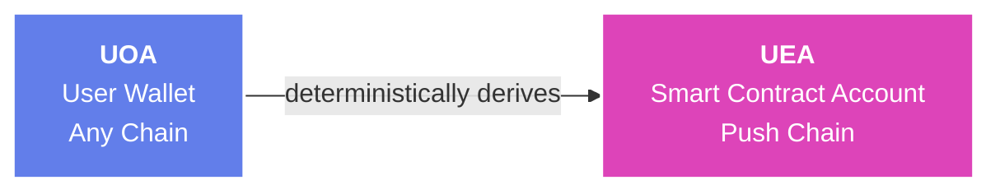
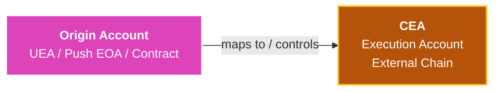
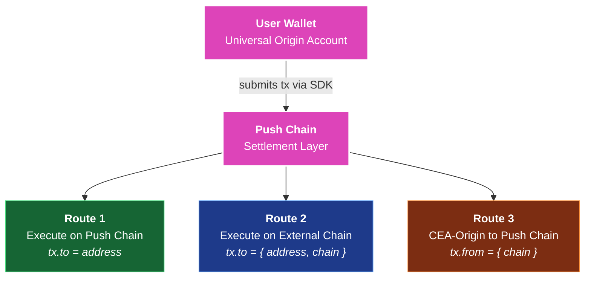
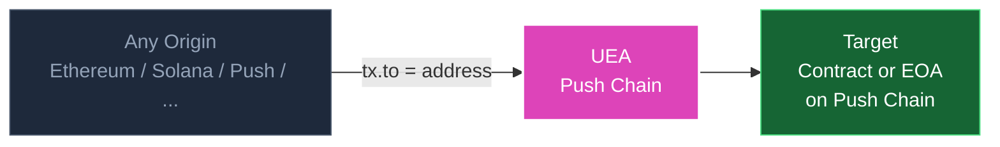
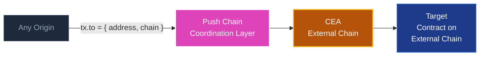
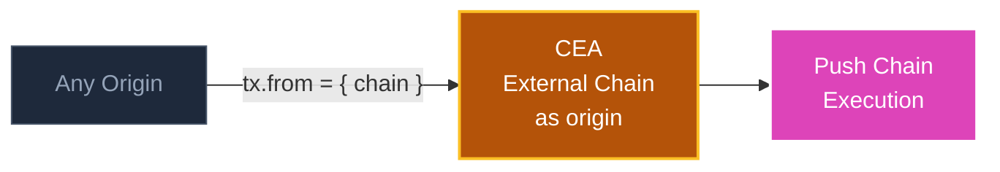

<head>
  <title>Understanding Universal Transactions | Build | Push Chain Docs</title>
</head>

{/* Content Start */}

## Overview

In most blockchain apps today, if a user on Ethereum wants to call a contract on another chain, they need to manually bridge tokens, switch wallets, pay gas on multiple networks, and hope nothing goes wrong between steps.

**Universal transactions eliminate all of that.** You write one transaction. The SDK handles origin detection, gas orchestration, proof replay, and final execution regardless of which chain the user is on.

**Push Chain turns all chains into universal execution environments behind a single transaction interface.**

:::info Summary
A universal transaction is a single transaction that executes across chains through Push Chain, without requiring manual bridging, network switching, or multi-step coordination.
:::

## Key Account Types

Before diving into routes and lifecycle, it helps to understand the three account types that power this system.

### Universal Origin Account (UOA)

The UOA is the user's **actual wallet**. It can be an Ethereum address, Solana public key, Push address or any chain-native identity. This is where transactions originate and the entity (controller) that authorizes execution. It never changes and requires no setup.

### Universal Executor Account (UEA)

The UEA is a **smart contract account on Push Chain**, deterministically derived from the UOA. It is the entity that actually executes transactions on Push Chain on behalf of the user.



Key properties:
- **Deterministic**: the same UOA always maps to the same UEA address, across all chains
- **Non-custodial**: only a valid proof from the UOA can authorize UEA actions
- **Lazy-deployed**: the UEA is deployed automatically on first use, no setup required

### Chain Executor Account (CEA)

The CEA is an **executor account deployed on a supported external chain** (e.g., Ethereum, BNB Chain). It is deterministically mapped with a user or contract and allows execution on external chains while preserving identity across environments.

CEAs are not limited to users with a UEA. They can also exist for native Push Chain EOAs or smart contracts. Depending on the target chain, a CEA may be implemented as an EOA or a smart contract, while remaining logically bound to its originating account.



CEAs are only used when execution must happen on or originate from an external chain.

### Mental Model

- UEA executes transactions on Push Chain for users originating from external chains
- CEA executes on external chains  

Together, they form a unified execution layer across all chains

## Transaction Routes

Universal transactions support three routing modes. The route is determined automatically by the `tx.to` and `tx.from` fields you supply.

| Route | Flow | Description |
|------|------|------------|
| Route 1 | Any Origin → Push | Execute on Push Chain via UEA |
| Route 2 | Any Origin → External via CEA | Execute on external chain via CEA |
| Route 3 | External (via CEA) → Push | Execute on Push Chain with external origin |



### Route 1: Any Origin to Push Chain

The most common route. The user signs from any supported chain and the transaction executes on Push Chain via their UEA.

**When to use**: Contract calls, token transfers, multicall batches — anything targeting Push Chain.



```typescript
// Route 1: plain address target triggers Push Chain execution
await pushChainClient.universal.sendTransaction({
  to: '0xContractOnPushChain',
  data: encodedCalldata,
  value: BigInt(0),
});
```

### Route 2: Any Origin to External Chain via CEA

The user signs from any chain, but execution happens on an **external chain** through their CEA. Push Chain acts as the coordination layer.

**When to use:** Calling a contract on Ethereum, BNB Chain, or any supported external chain without the user needing to switch networks.



```typescript
// Route 2: { address, chain } target routes through CEA on that chain
await pushChainClient.universal.sendTransaction({
  to: {
    address: '0xContractOnEthereum',
    chain: PushChain.CONSTANTS.CHAIN.ETHEREUM_SEPOLIA,
  },
  data: encodedCalldata,
});
```

### Route 3: External CEA Origin to Push Chain

The execution *originates* from a CEA on an external chain and targets Push Chain. This is used when the Push Chain contract needs to see an external chain as the transaction origin — for example, contracts that gate behavior based on the caller's origin chain.

**When to use:** Advanced scenarios where `msg.sender` on Push Chain must reflect a specific external chain identity.



```typescript
// Route 3: tx.from forces CEA on specified chain to be the execution origin
await pushChainClient.universal.sendTransaction({
  from: { chain: PushChain.CONSTANTS.CHAIN.ETHEREUM_SEPOLIA },
  to: '0xContractOnPushChain',
  data: encodedCalldata,
});
```

## Transaction Lifecycle

Every call to `sendTransaction` follows the same execution pipeline. These steps are handled automatically by the SDK.

| Step | Stage | Description |
|------|------|------------|
| 1 | Origin Detection | Identifies the UOA and source chain |
| 2 | Gas Estimation | Estimates total execution cost across chains |
| 3 | UEA Resolution | Resolves or deploys the user's UEA on Push Chain |
| 4 | User Authorization | Collects signature or verifies on-chain proof |
| 5 | Gas Funding | Funds the UEA if required |
| 6 | Asset Movement | Moves assets if `tx.funds` is set |
| 7 | Broadcast | Submits the transaction to Push Chain |
| 8 | Confirmation | Returns transaction hash and execution receipt |

Asset Movement (step 6) only runs when `tx.funds` is set. For plain Push Chain transactions it is skipped entirely.

Each step emits a `SEND-TX-*` progress event. You can subscribe via `progressHook` at the client level or per-call to show live status in your UI.

## Why Universal Transactions Matter

Universal transactions fundamentally change how apps are built and used across chains.

- **No per-chain deployments**  
  Developers deploy once and reach users across all supported chains

- **No bridging or network switching**  
  Users interact from their native chain without managing infrastructure

- **Unified user identity**  
  The same user can execute across chains while preserving identity

- **Composable cross-chain flows**  
  Complex multi-chain interactions happen within a single transaction

This enables a new class of applications that are truly chain-agnostic and universal.

## Next Steps

- Send your first universal transaction with [Send Universal Transaction](./send-universal-transaction)  
- Track and monitor execution with [Track Universal Transaction](./track-universal-transaction)  
- Build advanced cross-chain flows with [Send Multichain Transactions](./send-multichain-transactions)