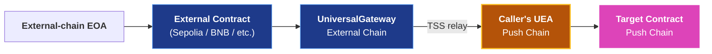
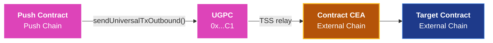
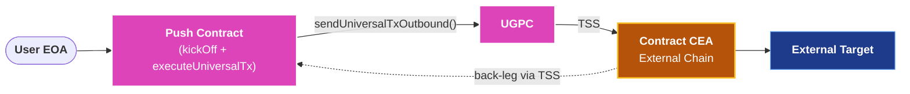

<head>
  <title>Contract-Initiated Multichain Execution | Build | Push Chain Docs</title>
</head>

import Details from '@theme/Details';
import PushAPIReference from '@site/src/components/PushAPIReference/PushAPIReference';
import { SolidityCode } from '@site/src/components/SolidityCode';
import ConstantsDropdown from '@site/src/components/ConstantsDropdown/ConstantsDropdown';

{/* Content Start */}

## Overview

Contract-Initiated Multichain Execution lets a **Push Chain smart contract trigger execution on an external chain**, or **receive a call originating from an external chain**, without any live user interaction at call time. 

This enables Push contracts to autonomously interact with external protocols, call contracts on Ethereum or BNB Chain, and optionally receive inbound payloads back on Push Chain, all driven by on-chain contract code.

> All directions run through the same primitives (UEAs, CEAs, the gateway pair) but the wire format and the on-chain identity differ. For real examples, see the [Contract-Initiated Examples](/docs/chain/build/contract-initiated-examples/).

## How This Differs from Universal Transactions

Universal transactions are initiated by users. Contract-initiated multichain execution is initiated by Push Chain smart contracts. Both use the same cross-chain infrastructure, but differ in execution model and integration surface.

| Dimension | Universal Transaction | Contract-Initiated Multichain Execution |
|-----------|----------------------|------------------------------|
| **Who initiates** | A user wallet (UOA). | A Push Chain smart contract. |
| **When it happens** | At user signature time. | During contract execution, triggered by any on-chain call. |
| **Authorization** | User signature or proof. | Contract logic, no live user required. |
| **Return handling** | SDK receives `TxResponse`. | Inbound `executeUniversalTx()` call on the originating contract. |
| **Identity on external chain** | User's CEA. | Contract's CEA (bound to the contract address). |
| **SDK involvement** | Required on client side. | Fully on-chain, no SDK required. |

The key distinction is that contract-initiated multichain execution is **programmable and autonomous**. Any call into your Push contract can trigger execution on an external chain. Liquidation triggers, scheduled jobs, governance outcomes, and user actions that fan out across chains all fit this model.

## Key Concepts

### Contract CEA

Every Push Chain smart contract has a deterministically derived **Chain Executor Account (CEA)** on each supported external chain. Same idea as user-initiated CEAs, but bound to the contract address instead of a user wallet.

The contract CEA:
- Is derived from the Push contract's address, not from any user.
- Is lazily deployed on first use by the TSS network.
- Acts as `msg.sender` on the external chain when the contract initiates execution there.
- Gas is taken in **$PC** on Push Chain and converted to the native token of the external chain.
- Is scoped to the contract, not to any user.

### UniversalGatewayPC (UGPC)

UGPC is the on-chain gateway contract on Push Chain through which all outbound cross-chain calls are routed. Your contract calls `UGPC.sendUniversalTxOutbound()`, which relays the payload, optionally burns or locks PRC20 tokens, and emits the event the TSS network listens for. 

UGPC is a predeploy at `0x00000000000000000000000000000000000000C1` on every Push Chain network.

### Universal Executor Module

The **UNIVERSAL_EXECUTOR_MODULE** (`0x14191Ea54B4c176fCf86f51b0FAc7CB1E71Df7d7`) is the privileged address authorized to deliver round-trip back-leg payloads to Push-native contracts. When your contract's CEA on an external chain triggers a callback to Push, the module calls `executeUniversalTx()` on your contract. 

Regular inbound (an external contract calling the Universal Gateway) lands on your Push target via the caller's UEA, not via this module.

:::warning Always validate inbound in your contract's `executeUniversalTx` handler
<br />If your contract implements `executeUniversalTx` (the round-trip back-leg handler), validate `msg.sender == UNIVERSAL_EXECUTOR_MODULE` and replay-protect on `txId`. <br /><br />Without these guards, anyone can call your handler with fabricated data. Regular inbound targets (called via the caller's UEA) do not need either guard.
:::

## Three Directions

Contract-initiated execution flows in three directions. Pick the one that matches your use case.

### Inbound: External Chain → Push Chain

An external-chain contract calls the per-chain Universal Gateway. The TSS network relays the call to Push Chain, where the dispatching contract's UEA executes the payload on the target Push contract.


<br /><br />
**Use this when** an external-chain contract needs to mutate state on Push (e.g. an Ethereum-side staking contract triggers a balance update on Push).

For instance a cross-chain governance proposal lands on Push from a vote on Sepolia, or an external chain bridges a payload with funds that should land in a Push vault.

### Outbound: Push Chain → External Chain

A Push contract dispatches a call that runs on an external chain. The call executes on the destination as the Push contract's CEA on that chain.



<br /><br />
**Use this when** you require liquidations on external DEXes, scheduled rebalances on Aave, fanning out a single Push tx to multiple destination chains, paying out winners on external networks.

### Round-Trip: Push Chain → External Chain → Push Chain

A Push contract dispatches outbound; the destination CEA's multicall nests a gateway call that fires an inbound back to the original Push contract. One user signature, an external action, and an automatic back-leg into the contract's `executeUniversalTx` handler.


<br /><br />
**Use this when** you need cross-chain state machines (request-and-fulfill), oracle-style flows where Push waits on external execution, or multi-chain cascades fired by a single user signature.

## Inbound Wire Format

An inbound dispatch is a single call into the per-chain `IUniversalGateway` from an external chain. The TSS network relays the call to Push, where the dispatching contract's UEA forwards the payload to your target. Below is the full surface.

### IUniversalGateway

**_`sendUniversalTx(UniversalTxRequest): void`_** <div style={{textAlign: 'right', fontSize: '1rem'}}>is <em><code style={{color: 'var(--ifm-sidebar-activetext-color)', background: 'transparent'}}>external payable</code></em></div>

**Deployed Address**: Per supported chain (Sepolia, BNB Testnet, Arbitrum Sepolia, Base Sepolia, Solana Devnet). See [Smart Contract Address Book - External Chain Gateway Contracts](/docs/chain/setup/smart-contract-address-book/#external-chain-gateway-contracts).

```solidity
struct UniversalPayload {
    address to;                    // Real target on Push (or address(0) if data is multicall-wrapped)
    uint256 value;                 // Native value to forward to the target
    bytes   data;                  // Raw calldata, or 0x2cc2842d-prefixed multicall encoding
    uint256 gasLimit;
    uint256 maxFeePerGas;
    uint256 maxPriorityFeePerGas;
    uint256 nonce;                 // Caller's UEA nonce on Push
    uint256 deadline;
    uint8   vType;                 // 0 = universalTxVerification (inbound to UEA)
}

struct UniversalTxRequest {
    address recipient;             // Always address(0); real target is inside payload
    address token;                 // address(0) for native; ERC-20 address for bridged token
    uint256 amount;                // Amount to bridge with this inbound
    bytes   payload;               // ABI-encoded UniversalPayload
    address revertRecipient;       // Address to receive bridged funds on revert
    bytes   signatureData;         // Empty for contract-initiated inbound
}

interface IUniversalGateway {
    function sendUniversalTx(UniversalTxRequest calldata req) external payable;
}
```

<PushAPIReference showRequiredNotice={false}>

| Arguments | Type | Description |
| --------- | ---- | ----------- |
| _`req.recipient`_ | `address` | Always `address(0)`. The real Push-side target lives inside `payload`. |
| _`req.token`_ | `address` | `address(0)` for native asset; ERC-20 address when bridging a token alongside the call. |
| _`req.amount`_ | `uint256` | Amount to bridge with this inbound. Set to `0` for payload-only inbounds. |
| _`req.payload`_ | `bytes` | ABI-encoded `UniversalPayload` describing the target call. |
| _`req.revertRecipient`_ | `address` | Address that receives bridged funds if the Push-side execution reverts. |
| _`req.signatureData`_ | `bytes` | Empty for contract-initiated inbound. |

</PushAPIReference>

### Single-call vs multicall payload

The caller's UEA inspects the first 4 bytes of `payload.data`. 
- If they match the multicall selector **_0x2cc2842d_** (= `bytes4(keccak256("UEA_MULTICALL"))`) → the UEA decodes the rest as `Multicall[]` and ignores `payload.to`. 
- **Otherwise** → it treats `payload.data` as raw calldata and runs it once against `payload.to`.

```solidity
// Single call: target is `to`, calldata is `data`.
UniversalPayload memory payload = UniversalPayload({
    to:                   pushTarget,
    value:                0,
    data:                 abi.encodeWithSignature("increment()"),
    gasLimit:             1e7,
    maxFeePerGas:         1e10,
    maxPriorityFeePerGas: 0,
    nonce:                ueaNonce,
    deadline:             9999999999,
    vType:                0
});

// Multicall: prefix the sentinel, then encode an array of (to, value, data).
// In multicall mode, payload.to is ignored. Convention is to leave it as address(0).
Multicall[] memory calls = new Multicall[](1);
calls[0] = Multicall({ to: pushTarget, value: 0, data: abi.encodeWithSignature("increment()") });
bytes memory multicallData = abi.encodePacked(
    bytes4(keccak256("UEA_MULTICALL")),  // 0x2cc2842d
    abi.encode(calls)
);
```

### Target identity and replay protection

When the inbound lands on Push, the caller's UEA executes the payload. From your target's perspective, `msg.sender` is that UEA, a smart account with its own internal nonce. 

**The UEA increments its nonce before forwarding, so your target does NOT need replay protection** and does NOT need to validate `msg.sender` against any module. A plain Solidity function works as-is.

To recover the origin chain and external wallet from `msg.sender`:

```solidity
(string memory chainNamespace, bytes memory externalAddress) =
    IUEAFactory(UEA_FACTORY).getOriginForUEA(msg.sender);
```

### Minimal dispatch

```solidity
address constant GATEWAY = 0x...; // Per-chain UG (Sepolia, BNB Testnet, etc.)
bytes4  constant UEA_MULTICALL_SELECTOR = 0x2cc2842d;

function triggerOnPush(
    address pushTarget,
    bytes   calldata pushCalldata,
    uint256 nonce
) external payable {
    // Wrap (target, calldata) into the UEA's multicall format.
    Multicall[] memory calls = new Multicall[](1);
    calls[0] = Multicall({ to: pushTarget, value: 0, data: pushCalldata });
    bytes memory multicallData = abi.encodePacked(UEA_MULTICALL_SELECTOR, abi.encode(calls));

    // Wrap multicall data in the UniversalPayload (vType = 0, inbound to UEA).
    bytes memory payload = abi.encode(
        address(0), uint256(0), multicallData,
        uint256(1e7), uint256(1e10), uint256(0),
        nonce, uint256(9999999999), uint8(0)
    );

    // Dispatch through the per-chain Universal Gateway.
    IUniversalGateway(GATEWAY).sendUniversalTx{value: msg.value}(
        UniversalTxRequest({
            recipient:       address(0),
            token:           address(0),
            amount:          0,
            payload:         payload,
            revertRecipient: address(this),
            signatureData:   ""
        })
    );
}
```

A complete runnable version (Sepolia dispatcher plus Push target) is in the [Inbound to Push](/docs/chain/build/contract-initiated-examples/inbound-to-push-chain) example.

## Outbound Wire Format

The outbound dispatch is a single call into UGPC. Below is the full surface.

### IUniversalGatewayPC

**_`sendUniversalTxOutbound(UniversalOutboundTxRequest): void`_** <div style={{textAlign: 'right', fontSize: '1rem'}}>is <em><code style={{color: 'var(--ifm-sidebar-activetext-color)', background: 'transparent'}}>external payable</code></em></div>

**Deployed Address**: [**_`0x00000000000000000000000000000000000000C1`_**](/docs/chain/setup/smart-contract-address-book/#push-chain-core-functionalities)

```solidity
struct UniversalOutboundTxRequest {
    bytes   recipient;        // CEA or target address on the external chain (bytes-encoded)
    address token;            // PRC20 token on Push Chain to bridge (address(0) for none)
    uint256 amount;           // Amount of PRC20 to bridge
    uint256 gasLimit;         // Gas limit for external-chain execution (see Operational Knobs)
    uint256 gasPrice;         // Gas price override (0 = per-chain default from UniversalCore; new in SDK v6)
    uint256 maxPCForGas;      // Max native PC the AMM may consume for the gas swap (0 = no cap; new in SDK v6)
    bytes   payload;          // Calldata for the CEA to execute on the external chain
    address revertRecipient;  // Address to receive funds if the tx reverts on the external chain
}

interface IUniversalGatewayPC {
    function sendUniversalTxOutbound(UniversalOutboundTxRequest calldata req) external payable;
}
```

<PushAPIReference showRequiredNotice={false}>

| Arguments | Type | Description |
| --------- | ---- | ----------- |
| _`req.recipient`_ | `bytes` | CEA or target address on the external chain, bytes-encoded. |
| _`req.token`_ | `address` | PRC20 token address on Push Chain to bridge. Use `address(0)` if no token is being bridged. |
| _`req.amount`_ | `uint256` | Amount of PRC20 to bridge. Set to `0` if not bridging. |
| _`req.gasLimit`_ | `uint256` | Gas limit for external-chain execution. Default to `2_000_000` (see [Operational Knobs](#operational-knobs)); UGPC charges only for actual gas used and refunds the surplus. |
| _`req.gasPrice`_ | `uint256` | Gas price override for the destination chain. Set to `0` to use the per-chain default quoted by UniversalCore (recommended). |
| _`req.maxPCForGas`_ | `uint256` | Maximum native `$PC` the on-chain AMM may consume when swapping for destination gas. Set to `0` for no cap (recommended on testnet). |
| _`req.payload`_ | `bytes` | ABI-encoded calldata for the CEA to execute on the external chain. |
| _`req.revertRecipient`_ | `address` | Address to receive bridged funds if the external transaction reverts. |

</PushAPIReference>

### Single-call vs multicall payload

The caller's UEA inspects the first 4 bytes of `payload.data`. 
- If they match the multicall selector **_0x2cc2842d_** (= `bytes4(keccak256("UEA_MULTICALL"))`) → the UEA decodes the rest as `Multicall[]` and ignores `payload.to`. 
- **Otherwise** → it treats `payload.data` as raw calldata and runs it once against `payload.to`.

```solidity
// Single call (most common): payload is the ABI-encoded calldata for the target.
bytes memory payload = abi.encodeCall(ICounter.increment, ());

// Multicall: prefix the sentinel, then encode an array of (to, value, data).
bytes memory multicallData = abi.encodePacked(
    bytes4(keccak256("UEA_MULTICALL")),
    abi.encode(callsArray)
);
```

The multicall path is what enables [round-trip patterns](#round-trip-wire-format) further down.

### Minimal dispatch

```solidity
address constant UGPC = 0x00000000000000000000000000000000000000C1;

function dispatchToBNB(address bnbCounter, uint256 protocolFeePc) external payable {
    bytes memory payload = abi.encodeWithSignature("increment()");

    IUniversalGatewayPC(UGPC).sendUniversalTxOutbound{value: protocolFeePc}(
        UniversalOutboundTxRequest({
            recipient:       abi.encodePacked(bnbCounter),
            token:           address(0),
            amount:          0,
            gasLimit:        2_000_000,
            gasPrice:        0,             // per-chain default from UniversalCore
            maxPCForGas:     0,             // no cap on PC for the gas swap
            payload:         payload,
            revertRecipient: address(this)
        })
    );
}
```

A complete runnable version is in the [Plain Outbound](/docs/chain/build/contract-initiated-examples/outbound-from-push-chain) example.

## Round-Trip Wire Format

A round-trip is a single outbound whose destination-chain payload **automatically fires** an inbound back to the originating Push contract. 

It reuses the outbound surface - [UniversalGatewayPC](#iuniversalgatewaypc), plus a back-leg handler on the dispatching contract - [executeUniversalTx()](#executeuniversaltx). Below is the full surface.

> For a visual breakdown of how the four payload layers nest, see the [layered diagram in the Round-Trip example](/docs/chain/build/contract-initiated-examples/round-trip-auto-back-leg#the-wire-format).

### executeUniversalTx

**_`executeUniversalTx(string, bytes, bytes, uint256, address, bytes32): void`_** <div style={{textAlign: 'right', fontSize: '1rem'}}>is <em><code style={{color: 'var(--ifm-sidebar-activetext-color)', background: 'transparent'}}>external payable</code></em></div>

**Caller**: **_`UNIVERSAL_EXECUTOR_MODULE`_** 
> Deployed Address

[**_`0x14191Ea54B4c176fCf86f51b0FAc7CB1E71Df7d7`_**](/docs/chain/setup/smart-contract-address-book/#push-chain-core-functionalities)

```solidity
/**
 * @notice Back-leg handler. TSS invokes this on the originating Push contract
 *         when the destination CEA's outer multicall completes.
 * @dev Only callable by UNIVERSAL_EXECUTOR_MODULE. Must validate msg.sender
 *      and guard against replay via txId.
 */
function executeUniversalTx(
    string  calldata sourceChainNamespace,  // CAIP-2 namespace, e.g. "eip155:97"
    bytes   calldata ceaAddress,             // CEA address on source chain, bytes-encoded
    bytes   calldata payload,                // ABI-encoded action data
    uint256          amount,                 // PRC20 amount bridged in
    address          prc20,                  // PRC20 token address on Push
    bytes32          txId                    // Unique cross-chain tx id; use for replay protection
) external payable;
```

<PushAPIReference showRequiredNotice={false}>

| Arguments | Type | Description |
| --------- | ---- | ----------- |
| _`sourceChainNamespace`_ | `string` | CAIP-2 chain identifier of the originating chain, e.g. `"eip155:97"`. |
| _`ceaAddress`_ | `bytes` | CEA address on the source chain, bytes-encoded. |
| _`payload`_ | `bytes` | ABI-encoded action data. Decode inside your handler to determine the action. |
| _`amount`_ | `uint256` | Amount of PRC20 tokens bridged with this back-leg. |
| _`prc20`_ | `address` | PRC20 token address on Push corresponding to the bridged asset. |
| _`txId`_ | `bytes32` | Unique cross-chain transaction identifier. Use this to prevent replay. |

</PushAPIReference>

### Required guards

The back-leg handler is privileged. Validate the caller and replay-protect on `txId`.

```solidity
mapping(bytes32 => bool) public executedTxIds;
address public constant UNIVERSAL_EXECUTOR_MODULE = 0x14191Ea54B4c176fCf86f51b0FAc7CB1E71Df7d7;

modifier onlyUniversalExecutor() {
    if (msg.sender != UNIVERSAL_EXECUTOR_MODULE) revert NotExecutorModule();
    _;
}

function executeUniversalTx(
    string  calldata sourceChainNamespace,
    bytes   calldata ceaAddress,
    bytes   calldata payload,
    uint256          amount,
    address          prc20,
    bytes32          txId
) external payable onlyUniversalExecutor {
    if (executedTxIds[txId]) revert TxAlreadyExecuted();
    executedTxIds[txId] = true;

    // Decode payload and apply your application logic.
    (uint8 action, address user) = abi.decode(payload, (uint8, address));
    if (action == 0) {
        stakedBalance[user][prc20] += amount;
        emit Staked(user, prc20, amount, txId);
    }
}
```

### Strict dispatch signature

The dispatch signature in your push-side contract needs to match exactly the one shown below for the round trip to complete.

| Signature | Used by |
|---|---|
| `executeUniversalTx(string, bytes, bytes, uint256, address, bytes32)` | Push-native contracts. **This is the path TSS dispatches to.** |

### Minimal round-trip dispatch

A round-trip dispatch is just a regular UGPC outbound. The only extra thing you do is shape the outbound's **payload** so that, when the destination CEA executes it, **one step of the outer multicall is a self-call to `sendUniversalTxToUEA` on the CEA**. 

That self-call is what TSS reads as "fire the inbound back to the originating Push contract." Without it, only the outbound leg runs.

> **Note**: You don't deploy or fund the destination CEA. TSS deploys it lazily on first use and forwards the converted gas value to it as `msg.value` when executing the destination tx (see [Operational Knobs](#operational-knobs)).

```solidity
// Build the inner UniversalPayload (vType = 1, inbound to Push UEA).
bytes memory innerMulticallData = abi.encodePacked(
    UEA_MULTICALL_SELECTOR,                  // 0x2cc2842d
    abi.encode(/* Multicall[] - what runs on the Push UEA after the back-leg */)
);
bytes memory inboundUniversalPayload = abi.encode(
    address(0), uint256(0), innerMulticallData,
    uint256(1e7), uint256(1e10), uint256(0),
    ueaNonce + 1, uint256(9999999999), uint8(1)
);

// The back-leg trigger: a CEA self-call wrapping the inner payload.
bytes memory ceaSelfCallData = abi.encodeWithSelector(
    bytes4(keccak256("sendUniversalTxToUEA(address,uint256,bytes,address)")),
    address(0), uint256(0), inboundUniversalPayload, address(this)
);

// Outer multicall delivered to the destination CEA: do the external action, then trigger the back-leg.
Multicall[] memory outerCalls = new Multicall[](2);
outerCalls[0] = Multicall({ to: targetOnExternalChain, value: 0, data: actionCalldata });
outerCalls[1] = Multicall({ to: destinationCEAAddr,    value: 0, data: ceaSelfCallData });
bytes memory outerMulticallData = abi.encodePacked(UEA_MULTICALL_SELECTOR, abi.encode(outerCalls));

// Dispatch with gasLimit ≥ 2_000_000 (see Operational Knobs).
UGPC.sendUniversalTxOutbound{value: protocolFeePc}(UniversalOutboundTxRequest({
    recipient:       abi.encodePacked(destinationCEAAddr),
    token:           pBNB,
    amount:          0,
    gasLimit:        2_000_000,
    gasPrice:        0,                // per-chain default from UniversalCore
    maxPCForGas:     0,                // no cap on PC for the gas swap
    payload:         outerMulticallData,
    revertRecipient: address(this)
}));
```

A complete runnable version is in the [Round-Trip with Auto Back-Leg](/docs/chain/build/contract-initiated-examples/round-trip-auto-back-leg) example.

## Operational Knobs

Two operational settings determine whether a round-trip lands. Verified on Donut Testnet; wrong values cause TSS to silently drop the back-leg.

| Knob | Value | Why |
|---|---|---|
| `gasLimit` on the UGPC outbound | **`≥ 2_000_000`** | UGPC's auto-floor for `gasLimit = 0` is 500k. Below ~1.5M, the destination tx runs out of gas during the nested gateway call and TSS does not retry.<br /><br />The Push tx still succeeds and UGPC emits its event, but no destination tx fires.<br /><br />**Note**: UGPC charges only for actual gas used and refunds the surplus into the calling contract, so over-provisioning is essentially free. |
| Push contract `$PC` balance | covers `protocolFee + inbound execution fee` | Inbound execution on Push pays gas in `$PC`, charged to the dispatching contract. UGPC refunds surplus, so refunds **accumulate on the contract**, not the user EOA.<br /><br />Plan a `withdraw()` path or treasury sweep for long-running flows. |

:::tip Destination CEA is auto funded
The destination CEA does not need pre-funding. When TSS submits the destination tx it forwards the converted gas value to the CEA as **msg.value**, so the CEA has the native balance it needs for nested gateway calls during the duration of that tx. 
:::

## Deterministic CEA Conversion

To convert a contract address on Push to a deterministic CEA on another chain, either to whitelist or pre-fund with other assets, use this off-chain SDK code.

```ts
import { PushChain } from '@pushchain/core';

const dispatcherAccount = PushChain.utils.account.toUniversal(
  contractAddressOnPush,
  { chain: PushChain.CONSTANTS.CHAIN.PUSH_TESTNET }
);
const destinationCEA = await PushChain.utils.account.deriveExecutorAccount(
  dispatcherAccount,
  { chain: PushChain.CONSTANTS.CHAIN.BNB_TESTNET, skipNetworkCheck: true }
);
console.log('CEA address:', destinationCEA.address);
```

## Outbound Value Sizing

Cross-chain gas is converted from **$PC** to the native token using the internal Universal V3 AMM. Either ensure that proper amount of **$PC** is sent as `msg.value` or over-size the value to account for potential slippage.

Since unused gas is refunded, over-sizing is recommended. The [Cross-Chain Cascade](https://github.com/pushchain/push-chain-examples/tree/main/core-sdk-functions/contract-initiated-roundtrip-between-external-chains) example implements this end to end.

## Security Considerations

- **Function _executeUniversalTx_ must validate the caller and guard against replay**<br /> 
  If your contract implements the back-leg handler, gate it on `msg.sender == UNIVERSAL_EXECUTOR_MODULE` and maintain a `mapping(bytes32 => bool) executedTxIds` keyed by the incoming `txId`. 

  Without these guards, anyone can call your handler with fabricated data, and a legitimate callback can be replayed. **Regular inbound targets (called via the caller's UEA) do not need these guards** because the UEA's nonce handles replay internally.<br />

- **CEA identity is contract-bound**<br /> 
  The contract's CEA is derived from its Push Chain address. A different deployment, even identical bytecode at a new address, will have a different CEA. If you use a proxy pattern, the CEA is bound to the **proxy** address, not the implementation. Upgrades do not change the CEA.

- **No cross-chain atomicity**<br /> 
  The outbound dispatch and the external execution are not atomic. Push-side state changes commit independently of whether the external call succeeds. Defer critical state commits to the inbound handler, or use an explicit pending/failed state machine.

- **Inbound timing is not predictable**<br />
  Inbound delivery depends on external chain finality and TSS observation. Do not design contracts that require an inbound within a specific block window.

## Best Practices

- **Emit an event at dispatch time**<br />
  Include a request ID, target address, and operation type so inbound payloads can be correlated with the original outbound call.

- **Use per-dispatch request IDs, or a FIFO queue**<br />
  If multiple outbound calls can be in flight, you have two options.<br /><br />
    (a) Stamp a request ID into your event log and correlate from off-chain.<br /><br /> (b) Maintain a `bytes32[] pendingQueue` plus `pendingHead` and pop on each callback. TSS preserves outbound-submission order, so the popped ID always matches the just-completed leg. The queue option avoids any payload-byte introspection and is more robust.

- **Keep inbound handlers lean**<br /> 
  The handler is called by an external module account; keep it tight and apply re-entrancy guards if it calls other contracts.

- **Fund the Push contract before dispatching**<br /> 
  Verify the contract has sufficient `$PC` to cover inbound execution fees. UGPC refunds surplus into the calling contract via `receive()`, so over-provisioning is safe; refunds **accumulate on the contract**, not on the EOA. Plan a `withdraw()` path for long-running flows.

## Limitations

| Area | Constraint |
|------|------------|
| **No synchronous result** | Outbound and inbound are always separate transactions. There is no in-call return value. |
| **CEA as `msg.sender`** | External contracts that restrict callers (whitelists, EOA-only guards) must explicitly whitelist the contract's CEA address. |
| **Proxy upgrade safety** | CEA is bound to the proxy address. New deployments at different addresses have different CEAs. |
| **Supported chains** | Target chains must be supported by the TSS network. <ConstantsDropdown variant="CHAIN" /> |

## Troubleshooting

Common failure modes when wiring contract-initiated flows. Every row links to the section that explains the underlying mechanic.

| Symptom | Likely cause | Fix |
|---|---|---|
| Push tx succeeds but no destination tx fires | `gasLimit` was `0` or under the auto-floor (~500k) | Pass `gasLimit: 2_000_000` on the UGPC outbound. See [Operational Knobs](#operational-knobs). |
| Destination tx fires but the target contract reverts | Destination contract restricts callers (whitelist or EOA-only guard) and does not recognise the CEA | Whitelist the contract's CEA on the destination. Derive it off-chain via [Deterministic CEA Conversion](#deterministic-cea-conversion). |
| Outbound succeeds but the back-leg never reaches `executeUniversalTx` | Destination CEA's outer multicall is missing the self-call to `sendUniversalTxToUEA` | Include the self-call step inside the multicall. See [Minimal round-trip dispatch](#minimal-round-trip-dispatch). |
| `executeUniversalTx` reverts with `NotExecutorModule` | Caller is not `UNIVERSAL_EXECUTOR_MODULE` | Validate `msg.sender == UNIVERSAL_EXECUTOR_MODULE` (`0x14191Ea54B4c176fCf86f51b0FAc7CB1E71Df7d7`) in your handler. |
| `executeUniversalTx` reverts with `TxAlreadyExecuted` | Replay protection rejected a duplicate `txId` | Expected behaviour. The same back-leg was delivered twice; your idempotency guard is working. |
| Outbound to an external destination reverts with `STF` | `msg.value` under-sized the live $PC → routing-token swap inside UGPC | Over-size `msg.value`. UGPC refunds the surplus to the calling contract. See [Outbound Value Sizing](#outbound-value-sizing). |
| EOA balance drains across many runs even though the contract is funded | UGPC routes refunds to `address(this)`, not back to the EOA that called the dispatcher | Plan a `withdraw()` path or treasury sweep on the dispatching contract. See [Best Practices](#best-practices). |
| Back-leg lands on Push but reverts with out-of-gas / insufficient `$PC` | Inbound execution on Push pays gas in `$PC`, charged to the dispatching contract. | Ensure your contract is funded with enough `$PC` for execution. |

## When to Use This

Use this pattern when:

- A Push Chain contract needs to call an external protocol (Aave, Uniswap, a custom contract on Ethereum) without requiring the user to be online at execution time.
- A governance or automation contract needs to execute an external action after an on-chain condition is met.
- Your app logic lives on Push Chain but state or liquidity lives on an external chain.
- You are building a cross-chain keeper, liquidator, or staking coordinator.

Do not use it when:

- The user is online and can sign directly. User-initiated universal transactions are simpler.
- Your logic requires atomic rollback across both chains. Partial failure must be handled explicitly.

## Next Steps

- Explore [Inbound Contract example](/docs/chain/build/contract-initiated-examples/inbound-to-push-chain) to see External Chain → Push Chain
- Explore [Outbound Contract example](/docs/chain/build/contract-initiated-examples/outbound-from-push-chain) to see Push Chain → External Chain
- Explore [Round-Trip Contract example](/docs/chain/build/contract-initiated-examples/round-trip-auto-back-leg) to see Push Chain → External Chain → Push Chain
- Checkout [advanced patterns in Contract-Initiated Examples](/docs/chain/build/contract-initiated-examples/advanced-patterns/)
- Compare with user-initiated flows in [Send Universal Transaction](/docs/chain/build/send-universal-transaction)
