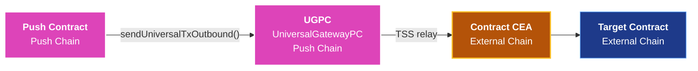

<head>
  <title>Contract-Initiated Multichain Execution | Build | Push Chain Docs</title>
</head>

import Details from '@theme/Details';
import PushAPIReference from '@site/src/components/PushAPIReference/PushAPIReference';
import { SolidityCode } from '@site/src/components/SolidityCode';

{/* Content Start */}

## Overview

Contract-Initiated Multichain Execution is a distinct capability that lets a **Push Chain smart contract trigger execution on an external chain** through its CEA, without any live user interaction at call time.

This enables Push contracts to autonomously interact with external protocols, call contracts on Ethereum or BNB Chain, and optionally receive inbound payloads back on Push Chain, all driven by on-chain contract code.

## How This Differs from Universal Transactions

Universal transactions are initiated by users. Contract-initiated multichain execution is initiated by Push Chain smart contracts. Both use the same cross-chain infrastructure, but differ in execution model and integration surface.

| Dimension | Universal Transaction | Contract Initiated Execution |
|-----------|----------------------|------------------------------|
| **Who initiates** | A user wallet (UOA). | A Push Chain smart contract. |
| **When it happens** | At user signature time. | During contract execution, triggered by any on-chain call. |
| **Authorization** | User signature or proof. | Contract logic, no live user required. |
| **Return handling** | SDK receives `TxResponse`. | Inbound `executeUniversalTx()` call on the originating contract. |
| **Identity on external chain** | User's CEA. | Contract's CEA (bound to the contract address). |
| **SDK involvement** | Required on client side. | Fully on-chain, no SDK required. |

The key distinction is that contract-initiated multichain execution is **programmable and autonomous**.  Any call into your Push contract can trigger external chain execution.

Examples include liquidation triggers, scheduled jobs, governance outcomes, and user actions that fan out across chains.

## Key Concepts

### Contract CEA

Every Push Chain smart contract has a deterministically derived **Chain Executor Account (CEA)** on each supported external chain. This is the same concept used in user-initiated transactions, but it is bound to the contract address instead of a user wallet.

The contract CEA:
- Is derived from the Push contract's address, not from any user
- Is lazily deployed on first use by the TSS network
- Acts as `msg.sender` on the external chain when the contract initiates execution there
- Gas is taken in **$PC** on Push Chain and converted to the native token of the external chain
- Is scoped to the contract, not to any user



### UniversalGatewayPC (UGPC)

UGPC is the on-chain gateway contract on Push Chain through which all outbound cross-chain calls are routed. Your contract calls `UGPC.sendUniversalTxOutbound()`, which relays the payload and, when applicable, burns or locks PRC20 tokens. It then emits the event that the TSS network listens for.

### Universal Executor Module

The `UNIVERSAL_EXECUTOR_MODULE` is the privileged address on Push Chain authorized to deliver inbound cross-chain payloads. When a CEA executes on an external chain and a response needs to come back, the module calls `executeUniversalTx()` on your Push contract. **Only this address should be trusted to deliver inbound payloads**.

:::warning Always validate inbound in your contract
Always validate `msg.sender` in your inbound handler. Not doing so will result in unauthorized execution.
:::


## Interfaces and Constants

### IUniversalGatewayPC

**_`sendUniversalTxOutbound(UniversalOutboundTxRequest): void`_** <div style={{textAlign: 'right', fontSize: '1rem'}}>is <em><code style={{color: 'var(--ifm-sidebar-activetext-color)', background: 'transparent'}}>external payable</code></em></div>


**Deployed Address**: **_`0x00000000000000000000000000000000000000C1`_**

The on-chain gateway your contract calls to dispatch an outbound cross-chain transaction. UGPC burns or locks the PRC20 tokens, collects the protocol fee from `msg.value`, and emits the event that the TSS network listens for.

**Commonly used for**:

- Triggering a contract call on an external chain from a Push Chain contract
- Bridging PRC20 tokens alongside a cross-chain payload
- Dispatching a fire-and-forget outbound with no expected inbound response

In order to use `IUniversalGatewayPC` in your contract, you can either:

#### 1. Import it directly from the Push Chain Core Repository

```solidity
import "push-chain-core-contracts/src/Interfaces/IUniversalGatewayPC.sol";
```

<Details summary="For Foundry Developers">
Do the additional steps to enable the same in your Foundry:<br />
<br />

1. Run forge install
```bash
forge install pushchain/push-chain-core-contracts
```

2. Add remappings to your **foundry.toml** file
```toml
remappings = ["push-chain-core-contracts/=lib/push-chain-core-contracts/"]
```
</Details>

#### Or 2. Define the interface manually in your Solidity contract

<Details summary="Use the following interface directly in your contract">

```solidity
pragma solidity ^0.8.0;

struct UniversalOutboundTxRequest {
    bytes   recipient;        // CEA or target address on the external chain (bytes-encoded)
    address token;            // PRC20 token address on Push Chain to bridge (address(0) for none)
    uint256 amount;           // Amount of PRC20 to bridge
    uint256 gasLimit;         // Gas limit for external-chain execution (0 = default)
    bytes   payload;          // Calldata for the CEA to execute on the external chain
    address revertRecipient;  // Address to receive funds if the tx reverts on the external chain
}

interface IUniversalGatewayPC {
    function sendUniversalTxOutbound(UniversalOutboundTxRequest calldata req) external payable;
}
```

</Details>

```solidity
/**
 * @notice Dispatches an outbound cross-chain transaction through the Push Chain gateway.
 * @dev msg.value must cover the protocol fee. Approve UGPC for `req.amount` before calling if bridging tokens.
 * @param req The outbound transaction request struct.
 */
function sendUniversalTxOutbound(
    UniversalOutboundTxRequest calldata req
) external payable;
```

<PushAPIReference showRequiredNotice={false}>

| Arguments | Type | Description |
| --------- | ---- | ----------- |
| _`req.recipient`_ | `bytes` | CEA or target address on the external chain, bytes-encoded. |
| _`req.token`_ | `address` | PRC20 token address on Push Chain to bridge. Use `address(0)` if no token is being bridged. |
| _`req.amount`_ | `uint256` | Amount of PRC20 to bridge. Set to `0` if not bridging. |
| _`req.gasLimit`_ | `uint256` | Gas limit for external-chain execution. Use `0` to let the UGPC estimate it automatically. Not recommended for advanced scenarios. |
| _`req.payload`_ | `bytes` | ABI-encoded calldata for the CEA to execute on the external chain. |
| _`req.revertRecipient`_ | `address` | Address to receive bridged funds if the external transaction reverts. |

</PushAPIReference>

<Details summary="On-chain usage" className="alert alert--live-play">

```solidity
function dispatchOutbound(
    address token,
    uint256 amount,
    bytes calldata recipient,
    bytes calldata payload,
    address revertRecipient
) external payable {
    if (amount > 0) {
        IPRC20(token).approve(ugpc, amount);
    }

    IUniversalGatewayPC(ugpc).sendUniversalTxOutbound{value: msg.value}(
        UniversalOutboundTxRequest({
            recipient:       recipient,
            token:           token,
            amount:          amount,
            gasLimit:        0,
            payload:         payload,
            revertRecipient: revertRecipient
        })
    );
}
```

</Details>

### UNIVERSAL_EXECUTOR_MODULE
The trusted executor module on Push Chain that delivers inbound cross-chain payloads to your contract.

**Deployed Address**: **_`0x14191Ea54B4c176fCf86f51b0FAc7CB1E71Df7d7`_**

### executeUniversalTx (Inbound Handler)

**_`executeUniversalTx(string, bytes, bytes, uint256, address, bytes32): void`_** <div style={{textAlign: 'right', fontSize: '1rem'}}>is <em><code style={{color: 'var(--ifm-sidebar-activetext-color)', background: 'transparent'}}>external payable</code></em></div>

The function your Push Chain contract exposes to receive inbound cross-chain payloads. The `UNIVERSAL_EXECUTOR_MODULE` calls this after the CEA has executed on the external chain and a response needs to be delivered back to Push Chain.

**Commonly used for**:

- Receiving staking confirmations, swap results, or any response from external chain execution
- Updating on-chain state based on what the contract's CEA did on another chain
- Triggering further logic on Push Chain after an external event completes

```solidity
/**
 * @notice Delivers an inbound cross-chain payload to this contract.
 * @dev Only callable by UNIVERSAL_EXECUTOR_MODULE. Must validate msg.sender and guard against replay via txId.
 * @param sourceChainNamespace CAIP-2 namespace of the originating chain, e.g. "eip155:97".
 * @param ceaAddress           CEA address on the source chain, bytes-encoded.
 * @param payload              ABI-encoded action data from the external chain.
 * @param amount               Amount of PRC20 tokens bridged with this inbound tx.
 * @param prc20                PRC20 token address on Push Chain.
 * @param txId                 Unique cross-chain transaction identifier for replay protection.
 */
function executeUniversalTx(
    string  calldata sourceChainNamespace,
    bytes   calldata ceaAddress,
    bytes   calldata payload,
    uint256          amount,
    address          prc20,
    bytes32          txId
) external payable;
```

:::warning Always validate the caller
Only **UNIVERSAL_EXECUTOR_MODULE** is authorized to call this function. Always guard it with an `onlyUniversalExecutor` modifier and track executed **txids** to prevent replay attacks.
:::

<PushAPIReference showRequiredNotice={false}>

| Arguments | Type | Description |
| --------- | ---- | ----------- |
| _`sourceChainNamespace`_ | `string` | CAIP-2 chain identifier of the originating chain, e.g. `"eip155:97"`. |
| _`ceaAddress`_ | `bytes` | CEA address on the source chain, bytes-encoded. |
| _`payload`_ | `bytes` | ABI-encoded action data. Decode inside your handler to determine the action. |
| _`amount`_ | `uint256` | Amount of PRC20 tokens bridged with this inbound transaction. |
| _`prc20`_ | `address` | PRC20 token address on Push Chain corresponding to the bridged asset. |
| _`txId`_ | `bytes32` | Unique cross-chain transaction identifier. Use this to prevent replay attacks. |

</PushAPIReference>

<Details summary="On-chain usage" className="alert alert--live-play">

```solidity
mapping(bytes32 => bool) public executedTxIds;
address public universalExecutorModule = 0x14191Ea54B4c176fCf86f51b0FAc7CB1E71Df7d7;

modifier onlyUniversalExecutor() {
    if (msg.sender != universalExecutorModule) revert NotExecutorModule();
    _;
}

function executeUniversalTx(
    string  calldata sourceChainNamespace,
    bytes   calldata ceaAddress,
    bytes   calldata payload,
    uint256          amount,
    address          prc20,
    bytes32          txId
) external payable onlyUniversalExecutor {
    if (executedTxIds[txId]) revert TxAlreadyExecuted();
    executedTxIds[txId] = true;

    // Decode payload and handle the inbound action
    (uint8 action, address user,) = abi.decode(payload, (uint8, address, bytes));

    if (action == 0) {
        stakedBalance[user][prc20] += amount;
        emit Staked(user, prc20, amount, txId);
    }

    emit InboundReceived(txId, sourceChainNamespace, ceaAddress, prc20, amount);
}
```

</Details>

## Minimal Integration Pattern

The following contract shows the minimum integration surface for contract-initiated multichain execution. It dispatches an outbound call through UGPC, accepts an inbound callback through `executeUniversalTx()`, validates the trusted executor module, and prevents replay using txId.

- **Outbound**: calls `dispatchOutbound()` → optionally approves UGPC → calls `sendUniversalTxOutbound()`
- **Inbound**: **UNIVERSAL_EXECUTOR_MODULE** calls `executeUniversalTx()` → contract validates caller → replay protects with txId → decodes payload and applies app logic

<SolidityCode
  title="Minimal Integration Pattern"
  fileName="MinimalIntegrationPattern.sol"
>

```solidity
// SPDX-License-Identifier: MIT
pragma solidity ^0.8.26;

/// @notice Minimal outbound request type for UGPC.
struct UniversalOutboundTxRequest {
    bytes recipient;
    address token;
    uint256 amount;
    uint256 gasLimit;
    bytes payload;
    address revertRecipient;
}

/// @notice Minimal UGPC interface.
interface IUniversalGatewayPC {
    function sendUniversalTxOutbound(UniversalOutboundTxRequest calldata req) external payable;
}

/// @notice Minimal PRC20 interface for approvals.
interface IPRC20 {
    function approve(address spender, uint256 amount) external returns (bool);
}

contract MinimalContractInitiatedExecutor {
    // -------------------------------------------------------------------------
    // Constants / Config
    // -------------------------------------------------------------------------

    address public immutable ugpc;
    address public immutable universalExecutorModule;

    // -------------------------------------------------------------------------
    // State
    // -------------------------------------------------------------------------

    mapping(bytes32 => bool) public executedTxIds;
    mapping(address => uint256) public creditedAmount;

    // -------------------------------------------------------------------------
    // Events
    // -------------------------------------------------------------------------

    event OutboundDispatched(
        bytes indexed recipient,
        address indexed token,
        uint256 amount,
        bytes payload,
        address revertRecipient
    );

    event InboundExecuted(
        bytes32 indexed txId,
        string sourceChainNamespace,
        bytes ceaAddress,
        address prc20,
        uint256 amount
    );

    // -------------------------------------------------------------------------
    // Errors
    // -------------------------------------------------------------------------

    error NotUniversalExecutor();
    error TxAlreadyExecuted();
    error ZeroAddress();
    error UnsupportedAction();

    // -------------------------------------------------------------------------
    // Constructor
    // -------------------------------------------------------------------------

    constructor(address _ugpc, address _universalExecutorModule) {
        if (_ugpc == address(0) || _universalExecutorModule == address(0)) {
            revert ZeroAddress();
        }

        ugpc = _ugpc;
        universalExecutorModule = _universalExecutorModule;
    }

    // -------------------------------------------------------------------------
    // Modifiers
    // -------------------------------------------------------------------------

    modifier onlyUniversalExecutor() {
        if (msg.sender != universalExecutorModule) revert NotUniversalExecutor();
        _;
    }

    // -------------------------------------------------------------------------
    // Outbound: Push Chain -> External Chain
    // -------------------------------------------------------------------------

    /// @notice Dispatch an outbound cross-chain execution from this contract.
    /// @dev If bridging PRC20 tokens, approve UGPC before calling.
    /// @param token PRC20 token on Push Chain. Use address(0) if not bridging tokens.
    /// @param amount Amount of PRC20 to bridge. Use 0 if not bridging.
    /// @param recipient Bytes-encoded CEA or target address on the external chain.
    /// @param gasLimit Gas limit for the external-chain execution. Use 0 for default.
    /// @param payload ABI-encoded calldata or app payload for the external-chain action.
    /// @param revertRecipient Address to receive bridged funds if the external tx reverts.
    function dispatchOutbound(
        address token,
        uint256 amount,
        bytes calldata recipient,
        uint256 gasLimit,
        bytes calldata payload,
        address revertRecipient
    ) external payable {
        if (revertRecipient == address(0)) revert ZeroAddress();

        if (amount > 0) {
            if (token == address(0)) revert ZeroAddress();
            IPRC20(token).approve(ugpc, amount);
        }

        IUniversalGatewayPC(ugpc).sendUniversalTxOutbound{value: msg.value}(
            UniversalOutboundTxRequest({
                recipient: recipient,
                token: token,
                amount: amount,
                gasLimit: gasLimit,
                payload: payload,
                revertRecipient: revertRecipient
            })
        );

        emit OutboundDispatched(recipient, token, amount, payload, revertRecipient);
    }

    // -------------------------------------------------------------------------
    // Inbound: External Chain -> Push Chain
    // -------------------------------------------------------------------------

    /// @notice Receive an inbound cross-chain payload.
    /// @dev Only UNIVERSAL_EXECUTOR_MODULE should be allowed to call this.
    ///      Replay protect using txId.
    ///      This example assumes payload is encoded as:
    ///      abi.encode(uint8 action, address beneficiary)
    ///
    ///      Example actions:
    ///      0 = CREDIT beneficiary with bridged amount
    function executeUniversalTx(
        string calldata sourceChainNamespace,
        bytes calldata ceaAddress,
        bytes calldata payload,
        uint256 amount,
        address prc20,
        bytes32 txId
    ) external payable onlyUniversalExecutor {
        if (executedTxIds[txId]) revert TxAlreadyExecuted();
        executedTxIds[txId] = true;

        (uint8 action, address beneficiary) = abi.decode(payload, (uint8, address));

        if (action == 0) {
            creditedAmount[beneficiary] += amount;
        } else {
            revert UnsupportedAction();
        }

        emit InboundExecuted(txId, sourceChainNamespace, ceaAddress, prc20, amount);
    }

    receive() external payable {}
}
```

</SolidityCode>


## Outbound Flow: Push Chain → External Chain

### Approve and call UGPC

If bridging tokens, approve UGPC to pull the PRC20 amount before calling:

```solidity
if (amount > 0) {
    IPRC20(token).approve(ugpc, amount);
}

UniversalOutboundTxRequest memory req = UniversalOutboundTxRequest({
    recipient:       recipient,       // bytes-encoded CEA or target on external chain
    token:           token,           // PRC20 on Push Chain
    amount:          amount,
    gasLimit:        gasLimit,        // 0 = network default
    payload:         payload,         // ABI-encoded calldata for the CEA to execute
    revertRecipient: revertRecipient  // fallback address if external tx reverts
});

IUniversalGatewayPC(ugpc).sendUniversalTxOutbound{value: msg.value}(req);
```

`msg.value` must cover protocol fees. The UGPC burns the PRC20 tokens and emits an event the TSS network listens for.

### TSS network picks up the event

The TSS validators observe the UGPC event, derive the contract's CEA on the target chain, and submit the transaction. If the CEA has not been deployed yet, the TSS network deploys it on first use.

### CEA executes on the external chain

The CEA runs the encoded `payload` on the target chain. From the external contract's perspective, `msg.sender` is the contract's CEA address. It has no awareness that the call originated from Push Chain.


## Inbound Flow: External Chain → Push Chain

When the CEA on the external chain needs to send a response back to Push Chain, it triggers an inbound call. The `UNIVERSAL_EXECUTOR_MODULE` delivers this by calling `executeUniversalTx()` on your contract.

### Security: validate the caller

```solidity
modifier onlyUniversalExecutor() {
    if (msg.sender != universalExecutorModule) {
        revert NotExecutorModule();
    }
    _;
}
```

Only the `UNIVERSAL_EXECUTOR_MODULE` address is authorized to call `executeUniversalTx()`. Anyone else calling it with fabricated data must be rejected.

### Replay protection

Each inbound call carries a unique `txId`. Track executed IDs to prevent replay:

```solidity
mapping(bytes32 => bool) public executedTxIds;

function executeUniversalTx(..., bytes32 txId) external payable onlyUniversalExecutor {
    if (executedTxIds[txId]) revert TxAlreadyExecuted();
    executedTxIds[txId] = true;

    _handleInboundPayload(payload, prc20, amount, txId);
    emit InboundReceived(txId, sourceChainNamespace, ceaAddress, prc20, amount);
}
```

### Decoding the payload

The `payload` passed to `executeUniversalTx` contains `UniversalPayload.data` — an `abi.encode`d blob. Your contract defines the encoding. A typical pattern:

```solidity
// abi.encode(uint8 action, address user, bytes executionPayload)

function _handleInboundPayload(
    bytes calldata data,
    address prc20,
    uint256 amount,
    bytes32 txId
) internal {
    (uint8 action, address user,) = abi.decode(data, (uint8, address, bytes));

    if (action == 0) {
        // e.g. STAKE: credit the user
        stakedBalance[user][prc20] += amount;
        emit Staked(user, prc20, amount, txId);
    } else if (action == 1) {
        // e.g. UNSTAKE: debit the user
        if (stakedBalance[user][prc20] < amount) revert InsufficientStake();
        stakedBalance[user][prc20] -= amount;
        emit Unstaked(user, prc20, amount);
    } else {
        revert UnsupportedAction();
    }
}
```


## Execution Lifecycle

| Step | Actor | Description |
|------|-------|-------------|
| 1 | Push Contract | Approves UGPC for PRC20, calls `sendUniversalTxOutbound()` with `msg.value` for fees |
| 2 | UGPC | Burns/locks the PRC20 tokens, emits an outbound event |
| 3 | TSS Network | Picks up the event, constructs a transaction from the contract's CEA on the target chain |
| 4 | External Chain | CEA executes the encoded payload; target contract sees CEA as `msg.sender` |
| 5 | TSS Network (optional) | If the CEA sends a response, TSS relays it back to Push Chain |
| 6 | UNIVERSAL_EXECUTOR_MODULE | Calls `executeUniversalTx()` on the originating Push contract |
| 7 | Push Contract | Decodes payload, updates state, emits events |

Steps 5–7 only occur when the external interaction produces an inbound response. A fire-and-forget outbound has no inbound step.


## Security Considerations

- **Validate inbound caller**<br />
  Only **UNIVERSAL_EXECUTOR_MODULE** can legitimately deliver inbound payloads. Always guard **executeUniversalTx()** with the **onlyUniversalExecutor** modifier. Anyone else calling it with fabricated data must be rejected.

- **Replay protection**<br />
  Each inbound call carries a unique **txId**. Maintain a **mapping(bytes32 => bool) executedTxIds** and revert on duplicates. Without this, the same result could be applied more than once.

- **CEA identity is contract-bound**<br />
  The contract's CEA is derived from its Push Chain address. A different deployment, even identical bytecode at a new address, will have a different CEA. If you use a proxy pattern, the CEA is bound to the **proxy** address, not the implementation. Upgrades do not change the CEA.

- **CEA inbound needs $PC for execution**<br />
  The CEA inbound to Push Chain needs $PC for execution fees. Funding your Push Chain contract with $PC is your responsibility.

- **No cross-chain atomicity**<br />
  The outbound dispatch and the external execution are not atomic. Push-side state changes commit independently of whether the external call succeeds. Design accordingly. Defer critical state commits to the inbound handler, or use an explicit pending/failed state machine.

- **Inbound timing is not predictable**<br />
  Inbound delivery depends on external chain finality and TSS observation. On slower chains this can take some time. Do not design contracts that require an inbound within a specific block window.


## Best Practices

- **Emit an event at dispatch time.** Include a request ID, target address, and operation type so inbound payloads can be correlated with the original outbound call.
- **Use per-dispatch request IDs.** If multiple outbound calls can be in flight simultaneously, track them by ID to route inbound results unambiguously.
- **Keep inbound handlers lean.** The inbound handler runs as a Push Chain transaction submitted by the module. Decode payload, update state, emit events. Avoid cascading outbound calls inside it.
- **Protect inbound handlers with nonReentrant.** The handler is called by an external module account, so apply re-entrancy guards if it calls other contracts.
- **Fund the Push-side contract before dispatching.** Verify the push-side contract has sufficient $PC to cover inbound execution fees.


## Limitations

| Area | Constraint |
|------|------------|
| **No synchronous result** | Outbound and inbound are always separate transactions. There is no in-call return value. |
| **No cross-chain atomicity** | A failed external call does not revert Push-side state. Handle partial failure explicitly. |
| **CEA as msg.sender** | External contracts that restrict callers (whitelists, EOA-only guards) must explicitly whitelist the contract's CEA address. |
| **Proxy upgrade safety** | CEA is bound to the proxy address. New deployments at different addresses have different CEAs. |
| **Supported chains** | Target chains must be supported by the TSS network. Supported chains are enumerated in `PushChain.CONSTANTS.CHAIN`. |


## When to Use This

Use this pattern when:

- A Push Chain contract needs to call an external protocol (Aave, Uniswap, a custom contract on Ethereum) without requiring the user to be online at execution time.
- A governance or automation contract needs to execute an external action after an on-chain condition is met.
- Your app logic lives on Push Chain but state or liquidity lives on an external chain.
- You are building a cross-chain keeper, liquidator, or staking coordinator.

Do not use it when:

- The user is online and can sign directly. User-initiated universal transactions are simpler.
- Your logic requires atomic rollback across both chains. Partial failure must be handled explicitly.


## Next Steps

- [Understanding Universal Transactions](./understanding-universal-transactions) — The routing model and CEA concepts this capability builds on
- [Send Universal Transaction](./send-universal-transaction) — User-initiated cross-chain execution, for comparison
- [Send Multichain Transactions](./send-multichain-transactions) — SDK-level sequencing of multi-step cross-chain flows
- [Track Universal Transaction](./track-universal-transaction) — Monitoring execution status for dispatched transactions
- [Contract Helpers](./contract-helpers) — Push Chain Solidity utilities and system interfaces
