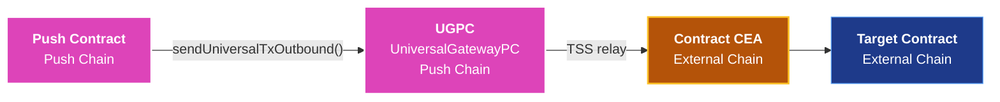
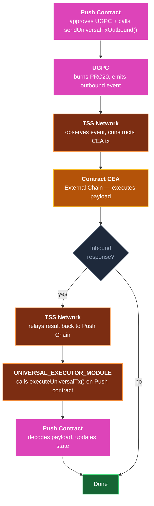

<head>
  <title>Contract-Initiated Multichain Execution | Build | Push Chain Docs</title>
</head>

{/* Content Start */}

## Overview

Universal transactions let **users** sign once and execute across chains. Contract-Initiated Multichain Execution is a distinct capability: a **Push Chain smart contract** triggers execution on an external chain through a CEA, without any live user interaction at call time.

This enables Push contracts to autonomously interact with external protocols, call contracts on Ethereum or BNB Chain, and receive inbound payloads back on Push Chain — all driven by on-chain contract code.

:::info Summary
A Push Chain smart contract calls `IUniversalGatewayPC.sendUniversalTxOutbound()` to trigger execution on an external chain. The TSS network picks up the event, deploys and executes the contract's CEA on the target chain. Inbound responses are delivered back to Push Chain by calling `executeUniversalTx()` on the originating contract.
:::

---

## How This Differs from Universal Transactions

Universal transactions and contract-initiated execution share the same routing infrastructure (CEAs, TSS validators, settlement on Push Chain) but serve different actors.

| Dimension | Universal Transaction | Contract-Initiated Execution |
|-----------|----------------------|------------------------------|
| **Who initiates** | A user wallet (UOA) | A Push Chain smart contract |
| **When it happens** | At user signature time | During contract execution, triggered by any on-chain call |
| **Authorization** | User signature or proof | Contract logic — no live user required |
| **Return handling** | SDK receives `TxResponse` | Inbound `executeUniversalTx()` call on the originating contract |
| **Identity on external chain** | User's CEA | Contract's CEA (bound to the contract address) |
| **SDK involvement** | Required on client side | Not required — fully on-chain |

The key distinction: contract-initiated execution is **programmable and autonomous**. Any call that reaches your Push contract can cascade into external chain execution — a governance outcome, a liquidation trigger, a scheduled job, or a user action that fans out across chains.

---

## Key Concepts

### Contract CEA

Every Push Chain smart contract has a deterministically derived **Chain Executor Account (CEA)** on each supported external chain — the same concept used for user-initiated transactions, but bound to the contract address instead of a user wallet.

The contract CEA:
- Is derived from the Push contract's address, not from any user
- Is deployed on first use by the TSS network
- Acts as `msg.sender` on the external chain when the contract initiates execution there
- Must hold sufficient native funds on the external chain to pay gas
- Is funded and managed independently from any user's CEA



### UniversalGatewayPC (UGPC)

UGPC is the on-chain gateway contract on Push Chain through which all outbound cross-chain calls are routed. Your contract calls `UGPC.sendUniversalTxOutbound()`, which burns or locks the bridged PRC20 tokens and emits the event that the TSS network listens for.

### Universal Executor Module

The `UNIVERSAL_EXECUTOR_MODULE` is the privileged address on Push Chain authorized to deliver inbound cross-chain payloads. When a CEA executes on an external chain and a response needs to come back, the module calls `executeUniversalTx()` on your Push contract. **Only this address should be trusted to deliver inbound payloads** — always validate `msg.sender` in your inbound handler.

---

## Interfaces

### `UniversalOutboundTxRequest`

This struct is passed to `sendUniversalTxOutbound()` to describe the outbound execution:

```solidity
struct UniversalOutboundTxRequest {
    bytes   recipient;        // CEA or target address on the external chain (bytes-encoded)
    address token;            // PRC20 token address on Push Chain to bridge (address(0) for none)
    uint256 amount;           // Amount of PRC20 to bridge
    uint256 gasLimit;         // Gas limit for external-chain execution (0 = default)
    bytes   payload;          // Calldata for the CEA to execute on the external chain
    address revertRecipient;  // Address to receive funds if the tx reverts on the external chain
}
```

### `IUniversalGatewayPC`

Minimal interface for triggering outbound execution:

```solidity
interface IUniversalGatewayPC {
    function sendUniversalTxOutbound(UniversalOutboundTxRequest calldata req) external payable;
}
```

`msg.value` must cover the protocol fee and gas forwarding. The contract must approve UGPC to pull the PRC20 tokens before calling if `amount > 0`.

### `executeUniversalTx` — Inbound Handler

To receive inbound cross-chain calls from the external chain, your contract exposes:

```solidity
function executeUniversalTx(
    string calldata sourceChainNamespace, // CAIP-2 chain ID, e.g. "eip155:97"
    bytes calldata ceaAddress,            // CEA address on the source chain (bytes-encoded)
    bytes calldata payload,               // UniversalPayload containing action data
    uint256 amount,                       // Amount of PRC20 tokens bridged with this inbound tx
    address prc20,                        // PRC20 token address on Push Chain
    bytes32 txId                          // Unique cross-chain transaction identifier
) external payable;
```

The `UNIVERSAL_EXECUTOR_MODULE` calls this function on your contract to deliver the inbound payload. The `payload` field carries the `UniversalPayload.data` — an `abi.encode`d blob that your contract decodes to determine what action to take.

---

## Outbound Flow: Push Chain → External Chain

### 1. Approve and call UGPC

If bridging tokens, approve UGPC to pull the PRC20 amount before calling:

```solidity
if (amount > 0) {
    IPRC20(token).approve(ugpc, amount);
}

UniversalOutboundTxRequest memory req = UniversalOutboundTxRequest({
    recipient:       recipient,       // bytes-encoded CEA or target on external chain
    token:           token,           // PRC20 on Push Chain
    amount:          amount,
    gasLimit:        gasLimit,        // 0 = network default
    payload:         payload,         // ABI-encoded calldata for the CEA to execute
    revertRecipient: revertRecipient  // fallback address if external tx reverts
});

IUniversalGatewayPC(ugpc).sendUniversalTxOutbound{value: msg.value}(req);
```

`msg.value` must cover protocol fees. The UGPC burns the PRC20 tokens and emits an event the TSS network listens for.

### 2. TSS network picks up the event

The TSS validators observe the UGPC event, derive the contract's CEA on the target chain, and submit the transaction. If the CEA has not been deployed yet, the TSS network deploys it on first use.

### 3. CEA executes on the external chain

The CEA runs the encoded `payload` on the target chain. From the external contract's perspective, `msg.sender` is the contract's CEA address — it has no awareness that the call originated from Push Chain.

---

## Inbound Flow: External Chain → Push Chain

When the CEA on the external chain needs to send a response back to Push Chain, it triggers an inbound call. The `UNIVERSAL_EXECUTOR_MODULE` delivers this by calling `executeUniversalTx()` on your contract.

### Security: validate the caller

```solidity
modifier onlyUniversalExecutor() {
    if (msg.sender != universalExecutorModule) {
        revert NotExecutorModule();
    }
    _;
}
```

Only the `UNIVERSAL_EXECUTOR_MODULE` address is authorized to call `executeUniversalTx()`. Anyone else calling it with fabricated data must be rejected.

### Replay protection

Each inbound call carries a unique `txId`. Track executed IDs to prevent replay:

```solidity
mapping(bytes32 => bool) public executedTxIds;

function executeUniversalTx(..., bytes32 txId) external payable onlyUniversalExecutor {
    if (executedTxIds[txId]) revert TxAlreadyExecuted();
    executedTxIds[txId] = true;

    _handleInboundPayload(payload, prc20, amount, txId);
    emit InboundReceived(txId, sourceChainNamespace, ceaAddress, prc20, amount);
}
```

### Decoding the payload

The `payload` passed to `executeUniversalTx` contains `UniversalPayload.data` — an `abi.encode`d blob. Your contract defines the encoding. A typical pattern:

```solidity
// abi.encode(uint8 action, address user, bytes executionPayload)

function _handleInboundPayload(
    bytes calldata data,
    address prc20,
    uint256 amount,
    bytes32 txId
) internal {
    (uint8 action, address user,) = abi.decode(data, (uint8, address, bytes));

    if (action == 0) {
        // e.g. STAKE: credit the user
        stakedBalance[user][prc20] += amount;
        emit Staked(user, prc20, amount, txId);
    } else if (action == 1) {
        // e.g. UNSTAKE: debit the user
        if (stakedBalance[user][prc20] < amount) revert InsufficientStake();
        stakedBalance[user][prc20] -= amount;
        emit Unstaked(user, prc20, amount);
    } else {
        revert UnsupportedAction();
    }
}
```

---

## Execution Lifecycle



| Step | Actor | Description |
|------|-------|-------------|
| 1 | Push Contract | Approves UGPC for PRC20, calls `sendUniversalTxOutbound()` with `msg.value` for fees |
| 2 | UGPC | Burns/locks the PRC20 tokens, emits an outbound event |
| 3 | TSS Network | Picks up the event, constructs a transaction from the contract's CEA on the target chain |
| 4 | External Chain | CEA executes the encoded payload; target contract sees CEA as `msg.sender` |
| 5 | TSS Network (optional) | If the CEA sends a response, TSS relays it back to Push Chain |
| 6 | UNIVERSAL_EXECUTOR_MODULE | Calls `executeUniversalTx()` on the originating Push contract |
| 7 | Push Contract | Decodes payload, updates state, emits events |

Steps 5–7 only occur when the external interaction produces an inbound response. A fire-and-forget outbound has no inbound step.

---

## Full Example: Cross-Chain Staking Contract

The following is a condensed but complete example of a Push Chain contract that:
1. Triggers outbound execution on an external chain
2. Receives inbound staking confirmations from its CEA

```solidity
// SPDX-License-Identifier: MIT
pragma solidity 0.8.26;

import {IERC20} from "@openzeppelin/contracts/token/ERC20/IERC20.sol";
import {SafeERC20} from "@openzeppelin/contracts/token/ERC20/utils/SafeERC20.sol";
import {Initializable} from "@openzeppelin/contracts-upgradeable/proxy/utils/Initializable.sol";
import {ReentrancyGuardUpgradeable} from "@openzeppelin/contracts-upgradeable/utils/ReentrancyGuardUpgradeable.sol";

import {UniversalPayload} from "../libraries/Types.sol";
import {IPRC20} from "../Interfaces/IPRC20.sol";

struct UniversalOutboundTxRequest {
    bytes   recipient;
    address token;
    uint256 amount;
    uint256 gasLimit;
    bytes   payload;
    address revertRecipient;
}

interface IUniversalGatewayPC {
    function sendUniversalTxOutbound(UniversalOutboundTxRequest calldata req) external payable;
}

contract StakingExample is Initializable, ReentrancyGuardUpgradeable {
    using SafeERC20 for IERC20;

    address public universalExecutorModule;
    address public ugpc;
    address public owner;

    mapping(bytes32 => bool) public executedTxIds;
    mapping(address => mapping(address => uint256)) public stakedBalance;

    error NotOwner();
    error NotExecutorModule();
    error TxAlreadyExecuted();
    error ZeroAddress();
    error ZeroAmount();
    error InsufficientStake();
    error UnsupportedAction();

    modifier onlyOwner() {
        if (msg.sender != owner) revert NotOwner();
        _;
    }

    modifier onlyUniversalExecutor() {
        if (msg.sender != universalExecutorModule) revert NotExecutorModule();
        _;
    }

    constructor() { _disableInitializers(); }

    function initialize(
        address _ugpc,
        address _universalExecutorModule,
        address _owner
    ) external initializer {
        if (_ugpc == address(0) || _universalExecutorModule == address(0) || _owner == address(0))
            revert ZeroAddress();
        __ReentrancyGuard_init();
        ugpc = _ugpc;
        universalExecutorModule = _universalExecutorModule;
        owner = _owner;
    }

    // ── OUTBOUND: Push Chain → External Chain ──────────────────────────────

    function triggerOutbound(
        address token,
        uint256 amount,
        bytes calldata recipient,
        uint256 gasLimit,
        bytes calldata payload,
        address revertRecipient
    ) external payable nonReentrant {
        if (token == address(0)) revert ZeroAddress();
        if (revertRecipient == address(0)) revert ZeroAddress();

        if (amount > 0) {
            IPRC20(token).approve(ugpc, amount);
        }

        IUniversalGatewayPC(ugpc).sendUniversalTxOutbound{value: msg.value}(
            UniversalOutboundTxRequest({
                recipient:       recipient,
                token:           token,
                amount:          amount,
                gasLimit:        gasLimit,
                payload:         payload,
                revertRecipient: revertRecipient
            })
        );

        emit OutboundTriggered(token, recipient, amount, payload);
    }

    // ── INBOUND: External Chain → Push Chain ───────────────────────────────

    /// @notice Called by UNIVERSAL_EXECUTOR_MODULE to deliver an inbound payload.
    function executeUniversalTx(
        string calldata sourceChainNamespace,
        bytes calldata ceaAddress,
        bytes calldata payload,
        uint256 amount,
        address prc20,
        bytes32 txId
    ) external payable onlyUniversalExecutor nonReentrant {
        if (executedTxIds[txId]) revert TxAlreadyExecuted();
        executedTxIds[txId] = true;

        _handleInboundPayload(payload, prc20, amount, txId);
        emit InboundReceived(txId, sourceChainNamespace, ceaAddress, prc20, amount);
    }

    // ── INTERNAL ───────────────────────────────────────────────────────────

    /// payload.data encoding: abi.encode(uint8 action, address user, bytes executionPayload)
    /// action 0 = STAKE, action 1 = UNSTAKE
    function _handleInboundPayload(
        bytes calldata data,
        address prc20,
        uint256 amount,
        bytes32 txId
    ) internal {
        (uint8 action, address user,) = abi.decode(data, (uint8, address, bytes));

        if (user == address(0) || prc20 == address(0)) revert ZeroAddress();
        if (amount == 0) revert ZeroAmount();

        if (action == 0) {
            stakedBalance[user][prc20] += amount;
            emit Staked(user, prc20, amount, txId);
        } else if (action == 1) {
            if (stakedBalance[user][prc20] < amount) revert InsufficientStake();
            stakedBalance[user][prc20] -= amount;
            emit Unstaked(user, prc20, amount);
        } else {
            revert UnsupportedAction();
        }
    }

    event OutboundTriggered(address indexed token, bytes recipient, uint256 amount, bytes payload);
    event InboundReceived(bytes32 indexed txId, string sourceChainNamespace, bytes ceaAddress, address prc20, uint256 amount);
    event Staked(address indexed user, address indexed token, uint256 amount, bytes32 indexed txId);
    event Unstaked(address indexed user, address indexed token, uint256 amount);

    receive() external payable {}
}
```

---

## Security Considerations

### Validate inbound caller

Only `UNIVERSAL_EXECUTOR_MODULE` can legitimately deliver inbound payloads. Always guard `executeUniversalTx()` with the `onlyUniversalExecutor` modifier. Anyone else calling it with fabricated data must be rejected.

### Replay protection

Each inbound call carries a unique `txId`. Maintain a `mapping(bytes32 => bool) executedTxIds` and revert on duplicates. Without this, the same result could be applied more than once.

### CEA identity is contract-bound

The contract's CEA is derived from its Push Chain address. A different deployment — even identical bytecode at a new address — has a different CEA. If you use a proxy pattern, the CEA is bound to the **proxy** address, not the implementation. Upgrades do not change the CEA.

### CEA funding is your responsibility

The contract's CEA must hold sufficient native funds on every target chain. Push infra does not fund it automatically. An underfunded CEA means the transaction is recorded on-chain but never executes on the external chain.

### No cross-chain atomicity

The outbound dispatch and the external execution are not atomic. Push-side state changes in `triggerOutbound()` commit independently of whether the external call succeeds. Design accordingly — defer critical state commits to the inbound handler, or use an explicit pending/failed state machine.

### Inbound timing is not predictable

Inbound delivery depends on external chain finality and TSS observation. On slower chains this can take minutes. Do not design contracts that require an inbound within a specific block window.

---

## Best Practices

- **Emit an event at dispatch time.** Include a request ID, target address, and operation type so inbound payloads can be correlated with the original outbound call.
- **Use per-dispatch request IDs.** If multiple outbound calls can be in flight simultaneously, track them by ID to route inbound results unambiguously.
- **Keep inbound handlers lean.** The inbound handler runs as a Push Chain transaction submitted by the module. Decode payload, update state, emit events. Avoid cascading outbound calls inside it.
- **Protect inbound handlers with `nonReentrant`.** The handler is called by an external module account — apply re-entrancy guards if it calls other contracts.
- **Fund the CEA before dispatching.** Verify the CEA holds sufficient native funds on the target chain before calling `triggerOutbound()`.

---

## Limitations

| Area | Constraint |
|------|------------|
| **CEA funding** | The contract's CEA must be pre-funded on each target chain. Push infra does not fund it. |
| **No synchronous result** | Outbound and inbound are always separate transactions. There is no in-call return value. |
| **No cross-chain atomicity** | A failed external call does not revert Push-side state. Handle partial failure explicitly. |
| **CEA as msg.sender** | External contracts that restrict callers (whitelists, EOA-only guards) must explicitly whitelist the contract's CEA address. |
| **Proxy upgrade safety** | CEA is bound to the proxy address. New deployments at different addresses have different CEAs. |
| **Supported chains** | Target chains must be supported by the TSS network. Supported chains are enumerated in `PushChain.CONSTANTS.CHAIN`. |

---

## When to Use This

Use this pattern when:

- A Push Chain contract needs to call an external protocol (Aave, Uniswap, a custom contract on Ethereum) without requiring the user to be online at execution time
- A governance or automation contract needs to execute an external action after an on-chain condition is met
- Your app logic lives on Push Chain but state or liquidity lives on an external chain
- You are building a cross-chain keeper, liquidator, or staking coordinator

Do not use it when:

- The user is online and can sign directly — user-initiated universal transactions are simpler
- You need a synchronous response in the same transaction — that is not possible across chains
- Your logic requires atomic rollback across both chains — partial failure must be handled explicitly

---

## Next Steps

- [Understanding Universal Transactions](./understanding-universal-transactions) — The routing model and CEA concepts this capability builds on
- [Send Universal Transaction](./send-universal-transaction) — User-initiated cross-chain execution, for comparison
- [Send Multichain Transactions](./send-multichain-transactions) — SDK-level sequencing of multi-step cross-chain flows
- [Track Universal Transaction](./track-universal-transaction) — Monitoring execution status for dispatched transactions
- [Contract Helpers](./contract-helpers) — Push Chain Solidity utilities and system interfaces
