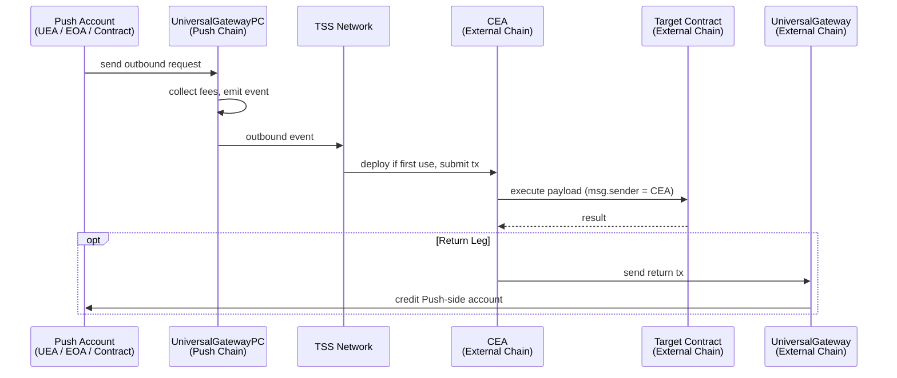

<head>
  <title>How Chain Executor Account (CEA) Works | Deep Dives | Push Chain Docs</title>
</head>

import Tabs from '@theme/Tabs';
import TabItem from '@theme/TabItem';
import Details from '@theme/Details';

{/* Content Start */}

The **Chain Executor Account (CEA)** is the destination-chain counterpart to the [UEA](/docs/chain/deep-dives/how-uea-works). Where a UEA is the identity an external-chain wallet uses to act *on Push Chain*, a CEA is the identity a Push Chain account uses to act *on every other chain*. Together they make universal execution **bidirectional**.

In this deep dive, we'll explore:
- 🧠 What a CEA is
- ⚙️ How transactions flow through it
- 🔗 How its identity is bound to a Push Chain account
- 🧩 How it differs from EOAs, Smart Accounts, and UEAs

## What Is a Chain Executor Account (CEA)?

A **Chain Executor Account** (CEA) is a *deterministic smart account* that lives on an *external chain* (such as Ethereum, BNB Chain, Base, Solana, etc.) and is **controlled by a Push Chain account**. The Push-side account can be a UEA, a Push-native EOA, or a Push Chain smart contract.

It acts as your **on-chain agent on every external chain**:
- It holds destination-chain native and tokens.
- It executes transactions on destination-chain protocols, with itself as `msg.sender`.
- It supports **atomic multicalls** dispatched by the Push-side account.
- It can send transactions back to Push Chain through the destination chain's gateway.
- Its address is **deterministic**, so you can compute it before any cross-chain activity has happened.

> Think of the CEA as your wallet or contract's universal executor on every other chain, controlled entirely from Push Chain.

## The CEA Architecture

At a system level, every CEA-mediated transaction flows through **Dispatch → Relay → Execution → (optional) Return**.

| Component | Role | Description |
|------------|------|-------------|
| **UniversalGatewayPC** | Dispatch | Push-Chain-side gateway that accepts outbound requests, locks fees in `$PC`, and emits the outbound event. |
| **TSS Network** | Relay & Deployment | Observes the outbound event, derives the CEA on the destination chain, deploys it on first use, and submits the transaction from the CEA. |
| **CEA Contract** | Execution | Lives on the destination chain. Runs the dispatched payload with itself as `msg.sender`. |
| **CEAFactory** | Identity Binding | Per-chain factory that maps Push-side accounts to deterministic CEA addresses. |
| **UniversalGateway (return leg)** | Inbound | Destination-chain gateway that the CEA calls to send results back to Push Chain. |

## How It Works

When a Push Chain account dispatches an outbound transaction, Push Chain routes and executes it through five stages:

**1. Dispatch (UniversalGatewayPC)** 
The Push-side account calls the gateway with the outbound request. The gateway collects the protocol fee in `$PC`, swaps part of the value into destination-chain gas, and emits the outbound event the TSS network listens for.

**2. CEA Resolution (TSS Network)** 
The TSS network observes the event and derives the CEA on the destination chain. If the CEA has not been deployed yet, the TSS deploys it on first use at the same deterministic address that was already known.

**3. CEA Funding (Vault)** 
The destination-chain Vault forwards the bridged amount (native or ERC20) to the CEA, leaving it ready to pay for the call.

**4. Execution (CEA)** 
The TSS submits the transaction. The CEA runs the dispatched payload (a single call or a multicall) with itself as `msg.sender`. The destination contract has no awareness that the call originated on Push Chain; it just sees a normal address.

**5. Optional Return Leg** 
If the payload calls back into the destination chain's gateway, that gateway emits an inbound event toward Push Chain, and the TSS relays it. Push Chain enforces that the return can only credit the Push-side account that owns the CEA, which is what makes contract-to-contract roundtrips trustless.

This design guarantees that every outbound transaction has a stable identity, a verifiable origin, and a predictable settlement path on the destination chain.

### Computing the CEA Address

The CEA address is fully deterministic, so applications can compute it any time without waiting for the first transaction. There are two equivalent paths:

**Off-chain (SDK)** 
The SDK exposes [deriveExecutorAccount()](/docs/chain/build/utility-functions/#derive-executor-account), which returns the CEA address for any Push-side account on any supported destination chain, optionally with a deployment-status check. Use this in dApps, scripts, or monitoring tools that don't want to make a destination-chain RPC call. See the [Derive CEA tutorial](/docs/chain/tutorials/power-features/tutorial-derive-chain-executor-account/) for end-to-end examples.

**On-chain (CEAFactory)** 
On every supported external chain, a `CEAFactory` contract exposes the same mapping. Calling `getCEAForPushAccount(pushAccount)` returns the CEA address (deployed or predicted) and a deployment flag. Use this when a destination-chain contract itself needs to whitelist, fund, or attribute calls to a known CEA.

Both paths produce the same address. The off-chain path is cheaper and faster for read flows; the on-chain path is the only option from a destination-chain contract.

### Lazy Deployment

CEAs are **never** deployed eagerly. The address is predictable and stable, but no on-chain footprint exists until the first transaction needs it. This means:

- You can compute and authorize a CEA before any cross-chain activity (whitelist it, fund it, approve it on a protocol).
- Deployment gas is paid by the TSS path on first use, calculated and included in the gas limit auto via the SDK.
- The deterministic mapping never moves once deployed.

### Fee Mechanics

CEA-mediated outbounds consume fees on both sides of the bridge, but the user pays once on Push Chain in `$PC`:

| Fee | Paid In | What It Covers |
|---|---|---|
| Protocol Fee | `$PC` | Push Chain protocol revenue |
| Gas Fee | `$PC` (auto-swapped) | Destination-chain gas for the CEA's transaction |
| Return-leg Inbound Fee (roundtrips only) | Destination native | The CEA's call into the destination chain's gateway to send the inbound back |

The dispatching account quotes the protocol fee plus the gas fee upfront. Surplus `msg.value` is refunded back to the dispatcher on Push Chain.

**Roundtrips need funding waiting on Push Chain too.** When the return leg arrives, the Push-side recipient (the originating contract or UEA) must already hold enough `$PC` to execute whatever post-arrival logic it runs. Push Chain delivers the payload; the recipient pays for executing it from its own balance. Plan the recipient's `$PC` balance before initiating the roundtrip, not after.

:::warning EOAs cannot execute roundtrip payloads
Roundtrip payload execution lands on Push Chain only when the recipient supports the signature scheme, which means a Push Chain contract that implements the inbound handler, or a UEA. A plain EOA on Push Chain is a valid destination for funds but cannot run executable inbound calls.
:::

## How is the Identity Preserved and Linked?

Each CEA is deterministically linked to a single Push Chain account. The `CEAFactory` on the destination chain stores both directions of this mapping:

- `getCEAForPushAccount(pushAccount)` returns the CEA on this chain (deployed or predicted).
- `getPushAccountForCEA(cea)` returns the Push-side account that owns this CEA.

This bidirectional mapping is what makes CEAs safe for return legs. When a CEA calls back to the destination chain's gateway with a recipient, the gateway checks that the recipient matches `getPushAccountForCEA(msg.sender)` and rejects any mismatch. A malicious destination-chain contract impersonating a CEA cannot misroute funds, because Push Chain only trusts the on-chain mapping.

### Binding for Contracts

For user wallets, the CEA is bound to the user's UEA. The same UEA on Push Chain produces the same CEA on each external chain forever.

For Push Chain *contracts*, the CEA is bound to the contract's Push Chain address. A different deployment, even with identical bytecode, has a different CEA on every chain. For proxy patterns, the CEA is bound to the proxy address, so upgrades do not change it. A new contract address means a new CEA, and previous whitelists or balances on the destination chain do not transfer.

## Comparison — EOAs vs Smart Accounts vs UEAs vs CEAs

| Feature | **EOA** | **Smart Account** | **UEA** | **CEA** |
|----------|----------|--------------------|---------|---------|
| **Lives On** | Single chain | Single chain | Push Chain | Each external chain |
| **Bound To** | Private key | Smart contract logic | An external-chain wallet | A Push Chain account |
| **Acts as msg.sender For** | Local-chain tx | Local-chain tx | Push Chain tx | Destination-chain tx |
| **Atomic Multicall** | ❌ | ✅ | ✅ | ✅ |
| **Deployment** | None | User-initiated | Lazy on first use, by Push validators | Lazy on first use, by TSS network |
| **Identity Persistence** | Chain-specific | Chain-specific | Same UEA forever per origin wallet | Same CEA forever per Push account, per chain |
| **Initiated By** | User key | Smart contract logic | External-chain signature | Push-Chain-side dispatch |

> In short: UEAs and CEAs together make Push Chain the first network where execution flows symmetrically across chain boundaries.

## Why the CEA Matters

The CEA completes the universal execution model:

- **Symmetric reach.** A Push Chain account can act on any supported destination chain through a stable, deterministic identity.
- **Trustless roundtrips.** The CEA-to-Push-account mapping is enforced by the destination-chain gateway, so return-leg credits cannot be misrouted.
- **Pre-authorization.** CEA addresses are predictable, so destination-chain protocols can whitelist or fund a CEA before it has been deployed.
- **No new mental model.** Same `msg.sender` semantics, same multicall, same lazy-deployment story as UEAs, applied to the destination chain instead of Push Chain.

For hands-on usage, see the [Outbound from Push Chain](/docs/chain/build/contract-initiated-examples/outbound-from-push-chain) and [Inbound to Push Chain](/docs/chain/build/contract-initiated-examples/inbound-to-push-chain) examples, the [Derive CEA tutorial](/docs/chain/tutorials/power-features/tutorial-derive-chain-executor-account/), and the [Contract-Initiated Multichain Execution](/docs/chain/build/contract-initiated-multichain-execution) reference.
